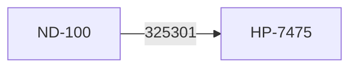
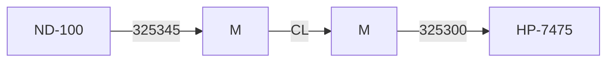
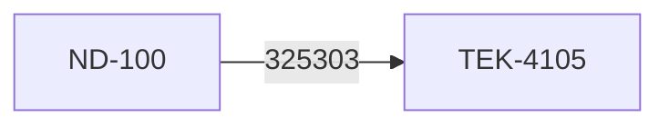
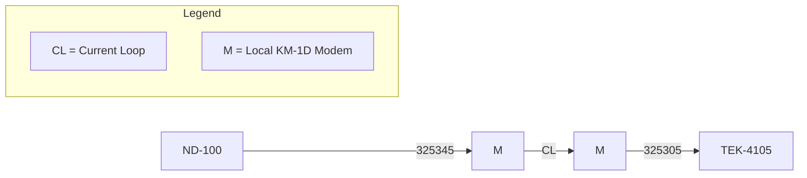

## Page 1

# Norsk Data A/S - Program Description

**Date:** 85.05.15  
**Page:** 1 of 17

## Product

| Name                                | ND-no. | Category |
|-------------------------------------|--------|----------|
| NOTIS-BG for ND-100 (Business Graphics) 48 bits fl. | 10724B | STPR     |

## Reason

- Error Correction
- Change/Addition
- Different Environment

## Documentation

| Title                        | ND-no.      |
|------------------------------|-------------|
| NOTIS-BG User Manual         | 63.033.01   |
| NOTIS-BG Brukerveiledning    | 63.034.01   |

## Purpose

Produce simple line graphs, bar charts and pie charts on various types of output units.

## Prerequisites

**Computer Type:** ND-100  
**Floating format:** 48 bits  
**Op. system Version:** SIN III VS \> = I

### Required Peripherals

| ND-no. | Product Name                                  |
|--------|-----------------------------------------------|
| 321    | NOTIS-terminal with graphic option            |
| 447    | Philips printer                               |
| 448    | Philips printer                               |
| 424    | Epson printer                                 |
| 218    | HP-plotter Tektronix 4105 (Not ND product)    |

## Minimum Mass Storage Resources for Installation

| User            | Userspace | Number of files |
|-----------------|-----------|-----------------|
| SYSTEM          | 300 pages | on 13 files     |
| user specified  | 160 pages | on 15 files     |

## Minimum Mass Storage Resources Permanent

| User            | Userspace | Number of files |
|-----------------|-----------|-----------------|
| SYSTEM          | 180 pages | on 4 files      |
| user specified  | 20 pages  | on 6 files      |

## Product Consists Of

| ND-no. for Source |   
|-------------------|
| 10759B            |

## Directory

**Directory Name:** 10724B00-EN-1  
**User Name:** FLOPPY-USER

| Prog.no. | File Name      | Type | T | Pg. | Bytes  | Containing                  |
|----------|----------------|------|---|-----|--------|-----------------------------|
| 205956B  | BG-PART1-EN-B00| BRF  | I | 56  | 111822 | BG-modules                  |
| 205957B  | INST-BG148-B00 | COM  | I | 4   | 6144   | Installation job.           |
| 205284B  | BG-EXO1-EN-B00 | PLOT | I | 2   | 415    | Demo-file                   |
| 205285B  | BG-EXO2-EN-B00 | PLOT | I | 2   | 328    | Demo-file                   |
| 205286B  | BG-EXO3-EN-B00 | PLOT | I | 2   | 311    | Demo-file                   |
| 205283B  | BG-EXO4-EN-B00 | PLOT | I | 2   | 425    | Demo-file                   |
| 205287B  | BG-EXO5-EN-B00 | PLOT | I | 2   | 284    | Demo-file                   |
| 205958B  | BG-EXO6-EN-B00 | PLOT | I | 2   | 1000   | Demo-file                   |
| 205959B  | INST-BG148-B00 | PROG | I | 14  | 25393  | Installation program        |
| 205960B  | XCOM           | PROG | I | 60  | 182272 | Installation system         |


ooo ND Norsk Data ooo  
[Scanned by Jonny Oddene for Sintran Data © 2012]

---

## Page 2

# Norsk Data A/S Program Description

**Date:** 85.05.15  
**Page:** 2 of 17

---

**Product**

- **Name**: NOTIS-BG for ND-100 (Business Graphics) 48 bits fl.  
- **ND-no.**: 10724B  
- **Category**: STPR

---

## Directory Name: 10724B00-NO-1
**User Name:** FLOPPY-USER

| Prog.no. | File Name        | Type | T | Pg. | Bytes | Containing                  |
|----------|------------------|------|---|-----|-------|-----------------------------|
| 205961B  | BG-PART1-NO-B00  | BRF  | I | 56  | 111834| BG-modules                  |
| 205957B  | INST-B6148-B00   | COM  | I | 4   | 6144  | Installation job.           |
| 205279B  | BG-EX01-NO-B00   | PLOT | I | 2   | 353   | Demo-file                   |
| 205280B  | BG-EX02-NO-B00   | PLOT | I | 2   | 419   | Demo-file                   |
| 205281B  | BG-EX03-NO-B00   | PLOT | I | 2   | 320   | Demo-file                   |
| 205278B  | BG-EX04-NO-B00   | PLOT | I | 2   | 443   | Demo-file                   |
| 205282B  | BG-EX05-NO-B00   | PLOT | I | 2   | 314   | Demo-file                   |
| 205962B  | BG-EX06-NO-B00   | PLOT | I | 3   | 701   | Demo-file                   |
| 205959B  | INST-B6148-B00   | PROG | I | 14  | 25393 | Installation program        |
| 205960B  | XCOM             | PROG | I | 60  | 182272| Installation system         |

## Directory Name: 10724B00-2
**User Name:** FLOPPY-USER

| Prog.no. | File Name        | Type | T | Pg. | Bytes | Containing                  |
|----------|------------------|------|---|-----|-------|-----------------------------|
| 205963B  | BG-DRIV01-B00    | BRF  | I | 8   | 13458 | Device-driver               |
| 205964B  | BG-DRIV02-B00    | BRF  | I | 10  | 17072 | Device-driver               |
| 205965B  | BG-DRIV03-B00    | BRF  | I | 9   | 16116 | Device-driver               |
| 205966B  | BG-DRIV04-B00    | BRF  | I | 10  | 16583 | Device-driver               |
| 205967B  | BG-DRIV05-B00    | BRF  | I | 8   | 14263 | Device-driver               |
| 205968B  | BG-DRIV15-B00    | BRF  | I | 9   | 14451 | Device-driver               |
| 205969B  | BG-PART2-B00     | PROG | I | 12  | 21812 | NRL                         |
| 205245B  | BG-PRINTERS-B00  | SYMB | I | 2   | 846   | Output device def.          |
| 205970B  | BG-TYPER-B00     | SYMB | I | 2   | 1479  | Printer data                |
| 203786D  | DDBTABLES-D-0    | VTM  | I | 19  | 20394 | VTM-table                   |

## Directory Name: 10724B00-3
**User Name:** FLOPPY-USER

| Prog.no. | File Name        | Type | T | Pg. | Bytes | Containing                  |
|----------|------------------|------|---|-----|-------|-----------------------------|
| 205972B  | BG-PART3-B00     | BRF  | I | 56  | 112180| Fortran library             |
| 205973B  | BG-PART4-B00     | BRF  | I | 25  | 47432 | Graphic modules             |
| 205974B  | BG-PART5-B00     | BRF  | I | 24  | 45339 | Graphic modules             |
| 205975B  | BG-PART6-B00     | BRF  | I | 22  | 41924 | Graphic modules             |
| 205976B  | BG-PART7-B00     | BRF  | I | 18  | 32787 | VTM-modules                 |

---

ooo ND Norsk Data ooo

*Scanned by Jonny Oddene for Sintran Data © 2012*

---

## Page 3

| Date        | Norsk Data A/S    | Page 3 of 17 |
|-------------|-------------------|--------------|
| PROGRAM DESCRIPTION                          |

| Product                                | Name                                  | ND-no. | Category |
|----------------------------------------|---------------------------------------|--------|----------|
| NOTIS-BG for ND-100 (Business Graphics) 48 bits fl. | 10724B | STPR     |

# 1 Errors Corrected

The following errors are corrected from the A-version of NOTIS-BG:

- R access on Philips spooling files is not required.
- Error message when opening printer will not be suppressed.
- Graphic Rendition Mode (in TDV menu) is set to 'Attribute' at exit from NOTIS-BG.
- Extended Control Mode (in TDV menu) is set to 'Off' at exit from NOTIS-BG.
- The instruction 'DATAFILE=?' in diagram file for line graphs works according to the specifications.

# 2 Known, But Not Corrected Errors

- The instructions 'XRANGE:' and 'YRANGE:' doesn't work as expected. These two instructions require two parameters each, lowest and highest value along the actual axis. These two values are used in the algorithm that calculates tic marks with 'nice' labels. The maximum and minimum value along the axis may be adjusted to get 'nice' values on the tic marks.

- If the execution of NOTIS-BG is breaked when preparing diagrams for Philips or Epson, the following files may exist on the account afterwards:
  - VECTOR-A:DATA
  - SPLIT-A:RAST
  - SORT-A:RAST

If more than one user is using NOTIS-BG at this time, the letter 'A' in the file names could be any letter. These files are used temporarily in the conversion algorithm, and are deleted when conversion is complete.

ooo ND Norsk Data ooo

---

## Page 4

# Program Description

| Date       | Company         | Page   |
|------------|-----------------|--------|
| 85.05.15   | Norsk Data A/S  | 4 of 17|

| Product    | Name                               | ND-no. | Category |
|------------|------------------------------------|--------|----------|
| NOTIS-BG   | NOTIS-BG for ND-100 (Business Graphics) 48 bits f1. | 10724B | STPR     |

## 3 Changed Prerequisites

- The B version of NOTIS-BG may be executed on a Tektronix 4105 color graphics terminal, or a compatible one (TEK 4106, 4107, 4109, 4115).

## 4 New Commands

The following command are added in the B-version. (Not documented in the User Manual.)

- **ROTATION=90**: This command (instruction) may be used to rotate the diagram 90 degrees. The diagram will then be plotted on an A4 portrait format instead on an A4 landscape format. In this version of NOTIS-BG it is not possible to rotate any other angles. The instruction has to be used in the first part of the diagram file.

## 5 New Features

- When printing diagrams on the PHILIPS printer, the diagram has to be converted to a raster-format first. The raster-format is printed directly to a spooling file. It is possible to store this raster-picture prepared for PHILIPS on a user specified file. This is done by specifying a file name instead of a logical output device when BG asks for 'OUTPUT DEVICE'. If the file doesn't exist, the file name has to be written in quotation marks ("file:data"). The file is stored in an internal format for future use and is not suited for direct copying to the Philips printer later.

- It is possible to specify a remote Philips for output in BG-PRINTERS:SYMB.

- Tektronix-4105, color graphics terminal may be used to execute NOTIS-BG.

---

## Page 5

# Program Description

| Date       | Norsk Data A/S        | Page      |
|------------|-----------------------|-----------|
| 85.05.15   | PROGRAM DESCRIPTION   | 5 of 17   |

| Product                           | Name                              | ND-no. | Category |
|-----------------------------------|-----------------------------------|--------|----------|
| Product                           | NOTIS-BG for ND-100               | 10724B | STPR     |
|                                   | (Business Graphics) 48 bits f1.   |        |          |

## 6 Improved Performance

- The algorithm for converting the diagram for the Philips printer is optimized, and output to Philips is not so time-consuming as in the A-version.

---

## Page 6

# 7 ADDITION TO MANUAL

## 7.1 DIAGRAM VARIATIONS

The following diagrams are not documented in the manual:

Text diagrams

```
+----------------+-------------------------+----------------+-----------+
| Date 85.05.15  | Norsk Data A/S          | Page 6 of 17   |           |
|                | PROGRAM DESCRIPTION     |                |           |
+----------------+-------------------------+----------------+-----------+
| Product        | Name                    | ND-no.         | Category  |
|                | NOTIS-BG for ND-100     | 10724B         | STPR      |
|                | (Business Graphics)     |                |           |
|                | 48 bits fl.             |                |           |
+----------------+-------------------------+----------------+-----------+

PLOT-TYPE=LINE
SIZE-OF-PLOT=210,170
XAXIS=INTEGER
XRANGE=0,1
XINTERVALS=0
YAXIS=INTEGER
YRANGE=0,1
YINTERVALS=0
1,1
CHARACTER-SIZE=10
TEXT-LINE=0.90,0.93,270, TEXT DIAGRAM
CHARACTER-SIZE=6
TEXT-LINE=0.75,0.95,270, This text-diagram is
TEXT-LINE=0.68,0.95,270, produced by using the
TEXT-LINE=0.61,0.95,270, 'TEXT-LINE' command
TEXT-LINE=0.54,0.95,270, in a line graph. The
TEXT-LINE=0.47,0.95,270, graph has only one
TEXT-LINE=0.40,0.95,270, data point (1,1). The
TEXT-LINE=0.33,0.95,270, axis labels have to
TEXT-LINE=0.26,0.95,270, be erased afterwards.
```

---

## Page 7

# Norsk Data A/S Program Description

**Date:** 85.05.15  
**Page:** 7 of 17

| Product | Name                                             | ND-no. | Category |
|---------|--------------------------------------------------|--------|----------|
|         | NOTIS-BG for ND-100 (Business Graphics) 48 bits f1. | 10724B | STPR     |

## Bar Chart with Both Negative and Positive Values

```
+-------------------------+
| PLOT-TYPE=BAR           |
| SIZE-OF-PLOT=70,140     |
| 5                       |
| 8                       |
| -7                      |
| 11                      |
| -3                      |
| -1                      |
| 2                       |
| 6                       |
+-------------------------+
```

## Line Chart with Non-Increasing x-Values

```
+-------------------------+
| PLOT-TYPE=LINE          |
| SIZE-OF-PLOT=70,140     |
| 1,2                     |
| 7,2                     |
| 7,8                     |
| 13,2                    |
| 19,2                    |
| 19,10                   |
| 13,18                   |
| 13,12                   |
| 7,18                    |
| 1,10                    |
| 1,2                     |
| PLOT-TYPE=LINE          |
| 21,2                    |
| 35,2                    |
| 39,6                    |
| 39,14                   |
| 35,18                   |
| 21,18                   |
| 21,2                    |
| PLOT-TYPE=LINE          |
| 27,8                    |
| 32,8                    |
| 33,9                    |
| 33,11                   |
| 32,12                   |
| 27,12                   |
| 27,8                    |
+-------------------------+
```

---

ooo ND Norsk Data ooo

_Scanned by Jonny Oddene for Sintran Data © 2012_

---

## Page 8

```
Date 85.05.15                        Norsk Data A/S                 Page  8  of 17
                                      PROGRAM DESCRIPTION

---------------------------------------------------------------------
| Product      |  Name                            | ND-no.  | Category |
|              |                                  |         |          |
|              |  NOTIS-BG for ND-100             | 10724B  |  STPR    |
|              |  (Business Graphics) 48 bits f1. |         |          |
---------------------------------------------------------------------

### 7.2 ERROR MESSAGES FROM THE GRAPHIC KERNEL

If a text-string in the diagram file exceeds the maximum length specified in the manual, the following error occurs:

```
** GPGS ERROR  17
* SEVERITY     2
* CALL NO.     ..
* ROUTINE NO.  140
* ARGUMENT NO. 0
* VALUE        ..
** GPGS VERSION 8200
```

This is only a warning from the graphic kernel, and the drawing continues.

If the file BG-PRINTERS is edited wrong (not according to this document), the following error may occur:

```
** GPGS ERROR  13
* SEVERITY     3
* CALL NO.     ..
* ROUTINE NO.  1
* ARGUMENT NO. 1
* VALUE        ..
** GPGS VERSION 8200
```

The program stops, because the number specifying output device in BG-PRINTERS is unknown.

### 7.3 NOTIS-BG IN BATCH

If many diagrams are going to be plotted, it could be convenient to run NOTIS-BG in batch. The following batch-job will do it:

```
ØENTER .....................
ØNOTIS-BG-ENG-B00,<diagram-file name>,<output device>,CC
ØNOTIS-BG-ENG-B00,<diagram-file name>,<output device>,CC
ØNOTIS-BG-ENG-B00, ....
ØNOTIS-BG-ENG-B00, ....
.
ESC,ESC
```

                        ooo  ND Norsk Data  ooo

                       Scanned by Jonny Oddene for Sintran Data © 2012
```

---

## Page 9

| Date      | Norsk Data A/S                                         | Page 9 of 17 |
|-----------|------------------------------------------------------|--------------|
|           | PROGRAM DESCRIPTION                                   |              |
| Product   | Name                                  | ND-no. | Category |
|           | NOTIS-BG for ND-100                   | 10724B | STPR     |
|           | (Business Graphics) 48 bits fl.       |        |          |

## 7.4 Plotting on A3 with the HP-Plotter

The plotter may be used both for A4 and A3 sheet sizes. Changing the sheet size on the plotter may be done in two ways:

- By switching one of the switches on the back of the plotter (marked A4 - A3).
- By pressing the 'SIZE' button and the 'ENTER' button simultaneously on the plotter's front panel.

When plotting on an A3 sheet, the 'SIZE-OF-PLOT=' instruction must be used to enlarge the diagram to fit the sheet.

## 7.5 Restrictions

The following restrictions are not mentioned in the User Manual:

- Maximum number of points in a line graph is 1000.
- Maximum number of bars in a bar chart is 25 groups with 25 bars each.

## 8. Installation Procedure

- Prepare the NOTIS terminal (see Instruction 1)
- Prepare the HP-plotter (see Instruction 2)
- Prepare the Philips and Epson printers (see Instruction 3)
- Prepare the Tektronix color terminal (see Instruction 4)
- Start installation job (see Instruction 5)
- Edit BG-PRINTERS (see Instruction 6)
- Test NOTIS-BG with the demo files (see Instruction 7)

### Instruction 1: Preparing the NOTIS terminal

Set these values in the Communications Switches Menu for NOTIS terminals (ND-246 or ND-320 with graphic option) that will be used to view diagrams with NOTIS-BG:

- Communication handshake: XON/XOFF

```
ooo ND Norsk Data ooo
```

[Scanned by Jonny Oddene for Sintran Data © 2012]

---

## Page 10

# Norsk Data A/S Program Description

| Date       | Page       | Product                          | Name                          | ND-no. | Category |
|------------|------------|----------------------------------|-------------------------------|--------|----------|
| 85.05.15   | 10 of 17   | NOTIS-BG for ND-100 (Business Graphics) 48 bits #1. | 10724B | STPR     |

- Transmission Code Length: 7 bits
- Transmission Code Parity: Even
- Transmission Code Stop Bits: 2

Set the same values for the terminal line like this:

Find the terminal's Logical Device Number with the SINTRAN command ∅WHO-IS-ON. Continue as shown here, typing the underlined commands and parameters. XXXX represents number provided by system.

```
∅SINTRAN-SERVICE
*CHANGE-DATA (Logical Device Number),I,Y,Y,Y
∅FLAG/ XXXXX 1000
CNTREG/ XXXXX 44005

*EXIIT 
```

**IMPORTANT!** The Logical Device Number must be followed by "D". Example: 53D.

## Instruction 2: Preparing the HP-plotter (ND-102180)

### Equipment:

- HP-7475 A3/A4 plotter
- 325301 Cable between ND-100 and HP-7475.
- OR 2 local KM-1D modems connected to each other, with 325345 Cable between ND-100 and one modem, and 325300 Cable between the other modem and the HP-7475.

### Connection:

- Set the switches at the back of the plotter for 9600 BAUD, A4 paper, direct line and even parity (7 bit character length): 010001010. For further details, see pages 2-21 and 2-23 in the Operation and Interconnection Manual accompanying the HP-7475 plotter.
- Obtain a terminal line with an RS-232 interface to the ND-100.
- Connect cables in one of the following configurations:

```
ooo ND Norsk Data ooo 
```

---

## Page 11

# Norsk Data A/S
## Program Description

| Date       | Page     |
|------------|----------|
| 85.05.15   | 11 of 17 |

| Product    | Name                             | ND-no. | Category |
|------------|----------------------------------|--------|----------|
|            | NOTIS-BG for ND-100              | 10724B | STPR     |
|            | (Business Graphics) 48 bits #1.  |        |          |

### Alternative 1: Direct cable between ND-100 and HP-7475



### Alternative 2: Connection via 2 local KM-1D modems.



*CL = Current Loop*  
*M = Local KM-1D Modem*

### Commands

- Log in as user SYSTEM and set a file name for the line:

  ```
  @SET-PERIPH-FILE <file name>,<Logical Device Number>
  ```

  Our plotter has the file name HP-PLOTTER and Logical Device Number 54D. The command is thus:

  ```
  @SET-PER-FILE "HP-PLOTTER",54D
  ```

- Define the file access so that a user who will be working with the plotter has file access RWC(D):

  ```
  @SET-FILE-ACCESS HP-PLOTTER,RWC,RWC,RWCD
  ```

- Find the background program for the terminal line with the SINTRAN command @LIST-DEVICE, and abort the background program:

  ```
  @LIST-DEVICE <Logical Device Number>,0
  NNNN
  @ABORT NNNN
  ```

```
ooo ND Norsk Data ooo
Scanned by Jonny Oddene for Sintran Data © 2012
```

---

## Page 12

# Program Description

| Date       | Norsk Data A/S            | Page 12 of 17 |
|------------|---------------------------|---------------|
| Product    | Name                      | ND-no. | Category |
|            | NOTIS-BG for ND-100       | 10724B | STPR      |
|            | (Business Graphics) 48 bits f1. |       |           |

- Note the address of the line's background program (represented here by XXXXX) for future use; then set the address to 0:

```
@SINTRAN-SERVICE
*REMOVE-FROM-BACKGR-TABLE <Logical Device No.>,I,Y,Y,Y
*CHANGE-DATAFIELD (LDN),I,Y,Y,Y
DBPROG/ XXXXXXX  0
.
*EXIT
```

- The transmission speed on the logical device has to be set according to the setting on the plotter. This speed has to be set explicitly, and is done by the following procedure:

```
@SINTRAN-SERVICE
*CHANGE-DATAFIELD (LDN),I,Y,Y,Y
TSPEED/ XXXXXXX  210        (for 9600 baud)
.
*EXIT
```

For terminal-lines, TSPEED is often set to -1 (177777), which means that the transmission is done according to the terminal setting (soft-switches). This will not work on the plotter!! The transmission speed has to be set on the terminal-card for a whole four-group before starting the machine. (Redefinition in software may be done afterwards).

- If you wish, output a test program to the plotter. See the Operation and Interconnection Manual that accompanies the HP-plotter.

- IMPORTANT! Before the plotter begins to draw, a green light blinks on the control panel. Press the plotter's ENTER button.

## Instruction 3: Preparing the Philips and Epson Printers

Philips ND-447 and ND-448 is set up as usual. There are no special requirements. NOTIS-BG takes care of switching between graphic and alphanumeric modes.

**NOTE!!**
The first versions delivered of the ND-447 had a hardware-error, which results in some black points scattered on the output. This may be corrected by the hardware service people.

```
ooo    ND Norsk Data    ooo
```

Scanned by Jonny Oddene for Sintran Data © 2012

---

## Page 13

# Program Description

**Date:** 85.05.15  
**Norsk Data A/S**  
**Page 13 of 17**

| Product | Name                         | ND-no. | Category |
|---------|------------------------------|--------|----------|
|         | NOTIS-BG for ND-100          | 10724B | STPR     |
|         | (Business Graphics) 48 bits fl. |        |          |

Epson ND-424 is connected to a NOTIS terminal as a local printer, but the printer is not used as a local one. (Use Cable 325356). Output to the printer is sent via the terminal, which hangs during printing.

## Setting of DIP-Switches

| DIP NO | Switch | ON         | OFF        |
|--------|--------|------------|------------|
| 1      | 1      | ●          |            |
|        | 2      |            | ●          |
|        | 3      |            | ●          |
|        | 4      |            | ●          |
|        | 5      | ●          |            |
|        | 6      |            | ●          |
|        | 7      | ●          |            |
|        | 8      |            | ●          |
| 2      | 1      | ●          |            |
|        | 2      |            | ●          |
|        | 3      | ●          |            |
|        | 4      |            | ●          |

Read the instructions accompanying the Epson with regard to switch settings.

On some ND-246 terminals, we have discovered an error in the printer interface, which leads to buffer overflow on the printer and wrong printout.

**NOTE!!**  
When printing on Philips or Epson, conversion from vector information to raster information is necessary. This conversion is very time-consuming especially when printing diagrams with hatched or filled areas.

---

ooo ND Norsk Data ooo

[Scanned by Jonny Oddene for Sintran Data © 2012]

---

## Page 14

```
| Date 85.05.15               | Norsk Data A/S             | Page 14 of 17 |
|-----------------------------|----------------------------|---------------|
|                             | PROGRAM DESCRIPTION        |               |
| Product                     | Name                       | ND-no.  | Category |
|                             | NOTIS-BG for ND-100        | 10724B  | STPR     |
|                             | (Business Graphics) 48 bits fl. |         |          |

# Instruction 4: Prepare the Tektronix color terminal.

## Equipment:

- Tektronix 4105 color graphics terminal
- 325303 Cable between ND-100 and TEK-4105
- **OR** 2 local KM-1D modems connected to each other, with 325345 Cable between ND-100 and one modem, and 325305 Cable between the other modem and the TEK-4105

## Connection:

The Tektronix terminal needs RS232/C interface on the machine. The connection is done in one of two ways:

### Alternative 1: Direct cable between ND-100 and TEK-4105.



### Alternative 2: Connection via 2 local KM-1D modems.



These possible connections are the same as for the HP-7475 plotter (see instruction 2), but the cables are different.

```
ooo ND Norsk Data ooo
```
```
Scanned by Jonny Oddene for Sintran Data © 2012
```

---

## Page 15

# Program Description

## Product Information

| Product Name                                         | ND-no.  | Category |
|------------------------------------------------------|---------|----------|
| NOTIS-BG for ND-100 (Business Graphics) 48 bits fl.  | 10724B  | STPR     |

## Instructions

Read the instructions following the terminal about how to set software switches.

The following switch-setting for communication is recommended:

| Setting        | Value     |
|----------------|-----------|
| ECHO           | NO        |
| IGNOREDEL      | NO        |
| BAUDRATE       | 9600,9600 |
| XMLTLIMIT      | 1200      |
| STOPBITS       | 2         |
| XMTDELAY       | 0         |
| PARITY         | EVEN      |
| PROMPTSTRING   | '>'       |
| PROMPTMODE     | NO        |
| QUEUESIZE      | 800       |
| FLAGGING       | IN/OUT    |
| EOMCHARS       | CR/LF     |
| EOLSTRING      | 'CR'      |
| EOFSTRING      | '.'       |
| BREAKTIME      | 200       |
| BYPASSCANCEL   | CR        |

Set the same values for the terminal line like this:

## Commands

Find the terminal's Logical Device Number with the SINTRAN command ØWHO-IS-ON. Continue as shown here, typing the **underlined** commands and parameters. XXXX represents number provided by system.

```
@SINTRAN-SERVICE
*CHANGE-DATA <Logical Device Number>,I,Y,Y,Y
DFLAG/ XXXXX  1000
CNTREG/ XXXXX **44005**
_
*EXIT
```

> IMPORTANT! The Logical Device Number must be followed by "D". Ex: 53D.

---

ooo ND Norsk Data ooo

*Scanned by Jonny Oddene for Sintran Data © 2012*

---

## Page 16

# Program Description

| Date      | Norsk Data A/S | Page 16 of 17 |
|-----------|----------------|---------------|
| Product   | Name           | ND-no.        | Category |
| NOTIS-BG for ND-100 | (Business Graphics) 48 bits fl. | 10724B | STPR |

## Instruction 5: Start Installation Job

The installation is done by starting the installation job which resides on diskette 10724B00-EN-1 (or 10724B00-NO-1):

```plaintext
Ø\10724B00-EN-1:FLOPPY-USER\INST-BG148-B00
```

The installation program will ask for all necessary information. When installing NOTIS-BG, the user may have an account to temporarily store brf-files which will be deleted afterwards. (Necessary storage requirements is specified in the beginning of this document).

Please study all notes and messages from the installation program carefully.

The files BG-LOAD:LOGG and BG-DUMP:LOGG will be created on user SYSTEM, and contains information about the installation. They should not be deleted. The files X-COM-nn:SAVE and X-COM-nn:MODE (where nn is terminal number on the terminal used for installation) should be deleted after installation. (They can not be deleted automatically in the installation job).

## Instruction 6: Editing BG-PRINTERS

The device's logical name, SINTRAN file name, GPGS driver number and (optional) plotter speed must be defined for each output device (screen, plotter or printer) in BG-PRINTERS.

Whichever output device is defined first will be the default output device for NOTIS-BG.

### Device Logical Name

Device logical name is used with NOTIS-BG to identify the specific printer or plotter desired. Each individual output device must have a unique name. Ex: The HP-plotter in Ann’s office could be HPANN.

### GPGS-driver Numbers are:

| Device       | Number |
|--------------|--------|
| NOTIS terminal | 20    |
| Tektronix-4105 | 62    |
| Epson printer  | 206   |
| Philips printer | 306  |
| HP-plotter    | XX04   |

The two first digits in the driver number for the HP-plotter are the Logical Device Number. If the plotter has line 54D, the driver number is 5404. (Only Logical Device Numbers with two digits are accepted!)

For the HP-plotter you have the option of specifying plotter speed. Speed is controlled by placing a number from 1 to 100 after the driver number. 100 is the default value. To plot on transparencies, the speed should be reduced by using a low number, for example 5.

```plaintext
ooo  ND Norsk Data  ooo
```

---

## Page 17

# Program Description

| Date      | Norsk Data A/S            | Page 17 of 17  |
|-----------|---------------------------|----------------|
| Product   | Name                      | ND-no. | Category |
|           | NOTIS-BG for ND-100       | 10724B | STPR     |
|           | (Business Graphics) 48 bits fl. |        |          |

Edit with CAPITAL LETTERS and use a comma to separate parameters. Comments must begin with CC or follow the final parameter. See also the accompanying example on BG-PRINTERS.

## Instruction 7: Test NOTIS-BG with the demo files.

Start NOTIS-BG:

```
ØNOTIS-BG-ENG

DIAGRAM FILE NAME : BG-EX01

OUTPUT DEVICE NAME (cr for SCREEN) :
```

Continue to test with other demo files (NNN:PLOT).

You ought to be able to produce diagrams on the screen, plotter or printer. If you choose the plotter as the output device, remember to press the ENTER button on the plotter to allow it to begin drawing.

To exit from NOTIS-BG, press the EXIT key or type EXIT.

---

## Page 18

# ND Software Library Diskette

**Page 1**

Containing:  
NOTIS-BG for ND-100 (ENGLISH VERSION) 48 BITS FL.

Directory Name: 10724B04-EN-01S  
User Name: FLOPPY-USER

## File Access

| Num | File Name       | Type | T | Public | Friend | Own  | Pages | Bytes  |
|-----|-----------------|------|---|--------|--------|------|-------|--------|
| 0   | BG-PART1-EN-B04 | BRF  | I | RWACD  | RWACD  | RWACD| 56    | 111123 |
| 1   | INST-BG148-B04  | PROG | I | RWACD  | RWACD  | RWACD| 4     | 6144   |
| 2   | BG-EX01-EN-B04  | PLOT | I | RWACD  | RWACD  | RWACD| 2     | 415    |
| 3   | BG-EX02-EN-B04  | PLOT | I | RWACD  | RWACD  | RWACD| 2     | 328    |
| 4   | BG-EX03-EN-B04  | PLOT | I | RWACD  | RWACD  | RWACD| 2     | 311    |
| 5   | BG-EX04-EN-B04  | PLOT | I | RWACD  | RWACD  | RWACD| 2     | 425    |
| 6   | BG-EX05-EN-B04  | PLOT | I | RWACD  | RWACD  | RWACD| 2     | 284    |
| 7   | BG-EX06-EN-B04  | PLOT | I | RWACD  | RWACD  | RWACD| 2     | 593    |
| 8   | INST-BG148-B04  | COM  | I | RWACD  | RWACD  | RWACD| 14    | 25839  |
| 9   | XCOM            | PROG | I | RWACD  | RWACD  | RWACD| 60    | 182272 |

===============================================================  
10 files using 146 pages. 148 pages reserved out of 148 pages  
===============================================================

[Scanned by Jonny Oddene for Sintran Data © 2012]

---

## Page 19

# ND Software Library Diskette

**Containing:**  
NOTIS-BG for ND-100  
(German Version) 48 Bits Fl.

**Directory Name:** 1072&804-GE-01S

**User Name:** FLOPPY-USER

## File Access

| Num | File name      | Type | T | Public | Friend | Own   | Pages | Bytes  |
|-----|----------------|------|---|--------|--------|-------|-------|--------|
| 0   | BG-PART1-GE-B04 | BRF  | I | RWACD  | RWACD  | RWACD | 56    | 112530 |
| 1   | INST-BG14B-B04 | PROG | I | RWACD  | RWACD  | RWACD | 4     | 6144   |
| 2   | BG-EX01-GE-B04 | PLOT | I | RWACD  | RWACD  | RWACD | 2     | 414    |
| 3   | BG-EX02-GE-B04 | PLOT | I | RWACD  | RWACD  | RWACD | 2     | 334    |
| 4   | BG-EX03-GE-B04 | PLOT | I | RWACD  | RWACD  | RWACD | 2     | 309    |
| 5   | BG-EX04-GE-B04 | PLOT | I | RWACD  | RWACD  | RWACD | 2     | 428    |
| 6   | BG-EX05-GE-B04 | PLOT | I | RWACD  | RWACD  | RWACD | 2     | 279    |
| 7   | BG-EX06-GE-B04 | PLOT | I | RWACD  | RWACD  | RWACD | 2     | 664    |
| 8   | INST-BG14B-B04 | COM  | I | RWACD  | RWACD  | RWACD | 14    | 25839  |
| 9   | XCOM           | PROG | I | RWACD  | RWACD  | RWACD | 60    | 182272 |

======================================================================  
10 files using 146 pages. 148 pages reserved out of 148 pages.  
======================================================================

---

## Page 20

# ND Software Library Diskette

**Page 1**

Containing: NOTIS-BG for ND-100  
(Norwegian Version) 48 Bits FL.

**Directory Name**: 10724B04-NO-01S  
**User Name**: FLOPPY-USER

**File Access**

| Num | File name      | Type | T | Public | Friend | Own | Pages | Bytes  |
|-----|----------------|------|---|--------|--------|-----|-------|--------|
| 0   | BG-PART1-NO-B04 | BRF  | I | RWACD  | RWACD  | RWACD | 56    | 111136 |
| 1   | INST-BG14B-B04 | PROG | I | RWACD  | RWACD  | RWACD | 4     | 6144   |
| 2   | BG-EXO1-NO-B04 | PLOT | I | RWACD  | RWACD  | RWACD | 2     | 353    |
| 3   | BG-EXO2-NO-B04 | PLOT | I | RWACD  | RWACD  | RWACD | 2     | 419    |
| 4   | BG-EXO3-NO-B04 | PLOT | I | RWACD  | RWACD  | RWACD | 2     | 320    |
| 5   | BG-EXO4-NO-B04 | PLOT | I | RWACD  | RWACD  | RWACD | 2     | 443    |
| 6   | BG-EXO5-NO-B04 | PLOT | I | RWACD  | RWACD  | RWACD | 2     | 314    |
| 7   | BG-EXO6-NO-B04 | PLOT | I | RWACD  | RWACD  | RWACD | 2     | 593    |
| 8   | INST-BG14B-B04 | COM  | I | RWACD  | RWACD  | RWACD | 14    | 25839  |
| 9   | XCOM           | PROG | I | RWACD  | RWACD  | RWACD | 50    | 182272 |

==============================================================

10 files using 146 pages. 148 pages reserved out of 148 pages

==============================================================

*Scanned by Jonny Oddene for Sintran Data © 2012*

---

## Page 21

# ND Software Library Diskette

**PAGE 1**

Containing : NOTIS-BG for ND-100  
(Swedish version) 48 bits floating

Directory Name : 10724B02-SW-01S

User Name : FLOPPY-USER

## File Access

| Num | File Name      | Type | T | Public | Friend | Own   | Pages | Bytes  |
|-----|----------------|------|---|--------|--------|-------|-------|--------|
| 0   | BG-PART1-SW-B02| BRF  | I | RWACD  | RWACD  | RWACD | 56    | 112144 |
| 1   | INST-BG14B-B02 | PROG | I | RWACD  | RWACD  | RWACD | 4     | 6144   |
| 2   | BG-EXO1-SW-B02 | PLOT | I | RWACD  | RWACD  | RWACD | 2     | 415    |
| 3   | BG-EXO2-SW-B02 | PLOT | I | RWACD  | RWACD  | RWACD | 2     | 328    |
| 4   | BG-EXO3-SW-B02 | PLOT | I | RWACD  | RWACD  | RWACD | 2     | 311    |
| 5   | BG-EXO4-SW-B02 | PLOT | I | RWACD  | RWACD  | RWACD | 2     | 425    |
| 6   | BG-EXO5-SW-B02 | PLOT | I | RWACD  | RWACD  | RWACD | 2     | 284    |
| 7   | BG-EXO6-SW-B02 | PLOT | I | RWACD  | RWACD  | RWACD | 2     | 593    |
| 8   | INST-BG14B-B02 | COM  | I | RWACD  | RWACD  | RWACD | 14    | 25883  |
| 9   | XCOM           | PROG | I | RWACD  | RWACD  | RWACD | 60    | 182272 |

=========================================================  
10 files using 146 pages. 148 pages reserved out of 148 pages  
=========================================================  

Scanned by Jonny Oddene for Sintran Data © 2012

---

## Page 22

# ND Software Library Diskette

## Page 1

### Containing
- NOTIS-BG FOR ND-100
- (48 BITS FLOATING)

### Directory Name
- 10724B03-XX-02S

### User Name
- FLOPPY-USER

| Num | File name       | Type | T | Public | Friend | Own   | Pages | Bytes |
|-----|-----------------|------|---|--------|--------|-------|-------|-------|
| 0   | BG-DRIV01-B03   | BRF  | I | RWACD  | RWACD  | RWACD | 8     | 13458 |
| 1   | BG-DRIV02-B03   | BRF  | I | RWACD  | RWACD  | RWACD | 10    | 16670 |
| 2   | BG-DRIV03-B03   | BRF  | I | RWACD  | RWACD  | RWACD | 9     | 16116 |
| 3   | BG-DRIV04-B03   | BRF  | I | RWACD  | RWACD  | RWACD | 10    | 16653 |
| 4   | BG-DRIV05-B03   | BRF  | I | RWACD  | RWACD  | RWACD | 9     | 14420 |
| 5   | BG-DRIV15-B03   | BRF  | I | RWACD  | RWACD  | RWACD | 9     | 14454 |
| 6   | BG-PART2-B03    | PROG | I | RWACD  | RWACD  | RWACD | 12    | 21812 |
| 7   | BG-PRINTERS-B03 | SYMB | I | RWACD  | RWACD  | RWACD | 2     | 749   |
| 8   | BG-TYPER-B03    | SYMB | I | RWACD  | RWACD  | RWACD | 2     | 1479  |
| 9   | DDBTABLES-E02   | VTM  | I | RWACD  | RWACD  | RWACD | 11    | 15034 |
| 10  | DDB078          | VTM  | I | RWACD  | RWACD  | RWACD | 2     | 625   |

```
===============================================================
11 files using 84 pages. 148 pages reserved out of 148 pages
===============================================================
```

---

## Page 23

# ND Software Library Diskette

### Page 1

**Containing**: NOTIS-8G FOR ND-100  
(48 BITS FLOATING)

**Directory Name**: 10724B03-XX-03S

**User Name**: FLOPPY-USER

#### File Access

| Num | File name   | Type | T   | Public | Friend | Own   | Pages | Bytes  |
|-----|-------------|------|-----|--------|--------|-------|-------|--------|
| 0   | BG-PART3-B03| BRF  | I   | RWACD  | RWACD  | RWACD | 56    | 112180 |
| 1   | BG-PART4-B03| BRF  | I   | RWACD  | RWACD  | RWACD | 25    | 47432  |
| 2   | BG-PART5-B03| BRF  | I   | RWACD  | RWACD  | RWACD | 22    | 41602  |
| 3   | BG-PART6-B03| BRF  | I   | RWACD  | RWACD  | RWACD | 19    | 35569  |

==============================================================

4 files using 122 pages. 148 pages reserved out of 148 pages.

==============================================================

---

