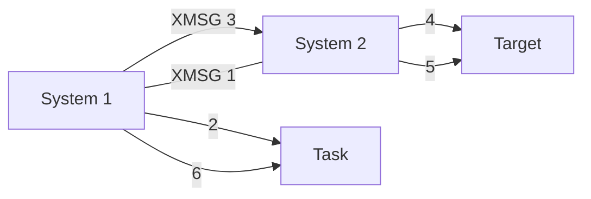

## Page 1

# ID Software Library Diskette

**Page 1**

## Directory Name:
210373L03-KX-01D

### Containing:
**X-MESSAGE**

---

### User Name: FLOPPY-USER

| No | File Name          | Type | T | Public | Friend | Own   | Pages | Bytes |
|----|--------------------|------|---|--------|--------|-------|-------|-------|
| 0  | XMSG-IN-L03        | PROG | I | R      | R      | RWACD | 59    | 180372|
| 1  | XMSG-01-L03        | XCOM | I | R      | R      | RWACD | 34    | 66798 |
| 2  | XMSG-STARTEX-L03   | MODE | I | R      | R      | RWACD | 2     | 886   |
| 3  | XMSG-STARTEX-L03   | BATC | I | R      | R      | RWACD | 3     | 3251  |
| 4  | XMSG-SYSTABS-L03   | SYMB | I | R      | R      | RWACD | 19    | 35080 |
| 5  | XMSG-POFTABS-L03   | SYMB | I | R      | R      | RWACD | 12    | 21265 |
| 6  | XMSG-VALUES-L      | SYMB | I | R      | R      | RWACD | 12    | 21422 |
| 7  | XMSG-FL-VALUES-L   | INCL | I | R      | R      | RWACD | 17    | 31710 |
| 8  | XMSG-LIBRARY-L03   | BRF  | I | R      | R      | RWACD | 8     | 13312 |
| 9  | XMSG-HDLC-TEST-L   | PROG | I | R      | R      | RWACD | 54    | 290816|
| 10 | XMSG-FIDO-L03      | PROG | I | R      | R      | RWACD | 45    | 90112 |
| 11 | XMSG-COMMAND-L03   | INCL | I | R      | R      | RWACD | 25    | 4766  |
| 12 | XMSG-KERN-CX-L03   | SPUN | I | R      | R      | RWACD | 43    | 80450 |
| 13 | XMSG-XROU-CX-L03   | SPUN | I | R      | R      | RWACD | 26    | 4301  |
| 14 | XMSG-SYMB-CX-L03   | SYMB | I | R      | R      | RWACD | 14    | 1398  |
| 15 | XMSG-LOAD-CX-L03   | MODE | I | R      | R      | RWACD | 2     | 956   |
| 16 | XMSG-KERN-NX-L03   | BPUN | I | R      | R      | RWACD | 42    | 7776  |
| 17 | XMSG-XROU-NX-L03   | SPUN | I | R      | R      | RWACD | 15    | 27995 |
| 18 | XMSG-SYMB-NX-L03   | SYMB | I | R      | R      | RWACD | 3     | 245   |
| 19 | XMSG-LOAD-NX-L03   | MODE | I | R      | R      | RWACD | 3     | 2063  |

20 files using 439 pages. 

610 pages reserved out of 610 pages.

---

## Page 2

# HD Software Library Diskette

## Containing:
**X-MESSAGE**

---

**User Name:** FLOPPY-USER

| No | File name          | Type | T | Public | Friend | Own   | Pages | Bytes |
|----|--------------------|------|---|--------|--------|-------|-------|-------|
| 0  | XMSG-IN-L03        | PROG | I | R      | R      | RWACD | 59    | 180372|
| 1  | XMSG-01-L03        | XCOM | I | R      | R      | RWACD | 34    | 66798 |
| 2  | XMSG-STARTEX-L03   | MODE | I | R      | R      | RWACD | 4     | 4486  |
| 3  | XMSG-STARTEX-L03   | BATC | I | R      | R      | RWACD | 2     | 886   |
| 4  | XMSG-SYSTABS-L03   | SYMB | I | R      | R      | RWACD | 19    | 35080 |
| 5  | XMSG-POFTABS-L03   | SYMB | I | R      | R      | RWACD | 12    | 21265 |
| 6  | XMSG-VALUES-L      | SYMB | I | R      | R      | RWACD | 12    | 21422 |
| 7  | XMSG-PL-VALUES-L   | INCL | I | R      | R      | RWACD |       |       |

8 files using 145 pages. 148 pages reserved out of 148 pages.

---

## Page 3

# ID Software Library Diskette

## Page 1

### Directory Name: 210373L03-XX-02S

---

**Containing:**

**X-MESSAGE**

---

**User Name: FLOPPY-USER**

| No | File name          | Type | T | Public | Friend | Own   | Pages | Bytes  |
|----|--------------------|------|---|--------|--------|-------|-------|--------|
| 0  | XMSG-LIBRARY-L03   | BRF  | I | R      | R      | RWACD | 17    | 31710  |
| 1  | XMSG-HDLC-TEST-L   | PROG | I | R      | R      | RWACD | 8     | 13312  |
| 2  | XMSG-FIDO-L03      | PROG | I | R      | R      | RWACD | 54    | 290816 |
| 3  | XMSG-COMMAND-L03   | PROG | I | R      | R      | RWACD | 45    | 90112  |

---

4 files using 124 pages. 148 pages reserved out of 148 pages.

---

## Page 4

# ID Software Library Diskette

## Directory Information

- **Page**: 1  
- **Directory Name**: 210373L03-XX-03S

### Containing

- **X-MESSAGE**

## User Information

- **User Name**: FLOPPY-USER

## Files

| No | File Name          | Type | T  | Public | Friend | Own   | Pages | Bytes |
|----|--------------------|------|----|--------|--------|-------|-------|-------|
| 0  | XMSG-KERN-CX-L03   | BPUN | I  | R      | RWAD   | RWACD | 25    | 47666 |
| 1  | XMSG-XROU-CX-L03   | BPUN | I  | R      | RWAD   | RWACD | 43    | 80450 |
| 2  | XMSG-SYMB-CX-L03   | SYMB | I  | R      | RWAD   | RWACD | 26    | 29601 |
| 3  | XMSG-LOAD-CX-L03   | MODE | I  | R      | RWAD   | RWACD | 2     | 1898  |

- **4 files using 96 pages.**
- **148 pages reserved out of 148 pages.**

---

## Page 5

# ID SOFTWARE LIBRARY DISKETTE

**PAGE 1**

**Directory Name:**  
210373L03-NX-04S

---

**Containing:**  
X-MESSAGE

---

**User Name:** FLOPPY-USER

| No | File name         | Type  | T  | Public | Friend | Own   | Pages | Bytes |
|----|-------------------|-------|----|--------|--------|-------|-------|-------|
| 0  | XMSG-KERN-NX-L03  | BPUN  | I  | R      | RWAD   | RWACD | 14    | 25136 |
| 1  | XMSG-XROU-NX-L03  | BPUN  | I  | R      | RWAD   | RWACD | 42    | 80076 |
| 2  | XMSG-SYMB-NX-L03  | SYMB  | I  | R      | RWAD   | RWACD | 15    | 27795 |
| 3  | XMSG-LOAD-NX-L03  | MODE  | I  | R      | RWAD   | RWACD | 3     | 2063  |

---

4 files using 74 pages. 148 pages reserved out of 148 pages.

---

## Page 6

# Norsk Data A.S - Program Description

**Date:** 88.02.02  
**Page:** 1 of 37

## Product

| Name      | ND-no.  | Category |
|-----------|---------|----------|
| X-MESSAGE | 210373L | STIN     |

## Reason

- X New product
- X Error Correction
- X Change/Addition

## Documentation

| Title                                | ND-no.     |
|--------------------------------------|------------|
| SINTRAN III Communication Guide      | 60.134.2 EN|
| COSMOS Operator Guide                | 30.025.2 EN|
| COSMOS Programmer Guide              | 60.164.3 EN|

## Purpose

Generalized Task-to-Task Communication within and between SINTRAN III VSE and/or VSX systems.

## Prerequisites

**Computer Type:** ND-100  
**Floating format:** SIN III VS  
**Op. system Version:** >=K

| ND-no.   | Product name     |
|----------|------------------|
| 210400B  | FMAC             |
| 210337E  | BACKUP-SYSTEM    |

**Minimum mass storage resources for installation**

| User   | Userspace             | Number of files                      |
|--------|-----------------------|--------------------------------------|
| SYSTEM | 60 pages              | 6 files                              |
| <ANY>  | 360 pages             | 19 files (VSE/Single density floppy) |
| <ANY>  | 360 pages             | 19 files (VSX/Single density floppy) |
| <ANY>  | 440 pages             | 23 files (Double density floppy)     |

**Minimum permanent mass storage resources**

| User  | Userspace | Number of files                  |
|-------|-----------|----------------------------------|
| <ANY> | 350 pages | 19 files (SINTRAN III VSE)       |
| <ANY> | 350 pages | 19 files (SINTRAN III VSX)       |

**Max/Min number of RT-descriptions:** 3 Max, 3 Min  
**Max/Min no. of system included segments:** 2 Max, 2 Min  
**Max/Min no. of pages of physical memory:** Max 400, Min 50  
**Space requirements on segment file(s):** 64 pages  

**ND-no. for Source:** 210198L

## File Information

| File Name              | Type  | Containing                          |
|------------------------|-------|--------------------------------------|
| XMSG-IN-L<rev>         | PROG  | Installation program                 |
| XMSG-OL-L<rev>         | XCOM  | Installation comm. file              |
| XMSG-STARTEX-L<rev>    | MODE  | Example of XMSG startup              |
| XMSG-STARTEX-L<rev>    | BATE  | Example of XMSG startup              |
| XMSG-SYSTABS-L<rev>    | SYMB  | XMSG table descriptions              |
| XMSG-POFTABS-L<rev>    | SYMB  | XMSG symbol values (NPL)             |
| XMSG-VALUES-L          | INCL  | Symbol values for PLANC              |
| XMSG-PL-VALUES-L       | BRF   | Message formatting library           |
| XMSG-LIBRARY-L<rev>    | PROG  | HDLC test program                    |
| XMSG-HDLC-TEST-L       | PROG  | XMSG watchdog program                |
| XMSG-FIDO-L<rev>       | PROG  | Background command program           |
| XMSG-COMMAND-L<rev>    | BPUN  | XMSG kernel (VSX system)             |
| XMSG-KERN-CX-L<rev>    | BPUN  | Routing prog. (VSX system)           |
| XMSG-XROUT-CX-L<rev>   | SYMB  | XMSG symbols (VSX system)            |
| XMSG-SYMB-CX-L<rev>    | MODE  | Loads XMSG onto its segments         |
| XMSG-LOAD-CX-L<rev>    |       |                                      |

ooo ND Norsk Data ooo

---

## Page 7

# Program Description

Date: 88.02.02  
Norsk Data A.S  

Page 2 of 37  

## Product

| Name      | ND-no.  | Category |
|-----------|---------|----------|
| X-MESSAGE | 210373L | STIN     |

| XMSG-KERN-NX-L<rev> | BPUN  | XMSG kernel (VSE system)         |
|---------------------|-------|---------------------------------|
| XMSG-XROU-NX-L<rev> | BPUN  | Routing prog. (VSE system)      |
| XMSG-SYMB-NX-L<rev> | SYMB  | XMSG symbols (VSE system)       |
| XMSG-LOAD-NX-L<rev> | MODE  | Loads XMSG onto its segments    |

**NOTE:**

- `<rev>` is to be replaced by the relevant version of the DIRECTORY or FILE. The revision level is found on the preceding "ND SOFTWARE LIBRARY DISKETTE" pages.

- The double density diskette 210373L<rev>-XX-01D contains all the files which are delivered on the four single density diskettes 210373L<rev>-XX-01S, 210373L<rev>-XX-02S, 210373L<rev>-XX-03S and 210373L<rev>-XX-04S.

- The product contains code for two different XMSG systems; one XMSG system to be used in a SINTRAN III - VSE system and one XMSG system to be used in a SINTRAN III - VSX system. (In a SINTRAN III VSE system, XMSG will be entered on page index table 3 - PIT3. In a SINTRAN III VSX system, XMSG will be entered on page index table 6 - XPIT).

```
ooo  ND Norsk Data  ooo
```

---

## Page 8

# TABLE OF CONTENTS

| Section | Page |
|---------|------|
| 1 GENERAL INFORMATION | 3 |
| 2 CHANGED PREREQUISITES | 5 |
| 3 ERRORS CORRECTED | 5 |

## 4 XMFIDO - XMSG watchdog service.

| Subsection | Page |
|------------|------|
| 4.1 General. | 7 |
| 4.2 XMFIDO requests. | 8 |
| 4.2.1 Start service. | 8 |
| 4.2.2 Stop service. | 8 |
| 4.3 XMFIDO response. | 9 |
| 4.3.1 Response layout from Start and Stop. | 9 |
| 4.3.2 Return status table. | 9 |

## 5 CHANGED NEW OR REMOVED XMSG-COMMAND:PROG COMMANDS

| Subsection | Page |
|------------|------|
| 5.1 Several commands | 9 |
| 5.2 Enable-Checksum | 10 |
| 5.3 Disable-Checksum | 10 |
| 5.4 Enable-Trace | 10 |
| 5.5 Disable-Route-Through | 10 |
| 5.6 Enable-Route-Through | 11 |
| 5.7 Define-Alternative-Link | 11 |
| 5.8 Remove-Alternative-Link | 11 |
| 5.9 List-Routing-Info | 11 |
| 5.10 List-Systems | 12 |
| 5.11 List-Links | 12 |
| 5.12 List-Frames | 12 |
| 5.13 List-Network-Servers | 12 |
| 5.14 List-Connections | 12 |
| 5.15 List-Utilization | 13 |
| 5.16 List-Generation-Variables | 14 |
| 5.17 Generate-Pattern | 14 |
| 5.18 Check-Pattern | 14 |
| 5.19 Loop-Receive-Reply | 14 |
| 5.20 Remote-Loop | 14 |
| 5.21 Debug-Mode | 14 |

---

## Page 9

# Table of Contents

| Section                                                                | Page |
|-----------------------------------------------------------------------|------|
| **6 CHANGED OR NEW XMSG FUNCTIONS**                                   | 15   |
| 6.1 Dummy Function (XFUDM)                                            | 15   |
| 6.2 General Status (XFGST)                                            | 15   |
| 6.3 General Status Multiple (XFGSM)                                   | 16   |
| 6.4 Check System and User Privileges (XFCPV)                          |      |
| **7 CHANGED OR NEW XRQUT SERVICES**                                   | 16   |
| 7.1 Get/Check Attribute (XSGAT)                                       | 16   |
| 7.2 Starting up/Stopping an Inter-System Link (XSLKI)                 | 17   |
| 7.3 Starting up/Stopping a Network Server (XSNET)                     | 17   |
| 7.4 Get Network Server Information (XSSNI)                            | 17   |
| 7.5 Get Information About a Link (XSLIN)                              | 18   |
| 7.6 Define Attribute (XSDAT)                                          | 18   |
| 7.7 Get Information About a System (XSLSY)                            | 19   |
| 7.8 Get Information About System Utilization (XSGSU)                  | 21   |
| 7.9 Get Information About System Generation Variables (XSGSG)         |      |
| **8 CHANGED OR NEW ERROR CODES**                                      | 22   |
| **9 INSTALLATION PROCEDURE**                                          | 23   |
| **10 LOADING/OPERATING PROCEDURE**                                    | 23   |
| 10.1 Loading Instructions                                             | 24   |
| 10.2 Assumptions Prior to Copying from the Diskette(s)                | 25   |
| 10.3 Copying the Product Diskette(s) to Mass Storage                  | 27   |
| 10.4 Initialization of XMSG to SINTRAN                                | 30   |
| 10.4.1 Initialization by means of the XMSG-INIT-L:MODE file:          | 30   |
| 10.4.2 Initialization by means of the installation program:           | 31   |
| 10.5 Redefine XMSG Generation Variable(s)                             |      |
| 10.5.1 Redefinition of variables using the XMSG-SYS-DEF-L:SYMB file:  | 32   |
| 10.5.2 Redefinition of variables by manual selection and modification | 33   |
| 10.6 Patching XMSG                                                    | 34   |
| 10.7 Exit from the Installation Program                               | 35   |
| 10.8 Loading XMSG                                                     | 36   |
| 10.9 Starting XMSG                                                    | 37   |
| 10.10 Stopping XMSG                                                   |      |

```
ooo ND Norsk Data ooo
```

---

## Page 10

# General Information

If MON 300 (EUSEL) or MON 276 (ELOFU) has been called without a following MON 303 (ELOFF) before a MON XMSG, then all escapes/local characters will be discarded while task is in XMSG. ELOFF will only delay the handling of an escape/local character until ELON is called. Advisable monitor call sequence if you want to trap all escape/local characters:  
MON 300(EUSEL)/276(ELOFU) - MON 303(ELOFF) - MON 200(XMSG) - MON 302(ELON).

The major changes from X-MESSAGE version K are:

- All known errors have been corrected.

- IOC interface is implemented on network gateway servers who support this interface. This interface is based on a separate message system residing within the I/O controller.

- XMFIDO is the new connection watchdog. The server resides on each system (with XMSG version>L), and checks periodically magic number validity (XFM2P) on behalf of a remote/local client. The new XMSG-COMMAND command LIST-CONNECTIONS will give a list of currently checked ports. XMFIDO is included on the XMSG-LOAD:MODE files. When XMSG is started, XMFIDO (RT-program) will be started by XROUT. When XMSG is stopped, XMFIDO will be stopped by XROUT. XMFIDO is described more detailed in chapter 5.

- Multiple transmit buffers are incorporated into the XMSG gateway handling routines. This will increase performance in various degrees for the different gateway server interfaces.

- When a link/network server is started, this is logged on the error device. When a network server is stopped, the server name will, if possible, be printed together with the information being logged on the error device. When XMSG is started/stopped by Start/Stop-XMSG in SINTRAN-SERVICE, this is logged on the error device.

- Handling of checksum on transport layer data is implemented. If we have a network connection to a remote system which is able (XMSG version>L) and enabled (checksum enabled) to handle checksum on datagrams, a checksum is provided on each datagram sent to the remote system. When a checksum error is detected, an error message is printed on the error device.

- Handling of alternative HDLC/Megalink(s) is implemented. When an HDLC/Megalink is stopped (fatal errors), datagrams currently set up for (re)transmission over the link will, if an alternative HDLC/Megalink has been defined, immediately be re-routed (by the link layer) for (re)transmission on that running link (if possible).

```
ooo  ND Norsk Data  ooo
```

---

## Page 11

# Program Description

| Date       | Norsk Data A.S   | Page 4 of 37 |
|------------|------------------|--------------|
| Product    | ND-no.           | Category     |
| Name       | 210373L          | STIN         |
| X-MESSAGE  |                  |              |

**NOTE:** When a HDLC/Megalink is started, XROUT will define all other HDLC/Megalinks, which are connected to the same neighbor system, as alternative links.

- A new XROUT service (XSLSY) that will return information about a system, has been implemented.

- A new XROUT service (XSGSU) that will return statistics about the XMSG system, has been implemented.

- A new XROUT service (XSGSG) that will return information about the XMSG system generation variables, has been implemented.

## XMSG VSX

- Default number of task descriptors (X4TSK) is increased from 50B to 120B. 
- Default number of port descriptors (X5PRT) is increased from 100B to 200B. 
- Default number of message elements (X4MES) is increased from 200B to 400B. 
- Default number of named ports (X4NAM) is increased from 400B to 1400B. 
- Default number of systems accessible (X4SIR) is increased from 250B to 1000B. 
- Default maximum message size (X4MMX) is increased from 2600B to 4704B (2500D).
- Default number of bytes each task can own (X5MTS) is increased from 5400B to 23420B (10000D). 
- The number of network transmit datagram elements (X4DGM) is increased from 5 to 12B.

Default size of the message buffer pool (X4BPG) is increased from 10B pages to 31B pages. This should be adequate for most systems, but do not hesitate to increase the number of pages at installation time if your system contains a lot of software using X-MESSAGE and your system has enough memory. If your situation is the opposite, it is advisable to reduce the number of pages used as buffer pool to increase swapping space.

## XMSG VSE

- Default number of task descriptors (X4TSK) is decreased from 50B to 24B.
- Default number of port descriptors (X5PRT) is decreased from 100B to 54B.
- Default number of message elements (X4MES) is decreased from 200B to 144B.
- Default number of links to be used simultaneously (X5NLK) is decreased from 4 to 2. These reductions are due to additions in code.
- Default maximum message size (X4MMX) is increased from 2600B to 4704B (2500D).
- Default number of bytes each task can own (X5MTS) is increased from 5400B to 23420B (10000D).

- The XMSG-COMMAND program has been extended with nine new commands and four commands have been removed.

- The installation procedure has been improved. When copying from diskettes, the program will create SYSTEM as friend (RWAD access) to the user having the XMSG files. Old XMSG files under the destination user will be deleted before.
   
---
000 ND Norsk Data 000

---

## Page 12

# Norsk Data A.S - Program Description

**Date:** 88.02.02  
**Page:** 5 of 37

| Product | ND-no. | Category |
|---------|--------|----------|
| Name    | 210373L | STIN     |
| X-MESSAGE |        |          |

files are copied from the diskette(s).

When old files have been deleted, the program will check for adequate free space/pages and enough free file entries under the destination user. If one of these checks fails, the program will stop (no files will be copied).

Note that all XMSG functions, XROUT services and error codes are referred to symbolically. Their values are defined in files XMSG-VALUES-L:SYMB for NPL and XMSG-PL-VALUES-L:INCL for PLANC. All XMSG calls are described later by showing the required NPL code.

## 2 Changed Prerequisites

XMSG version L requires SINTRAN III version K or later. It cannot run and *must not* be installed on a system which has a SINTRAN III earlier than the K version. If one wants to use Ethernet II with IOC interface, then SINTRAN III must be updated to patch level 4000 or greater.

## 3 Errors Corrected

All known errors have been corrected.

- One faulty operation in the XMSG installation procedure (XCOM) has been corrected. When the XMSG patch level was greater than 7 (decimal), the patch level was set to 0 (zero).

- If a system name was specified as reply to the 'XROUT system?' prompt (XMSG-Command), the internal output buffer, which contained the parameters for the XROUT service request (e.g. XSLKI), was destroyed. This faulty operation has been corrected.

- An error is corrected which caused XMSG crash (XXNMM) due to problems with allocated messages. When the task disconnected from XMSG, the memory usage was not updated correctly.

- When forwarding of INIT frames failed, XMSG could overwrite SINTRAN or itself. This faulty operation has been corrected.

- When data was received from another system via a wide area network (X.21/X.25), it was not possible to establish a connection to the remote system. This faulty operation has been corrected.

- When a network initialization response (INNAK) was returned via an Ethernet server, the network server could be stopped by XMSG. This faulty operation has been corrected.

```plaintext
ooo ND Norsk Data ooo
```

---

## Page 13

# Norsk Data A.S Program Description

| Date       | Page   | Product    | ND-no. | Category |
|------------|--------|------------|--------|----------|
| 88.02.02   | 6 of 37| Name       |        |          |
|            |        | X-MESSAGE  | 210373L| STIN     |

## Issues and Corrections

- When an RT-program which had issued the ‘receive and read’ function (XFRRE) was restarted, the program could be restarted with incorrect result parameters. This faulty operation has been corrected.

- The retransmission and termination of messages, caused by timeout (waiting for ACK etc.) and the reception of INIT/INACK/INNAK, has not been handled correctly - messages have been retransmitted in the wrong order, not been retransmitted at all, or not been terminated correctly etc. These faulty operations have been corrected.

- When a system was removed from the routing tables, messages set up for transmission to removed system were not released (i.e., message termination were never executed for these messages). This faulty operation has been corrected.

- The XROUT services XSNAM and XSCRS were accepted also from remote callers. In order to name a port using XSNAM/XSCRS, the caller must be a local task.

- When an RT-program which was in KMSG I/O-wait was to be restarted, the task was not restarted but would hang in KMSG. This faulty operation has been corrected.

- When a network server was to be started, XROUT would, if no XP/XM-block (or transmit buffer) was available, crash with XXRI2 (resource inconsistency). This faulty operation has been corrected. If there are not enough free resources, an error message is returned to the caller.

- When the ‘write and return’ function (XFWRT) was issued by an RT-program, XMSG could crash with crash reason XXIE (illegal port address) or, if no crash, an incorrect message could be returned. This faulty operation has been corrected.

- When a message was sent to a task with ‘wake-up’ specified, XMSG would, if the receiving task was in KMSG I/O-wait waiting for a message buffer (function XFGET with option XFWTF), loop on level 5.

- When an HDLC/Megalink was stopped/killed by XMSG, XMSG could crash with crash reason XXHER (error in HDLC driver or interface to it). This faulty operation has been corrected.

```
   ___  ND Norsk Data  ___
```

---

## Page 14

# XMFIDO - XMSG Watchdog Service

## 4.1 General



### Sequence of Operation

1: XMSG connection between "Task" in system 1 and "Target" in system 2.

2: "Task" requests XMFIDO service on "Target" to local XMFIDO.

3: Local XMFIDO transmits information to XMFIDO in system 2.

4: XMFIDO in system 2 checks "Target" in intervals requested by "Task".

5: XMFIDO in system 2 sends status back to XMFIDO in system 1 if "Target" closes port or XMFIDO itself terminates for maintenance, etc.

6: XMFIDO in system 1 gives status back to "Task".

Note that the **magic number of the port used to send** a "Start service" letter is the only reference back to requesting task - **DO NOT** close this port without terminating the services being performed for you.

## 4.2 XMFIDO Requests

The XMFIDO has a named port called \*XM-FIDO. The task that requests service from the XMSG watchdog system, must send a LETTER to \*XM-FIDO with the following information in standard XMSG (XROUT XSLET) parameter layout:

---

## Page 15

# Program Description

**Product** | **Name** | **ND-no.** | **Category**
--- | --- | --- | ---
X-MESSAGE | | 210373L | STIN

## 4.2.1 Start Service

Byte 0: Sequence number wanted on returned message.

(Byte 1: XSLET, Par. 1 = '**XM-FIDO**' etc.)

- **Par. 10, INTEGER2**: Request type: 100D = Start service.
- **Par. 11, INTEGER4**: Magic number of target.
- **Par. 12, INTEGER2**: Interval in seconds, legal range: 5 -> 3600 (5 seconds to 1 hour).
- **Par. 13, STRING**: Extra text displayed by XMSG-Command program (LIST-CONNECTIONS), max 20 characters.

**Note**: If you want to get only system-availability information from XMFIDO, then Parameter 11 should only contain the system no. in most significant 16 bits and zero in the L.S. 16 bits. The parameter 12 will in this case be a dummy parameter. This service will only be terminated by a stop request.

## 4.2.2 Stop Service

Byte 0: Sequence number wanted on returned message.

(Par. 1 = '**XM-FIDO**')

- **Par. 10, INTEGER2**: Request type: 101D = Stop service.
- **Par. 11, INTEGER4**: Magic number of target or system number - stop all services on this system, or 0 - stop all services.

## 4.3 XMFIDO Response

If the remote XMFIDO detects that target port is closed, it will send a letter to the local XMFIDO. The local XMFIDO will then notify "Task". Local XMFIDO will send information to "Task" about corresponding system availability (status 364). This will **not** affect remote services.

All statuses except:

- **XEFOK** (Ok (on Start service))
- **XEFSU** (System connection up)
- **XEFSD** (System connection down)
- **XEFAR** (Start service for this port..) and
- **XEFNP** (No corresponding port..)

will terminate the service.

```
ooo ND Norsk Data ooo
```

---

## Page 16

# Norsk Data A.S

**Program Description**

| Product   | Name      | ND-no. | Category |
|-----------|-----------|--------|----------|
| X-MESSAGE |           | 210373L| STIN     |

## 4.3.1 Response Layout from Start and Stop

Byte 0: Same number as in requested service.

Par. 1, INTEGER2: Return status

Par. 2, INTEGER4: Magic number of "Target" if Par. 1 > illegal parameter.

## 4.3.2 Return Status Table

The following values may currently be received as parameter 1:

- **XEFOK**: Ok.
- **XEFCL**: Watched port closed.
- **XEFSU**: System connection up.
- **XEFSD**: System connection down.
- **XEFTO**: Timeout on request. (No answer from remote XMFIDO)
- **XEFAR**: Start service for this port is already requested.
- **XEFIP**: Illegal parameters.
- **XEFOV**: Time parameter outside legal values.
- **XEFNP**: No corresponding port found.
- **XEFIE**: Internal error in XMFIDO.
- **XEFIT**: Local XMFIDO is terminating.
- **XEFRT**: Remote XMFIDO has terminated.
- **XEFRU**: Table resources used up in XMFIDO.

See also XMSG-values for definitions.

Note that in case of illegal parameters, only parameter 1 will be returned.

## 5 Changed New or Removed XMSG-Command: Prog Commands

No major changes have been made. However, five new commands have been added and a few commands have been changed.

When started, the XMSG-Command program will print additional information in the 'Options' field. If XMSG watchdog program (XMFIDO) is included in XMSG, 'Watchdog' is printed. If XMSG has IOC gateway code included, 'Network gateway/IOC' is printed.

### 5.1 Several Commands

If a virtual system number is specified as reply to an 'XROUT system?' or a 'Remote system?' prompt, the command is not accepted and the error message '*- Virtual system number not allowed -*' is printed.

```
         ooo  ND Norsk Data  ooo
```

---

## Page 17

# Norsk Data A.S Program Description

**Date:** 88.02.02  
**Page 10 of 37**  

| Product | Name       | ND-no.  | Category |
|---------|------------|---------|----------|
|         | X-MESSAGE  | 210373L | STIN     |

## 5.2 Enable-Checksum

This new privileged command prompts for `Xrout system` and `System`. If sent to a remote Xrout system running XMSG version L, the specified `System` must be the system name/number of the requesting XMSG-command program. If the remote Xrout system is older than XMSG version L, an error message will be printed. Throughput will be reduced with about 5% with checksum enabled.

If we have a network connection to a remote system which is able and willing to handle checksum on datagrams, a checksum is provided on each datagram.

## 5.3 Disable-Checksum

This new privileged command prompts for `Xrout system` and `System`. 

If sent to a remote Xrout system running XMSG version L, the specified `System` must be the system name/number of the requesting XMSG-command program. If remote Xrout system is older than XMSG version L, an error message will be printed.

## 5.4 Enable-Trace

Changed trace 16 (frame received); if checksum is enabled in the remote system, this is, when the `start-of-datagram` fragment is received, traced as `CE`.

Changed trace 17 (frame sent); if checksum is provided on the datagram this is, when the `end-of-datagram` fragment is sent, traced as `CP`.

Changed trace 14 (message received); if a message is received with checksum provided, this is traced as `message xxx received with checksum`.

## 5.5 Disable-Route-Through

It will now be possible to stop messages from being routed through a system. They will now be returned to the sending system with an error status.

## 5.6 Enable-Route-Through

Messages will now be allowed to travel through the system. This is the default situation.

```
ooo  ND Norsk Data  ooo
```

---

## Page 18

# Norsk Data A.S Program Description

| Date        | Page 11 of 37 |
|-------------|---------------|
| 88.02.02    |               |

| Product     | Name         | ND-no. | Category |
|-------------|--------------|--------|----------|
|             | X-MESSAGE    | 210373L | STIN     |

## 5.7 Define-Alternative-Link

This command enables a mega-/HDLC-link to be used directly as an alternative link if the main link should crash. The command prompts for the logical unit of the main and the alternative link. If the answer to the alternative logical unit is different from 0, it will ask for the system (name or number) that the main link is connected to. If the answer on the alt. LUN question is 0, then all Mega-/HDLC-links going to the same neighbor system will be regarded as alternative links. This is the default situation when a link is started.

## 5.8 Remove-Alternative-Link

This command prompts only for main mega-/HDLC-link logical unit and it removes the alternative link setting explained above.

## 5.9 List-Routing-Info

Change in the LIST-ROUTING-INFO command. Routing information for virtual system numbers (i.e. 9800-9999) is not listed. The command will now discriminate between LAN and WAN. The command program will append a '?' after WAN if a route is not previously used. This denotes that it is unknown whether it is LAN or WAN.

## 5.10 List-Systems

The command now allows us to list information from the tables held by any XRout system (which must be XMSG version > L), i.e. the command now prompts for 'XRout system?' and 'System?'.

When executed, the utilization of the routing table is listed as 'System table status: xxx entries. xx in use. Max xx used'

The information listed in the 'Access' field is:

``` 
    *----> x implies no checksum on datagrams is enabled.
    *---> x implies checksum is enabled in own system.
    *<--- x implies checksum is enabled in the listed system.
    *<--> x implies checksum is enabled in both systems, i.e. a 
    checksum is provided on each datagram transmitted.
```

- "**": here (local system).
- "x": indicates the access rights of the listed system.
- O - Own system, F - Friend system, P - Public system.

The information listed will also contain the network transmit and receive timeout values.

```
ooo ND Norsk Data ooo
```

---

## Page 19

# Norsk Data A.S Program Description

| Date       | Page      | Product    | Name     | ND-no. | Category |
|------------|-----------|------------|----------|--------|----------|
| 88.02.02  | 12 of 37 | X-MESSAGE |          | 210373L | STIN     |

## 5.11 List-Links

The command now allows us to list information from the tables held by any Xrout system (which must be XMSG version >=K), i.e., the command first prompts for `XROUT system?`. If nothing or 0 (i.e., local Xrout) is specified as response to the first prompt, the command prompts for `Record address?`. If a system (name or number) is specified as response to the `XROUT system` prompt, the command prompts for `Link number?`; depending on the reply to the `Link number` prompt, all links or only the specified link number (decimal) in the remote Xrout system will be listed.

If an Xrout system is specified (as response to the first prompt), the information is obtained using the Xrout service XSLIN. This means that if the accessed Xrout system is running XMSG version K, our system must have been defined as a friend in the executing Xrout system, and, in addition, if the accessed system is XMSG K, the link table status information will not and cannot be printed (due to the fact that this information is not returned from the service XSLIN in an XMSG K system).

## 5.12 List-Frames

If a frame is sent to/via a netserver or received from a netserver, the `HAC` field is now displayed as `-----`.

## 5.13 List-Network-Servers

The command now allows us to list network servers running in any Xrout system (which must be XMSG version >=K), i.e., the command now prompts for `XROUT system?`. To obtain information from a remote system running XMSG version K, our system must have been defined as a friend in the executing Xrout system.

## 5.14 List-Connections

The new XMSG-command command LIST-CONNECTIONS will give a list of currently checked ports and the corresponding requesting tasks. It will be prompted for `XROUT system` and `Connection System`.

## 5.15 List-Utilization

This new privileged command asks XROUT to dump out, from its and XMSG's tables, statistics about the system. The command prompts for `XROUT system?`, the system number or name of the system where the routing program is to be found (default is the local system).

```plaintext
ooo ND Norsk Data ooo
```

---

## Page 20

# Norsk Data A.S Program Description

- **Date:** 88.02.02
- **Page:** 13 of 37
  
## Product Information

| Name       | ND-no.  | Category |
|------------|---------|----------|
| X-MESSAGE  | 210373L | STIN     |

## System Information

The information listed is:

- **Version Level-patch-Size System Name**
  - Lxx `<level>` `<size>` # `<number>` `<name>`

- **Free space in Kernel:** xx words.
- **Size of message buffer:** xx pages.
- **Size of physical tables:** xx pages.

### Table Usage

| Table                     | Limit | Max used | In use |
|---------------------------|-------|----------|--------|
| Task table                | xx    | xx       | xx     |
| Port table                | xx    | xx       | xx     |
| Message table             | xx    | xx*      | xx     |
| Name table                | xx    | xx**     | xx     |
| System table              | xx    | xx       | xx     |
| Friend table              | xx    | xx       | xx     |
| Link table                | xx    | xx       | xx     |
| Receive Frame table       | xx    | xx       | xx     |
| Transmit Frame table      | xx    | xx       | xx     |
| Data transmit blocks      | xx    | xx       | xx     |
| Control transmit blocks   | xx    |          |        |

- **#** implies that forwarding of frames is inhibited (passthru stop).
- **\*** implies the maximum number of elements used simultaneously has reached the limit, i.e., at one point (or another) the market table has become full.

## 5.16 List-Generation-Variables

This new privileged command asks XROUT to dump out, from its and XMSG's tables, information about the system generation variables (as defined by the XMSG installation program). The command prompts for `XROUT system`, the system number or name of the system where the routing program is to be found (default is the local system).

The information listed is:

- **Version Patch System Name**
  - Lxx `<level>` `<number>` `<name>`

### System Generation Variables

| Name                               | Description                                             | Value  |
|------------------------------------|---------------------------------------------------------|--------|
| X4TSK                              | Maximum number of task descriptors                      | xxxxx  |
| X5PRT                              | Maximum number of ports                                 | xxxxx  |
| X4NAM                              | Maximum number of named systems/ports                   | xxxxx  |
| X4NLW                              | Maximum length of name in words                         | xxxxx  |
| X4MES                              | Maximum number of message elements                      | xxxxx  |
| X4MMX                              | Maximum message size in bytes                           | xxxxx  |
| X5MTS                              | Maximum buffer space owned by a task in bytes           | xxxxx  |
| X4BPG                              | Message buffer space in pages                           | xxxxx  |
| X4MCB                              | Maximum number of calls in a multicast function         | xxxxx  |
| X4SIR                              | Maximum number of systems accessible                    | xxxxx  |
| X5LNK                              | Maximum number of links                                 | xxxxx  |
| X4TMO                              | Default HDLC/Megalink timeout in XTUs                   | xxxxx  |
| X5TO1                              | Timeout in XTUs when receiving datagrams                | xxxxx  |
| X5TO2                              | Timeout in XTUs when transmitting datagrams             | xxxxx  |

```
ooo ND Norsk Data ooo
```

---

## Page 21

# Norsk Data A.S PROGRAM DESCRIPTION

**Date**: 88.02.02  
**Page**: 14 of 37

| Product  | Name        | ND-no. | Category |
|----------|-------------|--------|----------|
|          | X-MESSAGE   | 210373L| STIN     |

```
X3FSZ, Maximum frame size in words (input)................: xxxxx
X4FSO, Maximum frame size in words (output)...............: xxxxx
X4ACK, Maximum number of network acknowledgement frames...: xxxxx
X4NBF, Default number of receive frames per link..........: xxxxx
X4TMS, Number of transmit buffers per network server......: xxxxx
X4IRM, Default maximum number of SABMs when starting link.: xxxxx
X4RPM, Maximum number of repeats before link is stopped...: xxxxx
X4MXH, Maximum number of hops allowed.....................: xxxxx
X5NGT, Gateway timeout in XTUs when sending to net server.: xxxxx
X5TRB, Number of trace buffers............................: xxxxx
```

## 5.17 Generate-Pattern

Removed

## 5.18 Check-Pattern

Removed

## 5.19 Loop-Receive-Reply

Removed

## 5.20 Remote-Loop

Removed

## 5.21 Debug-Mode

In debug-mode, the `RT/DR` field of the LIST-TASKS command and the `Owner-task` field of the LIST-PORTS and the LIST-MESSAGES commands have been changed (and corrected). The `RT/DR` and the `Owner-task` fields will now display the task names as BAKxx etc.

```
ooo ND Norsk Data ooo
```

---

## Page 22

# 6 CHANGED OR NEW XMSG FUNCTIONS

One new function has been added and three functions have been changed.

## 6.1 Dummy Function (XFDUM)

The configuration mask being returned in the D-register has been extended with two new bits:

- Bit 12B: set if XMSG watchdog program (XMFIDO) is included.
- 13B: set if XMSG is generated with gateway software for IOC network servers.

## 6.2 General Status (XFGST)

On return, the X-register will now contain the number of messages queued to the port specified by the A-register, and the D-register will now contain message type.

## 6.3 General Status Multiple (XFGSM)

This is a new function for a 'snapshot' situation overview of messages queued to the 16 first opened ports.

**Name:** XFGSM  
**Input parameters:** None  
**Output parameters:** A-register

- A-register will have bit 0 set if last opened port has a message queued. It will have bit 1 set if the previously opened port has a message queued etc. (Any type of message)
- D-register will have the bits set if the first message queued is of type XMROU.
- X-register will have the bits set if the first message queued is of type XMTRE.

**Example:** Task opens port 6, 9 and 3 in that order.  
The bits in the return registers will then represent the ports in the reversed order:

| Port   | Corresponds to Bit |
|--------|--------------------|
| Port 3 | Bit 0 (last opened)|
| Port 9 | Bit 1              |
| Port 6 | Bit 2              |

Port 6 has got a normal message queued as first message.

```
ooo ND Norsk Data ooo
```

---

## Page 23

# Norsk Data A.S Program Description

**Date:** 88.02.02  
**Page:** 16 of 37  

| Product | Name       | ND-no.  | Category |
|---------|------------|---------|----------|
|         | X-MESSAGE  | 210373L | STIN     |

Port 9 has got message sent from XROUT (XMROU) as first message in queue. The second is a normal message (XMTNO).  
Port 3 has got a returned (XMTRE) message as first queued message.

The return registers will then be:

- A=7 => messages on port 3,9,6
- D=2 => message from XROUT on port 9
- X=1 => returned message on port 3

Bit 2 not set in neither D nor X means message of type XMTNO, XMHIP or XMBNC on port 6.

If the task then performs XFRCV on port 9, D will change from 2 to 0 on a new XFGSM.

## 6.4 Check System and User Privileges (XFCPV)

The response from the XFCPV function has been changed.

On return from XFCPV:  
If updating of routing tables are allowed, then A=1 and if the message is sent from a task within the local system, then D=0; if message is sent from a task in another system, then D=1. If updating of routing tables are NOT allowed, then A=0 and D contains the reason:

- D=0 if unprivileged remote system and unprivileged XMSG task.
- D=1 if privileged system, but not privileged XMSG task.
- D=2 if XMSG privileged task, but not privileged remote system.
- D=3 if the specified message is a returned (non-delivery) message.

## 7 Changed or New XROUT Services

Three new services have been implemented, and a few services have been changed.

### 7.1 Get/Check Attribute (XSGAT)

This service is divided into sub-services. The requested sub-service is specified by the first parameter in the message sent to XROUT. The number and type of the other parameters in the message, depends on the requested sub-service.

---

ooo ND Norsk Data ooo

---

## Page 24

# Norsk Data A.S

**PROGRAM DESCRIPTION**

| Product  | Name      | ND-no.  | Category |
|----------|-----------|---------|----------|
|          | X-MESSAGE | 210373L | STIN     |

---

## Get XMSG Version (XSGXV)

The reply will contain the version, the revision, the patch level, the product number/name and, in addition, the XMSG configuration mask (as returned by the "Dummy Function" XFDUM) as parameter number 1, 2, 3, 4 and 5 respectively.

| Parameter | No | Type    | Meaning                                      |
|-----------|----|---------|----------------------------------------------|
| In:       | 1  | Integer | Sub-service = XSGXV.                         |
| Out:      | 1  | String  | Version (e.g., L).                           |
|           | 2  | String  | Revision (e.g., 03).                         |
|           | 3  | Integer | Patch level (e.g., 3).                       |
|           | 4  | String  | Product number/name (e.g., 210373/xx..).     |
|           | 5  | Integer | XMSG configuration mask.                     |

## Get Friend Information (XSGFR)

The sub-service XSGFR is now available to both local and remote privileged XMSG tasks.

## 7.2 Starting up/Stopping an Inter-System Link (XSLKLI)

The reply will always contain the link state and the link index of the accessed link as parameters number 1 and 2 respectively.

| Parameter | No | Type    | Meaning                                        |
|-----------|----|---------|------------------------------------------------|
| Out:      | 1  | Integer | Link state (0=Dead, 1=Init, 2=Call, 3=Conn, 4=Run, 5=Kill). |
|           | 2  | Integer | Link (XL-block) index (>0).                    |

## 7.3 Starting up/Stopping a Network Server (XSNET)

The reply will always contain the link state and the link index of the accessed link as parameter number 1 and 2 respectively.

| Parameter | No | Type    | Meaning                                        |
|-----------|----|---------|------------------------------------------------|
| Out:      | 1  | Integer | Link state (0=Dead, 1=Init, 2=Call, 3=Conn, 4=Run, 5=Kill). |
|           | 2  | Integer | Link (XL-block) index (>0).                    |

## 7.4 Get Network Server Information (XSNSI)

The service is now available to both local and remote privileged XMSG tasks.

## 7.5 Get Information About a Link (XSLIN)

The service is now available to both local and remote privileged XMSG tasks.

The bit mask being returned in parameter 15D has been extended; if bit 2 (in parameter 15) is set, it implies that this is a link to a gateway (network server).

---

ooo ND Norsk Data ooo

---

## Page 25

# Norsk Data A.S - Program Description

- **Date**: 88.02.02
- **Page**: 18 of 37

| Product | Name     | ND-no. | Category |
|---------|----------|--------|----------|
|         | X-MESSAGE | 210373L | STIN     |

In addition to the parameters being returned in XMSG version K, the reply has been extended with three new parameters (P16-P18).

| Parameter Out | No | Type    | Meaning                                                |
|---------------|----|---------|--------------------------------------------------------|
|               | 16 | Integer | Size of link descriptor table, i.e., max number of entries available. |
|               | 17 | Integer | Number of link elements currently in use.              |
|               | 18 | Integer | Maximum number of link elements used.                  |

## 7.6 Define Attribute (XSDAT)

This service is divided into sub-services. The requested sub-service is specified by the first parameter in the message sent to XROUT. The number and type of the other parameters in the message depend on the requested sub-service.

### Enable Checksum (XSECS)

This new privileged service is used to enable checksum on datagrams being sent to the specified remote system. If the request is sent to a remote XROUT system, the request is accepted if, and only if, the specified system number in P2 equals the sending system number (i.e., the source system number).

| Parameter In | No | Type    | Meaning                     |
|--------------|----|---------|-----------------------------|
|              | 1  | Integer | Sub-service = XSECS         |
|              | 2  | Integer | System number               |

### Disable Checksum (XSDSCS)

This new privileged service is used to disable checksum on datagrams being sent to the specified remote system. If the request is sent to a remote XROUT system, the request is accepted if, and only if, the specified system number in P2 equals the sending system number (i.e., the source system number).

| Parameter In | No | Type    | Meaning                     |
|--------------|----|---------|-----------------------------|
|              | 1  | Integer | Sub-service = XSDSCS        |
|              | 2  | Integer | System number               |

## 7.7 Get Information About a System (XSLSY)

This new privileged service is mainly of interest to supervisor type programs, and not of general interest to normal users.

The service will return information about a known system (i.e., a system which has an entry (XS-block) in the routing tables). The service is also available to remote privileged tasks.

| Param | No | Type    | Meaning                                                                 |
|-------|----|---------|-------------------------------------------------------------------------|
| In    | 1  | Integer | Object system number.                                                   |
| Out   | 1  | Integer | The first system number found greater than or equal to that requested (or 0 if none). |
|       | 2  | Integer | Address of system descriptor (XS-block).                                |

ooo ND Norsk Data ooo

---

## Page 26

# Norsk Data A.S Program Description

**Date:** 88.02.02  
**Page:** 19 of 37

| Product | Name | ND-no. | Category |
| ------- | ---- | ------ | -------- |
|         | X-MESSAGE | 210373L | STIN |

## Parameters

| No. | Type    | Meaning                                                                 |
| --- | ------- | ----------------------------------------------------------------------- |
| 3   | Integer | System state (0=dead,<0 init,>0 run).                                   |
|     |         | =0: no connection exists.                                               |
|     |         | <0: connection being initialized (time countup).                        |
|     |         | >0: connected (repeat counter).                                         |
| 4   | Integer | Address of link descriptor (XL-block).                                  |
| 5   | Integer | Link (XL-block) index in XMSG.                                          |
| 6   | Integer | Subaddress (if via gateway) or 0.                                       |
| 7   | Integer | Send sequence number.                                                   |
| 8   | Integer | Receive sequence number.                                                |
| 9   | Integer | Number of WANs to this system (if parameter 3>0).                       |
| 10  | Integer | Number of LANs to this system (if parameter 3>0).                       |
| 11  | Integer | System type:                                                            |
|     |         | -0: Local system.                                                       |
|     |         | >0: Friend system.                                                      |
|     |         | <0: Public system.                                                      |
| 12  | Integer | Datagram checksum info:                                                 |
|     |         | 0: Disabled both in the local system and in this system.                |
|     |         | 1: Enabled in the local system, but disabled in this system.            |
|     |         | 2: Disabled in the local system, but enabled in this system.            |
|     |         | 3: Enabled both in the local system and in this system (i.e., when      |
|     |         |    datagrams are sent to this system, a checksum is provided on the     |
|     |         |    transport header and user data).                                     |
| 13  | Integer | Timeout value in tenths of a second (XTU's) being used when            |
|     |         | transmitting a datagram.                                                |
| 14  | Integer | Timeout value in tenths of a second (XTU's) being used when receiving   |
|     |         | a datagram.                                                             |
| 15  | Integer | Size of system ident and routing table.                                 |
| 16  | Integer | Number of system elements currently in use.                             |
| 17  | Integer | Maximum number of system elements used.                                 |

## 7.8 Get Information About System Utilization (XSGSU)

This new privileged service is mainly of interest to supervisor-type programs, and not of general interest to normal users.

The service allows a user to get information about the system utilization. The service is also available to remote privileged tasks.

| Param No | Type    | Meaning                                   |
| -------- | ------- | ----------------------------------------- |
| Out: 1   | Integer | Local system number.                      |
| 2        | String  | Local system name.                        |
| 3        | String  | XMSG version and revision (e.g. "L01").   |

ooo ND Norsk Data ooo

---

## Page 27

# Norsk Data A.S Program Description

**Date**: 88.02.02  
**Page**: 20 of 37  
**Product Name**: X-MESSAGE  
**ND-no.**: 210373L  
**Category**: STIN

| #  | Type    | Description                                                               |
|----|---------|---------------------------------------------------------------------------|
| 4  | Integer | XMSG patch level.                                                         |
| 5  | Integer | Total size of all patches.                                                |
| 6  | Integer | Number of WORDS free in Kernel (segment 33) for extension of tables and patches. |
| 7  | Integer | Size of message buffer pool in pages.                                     |
| 8  | Integer | Size of physical tables in pages.                                         |
| 9  | Integer | XMSG configuration mask (as returned by XFDUM).                           |
| 10 | Integer | Status info (Bit 0: passthru stop).                                       |
| 11 | Integer | Total number of XT-blocks available (limit).                              |
| 12 | Integer | Number of XT-blocks currently in use.                                     |
| 13 | Integer | Total number of XT-blocks used simultaneously.                            |
| 14 | Integer | Total number of XP-blocks available (limit).                              |
| 15 | Integer | Number of XP-blocks currently in use.                                     |
| 16 | Integer | Max number of XP-blocks used simultaneously.                              |
| 17 | Integer | Total number of XM-blocks available (limit).                              |
| 18 | Integer | Number of XM-blocks currently in use.                                     |
| 19 | Integer | Max number of XM-blocks used simultaneously.                              |
| 20 | Integer | Total no. of named ports & systems available.                             |
| 21 | Integer | Number of name units currently in use.                                    |
| 22 | Integer | Max number of name units used simultaneously.                             |
| 23 | Integer | Total number of XS-blocks available (limit).                              |
| 24 | Integer | Number of XS-blocks currently in use.                                     |
| 25 | Integer | Max number of XS-blocks used simultaneously.                              |
| 26 | Integer | Max number of friend units available (limit).                             |
| 27 | Integer | Number of friend units currently in use.                                  |
| 28 | Integer | Max number of friend units used simultaneously.                           |
| 29 | Integer | Total number of XL-blocks available (limit).                              |
| 30 | Integer | Number of XL-blocks currently in use.                                     |
| 31 | Integer | Max number of XL-blocks used simultaneously.                              |
| 32 | Integer | Total number of receive frame blocks available (limit).                   |
| 33 | Integer | Number of receive frame blocks currently in use.                          |
| 34 | Integer | Max number of receive frame blocks used simultaneously.                   |
| 35 | Integer | Total number of transmit frame blocks available (limit).                  |
| 36 | Integer | Number of transmit frame blocks currently in use.                         |
| 37 | Integer | Max number of transmit frame blocks used simultaneously.                  |
| 38 | Integer | Total number of data transmit blocks available (limit).                   |
| 39 | Integer | Number of data transmit blocks currently in use.                          |
| 40 | Integer | Max number of data transmit blocks used simultaneously.                   |
| 41 | Integer | Total number of control transmit blocks available (limit).                |

ooo ND Norsk Data ooo

---

## Page 28

# Norsk Data A.S Program Description

**Date**: 88.02.02  
**Page**: 21 of 37

| Product  | Name      | ND-no.  | Category |
|----------|-----------|---------|----------|
|          | X-MESSAGE | 210373L | STIN     |

42 Integer Number of control transmit blocks currently in use.  
43 Integer Max number of control transmit blocks used simultaneously.

## 7.9 Get Information About System Generation Variables (XSGSG)

This new privileged service is mainly of interest to supervisor type programs, and not of general interest to normal users.

The service allows a user to get information about the system generation variables. The service is also available to remote privileged tasks.

| Param No | Type    | Meaning                                                        |
|----------|---------|----------------------------------------------------------------|
| 1        | Integer | Local system number.                                           |
| 2        | String  | Local system name.                                             |
| 3        | String  | XMSG version and revision (e.g. "L01").                        |
| 4        | Integer | XMSG patch level.                                              |
| 5        | Integer | X4TSK: Max number of task descriptors.                         |
| 6        | Integer | X5PRT: Max number of ports.                                    |
| 7        | Integer | X4NAM: Max number of named systems/ports.                      |
| 8        | Integer | X4NLW: Max length of name in words.                            |
| 9        | Integer | X4MES: Max number of message elements.                         |
| 10       | Integer | X4MMX: Max message size in bytes.                              |
| 11       | Integer | X5MTS: Max buffer space owned by a task in bytes.              |
| 12       | Integer | X4BPG: Message buffer space in pages.                          |
| 13       | Integer | X4MCB: Max number of calls in a multicall function.            |
| 14       | Integer | X4SIR: Max number of systems accessible.                       |
| 15       | Integer | X5LNK: Max number of links.                                    |
| 16       | Integer | X4LTO: Default HDLC/Megalink timeout in XTUs.                  |
| 17       | Integer | X5T01: Timeout in XTUs when receiving datagrams.               |
| 18       | Integer | X5T02: Timeout in XTUs when transmitting datagrams.            |
| 19       | Integer | X3FSZ: Max frame size in words (input).                        |
| 20       | Integer | X4FSO: Max frame size in words (output).                       |
| 21       | Integer | X4ACK: Max number of network acknowledged frames.              |
| 22       | Integer | X4NBF: Default number of receive frames per link.              |
| 23       | Integer | X4TMS: Number of transmit buffers per network server.          |
| 24       | Integer | X4IRM: Default max no. of SABMs when starting link.            |
| 25       | Integer | X4RPM: Max number of repeats before link is stopped.           |
| 26       | Integer | X4MXH: Max number of hops allowed.                             |

ooo  ND Norsk Data  ooo

---

## Page 29

# Norsk Data A.S Program Description

**Date:** 88.02.02  
**Page:** 22 of 37

## Product Information

| Product | Name      | ND-no. | Category |
|---------|-----------|-------|----------|
|         | X-MESSAGE | 210373L | STIN   |

## Error Codes

| Integer | Code | Description                                        |
|---------|------|----------------------------------------------------|
| 27      | X5NGT | Gateway timeout in XTUs when sending to netserver.|
| 28      | X5TRB | Number of trace buffers.                          |

## 8 Changed or New Error Codes

Two new XMSG crash codes, two new XMSG function error codes and six new XROUT service error codes exist. In addition, the explanatory text for some of the error codes has been changed.

### New Error Codes

- **XXRIC** = XMSG crash: Inconsistency in COSMOS routing manager
- **XXMNL** = XMSG startup error: Length of system/port names too long, reduce length of name.
- **XENEC** = Network checksum error (purely internal significance)
- **XEICM** = Function not available to tasks other than the COSMOS routing manager
- **XRNTA** = Netserver: network temporarily not available
- **XRMT0** = Netserver: message too old
- **XRNRNR** = COSMOS routing manager is not running
- **XRCNR** = COSMOS routing manager is already running
- **XRRIND** = Routing information defined (start/stop inhibited!)
- **XRRIR** = COSMOS routing manager: invalid request

### Changed Error Codes

- **XEMFL** = Message space full or buffer not available
- **XETMU** = Too many multi-call functions
- **XEIBP** = Illegal message buffer pointer
- **XRUKS** = Unknown remote system name or number
- **XRNXM** = Invalid service request - not available to current caller
- **XRNXL** = No more Link Descriptors (XL-blocks) for start-link/netserver
- **XRNXD** = Not enough resources (XD/XF/XM-Blocks) for start-link/netserver
- **XRNRTR** = No trace generated (no trace buffer available)
- **XRMTL** = Too short message or resulting message too long
- **XRILN** = Illegal/Reserved Logical Unit Number (LUN) for link
- **XRNLN** = Remote system not on same Local Area Network (LAN)
- **XXIFL** = XMSG startup error: ZFUNC function >X5FUN
- **XIXOU** = XMSG crash: No legal routing (XROUT) port defined
- **XXINP** = XROUT crash: Releasing invalid name unit
- **XXNCX** = XMSG startup error: XMSG generated for ND-100/CX and ND-110, but this is no such CPU
- **XXIIL** = XMSG startup error: XMSG not to be run on this system (error from MON CPUST/ENTSG)

```
ooo  ND Norsk Data  ooo
```

---

## Page 30

# Installation Procedure

XMSG (X-MESSAGE) version L is available as two different systems:

a) XMSG generated with the standard ND-100 instruction set for computers which have the SINTRAN III - VSE operating system. (In a SINTRAN III - VSE system, XMSG will be entered on page index table 3 - PIT3).

b) XMSG generated with the CX instruction set for computers which have the SINTRAN III - VSX operating system. (In a SINTRAN III - VSX system, XMSG will be entered on page index table 6 - XPIT).

Both XMSG systems are registered and delivered together with the product no. 210373L.

Both systems always have the following XMSG code included:

- Single-system software.
- Inter-system software.
- Gateway software, except that XMSG for SINTRAN III/VSE does not (due to lack of space on page index table 3) include/support the new gateway (IOC) interface to network servers running in an I/O controller.
- XMSG trace facilities.
- XMSG watchdog facility.

# Loading/Operating Procedure

Read through this installation procedure before performing the installation.

This section describes how to install XMSG version L into a SINTRAN III VSE/VSX system. The installation is only permitted for SINTRAN III VSE/VSX version K and later versions; XMSG version L cannot run on a SINTRAN III system earlier than the K version.

Files installed on your system from installation of previous versions of XMSG may be deleted. However, if you already have an XMSG-START:MODE file, you should **not** delete this file.

The installation and maintenance of XMSG is done under user SYSTEM by means of an installation program called XMSG-IN-L:PROG and one installation command file of type XCOM. When started, the program will first prompt for the user that owns the XMSG file(s), present a menu on your terminal and prompt for a function.

---

## Page 31

# Norsk Data A.S Program Description

**Date:** 88.02.02  
**Page:** 24 of 37

| Product  | ND-no.  | Category |
|----------|---------|----------|
| X-MESSAGE | 210373L | STIN     |

---

## Which user has the X-MESSAGE files (default: UTILITY)?:

    ********************************
    * <Date>, <Time>               *
    ********************************
    *                              *
    * System number: <zzzzz>.      *
    * SINTRAN III - <xxxxx> version <y>. *
    * Installation of XMSG version L<ww>/<uu>. *
    *                              *
    * Copy files from floppies: ___ : 1. *
    * Initialize XMSG to Sintran:    : 2. *
    * Redefine XMSG generation variables: 3. *
    * Patch XMSG                     : 4. *
    * List function description:     : 5. *
    * List generation variables:     : 6. *
    * List Sintran system identification: 7. *
    * Exit:                          : 8. *
    *                              *
    ********************************

Please enter =>

`<Date>` and `<Time>` are the current date and time, `<zzzzz>` is the number of your system, `<xxxxx>` is the SINTRAN operating system type (VSE/VSX etc.), `<y>` is the SINTRAN version letter (e.g. K), `<ww>` is the XMSG version, and revision (e.g. L01) and `<uu>` indicates the system type (i.e. VSX or VSE).

Note that all answers to the installation program must be terminated by a carriage return (CR).

Note that the only proper way of leaving this program is to enter function 8 in the menu. If you return to the SINTRAN Command Processor (`@`) in any other way, an error has occurred.

You should be aware of the fact that when the installation program is started, the program will change the termination handling for your terminal (however, the termination handling will be restored to its original value when you leave the program). During this change of termination handling, the two messages ‘USER-BREAK TERMINATION ENABLED/DISABLED’ and ‘FATAL-ERROR TERMINATION ENABLED/DISABLED’ can be printed on your terminal. These messages are not error messages, and should be ignored.

## 10.1 Loading Instructions

Note that the product files can be copied to (and exist under) any user, but in this installation description we assume that the files are to be copied to (and exist under) user UTILITY. If the files are to be copied to someone else, you **must** substitute UTILITY with the other user-name.

    ooo   ND Norsk Data   ooo

---

## Page 32

# Norsk Data A.S Program Description

| Date       | Page      |
|------------|-----------|
| 88.02.02   | 25 of 37  |

| Product    | Name      | ND-no.  | Category |
|------------|-----------|---------|----------|
|            | X-MESSAGE | 210373L | STIN     |

a) If XMSG is to be installed from the diskette(s), start at section 10.2.  
b) If a new SINTRAN system has been installed, start at section 10.4.  
c) If you want to redefine an XMSG variable (i.e., if you want to change the current XMSG installation), start at section 10.5.  
d) If you need to patch XMSG, start at section 10.6.  
e) If a SINTRAN 'cold start' has been performed, start at section 10.8.  
f) If a RESTART-SYSTEM (Master Clear/Load or 'warm start') has been done, start at section 10.9.  
g) If you want to stop a running XMSG system, start at section 10.10.

## 10.2 Assumptions Prior to Copying from the Diskette(s)

Before the product files are copied from the diskette(s), a few things must be checked:

a) Make sure that the files SYMBOL-1-LIST:SYMB and SYMBOL-2-LIST:SYMB exist under user SYSTEM (and contain the MAC readable symbol lists for part 1 and 2 of your SINTRAN system).

```
<Log in as user SYSTEM>
@LIST-FILES SYMBOL-1-LIST:SYMB,,
@LIST-FILES SYMBOL-2-LIST:SYMB,,
```

b) Make sure that your SINTRAN has XMSG resident routines included (library mark 8XMSG).  
(When SINTRAN has the XMSG resident routines included, the file SYMBOL-2-LIST:SYMB contains the symbol XXRPT which is set to 177777.)

c) Make sure that the subsystems FMAC and BACKUP-SYSTEM have been installed (with those names).

```
<Log in as user SYSTEM>
@FMAC
- MACF - 
IMAGE-FILE : CR
)9EXIT

@BACKUP-SYSTEM
BACKUP-SYSTEM /xxx xx.xx.xx

Ba-sy: EXIT
```

```
ooo ND Norsk Data ooo
```

---

## Page 33

# Norsk Data A.S Program Description

## Product Information

| Date      | Page       |
|-----------|------------|
| 88.02.02  | 26 of 37   |

| Product   | Name       | ND-no.  | Category |
|-----------|------------|---------|----------|
|           | X-MESSAGE  | 210373L | STIN     |

---

### d) User SYSTEM Space Requirements

Ensure that user SYSTEM has sufficient unused space and adequate free entries for new files:

- **User SYSTEM** requires 60 pages of unused space and 6 free entries for new files.

If sufficient space is unavailable, increase user SYSTEM's space by using the command:

```
@GIVE-USER-SPACE SYSTEM,<No. of pages>
```

If free files are insufficient, delete some existing files.

### e) Pre-Copying Requirement for User UTILITY

Before copying files through the installation program:

- Log in as **user UTILITY** and:
  
  - Create user SYSTEM as a Friend of user UTILITY with Read-Write-Append-Directory (RWAD) access rights.
  
  - Delete all XMSG files under user UTILITY with the specified file names:

    ```
    XMSG-:COM       XMSG-::XCOM
    XMSG-IN:PROG    XMSG-STARTEX
    XMSG-SYSTABS:SYMB  XMSG-POFTABS:SYMB,
    XMSG-VALUES:SYMB   XMSG-PL-VALUES:INCL
    XMSG-LIBRARY:BRF   XMSG-HDLC-TEST:PROG
    XMSG-FIDO:PROG     XMSG-COMMAND:PROG
    XMSG-:BPUN         XMSG-SYMB::SYMB
    XMSG-LOAD:MODE     XMSG-INIT:MODE
    XMSG-SYS-DEF:SYMB  XMSG-SYS-DEF:LIST
    ```

  If any XMSG files exist under user UTILITY, ensure user UTILITY has Read-Write-Append-Directory (RWAD) access to the files:

  To log in as user UTILITY:

  ```
  @LIST-FILES <File name>,
  ```

  If the file(s) already exist:

  ```
  @SET-FILE-ACCESS <File name>,R,RWAD,RWACD
  ```

### b) User UTILITY Disk Space Requirements

Ensure that user UTILITY has enough unused space and free entries for new files:

- With a double density diskette, user UTILITY needs 440 pages and 23 file entries.

- With single density diskettes, user UTILITY requires 360 pages and 19 file entries.

```
ooo ND Norsk Data ooo
```

---

## Page 34

# Program Description

| Date      | Norsk Data A.S | Page 27 of 37 |
|-----------|----------------|---------------|
| Product   | Name           | ND-no.        | Category |
| X-MESSAGE | 210373L        | STIN          |

If not enough space is available, give the user more space with the command:

```
@GIVE-USER-SPACE UTILITY,<No. of pages>
```

If there are not enough free files, you must delete some (old) files.

## 10.3 Copying the Product Diskette(s) to Mass Storage

Note that the installation of XMSG version L must be performed by user SYSTEM.  
The installation may be performed on a screen-oriented terminal or, if you want a paper copy of the installation, on a hard-copy terminal.

- Log in as user SYSTEM.

- Insert the floppy labelled 210373L<rev>-XX-01 in floppy disk 1 unit 0 and enter the directory.

```
@ENTER-DIRECTORY 210373L<rev>-XX-01 FLOPPY-DISC-1 0
```

(If FLOPPY-DISC-1 unit 0 is occupied by someone else, you may use another floppy controller/unit.)

- Delete old XMSG-IN-:PROG files, if any.

- Copy the installation program (XMSG-IN-L:PROG) to user UTILITY by use of COPY-FILE or BACKUP-SYSTEM:

```
@BACKUP-SYSTEM
BACKUP-SYSTEM//xxx xx.xx.xx
```

```
Ba-sys: COPY-USERS-FILES
Destination type: DIRECTORY
Destination directory name '..' : CR
Destination user name 'SYSTEM' : UTILITY
Source type: DIRECTORY
Source directory name '..' : 210373L
Source user name '..' : FLOPPY-USER
Source file name '..' : XMSG-IN-L:PROG
Manual selection: NO
Ba-sys: EXIT
```

- Now the installation program has to be started.

```
@(UTILITY)XMSG-IN-L
```

When activated, the installation program will first check the terminal type number. If it has not been set, the program will prompt for the terminal type.

000 ND Norsk Data 000

---

## Page 35

# Norsk Data A.S Program Description

Date: 88.02.02  
Page: 28 of 37

| Product     | Name       | ND-no.  | Category |
|-------------|------------|---------|----------|
|             | X-MESSAGE  | 210373L | STIN     |

## Terminal Type Configuration

What is the terminal type (default: 2)?: **CR**

If the installation is performed on a hard-copy terminal, use the default terminal type (2). For a screen-oriented terminal, specify another value. Once set, the program will prompt for the user owning the XMSG installation program (XMSG-IN-L:PROG). If the installation program was copied to a user other than UTILITY, you **must** give the name of that user.

## User Configuration

Which user has the X-MESSAGE files (default: UTILITY)?: **CR**

Specify the user with the installation program to present the menu on your terminal. Refer to section 10 (page 24).

- Enter function 5: Describe various services.

  ```
  Please enter ==> 5
  ```

Avoid entering functions 2, 3, 4, or 6 before copying product files from the diskette(s).

## Copying XMSG Files

- Enter function 1 to copy files:

  ```
  Please enter ==> 1
  ```

The program guides you on copying files. Files can be copied to the user with the installation program or another user.

Conditions:
- Old XMSG files under the destination will be deleted.
- Check section 10.2 (page 26) for details.
- Ensure enough free pages and entries before copying.
- Error messages appear in case of failure, returning you to the SINTRAN Command Processor (@).

### Prompts

- Destination directory name (def: def. dir. for dest. user)?

- Destination user name (default: UTILITY)?

- Is directory 210373L-XX-01 entered (default: Y)?

- **If using single density diskettes:**

  - Which floppy station (floppy-disc-X) (default: 1)?
  
  - Unit number (default: 0)?

```
ooo ND Norsk Data ooo
```

---

## Page 36

# Norsk Data A.S Program Description

**Date:** 88.02.02  
**Page:** 29 of 37  

| Product | ND-no.  | Category |
|---------|---------|----------|
| X-MESSAGE | 210373L | STIN     |

To give you the opportunity to use a program file, the following question will be asked:

Is the BACKUP-SYSTEM dumped reentrant (default: Y)?

If you answer No, then you will be prompted for the user name of the owner of the BACKUP-SYSTEM:PROG file.

If the files are on single density diskettes, you will, when the files have been copied from the first diskette (210373L<rev>-XX-01S) be asked to remove floppy 210373L<rev>-XX-01S from the floppy station and to insert floppy 210373L<rev>-XX-2S in the floppy station. When the files have been copied from the second diskette (210373L<rev>-XX-02S) you will be asked to remove floppy from the floppy station and, depending on the XMSG system being copied, to insert floppy 210373L<rev>-XX-03S or 210373L<rev>-XX-04S in the floppy station. When the files are on single density diskettes, only those files that are necessary will be copied.

If the files are on a double density diskette, the installation program will copy all the files from the diskette, check whether you have a SINTRAN III - VSE or a SINTRAN III - VSX system and delete unnecessary SINTRAN dependent product files.

When the files have been copied, the SINTRAN dependent files are renamed as follows:

```
XMSG-KERN-XX-L:BPUN  is renamed to XMSG-KERNEL-L:BPUN
XMSG-XROU-XX-L:BPUN  is renamed to XMSG-XROUT-L:BPUN
XMSG-SYMB-XX-L:SYMB  is renamed to XMSG-SYM3L-L:SYMB
XMSG-LOAD-XX-L:MODE  is renamed to XMSG-LOAD-L:MODE
```

When the copying and renaming of files are performed, the program will automatically make the necessary adjustments of XMSG to your SINTRAN system (i.e., the XMSG files will be initialized for your SINTRAN system). When XMSG has been initialized, the program will automatically create an initialization file called XMSG-INIT-L:MODE. If the XMSG files need to be reinitialized (see section 10.4), this can be done by means of function 2 in the installation program or, as user SYSTEM, by running the XMSG-INIT-L:MODE file as a MODE job.

You can, as described in section 10.5, redefine the XMSG system definition variables. The installation program can, if you wish and when the XMSG-SYS-DEF-L:SYMB file exists, read your definitions from the XMSG-SYS-DEF-L:SYMB file. This file, which contains the variables needed for generating XMSG, must be created by the installation program, so now you will be prompted for:

Do you want to create the XMSG-SYS-DEF-L:SYMB file (Y/N) (Def: Y)?

If the file is created, you can, using a source editor, redefine the values of the XMSG system definition variables on the XMSG-SYS-DEF-L:SYMB file to suit your requirements.

---  

ND Norsk Data

---

## Page 37

# Program Description

| Date       | Page  |
|------------|-------|
| 88.02.02   | 30 of 37 |

**Norsk Data A.S**

| Product | Name      | ND-no.  | Category |
|---------|-----------|---------|----------|
|         | X-MESSAGE | 210373L | STIN     |

When the XMSG-SYS-DEF-L:SYMB file has been created, the installation program will return to the main menu and prompt for a new function.

**IMPORTANT NOTE:**

You can NOT use the 'COSMOS X.25 Option' version A (i.e., the ND product number 210573A), with this version of XMSG. Please change to a later version of 210573. (See section 10.5).

## 10.4 Initialization of XMSG to SINTRAN

The product files contain generalized SINTRAN independent BPUN files. Before XMSG is loaded onto its segments and started, these files must be modified according to your SINTRAN system.

**NOTE:** Whenever a new SINTRAN system is installed (with new SYMBOL-1-LIST:SYMB and SYMBOL-2-LIST:SYMB files), the XMSG files must be reinitialized before XMSG is reloaded onto its segments (see section 10.8) and restarted. (See section 10.9).

Initialization of XMSG to SINTRAN is automatically performed when the product files are copied from the diskette(s). If the product files have been copied, you may ignore the rest of section 10.4.

When the XMSG files need to be reinitialized, you can either run the (UTILITY)XMSG-INIT-L:MODE file, which was created when the product files were copied from the diskette(s), as a MODE job **or** you can use the XMSG installation program.

### 10.4.1 Initialization by Means of the XMSG-INIT-L:MODE File

- To initialize XMSG, log in as user SYSTEM and run the XMSG-INIT-L:MODE file:

```
<Log in as user SYSTEM>
@MODE (UTILITY)XMSG-INIT-L:MODE,,L
```

Running this mode file leads to the XMSG files being initialized to your SINTRAN system.

### 10.4.2 Initialization by Means of the Installation Program

- Start the installation program and specify which user has the XMSG files.

```
<Log in as user SYSTEM>
<Make sure that user SYSTEM has enough unused space (60 pages)>
<Make sure that user SYSTEM has at least 6 free file entries>
```

ooo ND Norsk Data ooo

---

## Page 38

# Norsk Data A.S

## PROGRAM DESCRIPTION

| Date       | Page       |
|------------|------------|
| 88.02.02   | 31 of 37   |

| Product   | Name        | ND-no.  | Category  |
|-----------|-------------|---------|-----------|
|           | X-MESSAGE   | 210373L | STIN      |

```
@{UTILITY}XMSG-IN-L

Which user has the X-MESSAGE files (default: UTILITY)?: CR

The program will display the installation menu on your terminal,
see section 10 (page 24).

- To initialize XMSG, enter function 2 in the menu.

  Please enter => 2

When the XMSG files have been initialized, the program will return to
the main menu and prompt for a new function.
```

### 10.5 Redefine XMSG Generation Variable(s)

The XMSG product is generated and delivered with default values inserted in the XMSG system definition variables. If a non-standard XMSG configuration is required, you may change the variables using the installation program.

The variables can be modified in one of two ways:

- If the definitions exist on the XMSG-SYS-DEF-L:SYMB file, the installation program can read the definitions from this file. When the file is read by the installation program, the variables will be checked and the result (output) is written to the XMSG-SYS-DEF-L:LIST file. The output file (of type LIST) will be created, by the installation program, under the same user that has the source file (of type SYMB).

  (The XMSG-SYS-DEF-L:SYMB file is created/updated by the installation program when the product files are copied from the diskettes, and when the XMSG generation variables have been modified.)

- You can perform manual selection and modification of the definitions. In this case, the installation program will prompt for each XMSG system definition variable.

**IMPORTANT NOTE:**
This redefinition of variables does not affect the running of the loaded XMSG system, but results in the product files (i.e., files of type BPUN) being updated to your definition(s). Your modifications will be effective when XMSG is later (re)loaded and (re)started, see section 10.8 and section 10.9.

- Start the installation program and specify which user has the XMSG files.

  ```
  <Log in as user SYSTEM>
  <Make sure that user SYSTEM has enough unused space (60 pages)>
  <Make sure that user SYSTEM has at least 6 free file entries>
  ```

```
@{UTILITY}XMSG-IN-L

ooo ND Norsk Data ooo
```

---

## Page 39

# Program Description

| Date       | Norsk Data A.S          | Page 32 of 37 |
|------------|-------------------------|---------------|
| Product    | Name                    | ND-no. 210373L| Category STIN |
|            | X-MESSAGE               |               |               |

Which user has the X-MESSAGE files (default: UTILITY)?: **CR**

The program will display the installation menu on your terminal, see section 10 (page 24).

- If you want a list of the current values, enter function 6 in the menu.

  Please enter => **6**

  The program will display the variables that may be modified, their meaning, their current values, space usage and the current XMSG patch level.

- To change the XMSG variable(s), enter function 3 in the menu.

  Please enter => **3**

  The program will guide you through the redefinition of variables.

If the XMSG-SYS-DEF-L:SYMB file does not exist, the program will automatically display the first system variable on your terminal and prompt for the new value. See ‘Redefinition of variables by manual selection and modification’, below.

If the XMSG-SYS-DEF-L:SYMB file exists, you will be prompted for:

Read definitions from (UTILITY)XMSG-SYS-DEF-L:SYMB (Y/N) (Def: No)?

If Yes (CR) is specified, the program will enter ‘Redefinition of variables using the XMSG-SYS-DEF-L:SYMB file’ (see below). If No (CR) is specified, the program will enter ‘Redefinition of variables by manual selection and modification’ (see below).

## 10.5.1 Redefinition of Variables Using the XMSG-SYS-DEF-L:SYMB File

If **Yes (CR)** is specified as reply to the ‘Read definitions from...?‘ prompt, the program will read and check your definitions from the XMSG-SYS-DEF-L:SYMB file. When the file is read and checked, errors will be written to the XMSG-SYS-DEF-L:LIST file. If the format of the file and the XMSG definitions are accepted, the program will update the product files (of type BPUN). If the XMSG system has become too big, an error message is printed on your terminal, and you are requested to reduce some of the variables.

When the product files have been updated to suit your definitions, you will be prompted for:

Do you want to update the XMSG-SYS-DEF-L:SYMB file (Y/N) (Def: Y)?

ooo ND Norsk Data ooo

---

## Page 40

# Norsk Data A.S Program Description

- **Date:** 88.02.02
- **Page:** 33 of 37

| Product | Name     | ND-no. | Category |
|---------|----------|--------|----------|
|         | X-MESSAGE| 210373L| STIN     |

When the file has been updated, or if you specify **No (CR)**, the program will return to the main menu and prompt for a new function, see section 10 (page 24).  
*(Unless a new SINTRAN system has been installed, it is not necessary to reinitialize the XMSG files to SINTRAN.)*

## 10.5.2 Redefinition of Variables by Manual Selection and Modification

When manual modification of definitions are to be performed, the program will display the first system variable on your terminal and then prompt for the new value.

- **X4TSK, Number of task descriptors (XT-blocks)——(old: 40):**

If you have or are going to have the 'COSMOS X.25 Option' **version A** (product no. 210573A), you must change the following variable:

- **X3FSZ, Maximum frame size in words (input)——(old: 312):** 256

During this modification of variables, you have the following set of commands at your disposal:

```
*--------------------------------------------------*
* Menu:                                            *
* H_____: List following commands.                 *
* N or CR: Move to the next variable.              *
* P_____: Move to the previous variable.          *
* F_____: Move to the first variable.              *
* Name___: Move to the specified variable.         *
* ?_____: Explain variable.                        *
* ._____: End of changes.                          *
*--------------------------------------------------*
```

When you have finished your modifications, the program will check the new system size and, if it fits on the page index table, update the product files (of type BPUN). If the XMSG system has become too big, an error message is printed on your terminal, and you are requested to reduce some of the variables. When the product files have been updated to suit your definitions, you will be prompted for:

Do you want to update the XMSG-SYS-DEF-L:SYMB file (Y/N) (Def: Y)?

When the file has been updated, or if you specify **No (CR)**, the program will return to the main menu and prompt for a new function, see section 10 (page 24).  
*(Unless a new SINTRAN system has been installed, it is not necessary to reinitialize the XMSG files to SINTRAN.)*

oo0 ND Norsk Data 0oo

---

## Page 41

# Program Description

**Date**: 88.02.02  
**Norsk Data A.S**  
**Page**: 34 of 37  

| Product | Name       | ND-no. | Category |
|---------|------------|--------|----------|
|         | X-MESSAGE | 210373L | STIN     |

## 10.6 Patching XMSG

If XMSG needs to be patched according to a Software System Report (SSR), this is done by using the installation program. If no SSR is received, you may ignore the rest of section 10.6.

XMSG is corrected by running a file `(XMSG-PATC-xx-L:SYMB)` which contains one or more patches that will correct the error. `xx` is the new XMSG patch level - see your Software System Report. Initially, when the product diskettes are delivered and installed, XMSG is on patch level 00.

This patching does not affect the loaded or the running XMSG system, but results in the product files (i.e., the XMSG files of type BPUN) being updated to the new patch level. The patch(es) will be effective when XMSG is (re)loaded (see section 10.8) and (re)started (see section 10.9).

- Start the installation program and specify which user that has the XMSG files.

```
<Log in as user SYSTEM>
<Make sure that user SYSTEM has enough unused space (60 pages)>
<Make sure that user SYSTEM has at least 6 free file entries>

@(UTILITY)XMSG-IN-L

Which user has the X-MESSAGE files (default: UTILITY)?: CR
```

The program will display the installation menu on your terminal, see section 10 (page 24).

- To patch XMSG, enter function 4 in the menu.

```
Please enter ==> 4
```

The program will prompt for the new patch level.

```
What is the new XMSG patch level (xx):
```

You must specify the new patch level (xx) according to the Software System Report.

The program will read and check the patch file. If the patch file is correct, the program will calculate and check the new system size and, if XMSG still fits into the XMSG index table, patch the product files (of type BPUN). When the product files have been patched, the program will return to the main menu and prompt for a new function. If the system has become too big, the program will enter function 3 in the main menu ('Redefine XMSG generation variables') and prompt for reduction of the variables that determine system size.

(Unless a new SINTRAN system has been installed, it is not necessary to reinitialize the XMSG files to SINTRAN.)

```
ooo  ND Norsk Data  ooo
```

---

## Page 42

```
Date 88.02.02                          Norsk Data A.S                       Page 35 of 37  
                                        PROGRAM DESCRIPTION  

| Product  | Name         | ND-no. | Category |
|----------|--------------|--------|----------|
|          | X-MESSAGE    | 210373L| STIN     |

## 10.7 Exit from the Installation Program

When the copying of files, initialization of XMSG, redefinition of variables, patching of XMSG etc. are completed, you may leave the installation program.

- To leave the program, enter function 8 in the menu.

  Please enter ==> 8

The program will restore the original termination handling of your terminal and return to the SINTRAN Command Processor (@).

If the termination handling was set, the message `* The standard termination handling is now restored, but NOT enabled! *` will be printed on the terminal. Note that the termination handling is restored, but it is not enabled. To enable the termination handling, you must use the SINTRAN command:

```
@ENABLE-TERMINATION-HANDLING B,/ <user break or fatal error>
```

If in doubt leave the termination handling as it is!

If no termination handling was set, the message `* The standard termination handling .....` will not be printed, so the command ENABLE-TERMINATION-HANDLING should not be executed.

The only proper way of leaving this program is to enter function 8. If you return to SINTRAN in any other way, an error has occurred.

## 10.8 Loading XMSG

Loading XMSG needs to be done:

a) When XMSG is installed from the diskette(s), see section 10.1.

b) After all `)HENT or `cold start´ operations.

c) When XMSG system definition variables have been redefined, see section 10.5.

d) When XMSG has been patched, see section 10.6

#### IMPORTANT NOTE:

If you have copied the XMSG product files to a user other than user UTILITY, you MUST edit the (XMSG-OWNER)XMSG-LOAD-L:MODE file before XMSG is loaded. `XMSG-OWNER` is the name of the user that has the XMSG files.

- Log in as user `XMSG-OWNER`.
- Read the file XMSG-LOAD-L:MODE using a source editor.
- Substitute (UTILITY)XMSG with (XMSG-OWNER)XMSG.
- Write the file back to XMSG-LOAD-L:MODE.

```
          ooo  ND Norsk Data  ooo
```

---

## Page 43

# Norsk Data A.S Program Description

| Date       | Page     |
|------------|----------|
| 88.02.02   | 36 of 37 |

| Product    | Name       | ND-no. | Category |
|------------|------------|--------|----------|
|            | X-MESSAGE  | 210373L| STIN     |

Note that when XMSG is loaded, the current running XMSG system will be stopped. Before you load XMSG, you should therefore inform other logged on users that XMSG (and thereby COSMOS) will be stopped.

**IMPORTANT NOTE:**  
XMSG version L **MUST** be loaded using the XMSG-LOAD-L:MODE file. You **cannot** load XMSG version L using any other load file.

To load XMSG, log in as user SYSTEM and run the (XMSG-OWNER)XMSG-LOAD-L:MODE file:

```
<Log in as user SYSTEM>
@MODE (XMSG-OWNER)XMSG-LOAD-L:MODE,,,
```

Running this mode file performs the following:

a) XMSG-KERNEL-L:BPUN is loaded onto segment 33 (non-demand).

b) XMSG-XROUT-L:BPUN is loaded onto segment 34 (demand).

c) XMSG-FIDO-L:PROG is loaded onto the first free segment (non-demand).

d) The foreground programs XROUT (routing program), XTRACE (trace program) and XMFIDO (watchdog program) are created.

e) The SINTRAN location XMSGU+4 is patched to -1, to indicate to SINTRAN that XMSG is loaded.

When XMSG has been loaded onto its segments, XMSG can be started as described in section 10.9.

## 10.9 Starting XMSG

When XMSG has been loaded onto its segments, the START-XMSG command in the SINTRAN-SERVICE program will start XMSG. Note that when a RESTART-SYSTEM (Master Clear/Load or "warm start") is done, the START-XMSG command must be executed to restart XMSG.

```
<Log in as user SYSTEM>
@SINTRAN-SERVICE
*START-XMSG 
Ok: XMSG started
*EXIT 
@
```

This will fix (FIXC/FIXC5) the XMSG-KERNEL-L segment and buffer area pages into physical memory, XMSG is entered on its page table, the XMSG monitor call is enabled, XROUT started, XTRACE started and XMFIDO started.

The file XMSG-STARTEX-L:MODE contains an EXAMPLE of how to start an XMSG system. It must be modified according to your special needs.

---

## Page 44

# Norsk Data A.S Program Description

**Date**: 88.02.02  
**Page**: 37 of 37

| Product | Name | ND-no. | Category |
|---------|------|--------|----------|
|         | X-MESSAGE | 210373L | STIN  |

How to operate XMSG is described in the COSMOS Operator Guide (ND-no. 30.025.2 EN) and in the SINTRAN III Communication Guide (ND-no. 60.134.2 EN).

## 10.10 Stopping XMSG

If XMSG needs to be stopped, the STOP-XMSG command in the SINTRAN-SERVICE program can be used:

```
<Log in as user SYSTEM>
@SINTRAN-SERVICE
*STOP-XMSG
Ok: XMSG terminated
*EXIT
@
```

This command disables the XMSG monitor call (from SINTRAN) and releases the physical memory space which was fixed. When XMSG has been stopped, it can later be restarted (see section 10.9).

ooo ND Norsk Data ooo

---

