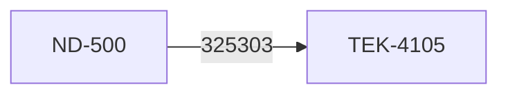
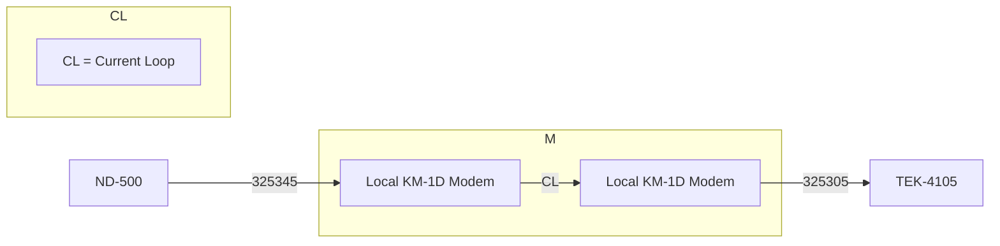

## Page 1

# Norsk Data A.S  
## PROGRAM DESCRIPTION

| Date       | Page  |
|------------|-------|
| 90.06.20   | 1 of 20 |

### Product

| Name                     | Reg. no. | Category |
|--------------------------|----------|----------|
| NOTIS-BG for ND-500/5000 | 210793C  | STPR     |

### Reason
- New product
- Change/Addition
- Other

- Error Correction
- Different Environment

### Documentation

| Title                        | ND-no.         |
|------------------------------|----------------|
| NOTIS-BG User Guide          | 863.033.2 <lang> |
| NOTIS-BG Reference Card      | 899.054.1 <lang> |

### Purpose
Produce various charts (bar, column, line, pie, and text) on terminals, printers, or plotters.

### Prerequisites

| Computer Type   | Floating format | Op. system | Version |
|-----------------|-----------------|------------|---------|
| ND-500/5000     | 32 bits         | SIN III VS | >= J    |

ND-no. | Product name
------ | --------------------------
210373 | XMSG (version >= K02)

At least _one_ of the following devices:
- 103211 NOTIS-terminal with graphic option
- 150003 Butterfly OWS-12
- 104480 Matrix Printer GP-300
- 104760 Page printer, ELPHO-20
- 110143 Matrix Printer 616CN
- 110223 Page printer 720
- 102180 Colour plotter HP-7475
- 110261 Colour plotter HP-7550
- Tektronix 4105 (Not ND product)

### Minimum mass storage resources for installation

| User          | Userspace       | Number of files |
|---------------|-----------------|-----------------|
| SYSTEM        | 288 pages on 11 files |
| NOTIS         | 54 pages on 1 file   |
| domain-user   | 507 pages on 6 files |
| example-user  | 27 pages on 7 files  |

### Minimum mass storage resources permanent

| User          | Userspace       | Number of files |
|---------------|-----------------|-----------------|
| SYSTEM        | 6 pages on 1 file  |
| NOTIS         | 54 pages on 1 file |
| domain-user   | 461 pages on 3 files|

ND-no. for Source  
210759C

---

ND-895231.1A EN

---

## Page 2

# Program Description

**Date:** 90.06.20  
**Norsk Data A.S**  
**Page** 2 of 20  

## Product

| Product Name | Reg. no. | Category |
|--------------|----------|----------|
| NOTIS-BG for ND-500/5000 | 210793C | STPR |

## File List

| File Name | Type | Containing |
|-----------|------|------------|
| INST-BG-500-C<rev> | PROG | Installation program |
| BG-500-SETUP-C<rev> | XCOM | Installation setup |
| DDDTABLES-G<rev> | VTM | Terminal descr. file |
| DDD078 | VTM | Terminal descr. file |
| BG-PRINTERS-C<rev> | SYMB | Printer descr. file |
| UE-FRMSG-<lang>-C<rev> | ERR | Error messages |
| BG-500-FONTS-C<rev> | DATA | Font file |
| VTM-COMPOUND-C<rev> | PROG | Compound program |
| BG-EX01-<lang>-C<rev> | CDBG | Demo-file |
| BG-EX02-<lang>-C<rev> | DABG | Demo-file |
| BG-EX03-<lang>-C<rev> | CDBG | Demo-file |
| BG-EX04-<lang>-C<rev> | DABG | Demo-file |
| BG-EX05-<lang>-C<rev> | CDBG | Demo-file |
| BG-EX06-<lang>-C<rev> | DABG | Demo-file |
| BG-EX07-<lang>-C<rev> | PABG | Demo-file |
| DESCRIPTION-FILE | DESC | Domain description file |
| BG-500-<lang>-C<rev> | PSEG | Domain program segment |
| BG-500-<lang>-C<rev> | DSEG | Domain data segment |
| BG-500-<lang>-C<rev> | LINK | Domain linkage info. |

## Notes

- `<rev>` is to be replaced by the current revision of the DIRECTORY or FILE.
- `<lang>` is to be replaced by the relevant language.
- The attached Software INFORMATION Reports should be read before installation.

---

ND-895231.1A EN

---

## Page 3

| Date       | Norsk Data A.S                     | Page 3 of 20        |
|------------|-----------------------------------|----------------------|
| PROGRAM DESCRIPTION                                                      |
| Product    | Name                               | Reg. no. | Category  |
|            | NOTIS-BG for ND-500/5000           | 210793C  | STPR      |

## 2 NEW FEATURES

- NOTIS-BG version C is more or less a completely new product. It has a new interface, where data and diagrams may be defined interactively. The production part of BG-C, i.e. the part of the software producing the picture, is based on the old version of BG. All diagram files made for A- and B-version of BG may be used in BG-C, but the chart appearance may be slightly different. (New fonts etc.)

### 2.1 USER INTERFACE

- The C-version of BG has a new interactive user interface where all chart and data definitions may be done. Chart definitions and data tables are completely separated. I.e it is possible to use the same chart description on several data sets and vice versa. It is still possible to define charts and data by using a symbolic instruction file.

### 2.2 SYMBOLIC INSTRUCTION FILE

- The instructions used in the instruction file (plot-file) have new syntax following the syntax used in the user interface. All new instructions may be abbreviated in the 'SINTRAN-way'. Old instructions used in plot-files for the A- and B-version of BG are accepted. (Even a mix of old and new instructions in a plot-file will be accepted but is not recommended due to possible contradictions between instructions).

### 2.3 DIAGRAM PRODUCTION

- It is possible to control many more chart attributes than in the previous version. (Chart-frame, multiple charts per page, text fonts etc.)

```
ND-895231.1A EN
```

---

## Page 4

| Date      | 90.06.20              | Norsk Data A.S                     | Page 4 of 20 |
|-----------|----------------------|-----------------------------------|--------------|
| Product   | Name                 | Reg. no.                          | Category     |
|           | NOTIS-BG for ND-500/5000 | 210793C                           | STPR         |

## 2.4 CONVERTING OLD :PLOT FILES

- This version of NOTIS-BG understands the old BG language but the result from execution will not be the same. Some of the default values have been changed in this version in order to make it more convenient to use.

- If your :PLOT files are made by another subsystem like NOTIS-RG you should change to the new BG language syntax.

- If you are making the :PLOT files manually you should read the file into BG and then use the interactive interface part of BG to change the parameters to get your plot the way you want it and then store it as separate chart description and data table.

- Below are listed the most important default values that are changed in this version:

  - Default chart size is 270 x 190 mm. If some of your chart exceeds that you will lose it, that is, the chart title will not be printed.
  
  - Default plot size is 150 x 120 mm.
  
  - Default plot position (lower left corner) is 45 x 30 mm from origo.
  
  - Value axis (y-axis) labels are now horizontal.
  
  - Axis limits, axis intervals and axis tickmarks may be different.
  
  - Plot frame is on.
  
  - Default line type, line markers, hatching and color are changed.
  
  - Heading and subheading is now left justified.
  
  - The percent labels in pie slices are off.
  
  - In the Norwegian version PLOT-TYPE=KURVE is no longer accepted, use only PLOT-TYPE=LINJE.
  
    ND-895231.1A EN

---

## Page 5

# Installation Procedure

- **NOTIS-BG for ND-500** with 32-bits real, is supplied on 2 diskettes 210793C<rev>-<lang>-01D and 210793C<rev>-<lang>-02D. `<lang>` is the language code, e.g. NO for Norwegian, EN for English, etc.

- If you already have NOTIS-BG version B installed on your computer, you are advised not to delete it until the new version is installed and works properly. The old version, however, has to be renamed. This is done the following way:

  1) Log in as user SYSTEM
  
  2) Delete the standard domain by typing:
  
  ```
  @ND-500-MONITOR
  N500:DELETE-STANDARD-DOMAIN NOTIS-BG
  ```

  3) Define NOTIS-BG with a new name by typing:

  ```
  N500:DEFINE-STANDARD-DOMAIN BG-B (<user>)NOTIS-BG-<lang>-B
  ```

  4) Leave the ND-500 monitor by typing:

  ```
  N500:EXIT
  ```

  (`<user>` means the user where BG-B is installed, and `<lang>` means language code.) The old version of BG is then started by typing:

  ```
  BG-B
  ```

- **The procedure to install NOTIS-BG version C is as follows:**

  1) Log in as user SYSTEM

  2) Make sure the required number of files and pages are available (prerequisites, page 1).

  3) Insert diskette 210793C-<lang>-01D in your diskette station.

  4) Enter this directory by typing:

  ```
  @ENTER-DIRECTORY 210793C-<lang>-01,F-D-1,<floppy-unit>
  ```

  5) Start the installation program by typing:

  ```
  @(210793: FLOPPY-USER)INST-BG
  ```

---

## Page 6

# Norsk Data A.S
## Program Description

| Date     | Product   | Name                   | Reg. no. | Category |
|----------|-----------|------------------------|----------|----------|
| 90.06.20 | NOTIS-BG  | NOTIS-BG for ND-500/5000 | 210793C  | STPR     |

- The installation job will now start and guide you through the installation. It checks whether the requirements to do a successful installation are fulfilled before the job actually starts. The installation job is self-explanatory.

- To check that the installation was done successfully, you may inspect the file `BG-500-DUMP-C:LOG` on user SYSTEM. Eventual error messages from SINTRAN during installation are written in this file. The file should be deleted after inspection.

**NOTE!** The installation job copies the file `BG-PRINTERS-C:SYMB` to user area SYSTEM **only** if you do not already have a `BG-PRINTERS` file. If you already have an older version of NOTIS-BG, you also have an older version of the `BG-PRINTERS` file. This file has changed slightly from B version of BG, see chapter 6 on how to edit the file.

- The installation leaves a temporary file on user SYSTEM, `INSTALL-BG-C:TEMP`. This file should be deleted.

- The terminal description files supplied on the diskettes are `DDBTABLES-G03:VTM`. If you already have an older revision of `DDBTABLES-G`, the file is copied to user SYSTEM with extension `:NEW`. If your existing terminal description file are version F or older, the file is copied to user SYSTEM with extension `:VTM`.

**NOTE!** If you have some special terminal definition tables in your existing `DDBTABLES` file, they may **not** be present in the new one. Use `VTM-COMPOUND` to move a terminal description from one `DDBTABLES` file to another. (`VTM-COMPOUND` are described along with installation of the Tektronix terminal)

**NOTE!** If you are using Ethernet and NOTS-card on your computer, the `DDBTABLES` file on the diskettes are recommended.

- If the file is copied with extension `:NEW`, and you want to use it, please delete the old one and rename the newer one by typing:

  ```
  @DELETE-FILE DDBTABLES:VTM
  @RENAME-FILE DDBTABLES-G:NEW :VTM
  ```

- The error message file `UE-ERMSG-<lang>-<version>:ERR` will be copied to user SYSTEMS with extension `:ERR` if existing file has an older version, but with extension `:NEW` if the file has the same version as the file on the diskette. The C version of this file is required by NOTIS-BG-C.

```
ND-895231.1A EN
```

---

## Page 7

# Program Description

| Date       | Norsk Data A.S                                                                                              | Page 7 of 20 |
|------------|-------------------------------------------------------------------------------------------------------------|--------------|
| Product    | Name                                                                                                        | Reg. no.     | Category |
| NOTIS-BG for ND-500/5000 |                                                                                               | 210793C      | STPR     |

## 4 Dumping BG After a Cold-Start

- The installation program makes a `:MODE` file on the prog-user. This file should later be run to dump NOTIS-BG. Remember to update the `DUMP-REENTRANT` (or `HENT-MODE`) file with the following command: (This can also be done manually from user SYSTEM.)

```
@MODE (<prog-user>)BG-500-DUMP-C:MODE
```

## 5 Delete NOTIS-BG Version B

- It is possible to have both B and C version of NOTIS-BG installed on the same computer. However, we recommend that you have only the latest C-version at the same computer.

**NOTE!!** You should **not** delete the old BG version completely before you are sure the new version are running correctly. Keep the old one as backup until then.

- The following instructions show how to delete NOTIS-BG version B. **NOTE!** `<lang>` is the language code (NO, EN, SW, DA).

1. Log in as user SYSTEM.

2. Delete the standard domain by typing :

```
@ND-500-MONITOR
N500:DELETE-STANDARD-DOMAIN BG-B
```

3. Delete the file `BG-TYPER:SYMB`

4. Log in as the user where you installed NOTIS-BG version B. The name of this user may be found in the `DUMP-REENTRANT` (or `HENT-MODE`) file on user SYSTEM.

5. Delete the NOTIS-BG domain by typing :

```
@ND-500-MONITOR
N500:LINKAGE-LOADER
N11:DELETE-DOMAIN NOTIS-BG-<lang>-B
N11:EXIT
```

---

ND-895231.1A EN

---

## Page 8

# Program Description

| Date       | Page     |
|------------|----------|
| 90.06.20   | 8 of 20  |

| Product                      | Reg. no. | Category |
|------------------------------|----------|----------|
| NOTIS-BG for ND-500/5000     | 210793C  | STPR     |

## 6 Preparing the Devices

### 6.1 Preparing the NOTIS Terminal

- Set these values in the Communications Switches Menu for NOTIS terminals with graphic option that will be used to view diagrams with NOTIS-BG:
  - Communication handshake: XON/XOFF
  - Transmission Code Length: 7 bits
  - Transmission Code Parity: Even
  - Transmission Code Stop Bits: 2

- Set the same values for the terminal line like this:

Find the terminal's Logical Device Number with the SINTRAN command `@WHO-IS-ON`. Continue as shown here, typing the _underlined_ commands and parameters. XXXX represents number provided by system.

```
@SINTRAN-SERVICE
*CHANGE-DATA <Logical Device Number>,I,Y,Y,N
DFLAG/ XXXXXX 1000
CNTREG/ XXXXXX 44005
*EXIT
```

**IMPORTANT!** The Logical Device Number must be followed by "D". Ex: 53D.

**NOTE!** Be aware of that terminals connected to the computer via Ethernet may be used with 8-bit communication, which means that the Transmission Code Length value in the terminal's Communication Switches Menu described above has to be set to 8.

### 6.2 Preparing the Butterfly (OWS-12)

- Connect the Butterfly as described in the Butterfly documentation. You need at least version C of the Tandberg emulator to be able to utilize the colours on the Butterfly.

- No special preparations are necessary. However, the key SHIFT+PRINT do not work on some Butterflies. Use SHIFT+F10 or FUNK+" instead.

[Document Footer: ND-895231.1A EN]

---

## Page 9

# Norsk Data A.S
### PROGRAM DESCRIPTION

| Product           | Name                   | Reg. no. | Category |
|-------------------|------------------------|----------|----------|
|                   | NOTIS-BG for ND-500/5000 | 210793C  | STPR     |

## 6.3 PREPARING THE HP-PLOTTER

### Equipment:

- HP-7475 or HP-7550 A3/A4 plotter
- 325488 Cable between ND-500 and HP-plotter
- OR 2 local KM-1D modems connected to each other, with 325345 Cable between ND-500 and one modem, and 325651 Cable between the other modem and the HP-plotter

### Connection:

- **HP-7475**  
  Set the switches at the back of the plotter for 9600 BAUD, A4 paper, direct line and even parity (7 bit character length): 01000110. For further details, see pages 2-21 and 2-23 in the Operation and Interconnection Manual accompanying the HP-7475 plotter.

- **HP-7550**  
  Set the switches by operating the Front-Panel on the front of the plotter. The Front-Panel looks something like this.

```
+-----------------+     +-----------------+
| Auto    |       |     |      | Enter    |
| feed    |       |     |      |          |
+---------+-------+     +------+----------+

+---------+-------+     +------+----------+
| Load/   |       |     |      | Next     |
| Unload  |       |     |      | Display  |
+---------+-------+     +------+----------+

     (Display)
```

Turn the power on, and press the `<ENTER>` key immediately followed by the `<NEXT DISPLAY>` key to enter setup mode. The following should be displayed.

```
  HP-IB   MONITOR
 STANDARD  SERIAL
```

The unnamed function keys on the front panel corresponding to the text shown on the display are used to set the switches.

Press the STANDARD key, and the text on the display will change to ENHANCED. Press the SERIAL key to enter the communication setup menus. The first menu looks like this:

```
  DATA FLOW
   BYPASS
       HANDSHAKE
```

ND-895231.1A EN

---

## Page 10

# Program Description

| Date       | 90.06.20           | Norsk Data A.S                                                           | Page 10 of 20 |
|------------|--------------------|---------------------------------------------------------------------------|--------------|
| Product    | Name               | Reg. no.                      | Category                              |
|            | NOTIS-BG for ND-500/5000 | 210793C                      | STPR                                  |

## Data Flow Submenu

When you press the DATA FLOW key, a submenu appears on the display.

```
+-----------+
|  REMOTE   |
|     *     |
| STANDALONE|
+-----------+
```

Set the data flow to REMOTE and STANDALONE by pressing the function keys several times until the correct settings are shown on the display. Press the `<ENTER>` key to exit and save the switch settings. Continue and do the same with BYPASS and HANDSHAKE.

- BYPASS is set to OFF.
- HANDSHAKE is set to XON/XOFF and DIRECT.

When you press the `<NEXT DISPLAY>` key, you will enter setup menu 2. The following is displayed.

```
+--------+-------+
| DUPLEX | PARITY|
|  BAUD  |       |
+--------+-------+
```

- DUPLEX is set to FULL.
- PARITY is set to 7-BITS and EVEN.
- BAUD is set to 9600.

To exit from the communication setup menus, press the `<ENTER>` key followed by the `<NEXT DISPLAY>` key.

Turn the power off and on. Now the plotter is ready to run. For further details, see the Operation and Interconnection Manual, page 3.31 - 3.44, accompanying the HP-7550 plotter.

- Obtain a terminal line with an RS-232 interface to the ND-500.  
  NOTE! The terminal line must have a logical unit no. < 100.

- Connect cables in one of the following configurations:

### Configuration Diagrams

Alternative 1: Direct cable between ND-500 and HP-plotter.

```plaintext
+-------+        +------+
| ND-500|------->|  HP  |
+-------+   325488 +------+
```

Alternative 2: Connection via 2 local KM-1D modems.

```plaintext
+-------+     +---+     +---+     +------+
| ND-500|---->| M |<--->| M |---->|  HP  |
+-------+ 325345 |   | 325651 +------+
                CL  CL
```

*CL = Current Loop*  
*M = Local KM-1D Modem*

---

ND-895231.1A EN

---

## Page 11

# Program Description

| Product     | Name                     | Reg. no. | Category |
|-------------|--------------------------|----------|----------|
|             | NOTIS-BG for ND-500/5000 | 210793C  | STPR     |

## Instructions

- **Log in as user SYSTEM and set a file name for the line:**

  ```
  @SET-PERIPH-FILE <file name>,<Logical Device Number>
  ```

  Example: If the plotter has the file name HP-PLOTTER and Logical Device Number 54D, the command will be:

  ```
  @SET-PER-FILE "HP-PLOTTER",54D
  ```

- **Define the file access so that a user who will be working with the plotter has file access RWC(D):**

  ```
  @SET-FILE-ACCESS HP-PLOTTER,RWC,RWC,RWCD
  ```

- **Find the background program for the terminal line with the SINTRAN command @LIST-DEVICE, and abort the background program:**

  ```
  @LIST-DEVICE <Logical Device Number>,0
  NNNN
  @ABORT NNNN
  ```

- **Remove the background program for the actual terminal line. This is done in different ways depending on SINTRAN version.**

  ### SINTRAN J or older:

  Note the address of the line’s background program (represented here by XXXXX) for future use; then set the address to 0:

  ```
  @SINTRAN-SERVICE
  *REMOVE-FROM-BACKGR-TABLE <Logical Device No.>,I,Y,Y,N
  *CHANGE-DATAFIELD (LDN),I,Y,Y,N
  DBPROG/ XXXXX  0
  *
  *EXIT
  ```

  ### SINTRAN K with floating background programs:

  ```
  @SINTRAN-SERVICE
  *REMOVE-FROM-BACKGR-TABLE <Logical>:Device No.>,I,Y,Y,N
  *CHANGE-DATAFIELD (LON),I,Y,Y,N
  TINFO/ 000000  10
  *
  *EXIT
  ```

  *(If you do not have workmode 200 and patch 3300 or newer, TINFO is only allowed changed in MEMORY, not in IMAGE and SAVE area.)*

---

ND-895231.1A EN

---

## Page 12

# Program Description

| Product       | Name                  |
|---------------|-----------------------|
| NOTIS-BG for  | ND-500/5000           |
| Reg. no.      | Category              |
| 210793C       | STPR                  |

## SINTRAN K with Fixed Background Programs

Note the address of the line’s background program (represented here by XXXXX) for future use; then set the address to 0:

```
@SINTRAN-SERVICE
*REMOVE-FROM-BACKGR-TABLE <Logical Device No.>,I,Y,Y,N
*CHANGE-DATAFIELD (LDN),I,Y,Y,N
DBPROG/ XXXXX 0
TINFO/ 000000 10
*EXIT
```

**Note!**  
If you do not have patch 3300, TINFO is only allowed changed in MEMORY, not in IMAGE and SAVE area.

- The transmission speed on the logical device has to be set according to the setting on the plotter. This speed has to be set explicitly, and is done by the following procedure:

```
@SINTRAN-SERVICE
*CHANGE-DATAFIELD (LDN),I,Y,Y,N
TSPEED/ XXXXX 210   (for 9600 baud)
*EXIT
```

For terminal-lines, TSPEED is often set to -1 (177777), which means that the transmission is done according to the terminal setting (soft-switches). This will not work on the plotter! The transmission speed has to be set on the terminal-card for a whole four-group before starting the machine. (Redefinition in software may be done afterwards).

- If you wish, output a test program to the plotter. See the Operation and Interconnection Manual that accompanies the HP-plotter.

- **IMPORTANT!** For HP-7475. Before the plotter begins to draw, a green light blinks on the control panel. Press the plotter's ENTER button.

ND-895231.1A EN

---

## Page 13

# Program Description

| Date      | Norsk Data A.S | Page 13 of 20 |
|-----------|----------------|---------------|
| Product   | Name           | Reg. no. | Category |
| NOTIS-BG for ND-500/5000 | 210793C | STPR |

## Spooling

It is possible to use the HP-7550 as spooled device. (It is not advised to use the HP-7475 spooled, since it has no sheet feeder option, and all charts will be plotted on the same sheet). To obtain spooling, do the following:

- Define the plotter as spooled device, as described in the SINTRAN SUPERVISOR manual. (ND-30.003.7 EN)
- Remove spooling header, using SINTRAN-SERVICE.
- If SPRINT is used, define the plotter as LINE-PRINTER. When defining the forms, use default options, BUT TURN OFF header (sheet between different printouts)
- If the plotter is connected to a remote computer, it has to be defined in COSMOS SPOOLING. The 'local' name in COSMOS SPOOLING has to be used as the second parameter in the BG-PRINTERS file. Read chapter Editing of BG-PRINTERS.

> **NOTE!** If the plotter is used with manual sheet feed, SPRINT will recognize it as an error, but this error message may be ignored.

## 6.4 Preparing the Philips ND616CN ND-720 and Epson Printers

Philips ND-447, ND-448, ND616CN and ND-720 are set up as usual. There are no special requirements. NOTIS-BG takes care of switching between graphic and alphanumeric modes.

The ND-720 emulates a HP-7475 plotter. Since the HP-7475 has no automatic sheet feeding, it is not possible for the ND-720 to change sheet while plotting. If you make a plot file using several BEGIN-PAGE, END-PAGE sequences, all the charts will be plotted on the same page.

The EPSON-printer may be used either locally connected to a NOTIS-terminal, or as a shared device using the SPOOLING system.

---

ND-895231.1A EN

[Scanned by Jonny Oddene for Sintran Data © 2020]

---

## Page 14

# Program Description

| Date       | 90.06.20                         | Norsk Data A.S         | Page 14 of 20  |
|------------|----------------------------------|------------------------|----------------|
| Product    | Name                             | Reg. no.               | Category       |
|            | NOTIS-BG for ND-500/5000         | 210793C                | STPR           |

## EPSON as 'local' device

Epson ND-424 is connected to a NOTIS terminal as a local printer, but the printer is not used as a local one. (Use Cable 325356). Output to the printer is sent via the terminal, which hangs during printing. Setting of DIP-switches:

| DIP NO | Switch | ON  | OFF |
|--------|--------|-----|-----|
| 1      | 1      | •   |     |
|        | 2      |     | •   |
|        | 3      |     | •   |
|        | 4      |     | •   |
|        | 5      |     | •   |
|        | 6      | •   |     |
|        | 7      | •   |     |
|        | 8      |     | •   |
| 2      | 1      | •   |     |
|        | 2      |     | •   |
|        | 3      | •   |     |
|        | 4      | •   |     |

Read the instructions accompanying the Epson with regard to switch settings.

On some ND-246 terminals, we have discovered an error in the printer interface, which leads to buffer overflow on the printer and wrong printout. The only way to correct this is to change printer interface in the terminal.

Read chapter Editing of **BG-PRINTERS** to see how to distinguish between local and shared EPSON printers at printout.

ND-895231.1A EN

---

## Page 15

# Program Description

Date: 90.06.20  
Norsk Data A.S  
Page 15 of 20

| Product       | Name                   | Reg. no. | Category |
|---------------|------------------------|----------|----------|
|               | NOTIS-BG for ND-500/5000 | 210793C  | STPR     |

## EPSON as Spooled Device

If the EPSON printer is used as a shared device, DIP-switch 2 has to be set differently from the settings referred above for a local printer.

### Setting of DIP-switches for EPSON as Shared Device:

| DIP NO | Switch | ON | OFF |
|--------|--------|----|-----|
| 1      | 1      | •  |     |
|        | 2      |    | •   |
|        | 3      | •  |     |
|        | 4      | •  |     |
|        | 5      | •  |     |
|        | 6      |    | •   |
|        | 7      | •  |     |
|        | 8      | •  |     |
| 2      | 1      | •  |     |
|        | 2      |    | •   |
|        | 3      |    | •   |
|        | 4      |    | •   |

Read the instructions accompanying the Epson with regard to switch settings.

Read chapter "Editing of BG-PRINTERS" to see how to distinguish between local and shared EPSON printers at printout.

### Note

When printing on Philips, ELPHO, Epson or to 'PICT'-file, conversion from vector information to raster information is necessary. This conversion is very time-consuming, especially when printing diagrams with hatched or filled areas.

If the execution of BG is halted during this conversion, the following files may exist on the user area afterwards and should be deleted:

- VECTOR-A:DATA
- SPLIT-A:RAST
- SORT-A:RAST

If more than one user is using BG at this time, the letter 'A' in the file names could be any letter. These files are used temporarily in the conversion algorithm and are deleted when conversion is complete.

ND-895231.1A EN

---

## Page 16

# Program Description

| Date       | Norsk Data A.S                   | Page 16 of 20 |
|------------|----------------------------------|---------------|
| Product    | Name                             | Reg. no.      | Category |
|            | NOTIS-BG for ND-500/5000         | 210793C       | STPR     |

## 6.5 Preparing the Tektronix Color Terminal

### Equipment:

- Tektronix 4105 color graphics terminal, or compatible (The new 4200 range of terminals are compatible with 4105)
- 325303 Cable between ND-500 and TEK-4105
- **OR** 2 local KM-1D modems connected to each other, with 325345 Cable between ND-500 and one modem, and 325305 Cable between the other modem and the TEK-4105.

### Connection:

The Tektronix terminal needs RS232/C interface on the machine. The connection is done in one of two ways:

**Alternative 1**: Direct cable between ND-500 and TEK-4105.



**Alternative 2**: Connection via 2 local KM-1D modems.



These possible connections are the same as for the HP-plotters (see above), but the cables are different. 

---

ND-895231.1A EN

---

## Page 17

# Norsk Data A.S Program Description

**Product Name:** NOTIS-BG for ND-500/5000  
**Reg. no.:** 210793C  
**Category:** STPR  

## Communication Switch-Settings

Read the instructions accompanying the terminal about how to set software switches. The following switch-settings for communication are recommended:

| Setting        | Value       |
|----------------|-------------|
| ECHO           | NO          |
| IGNOREDEL      | NO          |
| BAUDRATE       | 9600,9600   |
| XMLLIMIT       | 1200        |
| STOPBITS       | 2           |
| XMTDELAY       | 0           |
| PARITY         | EVEN        |
| PROMPTSTRING   | '>'         |
| PROMPTMODE     | NO          |
| QUEUESIZE      | 800         |
| FLAGGING       | IN/OUT      |
| EOMCHARS       | CR/LF       |
| EOLSTRING      | 'CR'        |
| EOFSTRING      | ''          |
| BREAKTIME      | 200         |
| BYPASSCANCEL   | CR          |

Set the same values for the terminal line like this:

Find the terminal's Logical Device Number with the SINTRAN command `@WHO-IS-ON`. Continue as shown here, typing the underlined commands and parameters. XXXX represents number provided by system.

```
@SINTRAN-SERVICE
*CHANGE-DATA <Logical Device Number>,I,Y,Y,N
DFLAG/ XXXXX 1000
CNTREG/ XXXXX 44005
*EXIT
```

**IMPORTANT!** The Logical Device Number must be followed by "D". Ex: 53D.

The Tektronix terminal needs an additional description table in the terminal description file `DDBTABLES:VTM`. The additional table resides on the file `DDB078:VTM` on diskette `210793C-<lang>-01D`. This additional table is added to the existing `DDBTABLES` file by use of the program `VTM-COMPOUND` which resides on diskette `210793C-<lang>-02D`. If you already have terminal type 78 included in your `DDBTABLES:VTM` file, you should replace it with the new one.

ND-895231.1A EN

---

## Page 18

# Program Description

| Date       | 90.06.20            | Norsk Data A.S                          | Page 18 of 20 |
|------------|---------------------|-----------------------------------------|---------------|
| Product    | **Name**            | **Reg. no.**                            | **Category**  |
|            | NOTIS-BG for ND-500/5000 | 210793C                                   | STPR          |

## Using VTM-COMPOUND:

1. Log in as user SYSTEM.
2. Copy the DDB078:VTM file to user SYSTEM. (DDB078:VTM resides on diskette 210793C-<lang>-01D)
3. Be sure that diskette 210793C-<lang>-01D still is entered. Start VTM-COMPOUND by writing: `@(210793C-<lang>-02D:FLOPPY-USER)VTM-COMPOUND`
4. Choose menu-entry 2 to add a new terminal type.
5. Choose correct VTM-file by choosing menu-entry 2 in the next menu.
6. Complete the file name by typing VTM-file version. (Use capital letters). The VTM-file accompanying NOTIS-BG/C has version number G03. (The whole name is then DDBTABLES-G03:VTM).
7. Add terminal description for Tektronix-4105 by specifying the terminal description file which is DDB078:VTM.
8. Finish by typing 777.
9. Exit to SINTRAN by typing 9 in the main menu.

See SINTRAN Utilities Manual (ND-60.151) for description of VTM-COMPOUND.

## 7 Editing BG-PRINTERS

The BG-PRINTERS file contains information about logical device name, SINTRAN file name, and GPGS driver number (and in some cases optional plotter speed). The file has one line for each defined output device. A typical BG-PRINTERS file looks like this:

```
OLD-PLOTTER, HP-PLOTTER, 4            HP-7475
SLOW-PLOTTER, HP-PLOTTER, 4, 5        HP-7475, low-speed
NEW-PLOTTER, HP-7550, 80              HP-7550
REMOTE-PLOTTER, REMOTE-PLOTTER, 80    HP-7550, remote spooled
FACIT, PRINTER, 5                     ND-7220
PHILIPS, PHILIPS, 306                 PHILIPS GP300L
HERMES, HERMES, 306                   ND-616CN
ORION, MACHINE(USER(PASSW)).PHILIPS, 306  REMOTE PHILIPS
ELPHO, ELPHO-20, 306                  ELPHO-20
EPSON, 206                            EPSON (local)
EPSON, EPSON, 206                     EPSON (shared)
```

**Note:** The remote spooled plotter cannot be defined with remote filename directly in the BG-PRINTERS file (as you can do with printers). But it has to be defined with local name on the remote device (used in COSMOS SPOOLING).

ND-895231.1A EN

---

## Page 19

# Norsk Data A.S Program Description

| Date       | Page     |
|------------|----------|
| 90.06.20   | 19 of 20 |

| Product    | Name                     | Reg. no. | Category |
|------------|--------------------------|----------|----------|
|            | NOTIS-BG for ND-500/5000 | 210793C  | STPR     |

## Example

```
REMOTE-PLOTTER, REMOTE-PLOTTER, 80
     |
This name is defined in COSMOS SPOOLING
```

In this version of BG, it is not necessary to define screens (NOTIS terminal and Tektronix 4105) in BG-PRINTERS. It is no longer necessary to define logical device numbers. However, if you want to keep the B version, you must NOT delete these numbers.

Which ever output device is defined first will be the default output device for NOTIS-BG.

## GPGS-driver numbers are:

| Device            | Number |
|-------------------|--------|
| EPSON printer     | 206    |
| Philips GP300L    | 306    |
| Philips ELPHO-20  | 306    |
| HP-7475           | 4      |
| HP-7550           | 80     |
| ND-720            | 5      |

For the HP-7475, you have the option of specifying plotter speed. Speed is controlled by placing a number from 1 to 100 after the driver number. 100 is the default value. To plot on transparencies, the speed should be reduced by using a low number, for example 5. On the HP-7550, the speed is automatically changed when a pen carousel for transparencies is loaded.

Edit with CAPITAL LETTERS and use a comma to separate parameters. Comments must begin with CC or follow the final parameter. See also the accompanying example of BG-PRINTERS on diskette 210793C-<lang>-01D. See NOTIS-BG User Guide (ND-63.033.2) for more information about the BG-PRINTERS file.

ND-895231.1A EN

---

## Page 20

# Program Description

| Date       | Norsk Data A.S                | Page 20 of 20 |
|------------|-------------------------------|---------------|
| Product    | Name                          | Reg. no. 210793C | Category STPR |
|            | NOTIS-BG for ND-500/5000      |               |

## 8 Using the Example Files

The example-files are named:
- `BG-EX01-<lang>-C:CDBG  BG-EX02-<lang>-C:DABG`
- `BG-EX03-<lang>-C:CDBG  BG-EX04-<lang>-C:DABG`
- `BG-EX05-<lang>-C:CDBG  BG-EX06-<lang>-C:DABG`
- `BG-EX07-<lang>-C:PABG`

and reside on diskette `210793C-<lang>-02D`.

The files with extension `:CDBG` are chart description files, `:DABG` files are data tables and the `:PABG` file is a page description.

1) Copy the example files to your user

2) Start NOTIS-BG by: `@NOTIS-BG ↲`

3) Fetch first chart description by choosing the menu entries `ARCHIVE/FETCH`

4) Specify Drawer  : `SINTRAN ↲`  
   Folder          : [illegible]  
   Document        : `BG-EX01-<lang>-C:CDBG ↲`

5) Fetch first data table by choosing the menu entries `ARCHIVE/FETCH`

6) Specify Drawer  : `SINTRAN ↲`  
   Folder          : [illegible]  
   Document        : `BG-EX02-<lang>-C:DABG ↲`

7) View the resulting chart by pressing `SHIFT + PRINT`

   (or on an OWS-12: `SHIFT+f10` or `FUNK+`), and then [ ].

8) The chart will be displayed on the screen until any button is pressed. (If you press 'E' or 'e', you will exit NOTIS-BG)

9) Repeat point 3 - 8 to fetch chart description `BG-EX03-<lang>-C:CDBG` and data set `BG-EX04-<lang>-C:DABG` and view the second chart on the screen.

10) Repeat point 3 - 8 to fetch chart description `BG-EX05-<lang>-C:CDBG` and data set `BG-EX06-<lang>-C:DABG` and view the third chart on the screen.

11) Fetch `BG-EX07-<lang>-C:PABG` to get a page description. This page is made up of the first, second and third chart.

12) View the resulting page by pressing `SHIFT + PRINT` and [ ].

13) Read NOTIS-BG User Guide (ND-63.033.2) to get a full explanation of how to use NOTIS-BG.

---

