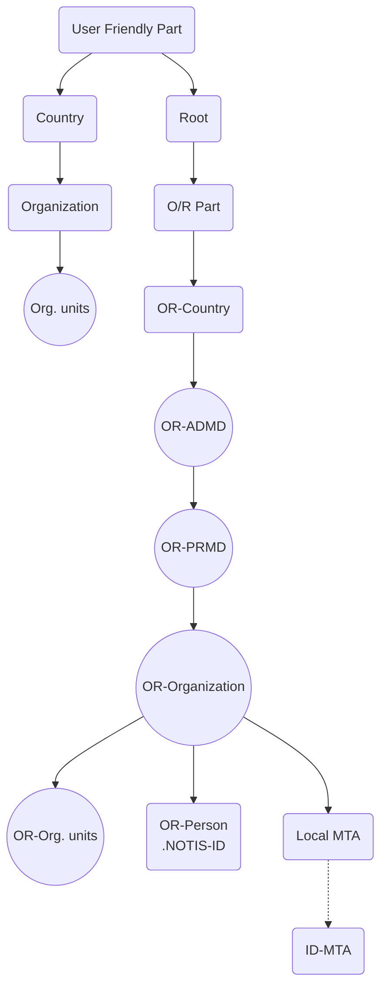

## Page 1

# Product Information

**Product name:** NOTIS-MAIL  
**Product number:** 211286A  
**ND 211286, 211788, 211289, 211290**

---

## Description of product

The NOTIS-MAIL product is a system for interchange of messages and documents by Electronic Mail.

## Reason(s) for new product or version

The NOTIS-MAIL system is an implementation of the X.400 series of recommendations from CCITT. This standard is recognized by most vendors of data systems as the mail system standard for the future. The NOTIS-MAIL system has passed the SPAG (the Standards Promotion and Application Group) tests.

Addressees will be available worldwide for those using such systems. The X.400 protocol is also expected to be greatly used for Electronic Data Interchange (EDI) in the future.

## Table of Contents

| Section                            | Page |
|------------------------------------|------|
| Prerequisites                      | 2    |
| Product structure                  | 2    |
| Dependencies                       | 5    |
| Documentation                      | 7    |
| Installation procedure             | 7    |
| Modifications                      | 20   |
| Errors corrected                   | 21   |
| Errors known but not corrected     | 23   |

---

ND-895080.1 EN

Scanned by Jonny Oddene for Sintran Data © 2011

---

## Page 2

# Product Information

| Date       | Norsk Data | Page      |
|------------|------------|-----------|
| 89.09.26   |            | 2 of 24   |

| Product name      | Product number |
|-------------------|----------------|
| NOTIS-MAIL        | 211286A        |
| ND 211286, 211788, 211289, 211290 |             |

## Product Structure

The main NOTIS-MAIL products are:

* **ND 211286 NOTIS-MAIL**
  - ND 380720
  - ND 380419
  - ND 380451
  - ND 380493

  Total MAIL product, including:
  - Basic System and directory.
  - A SIBAS database system limited to NOTIS-MAIL use.

* **ND 211290 NOTIS-MAIL X.400 Gateway**
  - ND 380718
  - ND 380349

  The X.400 Gateway, including:
  - The gateway.
  - ND OSI transport service.

* **ND 211289 NOTIS-MAIL Remote User Interface**
  - Remote User Interface for ND-500/5000
  - ND 380493

  The Remote User Interface part for additional computers running the user interface only, including SIBAS libraries.

This product information gives details about the installation of all these products.

In addition, users who need to make their own application programs which use NOTIS-MAIL, should order:

* **ND 211696 NOTIS-MAIL API**

  An Application Program Interface to NOTIS-MAIL.

# 1 Prerequisites

The following things are **required** in order to use this product.

## 1.1 Hardware Prerequisites

The following hardware must be present for this product to be used:

**CPU type (any of the following):**

- 500
- 5000

**Floating format:** 32/48

**Other hardware:**

---

ND-895080.1 EN

---

## Page 3

# Product Information

| Date       | Norsk Data | Page |
|------------|------------|------|
| 89.09.25   |            | 3 of 24 |

| Product name | Product number |
|--------------|----------------|
| NOTIS-MAIL   | **211286A**     |
| ND 211286, 211788, 211289, 211290 | |

---

### Product name
- Programmable Input/Output Controller (PIOC) if X.400 or HDLC DMA or I/O interface if X.400.

| Product number |
|----------------|
| ND-108670      |
| ND-107300      |

## 1.2 Software prerequisites

The following software must be installed on the system for this product to be used:

### Operating system:

| Name           | Version/Revision |
|----------------|------------------|
| SINTRAN        | K/312/10200      |

### Other software:

| Product name                                               | Product number |
|------------------------------------------------------------|----------------|
| SIBAS/R, version A, revision ≥ 06                          | ND-211144      |
| A special SIVAS/R package is included in the product NOTIS-MAIL. |                |
| NOTIS-DS, version ≥ C01                                    | ND-210794      |
| Backup System                                              | ND-210337      |
| NOTIS-WP version 2 N                                       | ND-210526      |
| SPRINT version ≥ A01                                       | ND-211056      |
| User Environment version ≥ C02                             | ND-210518      |
| XMSG version ≥ L03                                         | ND-210373      |
| COSMOS X.25 option for PIOC version ≥ A (X.400 Gwy only) or| ND-210570      |
| COSMOS X.25 option for HDLC version ≥ C (X.400 Gwy only)   | ND-210573      |
| ND OSI Transport Service (OSITS), version ≥ A01 (X.400 Gwy only) | ND-211023  |

---

```
ND-895080.1 EN
Scanned by Jonny Oddene for Sintran Data © 2011
```

---

## Page 4

# Product Information

| Date      | Norsk Data                       | Page 4 of 24 |
|-----------|----------------------------------|--------------|
| Product name | Product number                |              |
| NOTIS-MAIL | **211286A**                     |              |
| ND 211286, 211788, 211289, 211290 |          |              |

ND OSI Transport Service is included in the product NOTIS-MAIL X.400 gateway.

## 1.3 Other prerequisites

The following are necessary for this product to be used.

### Minimum Permanent Mass Storage:

| User                             | Space (pages) | Number of files |
|----------------------------------|---------------|-----------------|
| (Remote User Interface)          |               |                 |
| SYSTEM (incl.UE-ERMSG and DDBTABLES) | 500           | 2               |
| NOTIS-MAIL                       | 1500          | 12              |
| (Directory)                      |               |                 |
| SYSTEM                           | 500           | 1               |
| NOTIS-MAIL                       | 2000          | 30              |
| MAIL-QJDB                        | 1000          | 15              |
| MAIL-DIRDB                       | 2500          | 30              |
| (Mail (+ X.400))                 |               |                 |
| SYSTEM                           | 500           | 2               |
| NOTIS-MAIL                       | 4200 (+1000)  | 60 (+12)        |
| MAIL-QJDB                        | 3000          | 30              |
| (Mail+Directory(+X.400))         |               |                 |
| SYSTEM                           | 500           | 2               |
| NOTIS-MAIL                       | 5400 (+1000)  | 80 (+12)        |
| MAIL-QJDB                        | 3500          | 40              |
| MAIL-DIRDB                       | 2500          | 30              |

The actual demands for permanent mass storage space on the users MAIL-QJDB and MAIL-DIRDB are bigger. These users will contain databases which will need more space - depending on the number of users, and the size of the directory.

|                                 | Minimum | Maximum |
|---------------------------------|---------|---------|
| Number of segments (ND-100)     | 1       |         |
| Number of RT descriptions       |         |         |
| (User Interface only)           | 1       |         |
| Number of RT descriptions       | 8       |         |
| (Basic system excl. Dir)        |         |         |
| Number of RT descriptions       | 9       |         |
| (Basic system incl. Dir)        |         |         |
| Number of RT descriptions       | 11      |         |
| (Basic sys, Dir and X.400)      |         |         |

ND-895080.1 EN

---

## Page 5

# Product Information

| Date       | Page      |
|------------|-----------|
| 89.09.25   | 5 of 24   |

| Norsk Data            |
|-----------------------|
| **Product Information** |

| Product name | Product number |
|--------------|----------------|
| NOTIS-MAIL   | **211286A**    |
| ND 211286, 211788, 211289, 211290 |

Space required on segment files: 64 pages  
Space required on swap segment: 5000 pages  

Requirements regarding TADs:  
Two for each of the three databases.

Requirements regarding internal devices:  
............................................................

Requirements regarding batch processors:  
............................................................

## 2 Dependencies

In addition to the hardware and/or software prerequisites listed above, the following dependencies exist between this and other products. The hardware and software listed here may, for example, be necessary to use the product's full functionality.

### 2.1 Hardware dependencies

There are dependency relationships between this product and the following hardware:

| Product name                         | Product number |
|--------------------------------------|----------------|
| COSMOS X.25 option for PIOC ........ | ND-210570      |
| version ≥ A (X.400 Gwy only) or      |                |
| COSMOS X.25 option for HDLC ........ | ND-210573      |
| version ≥ C (X.400 Gwy only)         |                |

**Nature of dependency**  
The X.25 must be ordered with subaddressing capabilities from the local PTT.

### 2.2 Software dependencies

There are dependency relationships between this product and the following software:

ND-895080.1 EN  

Scanned by Jonny Oddene for Sintran Data © 2011

---

## Page 6

# Product Information

Date: 89.09.25  
Norsk Data  
Page 6 of 24

## Product Name: NOTIS-MAIL  
Product Number: 211286A

ND 211286, 211788, 211289, 211290

### Product Name
XMSG

### Product Number
ND-210373

#### Nature of Dependency

Minimum requirements.

| Item             | Basic Sys | RTS Gwy |
|------------------|-----------|---------|
| Tasks            | 9         | 2       |
| Ports            | 36        | 9       |
| Message elements | 24        | 8       |
| Buffer space     | 22400     | 6000    |
| Names            | 9         | 4       |

Minimum parameter values for a practical system: X4TSK>=80, X5PRT>=150, X4MES>=214, X4BPG>=64, X5MTS>=32000

### Product Name
SIBAS/R

### Product Number
ND-211144  
ND-211201  
ND-211221  
ND-211304

#### Nature of Dependency

SIBAS is used as the database for NOTIS-MAIL. If you do not already have this product you must install the special SIBAS package included in the NOTIS-MAIL product. This SIBAS package can be used only for special databases including those used by NOTIS-MAIL. It is technically identical to the standard system.

## 2.3 Other Dependencies

In addition to the hardware and software dependency relationships listed above, you should be aware of the following dependencies:

### Product Name
LOOK-FILE (Subsystem package 32/48 bits)

### Product Number
ND-10005U/10044S

#### Nature of Dependency

The LOOK-FILE subsystem must be available on user area SYSTEM

---

ND-895080.1 EN

Scanned by Jonny Oddene for Sintran Data © 2011

---

## Page 7

# Product Information

| Date       | Norsk Data                   | Page 7 of 24 |
|------------|------------------------------|--------------|
| Product name  | Product number             |              |
| NOTIS-MAIL | 211286A                    |              |
| ND 211286, 211788, 211289, 211290 |                  |              |

---

(or as a reentrant subsystem) during the installation.

## 3 Documentation

Included (distributed free with product)

| Title                            | Number |
|----------------------------------|--------|
| NOTIS-MAIL User Guide            | 863061 |
| NOTIS-MAIL Supervisor Guide      | 830106 |

## 4 Installation procedure

This chapter gives details of the installation of all the NOTIS-MAIL modules. The following rules should be followed:

- If you want a local Directory, run the Directory installation job first.
- Install the X.400 Gateway last.
- Use the User Interface installation job only when installing a stand-alone interface on a remote computer.

There are three different floppy-sets available for the system. The first floppy in each set contains the appropriate installation job. You start the installation job as follows:

- Log in using SYSTEM as work-area.
- Put the first floppy of the appropriate floppy-set into the drive.
- Give the commands:
  ```
  @ENT-DIR 2112,???
  @(2112:FLOPPY-USER)IN-???
  ```

The installation job now gives you some information, and then the main menu will appear on the screen:

1. Get start information
2. Delete product files
3. Check environment and resources
4. Copy product files
5. Exit program
? Get HELP information

In most cases, you should choose the proposed steps (first step 1, then step 2, 3, 4, and 5). If this is the first time NOTIS-MAIL is installed on your computer, you do not need to perform step 2. The "copy product files" (4) copies from floppies by module, creates and

---
ND-895080.1 EN

[Scanned by Jonny Oddene for Sintran Data © 2011]

---

## Page 8

# Product Information

| Date       | Page     |
|------------|----------|
| 89.09.25   | 8 of 24  |

| Product name | Product number |
|--------------|----------------|
| NOTIS-MAIL   | 211286A        |
| ND 211286, 211788, 211289, 211290 |                |

runs mode jobs. You are told when to change floppies.

The installation jobs ask you some questions. If you type "?" instead of the answer, the installation job will display a help text.

## 4.1 Preparation

Before you start the installation job you should prepare your system and be ready to answer a few questions:

- Look at the "Errors known but not corrected" part of this Product Information.

- Get the required resources and prerequisites as defined in the section for prerequisites.

- Make sure that the SINTRAN directories involved are defined as main or default directories. If there are more than one main directory on your system you should carefully create all required user areas as defined below before you start the installation job because the installation job does not handle this situation properly.

- Create the UE-user NOTIS-MAIL with SUPERVISOR privileges. This user should have NOTIS-MAIL as default user area. Define MAIL-QJDB, MAIL-DIRDB (if local Directory) and SYSTEM as alternate user areas. During the installation you are asked for the NOTIS-MAIL UE password ("Database administrator password").

- Use the STATUS/PROCESS command in SIBAS-SERVICE to find free SIBAS process numbers for the databases MAIL-QJ, MAIL-SWP and MAIL-DIR. During the installation you will be asked for these numbers.

- Define the following XMSG names giving the CPU of the MAIL-DIR and MAIL-QJ database computers:

```
DEFINE-REMOTE-NAME,,*MAIL-DIRSYS,<Dir CPU>
DEFINE-REMOTE-NAME,,*MAIL-QJSYS,QJJ CPU
```

Note that in case of a remote User Interface these CPUs are different from the one running the UI. Always check that the appropriate remote-names *SIB<number> are defined. These names should be available from the SIBAS installation on the database computer. If they are not defined, you must define the following XMSG names:

```
                                                                                   
```

ND-895080.1 EN

[Scanned by Jonny Oddene for Sintran Dec© 2011]

---

## Page 9

# Product Information

| Date       | Norsk Data     | Page  |
|------------|----------------|-------|
| 89.09.25   |                | 9 of 24 |

| Product name   | Product number |
|----------------|-----------------|
| NOTIS-MAIL     | 211286A         |
| ND 211286, 211788, 211289, 211290 |                 |

```
+-------------------------------+
| DEFINE-REMOTE-NAME,,*SIB<??>,<Dir CPU> |
| DEFINE-REMOTE-NAME,,*SIB<??>,<QJ CPU>  |
+-------------------------------+
```
The installation jobs may ask you for some Directory parameters. If you want to generate the top nodes of a new Directory, you are asked for Country name, Country code, Administrative Domain name, Private Domain name, (OR) Organization name and (OR) Organization Unit name(s) in the Directory installation job. Prior to the installation you should have planned the directory structure as explained in the Service Guide.

## 4.2 Directory Installation (211286)

The first part of the product to be installed should always be the Directory if you have decided to put a copy on your local system. This installation job uses some of the 211286-floppies, starting with floppy 211286A-EN-01D. Give the following commands:

```
@ENT-DIR 2112,???
@(2112:FLOPPY-USER)IN-DIR
```

During the Directory installation job you are asked for the Password and Account password for the UE-user NOTIS-MAIL. In addition, you are asked for the SIBAS process numbers of the MAIL-DIR and MAIL-SWP databases. We recommend you fill in the following form for reference:

| Database name | Device nr. |
|---------------|------------|
| MAIL-SWP      | 0          |
| MAIL-DIR      | 1          |
| MAIL-QJ       | 2          |

If you want to initialize the Directory with shadow information, you are asked for the name of the file containing the information. If not, you are asked for the information to create the top nodes of a new Directory. The top nodes are: Country name, Country code, Administrative domain name (ADMD), Private domain name (PRMD), (OR) Organization name, (OR) Org. Unit name(s), Your local MTA name and the full system name of your computer. We recommend that you fill in the following form for reference:

ND-895080.1 EN

[Scanned by Jonny Odden for Sintran Data © 2011]

---

## Page 10

# Product Information

**Date:** 89.09.25  
**Company:** Norsk Data  
**Page:** 10 of 24  

| Product name | Product number |
|--------------|----------------|
| NOTIS-MAIL   | **211286A**    |
| ND 211286, 211788, 211289, 211290 |  |

## Table

| Parameter       | User Friendly | O/R part |
|-----------------|---------------|----------|
| Country         |               |          |
| ADMD            | **********    |          |
| PRMD            | **********    |          |
| Organization    |               |          |
| Org. unit       |               |          |
| Org. unit       |               |          |
| Local MTA Name  | **********    |          |

The Directory installation job runs mode-jobs to link segments to domains, creates the RT-program MLDIR1, creates the MAIL-DIR and MAIL-SWP databases, and generates some MODE-jobs for later use. In addition, it updates the SIBAS SW-CONFIG file with database descriptions. Before the SW-CONFIG file is updated, the file is copied to (ND-OPERATIONS)SW-CONFIG:OLD.

After the installation, you should have a look at the SW-CONFIG file from the database operations point of view. Information about this may be found in DIALOGUE Operations - General (ND-30.072).

The R-log should be used and the logfile defined on a different disk for MAIL-DIR and MAIL-QJ. R-log is not necessary for MAIL-SWP. As a default NOTIS-MAIL will reset the R-log when 80% of the available disk space is used. This means that the system will be vulnerable to crash of the database disk. For maximum security, the variables DIRECTORY.RLOG.MAX-FILL and QJSP.RLOG.MAX-FILL should be defined to 100. The system will then stop when the R-log is 95% full. As a default, B-log is always used with B-log-file-size=schema size+1000. If you want to define these variables, you must execute the following commands:

```
@ND (NOTIS-MAIL)ML-SERVICE
ADVANCED-MODE YES
PROFILE
DEFINE-VARIABLE DIRECTORY SUBPARAMETERS
DEFINE-VARIABLE DIRECTORY.RLOG SUBPARAMETERS
DEFINE-VARIABLE DIRECTORY.RLOG.MAX-FILL INTEGER
SET-VARIABLE DIRECTORY.RLOG.MAX-FILL 100
DEFINE-VARIABLE QJSP SUBPARAMETERS
DEFINE-VARIABLE QJSP.RLOG SUBPARAMETERS
DEFINE-VARIABLE QJSP.RLOG.MAX-FILL INTEGER

ND-895080.1 EN
```

[Scanned by Jonny Oddene for Sintran Data © 2011]

---

## Page 11

# Product Information

| Date       | Page      |
|------------|-----------|
| 89.09.25   | 11 of 24  |

| Norsk Data                                                                 | Product number |
|----------------------------------------------------------------------------|----------------|
| Product name                                                               | 211286A        |
| NOTIS-MAIL                                                                 |                |
| ND 211286, 211788, 211289, 211290                                          |                |

```
SET-VARIBLE QJSP.RLOG.MAX-FILL 100
EXIT, YES
EXIT
```

You should have a look at the (SYSTEM)IN-DIR-EN-A:LOGG file, to check the results of the installation job. You should also look at the result of the MODE-jobs (the corresponding :LIST-files) which were run by the installation job.

After the installation job is (successfully) run you should do as follows:

1. Log in as UE-user NOTIS-MAIL on user area SYSTEM.

2. Start the MAIL-DIR and MAIL-SWP databases from SIBAS-SERVICE. You should use the same process numbers as you were prompted for in the installation job, i.e. use the default values for process numbers.

3. Run the MODE-job (NOTIS-MAIL)ML-SET-INIT-DIR:MODE from user area NOTIS-MAIL (or SYSTEM) if this is the first time you install the directory on this system.

If the Directory is empty you should also do as follows from user area SYSTEM:

4. Run the MODE-job (MAIL-DIRDB)ML-DIR-PATT:MODE. This job puts PATTERN-information into the Directory database, and may take 5 minutes to run.

5. Run the MODE-job (MAIL-DIRDB)ML-DIR-FILL:MODE. This job generates the Directory top-nodes, or shadows (copies) Directory information from another Directory, depending on the answer given in the installation job. The "top-node" job may take a couple of minutes to run, while the "shadowing" job may take some hours.

**ND-895080.1 EN**

[Scanned by Jonny Oddene for Sintran AG © 2011]

---

## Page 12

# Product Information

| Date       | Norsk Data           | Page       |
|------------|----------------------|------------|
| 89.09.25   | Product Information  | 12 of 24   |

| Product name  | Product number          |
|---------------|--------------------------|
| NOTIS-MAIL    | **211286A**              |
| ND 211286, 211788, 211289, 211290 |      |

If you have just initialized a new Directory, your Directory Information Tree will be defined like this:



    Directory Information Tree Node

    MTA

    MTA reference

ND-895080.1 EN

Scanned by Jonny Oddene for Sintran Data © 2011

---

## Page 13

# Product Information

| Date      | Page      |
|-----------|-----------|
| 89.09.25  | 13 of 24  |

| Product name      | Product number |
|-------------------|----------------|
| NOTIS-MAIL        | 211286A        |
| ND 211286,211788,211289,211290 |          |

The nodes in parenthesis are optional, but you can't leave out all of them. The OR-ADMD should normally be there. If you leave out the OR-PRMD, you should define an OR-ORGANIZATION. On the other hand, if you define an OR-PRMD, you may leave out the OR-ORGANIZATION. If the OR-ORGANIZATION is left out, the sub nodes will be linked to the OR-PRMD or the OR-ADMD.

The "Local MTA" is the MTA for your local system. You must define one MTA for each mail system you want to communicate with. The ID-MTA and the OR-PERSON called `<sys>`.NOTIS-ID are used by the ID-gateway.

If you have initialized your Directory with a copy (shadow), or if you use a remote Directory you must do as follows:

1. Check your Directory structure and decide where to put information specific to your system. This means that you should fill in the previous form.

2. If the nodes you require are not previously defined in your directory you must create them manually using the Service Program command CREATE-ENTRY. Examples of this are included in the Service Guide.

NOTE: For improved performance you might want to use contiguous files. It is possible to convert to contiguous files as described in the manual DIALOGUE-SIBAS/R Database Definition (ND-60.282). This includes the commands:

```
@RENAME-FILE <old file name>,<new file name>
@CREATE-FILE <old file name>,<new file size>
@COPY-FILE <old file name>,<new file name>
```

NOTE!! IF YOU ARE UPGRADING FROM A02 TO A03.

To correct a minor error in the A02 directory, you must execute the following command in the Mail-service program:

```
@ND (NOTIS-MAIL)ML-SERVICE
 ADVANCED-MODE,YES
 DIRECTORY
 UPDATE-ATTRIBUTE-CLASS,YES
 EXIT
 EXIT
```

It is a hidden command, so it will not be shown in help. Depending on how big your directory is, the command will take some time to run through. It might therefore be wise to run the command one late evening before you go home.

ND-895080.1 EN

[Scanned by Jonny Oddene for Sintran Data © 2011]

---

## Page 14

# Product Information

| Date       | Norsk Data      | Page 14 of 24        |
|------------|-----------------|----------------------|
| Product name| Product number |
| NOTIS-MAIL | 211286A        |
| ND 211286, 211788, 211289, 211290          |                      |

## 4.3 Mail Server Installation (211286)

This installation job uses some of the 211286-floppies. Insert the floppy 211286A-EN-01D in the floppy drive and give the commands:

```
@ENT-DIR 2112,???
@(2112:FLOPPY-USER)IN-MAIL
```

Prior to the installation of this part of the system the Directory part should be ready. Even if you have a remote directory you should read carefully through the previous chapter. This installation job warns you about this dependency, and you may leave the program in the "get start info" module.

During the first installation of the Mail Servers on your system you must be prepared to answer the following questions:

### Remote Directory
- Password and Account password for UE-user NOTIS-MAIL.
- Process number for MAIL-QJ and MAIL-SWP databases.
  (only if NOTIS-MAIL is not previously installed).
- Time difference to GMT.
- Name of this MTA.
- Country code (OR-COUNTRY), ADMD and PRMD of this MTA.

### Local Directory
- Process number for the MAIL-QJ database
  (only if NOTIS-MAIL is not previously installed).
- Time difference to GMT.
- Name of this MTA.

The Mail Server installation job generates and runs MODE-jobs to link segments to domains, creates RT-programs, generates the MAIL-QJ (and MAIL-SWP) databases, and updates the SIBAS SW-CONFIG file.

After installation you should have a look at the SW-CONFIG file from the database operations point of view. Information about this may be found in DIALOGUE Operations - General (ND-30.072).

The R-log should be used and the logfile defined on a different disk for MAIL-DIR and MAIL-QJ. R-log is not necessary for MAIL-SWP. As a default NOTIS-MAIL will reset the R-log when 80% of the available disk space is used. This means that the system will be vulnerable to crash of the database disk. For maximum security the variable DIRECTORY.RLOG.MAX-FILL and QUSP.RLOG.MAX-FILL should be defined to 100. The system will then stop when the R-log is 95% full. As a default, B-log is always used with

ND-895080.1 EN

[Scanned by Jonny Oddene for Sintran Data © 2011]

---

## Page 15

# Product Information

| Date       | Norsk Data                | Page      |
|------------|---------------------------|-----------|
| 89.09.25   |                           | 15 of 24  |

| Product name |                           | Product number |
|--------------|---------------------------|----------------|
| NOTIS-MAIL   | ND 211286, 211788, 211289, 211290 | **211286A**    |

## B-log-file-size

`B-log-file-size=schema size+1000`. If you want to define these variables, you must execute the following commands:

```
@ND (NOTIS-MAIL)ML-SERVICE
ADVANCED-MODE YES
PROFILE
DEFINE-VARIABLE DIRECTORY SUBPARAMETERS
DEFINE-VARIABLE DIRECTORY,RLOG SUBPARAMETERS
DEFINE-VARIABLE DIRECTORY,RLOG,MAX-FILL INTEGER
SET-VARIABLE DIRECTORY,RLOG,MAX-FILL 100
DEFINE-VARIABLE QJSP SUBPARAMETERS
DEFINE-VARIABLE QJSP,RLOG SUBPARAMETERS
DEFINE-VARIABLE QJSP,RLOG,MAX-FILL INTEGER
SET-VARIABLE QJSP,RLOG,MAX-FILL 100
EXIT,YES
EXIT
```

After running this installation job, you should take a look at the LOGG-file `(SYSTEM)IN-MAILB-EN-A:LOGG` and the result of the MODE-jobs (the corresponding `;LIST-files`).

After the installation job is finished you must, from the (UE-user NOTIS MAIL) user area SYSTEM, do the jobs listed below.

If the Mail Servers have been installed previously, you should perform items 1 and 5 only.

1. **Start the MAIL-QJ and MAIL-SWP** (if necessary) databases from SIBAS-SERVICE. Remember to use the process number(s) you were asked for previously (The directory is supposed to be running).

2. **Run the MODE-job** `(MAIL-QJDB)ML-CRE-PROC:MODE`. This job initializes the MAIL-QJ database, and creates process descriptions in the MAIL-QJ database.

3. **You should make a patch on UE** (User Environment). Please perform the following actions:

```
(-- for UE-C01 --)          (-- for UE-C02/C03 --)        (-- for UE-D --)
@LOOK-AT SEG UESEGJ         @LOOK-AT SEG UESEGJ           No patching is
250274J 046501J             250346J 046501J               necessary.
044514J                     044514J
044516J                     044516J
043117J                     043117J
040000J 20000JJ             040000J 20000J
```

250300/250352 is the address which is actually patched. Check the preceding locations before doing the modification. This patch should be included at the end of `UE-LOAD:MODE`.

ND-895080.1 EN

---
Scanned by Jonny Oddene for Sintran Data © 2011

---

## Page 16

# Product Information

| Date       | Norsk Data       | Page 16 of 24     |
|------------|------------------|-------------------|
| 89.09.25   |                  | Product name      |
|            |                  | NOTIS-MAIL        |
|            |                  | ND 211286, 211788, 211289, 211290 |
| Product number |              | **211286A**       |

## Instructions

4. **Run the following job from user area NOTIS-MAIL (or SYSTEM):**

   ```
   @ND (NOTIS-MAIL)ML-SET-INIT-MAIN:MODE
   ```

5. **Start the system in this way:**

   ```
   @ND (NOTIS-MAIL)ML-SERVICE
   START
   EXIT
   ```

**NOTE:** For improved performance, you might want to use contiguous files. It is possible to convert to contiguous files as described in the manual DIALOGUE-SIBAS/R Database Definition (ND-60.282). This includes the commands:

```
@RENAME-FILE <old file name>,<new file name>
@CREATE-FILE <old file name>,<new file size>
@COPY-FILE <old file name>,<new file name>
```

If you are using a remote directory, you must remember to define your own local MTA in the directory.

**NOTE!! IF YOU ARE UPGRADING FROM A02 TO A03**  
The user setup parameters in the user program will be reset to default values for all users during the installation. Correct the parameters using the SETUP command, after installation.

## 4.4 X.400 Gateway Installation (211290)

Prior to this job, you should have installed ND OSI Transport Service in addition to the other parts of NOTIS-MAIL.

The mail databases must be running when installing the X.400 gateway.

This installation job uses the 211290-floppies, starting with floppy 211290A-EN-01D. Give the commands as follows:

```
@ENT-DIR 2112,???
@(2112:FLOPPY-USER)IN-MAIL
```

The Basic system should be installed prior to the X.400 Gateway. You may leave the installation job in the "get start info" module (you are asked if you want to abort this job).

---

## Page 17

# Product Information

| Date       | Norsk Data  | Page 17 of 24 |
|------------|-------------|---------------|
| 89.09.25   |             |               |

| Product name   | Product number |
|----------------|----------------|
| NOTIS-MAIL     | 211286A        |
| ND 211286, 211788, 211289, 211290|       |

This installation job runs MODE-jobs for linking segments to domains, creates RT-programs, and generates process descriptions for the X.400 gateway in the MAIL-QJ database.

After this job is run, you should take a look at the IN-MAILX-EN-A:LOGG file and the result-files (:LIST) from the MODE-jobs.

Details on how to make the appropriate Directory and XMSG definitions in order to establish connection with another MTA is given in Appendix H in the Service Guide.

## 4.5 Remote User Interface Installation (211289)

This user interface is to be installed only on computers with no basic mail system installed.

This installation job uses the 211289-floppies, starting with floppy 211289A-EN-01D. Give the commands as follows:

```
@ENT-DIR 2112,???
@(2112:FLOPPY-USER)IN-MAIL
```

This installation job runs one MODE-job for generating the remote IMH program (internal program).

After this job is run, you should take a look at the files (SYSTEM)IN-MAILU-EN-A:LOGG file and (NOTIS-MAIL)ML-IMH-REM:LIST.

The remote names *MAIL-QJSYS and *MAIL-DIRSYS should already have been defined. If not, you may define them now. These CPUs are different from the one running the UI. You should also check that the appropriate remote-names *SIB<number> are defined. These names will be available from the SIBAS installation on the database computer.

```
DEFINE-REMOTE-NAME,*,MAIL-QJSYS,<QJ Cpu>
DEFINE-REMOTE-NAME,*,MAIL-DIRSYS,<DIR Cpu>
DEFINE-REMOTE-NAME,*,SIB???,<QJ Cpu>
DEFINE-REMOTE-NAME,*,SIB???,<DIR Cpu>
```

If this is the first installation of the remote User Interface, you should run the IMH-REMOTE program. You start the program from SINTRAN by writing "(NOTIS-MAIL)ML-IMH-REMOTE". You are asked for the database administrator password(s) in this program. If you change the password for UE-user NOTIS-MAIL, you must run the IMH-REMOTE program again.

---

## Page 18

# Product Information

| Date      | Norsk Data | Page 18 of 24 |
|-----------|------------|---------------|
| 89.09.25  |            |               |

| Product name | Product number |
|--------------|----------------|
| NOTIS-MAIL   | **211286A**    |

ND 211286, 211788, 211289, 211290

The following patch on UE (User Environment) is necessary:

|                | **(-- for UE-CO1 --)**    | **(-- for UE-CO2/CO3 --)**  | **(-- for UE-D --)**                    |
|----------------|----------------------------|-----------------------------|-----------------------------------------|
| **@LOOK-AT SEG USESEGJ** | **@LOOK-AT SEG USESEGJ** |                             | No patching is necessary.               |
| 250274J/046501J | 250346J/046501J |                                                                  |
| 044514J        | 044514J                    |                             |                                         |
| 044516J        | 044516J                    |                             |                                         |
| 043117J        | 043117J                    |                             |                                         |
| 040000J/20000J | 040000J/20000J             |                             |                                         |

250300/250352 is the address which is actually patched. Check the preceding locations before doing the modification. This patch should be included at the end of UE-LOAD:MODE.

## 4.6 Start and Stop of the System

The NOTIS-MAIL system should be started when your system starts, and be stopped in a controlled way when your system stops.

In the "cold-start" (HENT-MODE or similar) file you should enter these operations:

- Define standard-domain NOTIS-MAIL:
  ```
  @ND-500-MONITOR
  DEFINE-STANDARD-DOMAIN NOTIS-MAIL,(NOTIS-MAIL)NOTIS-MAIL-A
  EXIT
  ```

- Define RT-programs, by running the MODE-jobs (from SYSTEM)
  - `(NOTIS-MAIL)ML-500-DUMP-DIR:MODE` if local directory
  - `(NOTIS-MAIL)ML-500-DUMP-MAIN:MODE` for the Mail Servers
  - `(NOTIS-MAIL)ML-500-DUMP-RTS:MODE` if X.400 gateway
  - `(NOTIS-MAIL)ML-IMH-REMOTE:MODE` only if remote User Interf.

**NOTE!!** It is important that the first 3 MODE-jobs are run in the indicated sequence.

In the "warm-start" (LOAD-MODE or similar) file you should enter these operations:

- Define *MAIL-QJSYS and *MAIL-DIRSYS from XMSG-COMMAND:
  ```
  DEF-REM-NAM,*MAIL-QJSYS,<QJ CPU-number>
  DEF-REM-NAM,*MAIL-DIRSYS,<DIR CPU-number>
  ```

_ND-895080.1 EN_

[Scanned by Jonny Oddene for Sintran Data © 2011]

---

## Page 19

# Product Information

| Date      | Page     |
|-----------|----------|
| 89.09.25  | 19 of 24 |

| Product name | Product number |
|--------------|----------------|
| NOTIS-MAIL   | 211286A        |

| ND Numbers         |
|--------------------|
| 211286, 211788, 211290 |

You should also check that the definition of the appropriate remote-name(s) *SIB<number> is included.

- If you have installed the remote User Interface, you should (after establishing connection with *MAIL-QJSYS) include:
  ```
  @(NOTIS-MAIL)ML-IMH-REM,,,,,
  ```
  
- Start the databases by running the following MODE-jobs:
  - `(MAIL-DIRDB)ML-DIR-START:MODE` if local Directory
  - `(MAIL-QJDB)ML-QJ-START:MODE` for the Mail Servers
  - `(MAIL-QJDB)ML-SWP-START:MODE` for the Mail Servers

- Start the system by including the following statements:
  ```
  @ND (NOTIS-MAIL)ML-SERVICE
  START
  EXIT
  ```

In the "stop" (SHUTDOWN or similar) file you should include the following operations:

- Stop the system in this way:
  ```
  @ND (NOTIS-MAIL)ML-SERVICE
  ADVANCED Y
  STOP,,,, for the total system
  WAIT-FOR-STOP <secs to wait>,,,,, (default is 300 secs)
  STOP-DIRECTORY if local Directory
  EXIT
  ```

- Stop the databases by running the following MODE-jobs:
  - `(MAIL-DIRDB)ML-DIR-STOP:MODE` if local Directory
  - `(MAIL-QJDB)ML-QJ-STOP:MODE` for the Mail Servers
  - `(MAIL-QJDB)ML-SWP-STOP:MODE` for the Mail Servers

**NOTE:** If the system has aborted (uncontrolled stop), you should start and recover/reprocess the databases manually by using SIBAS-SERVICE.

**NOTE:** The following patching statements should be entered in the (USER-ENVIRONMENT)UE-LOAD:MODE file for systems with Mail Servers and for systems with Remote User Interface:

```
(-- for UE-CO1 --)        (-- for UE-CO2/CO3 --)       (-- for UE-D --)
@LOOK-AT USEEG            @LOOK-AT USEEG               No patching is
250300/ 20000             250352/ 20000                Necessary.
```

## 4.7 Midnight job

In the total-system installation job a midnight-job proposal is included. This job is in the file `(MAIL-QJDB)ML-MIDNIGHT:MODE`.

ND-895080.1 EN

---

## Page 20

# Product Information

| **Date**       | **Norsk Data**    | **Page 20 of 24** |
|---------------|------------------|-------------------|
| Product name  | Product number   |                   |
| NOTIS-MAIL    | **211286A**      |                   |
| ND 211286,    |                  |                   |
| 211788,       |                  |                   |
| 211289,       |                  |                   |
| 211290        |                  |                   |

stops the system and databases, cleans up the MAIL-QJ database, verifies the MAIL-QJ and MAIL-DIRSSY, and starts the databases and the system. If you are not using a local Directory, you should delete the statements regarding the MAIL-DIR database. You are free to make other changes to this Midnight-job (if you want to use it all).

Note that the Backup Scheduler may be used for scheduling batch jobs at regular intervals. For further information see Backup Manager User Guide (ND-60.276).

## 4.8 INIT-data

The file (NOTIS-MAIL)NOTIS-MAIL-A:INIT contains data giving values to a set of system variables. Values are assigned to some of these variables during the installation phase; the rest have defaults. These values may be modified through use of the SET-VARIABLE command in the PROFILE submenu of MAIL-SERVICE. For further information see the NOTIS-MAIL Service Guide.

# 5 Modifications

## 5.1 New functions/commands

### User interface

1. The command FUNC 5 @ can be used to set default expand mode in the user interface permanent ON or OFF. This command can also be used to set "sensitivity dependent" autoforwarding.

2. When a document is displayed on the screen, giving a new view command (<<) will make the program search for, and open, the next bodypart.

3. It is now possible to give a complete O/R address in the To: field in the editor. The name must be on the form:

```
C=<country code>;ADM=<Adm. dom. name>;PRMD=<Priv. dom. name>; 
X121=<X.121 address>;T-ID=<Terminal ID>;O=<Organisation>; 
OU=<Org. unit>;UA-ID=<User agent ID>;S=<Surname>;G=<Given name>;
I=<Initials>;GQ=<Generational qualifier>;
DD.<Type>=<value>;
```

Example:

ND-895080.1 EN

Scanned by Jonny Oddene for Sintran Data © 2011

---

## Page 21

# Norsk Data Product Information

| Date         | Page       |
|--------------|------------|
| 89.09.25     | 21 of 24   |

## Product Information

| Product name                 | Product number |
|------------------------------|----------------|
| NOTIS-MAIL                   | 211286A        |
| ND 211286, 211788, 211289, 211290 |              |

```
C=NO;ADMD=Tele;PRMD=Norsk Data;OU=KSU;OU=Mail;S=Norman;G=Ola;
```

**NOTE:**

1. The field identifiers (C=, ADMD= etc.) have to be in UPPER CASE.
2. This only works in the To: field, NOT in the recipients list (F3/Recipient list(add names)).

## 5.2 Changed functions/commands

### User interface

1. The function of the commands COPY, SHIFT+COPY, MOVE and SHIFT+MOVE in the user program has been somewhat changed. Use the HELP function to see the details.

## 6 Errors corrected

These are the changes since revision A02:

### General

1. If your NOTIS-DS archive is installed on another computer than the one with the User Interface there were problems.
2. If the names of more than 20 persons match a given O/R name in a search in the Directory, the error message "Size limit exceeded" would be given and the ID-Gateway and the Message Dispatcher would stop.
3. The Message Dispatcher might loop if you received a message causing a "non-delivery notification" to an originator from an outside system without routing information in your Directory.
4. Directory search on O/R name did not distinguish on Given Name and on higher level nodes (organization units). This would often give ambiguity.
5. A message that did not have any information in its Report component of its Last Trace Information would cause the MD to crash.

```
ND-895080.1 EN
```

Scanned by Jonny Oddene for Sintran Data © 2011

---

## Page 22

# Norsk Data Product Information

| Date      | Norsk Data       | Page       |
|-----------|------------------|------------|
| 89.09.25  | Product Information | 22 of 24   |

| Product name | Product number |
|--------------|----------------|
| NOTIS-MAIL   | 211286A        |
| ND 211286, 211788, 211289, 211290 | |

## Error Handling

Error handling has been improved, making the system more stable. The processes will not stop when error situations occur.

## Installation

1. It was impossible to create a Directory without PRMD from the installation job.

2. It was impossible to create a Directory without ADMD from the installation job.

3. During the installation files with PUBLIC READ access was produced that contained the password to the user NOTIS MAIL.

4. Some MODE files, like ML-MIDNIGHT:MODE, was copied from floppy by the installation program even if a previous version existed on the user.

## User Interface

1. If you are using the MAIL editor and for some reason enter NOTIS-WP, the document was not read into WP.

2. When selecting F3 in context where no F3 menu is defined you might get the message "Press the F3 key to choose task".

3. Listing of Private Mailing Lists did not work as it should.

4. Listing of Directory information with Organization or Org unit as selection key might give "Nothing to list".

5. Entering NOTIS-WP with a document of type :OUT activated the Text mode rather than the Inspect mode.

6. COPY, MOVE, SHIFT+COPY and SHIFT+MOVE might fail.

7. When using SHIFT+HELP in the "To:" field for search in the Directory and the search key gives no match, the screen was cleared without any message.

8. Many refresh problems in the user interface has been corrected.

9. Some errors in the editor has been corrected.

---

## Page 23

# Product Information

| Date       | Norsk Data     | Page 23 of 24 |
|------------|----------------|---------------|
| Product name | Product number | 211286A |
| NOTIS-MAIL | ND 211286, 211788, 211289, 211290 | |

## Service Program

1. Use of default on the ND-MTA question of the CREATE-ENTRY OR-MTA command might cause problems.

2. LIST-ENTRY ORG-PERSON with no specified Personal name might produce more than one entry for each person.

3. DELETE-USER/DELETE-ADDRESSEE with a key that matches more than five entries might loop.

4. LIST-ADDRESSEES did not accept empty search key.

5. LIST-STATUS did not always give correct status for the directory server.

## ID Gateway

1. Very big documents sent via the ID Gateway would fail.

# 7 Errors Known but Not Corrected

### Installation

1. The following warning that may appear when using DRL can be ignored:
   - UNDEFINED SPACE IN TABLE
   - TABLE: XXXXX
   - NO SPACE AVAILABLE FOR B-LOG (only for MAIL-SWP)

### General

1. If you want to be sure that the receiver has read your message, you should set the "Parameters for mailing" "Receipt notification" and "Non-Receipt notification" to Yes and "Delivery reporting" to "Confirmed" in the User Interface. This mechanism does, however, not work if the recipient is a user of NOTIS-ID. The send-status will then be set to Autoforwarded as soon as the message is stored in the recipients Intray. However, if you use the F3/NOTIS-ID recipients command when viewing the

ND-895080.1 EN

[Scanned by Jonny Oddene for Sintran Data © 2011]

---

## Page 24

# Product Information

| Date       | Norsk Data | Page 24 of 24 |
|------------|------------|---------------|
| 89.09.25   |            |               |

| Product name  | Product number |
|---------------|----------------|
| NOTIS-MAIL    | **211286A**    |
| ND 211286, 211788, 211289, 211290 | |

recipient list the information is available.

## User Interface

1. If you specify an O/R-name in the To: field in the editor using the syntax C=...; ADMD=...; etc, this works ok. If the same syntax is used in the recipient list, it does not work.
   Ref 5.2.3

## Service Program

1. The List-Status command in the Mail Service program does not give the status for the processes run on remote CPUs.  
   **Fix**: Use the Service program on the appropriate system

2. LIST-ADDRESSEES with empty search key and extension ALL does not work.

ND-895080.1 EN

Scanned by Jonny Oddene for Sintran Data © 2011

---

