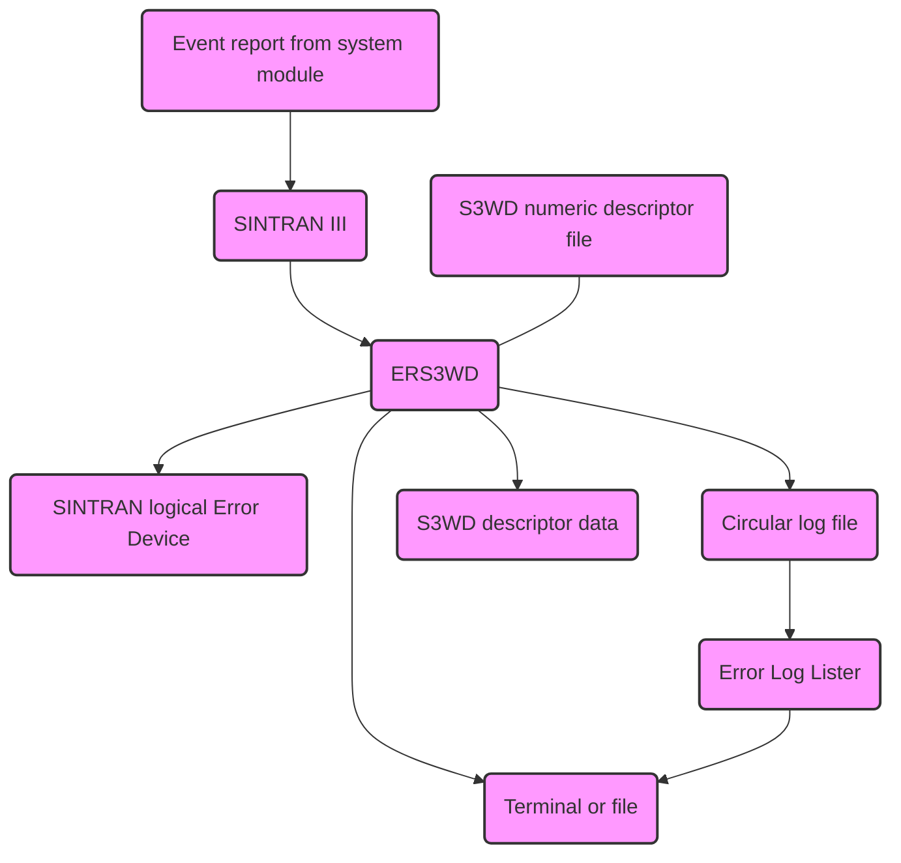

## Page 1

# Product Information

| Product name               | Product number |
|----------------------------|----------------|
| SINTRAN III/VSX Patch File | 250360L        |
| Patch level 007200 for L-version |            |

## Notes Concerning the Product

A new revision (C04) of the descriptor files for ERS/SINTRAN III Watchdog will be installed with this patch file.

If the descriptor file is required under user area ND-OPERATION, move it from user area SYSTEM after the installation of the patch file is completed.

The descriptor file copied during installation is the file used by ND-100 and ND-5000. If your system is an ND-500 you have to copy the file (250360:SYSTEM)ER-S3WD-500D-C04:EDAT to your system and rename it to ER-S3WD-DESC-C04:EDAT

## Table of Contents

|                                  | Page |
|----------------------------------|------|
| List of changed reports          | 2    |
| Cross Reference List             | 3    |
| How to install Special Modification reports | 9    |

ND-895230.1G EN

Scanned by Jonny Oddene for Sintran Data © 2025

---

## Page 2

# SINTRAN III Version L/VSX
## Patch File 007200

Listed below are changes since Patch File 007000

---

### Report 310 B
- **Program:** 500(0).
- **Subject:** 500(0) swapper disk I/O
- **Symptom:** 
  The following error is printed: "Swap Device Error".
  Process is always trapped if error is detected by the controller on any unit.

---

### Report 251 C
- **Program:** VSX/500
- **Subject:** 
  Error in setting max byte pointer of a file open for direct access from ND-500(0).
- **Symptom:**
  Max byte counter was not updated upon close. B-version: Fatal error from PIT 5.

---

ND-895230.1G EN

[Scanned by Jonny Oddene for Sintran Data © 2025]

---

## Page 3

# SINTRAN III version L/VSX  
## Patch File 007200  
### Cross Reference List  

**X-origin**.....Patch File  
**Y-origin**.....Software System report (SSR)  
**>**..........SSR-revision  
**\***..........Preliminary SSR  

```
   : 1 2 3 4 5 6 7 7 :
   3 3 2 1 3 1 0 0 0 2 :
   0 0 0 0 0 0 0 0 0 0 :
   0 0 0 0 0 0 0 0 0 0 :
 2 A A A A A A A A A A :
 3 A A A A A A A A A A :
 4 A A A A A A A A A A :
 5 A A A A A A A A A A :
 6 A A A A A A A A A A :
 7 A A A A A A A A A A :
 8 A A A A A A A A A A :
 9 A A A A A A A A A A :
10 A A>A A A A A A A A :
11 A A>B >C C C C C C C :
12 A A A A A A A A A A :
13 A A A A A A A A A A :
14 A A A A A A A A A A :
15 A A A A A A A A A A :
16 A A A A A A A A A A :
17 A A A A A A A A A A :
18 A A A A A A A A A A :
19 A A A A A A A A A A :
20 A A A A A A A A A A :
22 A A A A A A A A A A :
23 A A A A A A A A A A :
24 A A A A A A A A A A :
25 A A A A A A A A A A :
26 A A A A A A A A A A :
27 A A A A A A A A A A :
28 A A A A A A A A A A :
29 A A A A A A A A A A :
30 A A A A A A A A A A :
31 A A A>A A A A A A A :
32 A A A>B B B B B B B :
33 A A>B B B B B B B B :
34 A A A A A A A A A A :
35 A A A A A A A A A A :
36 A A A A A A A A A A :
37 A A A A A A A A A A :
38 A A A A A A A A A A :
39 A A A A A A A A A A :
40 A A A A A A A A A A :
41 A A A A A A A A A A :
42 B B B B B B B B B B :
43 A A A A A A A A A A :
44 A A>B B B B B B B B :
45 A A>B B B B B B B B :
46 A A A A A A A A A A :
47 A A A A A A A A A A :
48 A A A A A A A A A A :
```

ND-895230.1G EN  
Scanned by Jonny Oddene for Sintran Data © 2025

---

## Page 4

# SINTRAN III version L/VSX
## Patch File 007200

|   | 1 | 2 | 3 | 4 | 5 | 6 | 7 |
|---|---|---|---|---|---|---|---|
| 33 | 2 | 1 | 3 | 1 | 0 | 0 | 2 |
| 0 | 0 | 0 | 0 | 0 | 0 | 0 | 0 |
| 0 | 0 | 0 | 0 | 0 | 0 | 0 | 0 |

| 49  | A | A | A | A | A | A | A |
| 50  | A | A | A | A | A | A | A |
| 51  | A | A | A | A | A | A | A |
| 52  | A | A | A | A | A | A | A |
| 53  | A | A | A | A | A | A | A |
| 54  | A | A | A | A | A | A | A |
| 55  | A | A | A | A | A | A | A |
| 56  | A | C | C | C | C | C | C |
| 57  | B | B | B | B | B | B | B |
| 58  | A | A | A | A | A | A | A |
| 59  | A | A | A | A | A | A | A |
| 60  | B | B | B | B | B | B | B |
| 61  | A | A | A | A | A | A | A |
| 62  | A | A | A | A | A | A | A |
| 63  | A | A | A | A | A | A | A |
| 64  | A | A | A | A | A | A | A |
| 65  | A | A | A | A | A | A | A |
| 66  | A | >B| B | B | B | B | B |
| 67  | A | A | A | A | A | A | A |
| 68  | A | A | A | A | A | A | A |
| 69  | A | A | A | A | A | A | A |
| 70  | B | B | B | B | B | B | B |
| 71  | D | D | D | D | D | D | D |
| 72  | A | A | A | A | A | A | A |
| 73  | A | A | A | A | A | A | A |
| 74  | A | A | A | A | A | A | A |
| 75  | A | A | A | A | A | A | A |
| 76  | A | A | A | A | A | A | A |
| 77  | A | A | A | A | A | A | A |
| 78  | A | A | A | A | A | A | A |
| 79  | A | >B| B | B | B | B | B |
| 80  | A | A | A | A | A | A | A |
| 81  | A | A | A | A | A | A | A |
| 82  | A | >B| B | B | B | B | B |
| 83  | A | A | A | A | A | A | A |
| 84  | C | C | C | C | C | C | C |
| 85  | A | >C| C | C | C | C | C |
| 86  | A | A | A | A | A | A | A |
| 87  | A | A | A | A | A | A | A |
| 88  | A | A | A | A | A | A | A |
| 89  | A | A | A | A | A | A | A |
| 90  | A | A | A | A | A | A | A |
| 91  | A | A | A | A | A | A | A |
| 92  | A | A | A | A | A | A | A |
| 93  | A | A | A | A | A | A | A |
| 94  | A | A | A | A | A | A | A |
| 95  | A | A | A | A | A | A | A |
| 96  | A | A | A | A | A | A | A |
| 97  | A | A | A | A | A | A | A |
| 98  | A | A | A | A | A | A | A |
| 100 | C | C | C | D | >E| E | E |
| 101 | A | >B| B | B | B | B | B |
| 102 | A | A | A | A | A | A | A |
| 107 | A | A | A | A | A | A | A |
| 108 | A | A | A | A | A | A | A |
| 109 | A | A | A | A | A | A | A |
| 110 | A | A | A | A | A | A | A |
| 111 | B | B | B | B | B | B | B |

```
ND-895230.1G EN
Scanned by Jonny Oddene for Sintran Data © 2025
```

---

## Page 5

# SINTRAN III version L/VSX
## Patch File 007200

```
   : 1 2 3 4 5 6 7 7 :
 3 3 2 1 3 1 0 0 2 :
 0 0 0 0 0 0 0 0 0 :
 0 0 0 0 0 0 0 0 0 :
---------------------
112 : A A A A A A A :
113 : A A A A A A A :
114 : A A A A A A A :
117 : A A A A A A A :
119 : A A A A A A A :
120 : A A A A A A A :
123 :   B >C C C C C :
124 :   A A A A A A :
125 :   A A A A A A :
126 :   A A A A A A :
127 :   A A A A A A :
128 :   A A A A A A :
129 :   A A A A A A :
130 :   A A A A A A :
131 :   A A A A A A :
134 :   A A A >B B B :
135 :   A A A A A A :
137 :   A A A A A A :
138 :   A A A A A A :
139 :   A A A A A A :
140 :   A A >B B B B :
141 :   A A A A A A :
142 :   A A A A A A :
143 :   A A A A A A :
144 :   A A A A A A :
145 :   A A A A A A :
146 :   A A A A A A :
147 :   A A A >B B B :
148 :   A A >B B B B :
149 :   A :
151 :   A A A A A A :
154 :   A A A A A A :
156 :   A A >B B B B :
157 :   A A A A A A :
158 :   A A A A A A :
159 :   A A A A A A :
160 :   A A A A A A :
163 :   A A A A A A :
164 :   A A A A A A :
165 :   A A A A A A :
166 :   A A A A A A :
168 :   A A A A A A :
169 :   A A A A A A :
170 :   A A A A A A :
171 :   A A A A A A :
172 :   A A A A A A :
173 :   A A A A A A :
174 :   A A A A A A :
175 :   A A A A A A :
176 :   A A A A A A :
177 :   A A A A A A :
178 :   A A A A A A :
179 :   A A A A A A :
180 :   A A A A A A :
```

---

ND-895230.1G EN

[Scanned by Jonny Oddene for Sintran Data © 2025]

---

## Page 6

# SINTRAN III version L/VSX
## Patch File 007200

|   | 1 | 2 | 3 | 4 | 5 | 6 | 7 | 7 |
|---|---|---|---|---|---|---|---|---|
| 3 | 3 | 2 | 1 | 3 | 1 | 0 | 0 | 2 |
| 0 | 0 | 0 | 0 | 0 | 0 | 0 | 0 | 0 |
| 0 | 0 | 0 | 0 | 0 | 0 | 0 | 0 | 0 |

|     |     |   |   |   |   |   |   |   |
|-----|-----|---|---|---|---|---|---|---|
| 181 | :   | : | A | A | A | A | A | : |
| 182 | :   | : | : | A | A | A | A | : |
| 183 | :   | : | : | A | A | A | A | : |
| 184 | :   | : | : | A | A | A | A | : |
| 186 | :   | : | A | A | A | A | A | : |
| 188 | :   | : | : | A | A | A | A | : |
| 189 | :   | : | B | B | B | B | B | : |
| 190 | :   | : | A | A | A | A | A | : |
| 191 | :   | : | A | >B| B | B | B | : |
| 192 | :   | : | : | A | A | A | A | : |
| 193 | :   | : | A | A | A | A | A | : |
| 194 | :   | : | A | A | >B| B | B | : |
| 195 | :   | : | A | A | A | >B| B | : |
| 196 | :   | : | : | A | A | A | A | : |
| 197 | :   | : | A | A | A | A | A | : |
| 200 | :   | : | A | A | A | A | A | : |
| 201 | :   | : | A | A | A | A | A | : |
| 202 | :   | : | : | A | A | A | A | : |
| 203 | :   | : | A | A | A | A | A | : |
| 205 | :   | : | : | A | A | A | A | : |
| 206 | :   | : | A | A | A | A | A | : |
| 207 | :   | : | : | A | A | A | A | : |
| 208 | :   | : | A | A | A | A | A | : |
| 209 | :   | : | A | >B| B | B | B | : |
| 210 | :   | : | A | A | A | A | A | : |
| 211 | :   | : | : | A | A | A | A | : |
| 212 | :   | : | A | >B| B | B | B | : |
| 213 | :   | : | : | A | A | A | A | : |
| 214 | :   | : | A | A | A | A | A | : |
| 216 | :   | : | : | A | A | A | A | : |
| 218 | :   | : | A | A | A | A | A | : |
| 219 | :   | : | A | A | A | A | A | : |
| 220 | :   | : | A | A | A | A | A | : |
| 222 | :   | : | A | A | A | A | A | : |
| 224 | :   | : | : | A | A | A | A | : |
| 226 | :   | : | : | A | A | A | A | : |
| 227 | :   | : | : | A | A | A | A | : |
| 229 | :   | : | A | A | A | A | A | : |
| 230 | :   | : | : | A | A | A | A | : |
| 231 | :   | : | : | A | A | A | A | : |
| 232 | :   | : | : | A | A | A | A | : |
| 233 | :   | : | : | A | A | A | A | : |
| 235 | :   | : | A | A | A | A | A | : |
| 236 | :   | : | : | A | A | A | A | : |
| 237 | :   | : | : | A | A | A | A | : |
| 239 | :   | : | : | A | A | A | A | : |
| 240 | :   | : | : | A | >B| B | B | : |
| 241 | :   | : | : | A | A | A | A | : |
| 242 | :   | : | : | A | A | A | A | : |
| 243 | :   | : | : | A | A | A | A | : |
| 244 | :   | : | : | A | A | A | A | : |
| 245 | :   | : | : | A | A | A | A | : |
| 247 | :   | : | : | A | A | A | A | : |
| 248 | :   | : | : | A | A | A | A | : |
| 249 | :   | : | : | A | A | A | A | : |

ND-895230.1G EN

[Scanned by Jonny Oddene for Sintran Data © 2025]

---

## Page 7

# SINTRAN III version L/VSX
## Patch File 007200

```
  : 1 2 3 4 5 6 7 7 :
  : 3 2 1 3 1 0 0 2 :
  : 0 0 0 0 0 0 0 0 :
  : 0 0 0 0 0 0 0 0 :
_____________________
250 : : : : A A A A :
251 : : : A A >B >C :
252 : : : : A A A A :
253 : : : : A A A A :
254 : : : : A A A A :
255 : : : : A A A A :
256 : : : : A A : : :
257 : : : : A A A A :
258 : : : : A A A A :
259 : : : : A A A A :
260 : : : : A A A A :
261 : : : : A A A A :
262 : : : : A A A A :
263 : : : : A A A A :
264 : : : : A A A A :
265 : : : : A A A A :
266 : : : : A A A A :
267 : : : : A A A A :
268 : : : : A A A A :
269 : : : : A A A A :
270 : : : : A A A A :
271 : : : : A A A A :
272 : : : : A A A A :
273 : : : : A A A A :
274 : : : : A A A A :
275 : : : : A A A A :
276 : : : : A >B >B :
277 : : : : : B >B :
278 : : : : A A A A :
280 : : : : A >B >B :
281 : : : : A A A A :
282 : : : : A A A A :
283 : : : : A A A A :
284 : : : : A A A A :
285 : : : : A A A A :
286 : : : : A A A A :
287 : : : : A A A A :
290 : : : : A A :
291 : : : : A A A :
292 : : : : A A A :
294 : : : : A A A :
295 : : : : A A A :
297 : : : : A A A :
298 : : : : A A A :
302 : : : : A A A :
303 : : : : A A A :
304 : : : : A A A :
305 : : : : A A A :
307 : : : : A A :
310 : : : A >B :
312 : : : : A A A :
313 : : : : A A :
314 : : : : A A A :
315 : : : : A A A :
316 : : : : A A A :
318 : : : : A A :
319 : : : : : A A :
_____________________
```

ND-895230.1G EN
Scanned by Jonny Oddene for Sintran Data © 2025

---

## Page 8

# SINTRAN III Version L/VSX
## Patch File 007200

|   | 1 | 2 | 3 | 4 | 5 | 6 | 7 | 7 |
|---|---|---|---|---|---|---|---|---|
| 3 | 2 | 1 | 3 | 1 | 0 | 0 | 2 |   |
| 0 | 0 | 0 | 0 | 0 | 0 | 0 | 0 |   |
| 0 | 0 | 0 | 0 | 0 | 0 | 0 | 0 |   |
| 3 | 2 | 1 |   |   |   | A | A |   |

ND-895230.1G EN

Scanned by Jonny Oddene for Sintran Data © 2025

---

## Page 9

# ERS SINTRAN III Watchdog Description. Version C.

This report describes two programs:

The first is the ERS/SINTRAN III Watchdog (henceforth called ERS3WD), which is an RI-program to handle SINTRAN III error messages.

The second program is the Error Log Lister, which formats the log file produced by ERS3WD.

The installation procedure is found in the last paragraph.

## Central Concepts

- **SSI**: Subsystem Identification, a number uniquely identifying a product.
- **EC**: Event Code (or Error Code), a number identifying an event in a product.
- **SEC**: Standard Event Code (16 bits), the SSI and the EC combined. The SEC identifies both the (failing) product and the event which has occurred.

**Example**:
- SSI = 1061B  '/FTX - Disk Mirroring'
- EC = 15B  'Page outside limits'
- SEC = 106115B

## ERS3WD

The RI-program ERS3WD is a process which handles error reports sent via or by SINTRAN III. ERS3WD receives these reports from SINTRAN on the internal device with logical device number 276B. The SEC parameter in every report specifies which system module has issued the report and which error has occurred.

A received report is in numeric format. ERS3WD converts the report to text format and writes it to the error device.

To do this conversion ERS3WD needs some formatting information, the so-called "report descriptors". This information is already contained in ERS3WD's data segment at installation. The report descriptors are also supplied as the file ER-S3WD-DESC-Cxx:EDAT to make it possible to update the descriptors more frequently than ERS3WD is revised. If this file exists on the user areas ND-OPERATIONS or SYSIEM, ERS3WD will substitute this file's descriptors for its own descriptors at startup.

ERS3WD also writes the numerically formatted report to its own log file. This is the file (SYSIEM)ER-S3WD-LOG:DATA, which is created by ERS3WD at startup if it does not already exist. The log file is created as a contiguous 11-page file and ERS3WD treats it as a ring file. This means that ERS3WD will start writing at the beginning of the file again after reaching the end.

## Error Log Lister

The Error Log Lister is a background program that takes the log file produced by ERS3WD and formats it into text messages.

Contrary to ERS3WD, the Error Log Lister program depends on finding and reading the descriptor file ER-S3WD-DESC-Cxx:EDAT, either on the user area ND-OPERATIONS or the user area SYSIEM.

---

*ND-895230.1G EN*

*Scanned by Jonny Codebreaker for Sintran Data © 2025*

---

## Page 10

# SINTRAN III version L/VSX
## ERS SINTRAN III Watchdog

ERS3WD writes to the file `(SYSTEM)ER-S3WD-LOG:DATA`, and this is the default input file to the Error Log Lister. Output can be directed to a file or to the terminal, default output is the file `ER-S3WD-LOG:OUT`.

It is possible to clear the log file when reading it, but this is not necessary as the log file is circular as explained above.

The program is started by typing: `ER-S3WD-LOG`

## Data Flow



### Footnotes

1. ERS3WD does not depend on finding the descriptor file.
2. Error Log Lister depends on finding the descriptor file.
3. Numeric format event reports.
4. Text format event reports.

### Note
If in a period reports are produced faster than they are read, it may happen that the internal device gets filled up by unread reports. Before SINTRAN writes a new report, it checks whether the device is almost full. Should this be the case, then a report with `SEC = 1666B` is written instead. The text format version of this report includes the event text:

**Internal device for error messages is full.**

SINTRAN will ignore event reports arriving after the 1666B report until sufficient free space is again available in the device. The ignored reports are lost.

```
ND-895230.1G EN
Scanned by Jonny Oddene for Sintran Data © 2025
```

---

## Page 11

# SINTRAN III version L/VSX
## ERS SINTRAN III Watchdog

### Text format

This is the layout of a report written to the error device:

```
<severity> * SSI.EC * YYYY-MM-DD HH:MM:SS * <RIprog>.<P-reg> * <sysname>.<sysno>
<product name>
<event text>
<parameter description><parameter>
<parameter description><parameter>
.
.
```

#### <severity>

This tells the severity of the event that has been reported. (FATAL, ERROR, WARNING, INFORMATION)

#### SSI

This is the SSI of the reported event. It is written as an octal number.

#### EC

This is the Event Code of the reported event. It is also written as an octal number.

#### YYYY-MM-DD

The date when the event was read by ERS3WD.

#### HH:MM:SS

The time when the event was read by ERS3WD.

#### <RIprog>

The RI-program name (if possible, or RI-program description address).

#### <P-reg>

The P-register contents of the RI-program.

#### <sysname>

The system name as defined in XMSG, if it is accessible.

#### <sysno>

The system number as defined in XMSG, if it is accessible.

#### <product name>

The product name.

#### <event text>

A text which describes the nature of the event.

#### <parameter description>

An explanation of what the following parameter value is.

#### <parameter>

A parameter value.

### Suppression

When a process reporting to ERS3WD "goes wild" and sends a stream of identical error messages, it is desirable that "excess" messages will be suppressed.

If the same event report appears more than 20 times in succession, the following identical event reports will be suppressed until a different event arrives or the time between the last and previous event exceeds 10 seconds.

When the suppression starts, a message about this will be given. When the logging of event reports is resumed, ERS3WD reports the number of reports that have been suppressed, and then the new report.

```
ND-895230.1G EN
```

---

## Page 12

# SINTRAN III Version L/VSX

ERS SINTRAN III Watchdog

## ERS3WD Messages

ERS3WD indicates a few situations by writing messages both to the error device and the log file. The messages are:

### 1170B.01B ERS/Watchdog has started

### 1170B.02B ERS/Watchdog has stopped

### 1170B.03B Cannot reserve internal device

The internal device 276B could not be reserved.

### 1170B.04B Descriptor file was not found on SYSTEM or ND-OPERATIONS

The descriptor file could not be found or accessed.  
The file was searched for on both the user areas ND-OPERATIONS and SYSTEM.  
ERS3WD continues and will use its initial descriptors.

### 1170B.05B Cannot read descriptor file. Corrupt file

The descriptor file named ER-S3WD-DESC-C:EDAT is empty or contains corrupted data.

### 1170B.06B Log file could not be opened/created

The log file named (SYSTEM)ER-S3WD-LOG:DATA could not be created or opened. Is it possible to reserve at least 11 contiguous pages for user SYSTEM?

### 1170B.07B Further copies of this event will be suppressed

If the same event report appears more than 20 times in succession, the following identical event reports will be suppressed until a different event arrives or the time between the last and previous event exceeds 10 seconds.

### 1170B.10B The previous message has been suppressed

This message is written at the end of a suppression period.

### 1170B.11B Descriptor file too big

The descriptor file named ER-S3WD-DESC-C:EDAT is larger than ERS3WD’s data segment (about 114000 bytes).

### 1170B.12B Descriptor file too small

The descriptor file named ER-S3WD-DESC-C:EDAT is found to be too small. It must at least be 2 pages.

### 1170B.13B Error when reading descriptor file

A file system error occurred when reading the descriptor file ER-S3WD-DESC-C:EDAT.

---

[Scanned by Jonny Oddene for Sintran Data © 2025]

---

## Page 13

# SINTRAN III Version L/VSX
## ERS SINTRAN III Watchdog

### 1170B.14B Protocol Error on Internal Device

The byte string that was received on the internal device was not recognised by ERS3WD as a legal protocol. This error may cause one or more of the following reports to be slightly corrupted or totally wrong, or even make ERS3WD stop reporting. It is recommended that you abort ERS3WD, do `RTCIIOSE` on the log file, and then restart the ERS3WD RT-program if this error occurs. (See the next message.)

### 1170B.15B The Protocol Error is Corrected

This message appears if ERS3WD managed to find a correct protocol header on the internal device after the previously described situation. A restart is no longer necessary.

### Reporters that are Recognised by ERS3WD

This list may be expanded by the installation of a newer revision of the descriptor file than `ER-3WD-DESC-C02:EDAT`.

| SEC Range  | System Module |
|------------|----------------|
| 000000B - 000377B | SINTRAN III File System |
| 001000B - 001077B | ND-500/5000 System Monitor |
| 001500B - 001677B | SINTRAN III Runtime System |
| 002000B - 002217B | ND-500/5000 Monitor Internal |
| 002200B - 002277B | ACCP/Microprogram |
| 003300B - 003377B | SINTRAN III File System |
| 006000B - 006277B | Domino Operating System |
| 006200B - 006277B | Domino Services |
| 007600B - 007677B | ND-500/5000 Traps |
| 044500B - 044577B | FO-LIB Service Point System |
| 046600B - 046677B | Ethernet Media Access |
| 047200B - 047277B | AIP - ARPA Internet Protocol |
| 047300B - 047377B | TCP/IP - Transmission Control Protocol / Internet Protocol |
| 047400B - 047477B | SLIB - Socket Library |
| 047600B - 047677B | Telnet Server |
| 101000B - 101077B | Nucleus |
| 101100B - 101177B | Nucleus Operations |
| 101200B - 101277B | MIAD Server |
| 101400B - 101477B | Octobus driver |
| 101500B - 101577B | MF-bus Controller |
| 104000B - 104277B | BDIO - Basic Disk I/O |
| 104500B - 104577B | SCSI domino driver |
| 104600B - 104677B | SCSI domino device level |
| 104700B - 104777B | SCSI domino tape access |
| 105000B - 105077B | PROMAN - Processor Manager |
| 105300B - 105377B | SCSI domino device level |
| 106100B - 106277B | FTX Disk Mirroring |
| 107000B - 107077B | ERS Watchdog |
| 107100B - 107177B | ERS Library |
| 107200B - 107277B | ERS Router |
| 107300B - 107377B | ERS Receiver |
| 107400B - 107477B | ERS Formatter |
| 107500B - 107577B | ERS Configuration Server |
| 142200B - 142277B | SIBAS Access Server |

---

## Page 14

# Installation

ERS SINTRAN III Watchdog version C is delivered as part of the patch file 7200 for SINTRAN III version L.

ERS3WD version C is installed when you run the patch file, and is started when SINTRAN starts.

The operation of the log file (ring file) (SYSTEM)ER-3WD-LOG:DATA is fully automatic. ERS3WD will create it as a 11-page contiguous file if it does not already exist. With this size the log file typically contains between 400 and 900 event reports when filled up. You may recreate this file with a new size to suit your demands, but it must be at least 2 pages in size, and it must be a contiguous file.

**NOTE:** ER-S3WD-LOG:DATA must not be closed for RT-program use (@RTCLOSE-FILE), deleted or otherwise tampered with while ERS3WD is active.  
You must first do @ABORT ERS3WD, then @RTCLOSE on the log file.  
To restart ERS3WD do @RT ERS3WD or @RESTART-SYSTEM.  

The Error Log Lister may run while ERS3WD is active.

---

ND-895230.1G EN

Scanned by Jonny Oddene for Sintran Data © 2025

---

