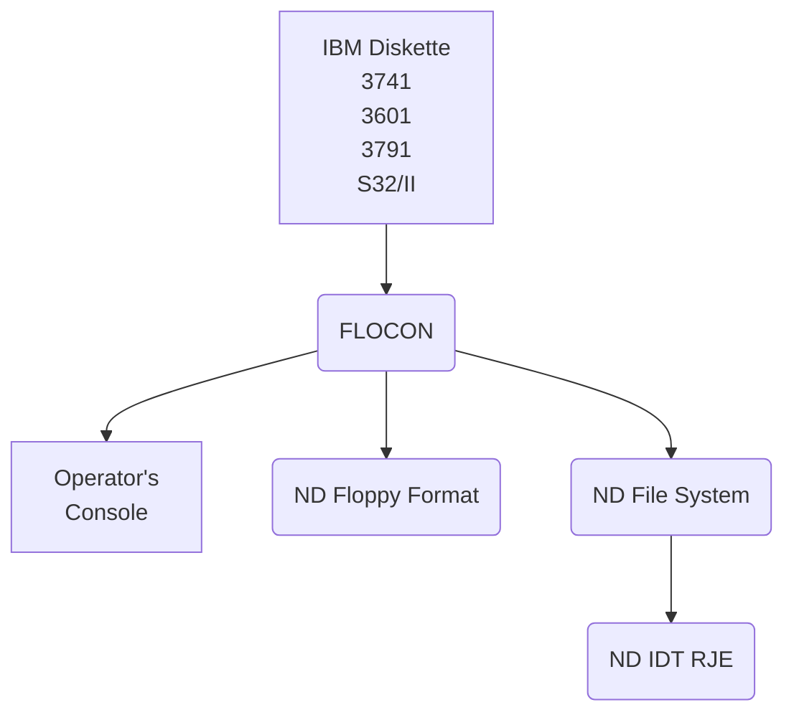

## Page 1

# ND 10014/10021 FLOCON

## INTRODUCTION

The ND Floppy Converting System – FLOCON – is a multifunction conversion and service program used to manipulate data-sets on floppy diskettes.

The program can handle various diskette formats as IBM 3740, 3600, 3790, System 32/II and NORD-10 Floppy and File System format as input and also produce output in IBM 3740 EBCDIC or ASCII format.

FLOCON can be used in local conversion tasks as a subsystem from any SINTRAN III/VS time-sharing terminals copying data to and from diskettes, or as a software interface controlling several ND IDT Remote Job Emulator packages communicating with large computers as CDC (2000 T, IBM (HASP/3780), Honeywell Bull (GERTS-115) and Univac 1100 (NTR).

In the last function the FLOCON program (VS and RT version) controls the dataflow and operator messages between the IDT packages and a common operator console.

Job-decks read from disk, floppy or card reader may contain a `<local-control-record>` specifying data files to be interspersed with the job-control-cards submitted to the remote computer.

## FEATURES

- Supports most of IBM diskette formats
- Several conversion modes can be selected, EBCDIC to ASCII automatic depending on diskette-label
- Copying data-sets from diskette to local file or peripherals, copying complete diskettes for back-up
- File-statistics – and manipulation of IBM diskettes
- Common operator console for several ND IDT Remote Job Emulator packages
- Transmits data-sets on diskette or local files to remote computer when `<local-control-record>` is detected in the job-decks
- Issues mounting messages to the operator specifying diskette volume, name and floppy device
- Installation can define own `<local-control-records>` to suit various job-control-language formats

## PRODUCT DESCRIPTION

The FLOCON utility exists in three versions:

- **The BG version (FLOCON-BG)** runs as a SINTRAN III/VS subsystem and provides local conversion and copying functions from interactive terminals



---

## Page 2

# Command Summary

The BG-Version is started from the user’s terminal by typing:

```
@ FLOCOn
```

Commands shown below can be executed one at a time, only local commands are allowed.

The VS- and RT-versions must be started by user SYSTEM or RT typing:

```
ABORT
APPEND-FILE <DESTINATION FILE> <SOURCE FILE>
CHANGE-FILE-LABEL <FILE NAME>
CHANGE-IDT-TABLE <IDT-TABLE NO.>
CHANGE-IDT-NAME <NEW IDT-NAME>
CHANGE-VOLUME-LABEL <DEVICE FILE NAME>
COPY-DEVICE <DESTINATION DEVICE> <SOURCE DEVICE>
COPY-FILE <DESTINATION FILE> <SOURCE FILE>
CREATE-VOLUME <VOLUME NAME> <DEVICE FILE NAME>
DEFINE-LOCAL-RECORD
DELETE-FILE <FILE NAME>
EXIT
HELP
LIST-CURRENT-IDT-NAMES
LIST-FILE <DEVICE FILE NAME> [<OUTPUT FILE>]
LIST-LOCAL-RECORD
LIST-TABLE-ADDRESSES
LOCAL
REMOTE <IDT-NAME> [<CHANNEL-1><CHANNEL-2><CHANNEL-3><CHANNEL-4>]
SET-ASCII-LABEL
SET-CONVERTING-MODE <MODE>
SET-EBCDIC-LABEL
VOLUME-STATISTICS <DEVICE FILE NAME> [<OUTPUT FILE>]
```

# RT Main

All communication goes initially through logical device number 1. However, this may be changed by changing two locations in the program.

The user must be logged out from the actual terminal to be used by FLOCOn-VS/FLOCOn-RT. FLOCOn-VS has, however, the possibility of connecting to any terminal without changing the program locations each time. If the logical device number for terminal input is set to zero before FLOCOn-VS is started, the user may type:

```
@ CONNECT-FLOCON
```

and a communication with FLOCOn-VS will be established. An internal device is used for this connection procedure.

In the VS- and RT-versions, several tasks may be active at the same time. Commands to the IDT packages to read data-files and commands to request status from the IDT packages, can be performed simultaneously with local copying of diskette files. Messages from different tasks and IDT packages are collected at the operator console.

The following commands can be used by all versions:

```
[Commands list continues]
```

---

## Page 3

# Commands Available in VS- and RT-Versions

```
> GERTS
> HASP-WS
> HASP-II
> MTR
> ZOUVS
> 3780
> CLEAR
> COMMANDS-TO-IDT
> CONTINUE <INPUT FILE>
> LOGIN
> READ <INPUT FILE>
```

# Requirements

The FLOCON-BG is used with the SINTRAN III/VS operating system as a standard subsystem or as a reentrant subsystem. The program occupies approximately 18 K words.

The FLOCON-VS is used with the SINTRAN III/VS operating system. It requires 13 RT-programs, one segment of 20 K words, 3 internal devices for each IDT package to be supervised (or 2 if only console messages and commands are to be exchanged between FLOCON and the IDT).

If the connect-program, CONNECT-FLOCON is to be installed, one separate internal device is required for this program.

The FLOCON-RT is to be used with the SINTRAN III/RT operating system. It requires 13 RT-programs and a memory space of approximately 15 K words.

Any IDT package to be supervised must be installed separately.

# Delivery

FLOCON-BG, FLOCON-VS and CONNECT-FLOCON are delivered on the same diskette, product no. ND 10014. FLOCON-BG and CONNECT-FLOCON are in BPUN-Format, and may be loaded as a standard subsystem, while FLOCON-VS is in BRF-format and may be loaded by the RT-loader.

FLOCON-RT is delivered in BRF-format and must be loaded by the SINTRAN III/RT Loader, product no: ND 10021.

# References

Data Management Utilities Manual …. ND-60.157.01

---

## Page 4

# Contact Information

## Norsk Data

| Location              | Telephone    | Telex                   |
|-----------------------|--------------|-------------------------|
| Bergen                | 05-22900     |                         |
| Sandnes               | 04-62554     |                         |
| Trondheim             | 075-16260    | tix. 55850 comtec n     |
| Tromsø                | 083-75546    |                         |
| Stockholm (Upplands Väsby) | tel. 0870-43100 | tix. 15255 nordata s |
| Stockholm (Solna)     | tel. 086-72885 | tix. 13700 swecom s    |
| Göteborg              | 031-306670   |                         |
| Odense                | tel. 09-154601 | tix. 59655 comtec dk  |
| København             | tel. 02-850455 | tix. 37725 nd dk    |
| Ballerup (Copenhagen) | 02-675000    |                         |
| Düsseldorf            | tel. 0211-66088 | tix. 8587277 comt d  |
| Wiesbaden             | tel. 061-34567 | tix. 318703 norda n   |
| Fenny-Voltaire        | tel. 065-56876 | tix. 385563 nordata fernv |
| Paris                 | tel. 01-4233466 | tix. 20160 nd paris   |
| Lynn, tel.            | 067-8737147  |                         |
| Newbury (Berkshire)   | tel. 0635-31465 | tix. 849819 norsk g  |
| Boston                | tel. 617-237-7945 | tix. 921740 norsk well |

## Headquarters

| Location  | Address            | Telephone  | Telex          |
|-----------|--------------------|------------|----------------|
| Oslo      | Boks 4, Lindeberg gård, Oslo 10 | 02-30900 | 18661 nd n |

NOTE: NORSK DATA reserves the right to change specifications without given notice!

---

