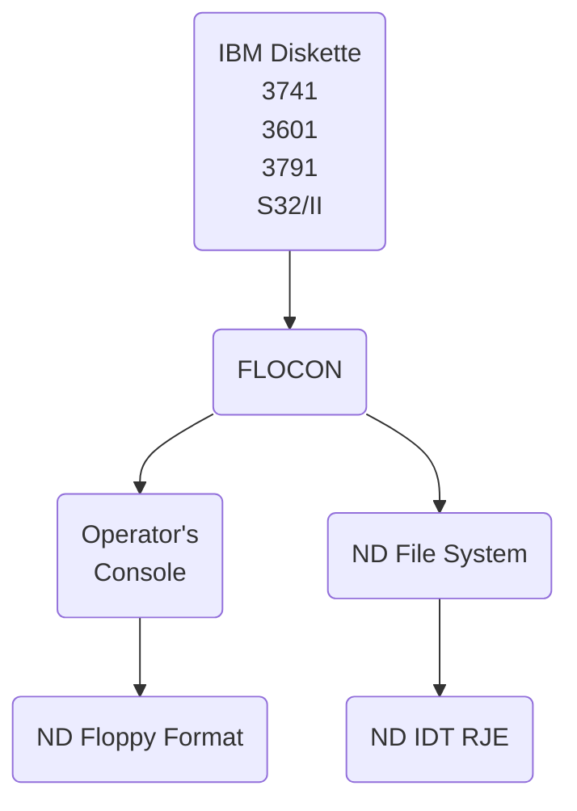

## Page 1

# ND 10014/10021 FLOCON

## INTRODUCTION

The ND Floppy Converting System – FLOCON – is a multifunction conversion and service program used to manipulate data-sets on floppy diskettes.

The program can handle various diskette formats as IBM 3740, 3600, 3790, System 32/II and NORD-10 Floppy and File System format as input and also produce output in IBM 3740 EBCDIC or ASCII format.

FLOCON can be used in local conversion tasks as a subsystem from any SINTRAN III/VS time-sharing terminals copying data to and from diskettes, or as a software interface controlling several ND IDT Remote Job Emulator packages communicating with large computers as CDC (2000 T), IBM (HASP/3780), Honeywell Bull (GERTS-115) and Univac 1100 (NTR).

In the last function the FLOCON program (VS and RT version) controls the dataflow and operator messages between the IDT packages and a common operator console.

Job-decks read from disk, floppy or card reader may contain a «local-control-record» specifying data files to be interspersed with the job-control-cards submitted to the remote computer.

## FEATURES

- Supports most of IBM diskette formats
- Several conversion modes can be selected, EBCDIC to ASCII automatic depending on diskette-label
- Copying data-sets from diskette to local file or peripherals, copying complete diskettes for back-up
- File-statistics – and manipulation of IBM diskettes
- Common operator console for several ND IDT Remote Job Emulator packages
- Transmits data-sets on diskette or local files to remote computer when «local-control-record» is detected in the job-decks
- Issues mounting messages to the operative specifying diskette volume, name and floppy device
- Installation can define own «local-control-records» to suit various job-control-language formats

## PRODUCT DESCRIPTION

The FLOCON utility exists in three versions:

- **The BG version (FLOCON-BG)** runs as a SINTRAN III/VS subsystem and provides local conversion and copying functions from interactive terminals



[Photo: ND logo and additional text not transcribed]

---

## Page 2

# VS and RT Versions

- **VS version (FLOCON-VS):**
  - Runs as a set of asynchronous RT-programs under SINTRAN III/VS.
  - Same functions as the BG Version.
  - Up to one user at a time.
  - Acts as a supervisor for the ND IDT Remote Job Emulators.

- **RT Version (FLOCON-RT):**
  - Runs as a set of asynchronous RT-programs under SINTRAN III/RT.
  - Same functions as the VS Version, except disk files are not handled.

- **Usage:**
  - FLOCON-BG and FLOCON-VS may be used simultaneously.
  - FLOCON-BG may not control any IDT packages.

# Command Summary

- **BG-Version:**
  - Started from the user's terminal by typing:
    ```
    @ FLOCON
    ```
  - Commands shown can be executed one at a time.
  - Only local commands are allowed.

- **VS- and RT-versions:**
  - Must be started by user SYSTEM or RT typing.

### Commands

| Command                                 | Description                                    |
|-----------------------------------------|------------------------------------------------|
| ABORT                                   |                                                |
| APPEND-FILE `<DESTINATION FILE> <SOURCE FILE>` |                                       |
| CHANGE-FILE-LABEL `<FILE NAME>`         |                                                |
| CHANGE-IDT-TABLE `<IDT-TABLE NO.>`      |                                                |
| CHANGE-IDT-NAME `<NEW IDT-NAME>`        |                                                |
| CHANGE-VOLUME-LABEL `<DEVICE FILE NAME>`|                                                |
| COPY-DEVICE `<DESTINATION DEVICE> <SOURCE DEVICE>` |                                     |
| COPY-FILE `<DESTINATION FILE> <SOURCE FILE>` |                                             |
| CREATE-VOLUME `<VOLUME NAME> <DEVICE FILE NAME>` |                                            |
| DEFINE-LOCAL-RECORD                     |                                                |
| DELETE-FILE `<FILE NAME>`               |                                                |
| EXIT                                    |                                                |
| HELP                                    |                                                |
| LIST-CURRENT-IDT-NAMES                  |                                                |
| LIST-FILE `<DEVICE FILE NAME> [<OUTPUT FILE>]` |                                      |
| LIST-LOCAL-RECORD                       |                                                |
| LIST-TABLE-ADDRESSES                    |                                                |
| LOCAL                                   |                                                |
| REMOTE `<IDT-NAME> [<CHANNEL-1><CHANNEL-2><CHANNEL-3><CHANNEL-4>]` |                    |
| SET-ASCII-LABEL                         |                                                |
| SET-CONVERTING-MODE `<MODE>`            |                                                |
| SET-EBCDIC-LABEL                        |                                                |
| VOLUME-STATISTICS `<DEVICE FILE NAME> [<OUTPUT FILE>]` |                                  |

# RT MAIN

- **Connection:**
  - All communication goes initially through logical device number 1.
  - Can be changed by modifying locations in the program.

- **User Login:**
  - The user must be logged out for the actual terminal to be used by FLOCON-VS/FLOCON-RT.
  - FLOCON-VS can connect to terminals without program location changes.

- **Establish Communication:**
  - For terminal input, set logical device number to zero before starting FLOCON-VS:
    ```
    @ CONNECT-FLOCON
    ```
  - Communication with FLOCON-VS will be established.
  - An internal device is used.

- **Tasks:**
  - VS- and RT-versions allow multiple active tasks.
  - Commands and data-file requests from the IDT packages can be simultaneous.
  - Messages collected at the operator console.

### Common Commands Used by All Versions

- Several tasks may be active, with commands and message systems for efficient operation.

---

## Page 3

# Commands Available

The following commands are available in VS- and RT-versions only:

```
> GERTS
> HASP-WS
> HASP-II
> MTR
> ZOOVS
> 3780
> CLEAR
> COMMANDS-TO-IDT
> CONTINUE <INPUT FILE>
> LOGIN
> READ <INPUT FILE>
```

# Requirements

The FLOCON-BG is used with the SINTRAN III/VS operating system as a standard subsystem or as a reentrant subsystem. The program occupies approximately 18 K words.

The FLOCON-VS is used with the SINTRAN III/VS operating system. It requires 13 RT-programs, one segment of 20 K words, 3 internal devices for each IDT package to be supervised (or 2 if only console messages and commands are to be exchanged between FLOCON and the IDT).

If the connect-program, CONNECT-FLOCON is to be installed, one separate internal device is required for this program.

The FLOCON-RT is to be used with the SINTRAN III/RT operating system. It requires 13 RT-programs and a memory space of approximately 15 K words.

Any IDT package to be supervised must be installed separately.

# Delivery

FLOCON-BG, FLOCON-VS and CONNECT-FLOCON are delivered on the same diskette, product no. ND 10014. FLOCON-BG and CONNECT-FLOCON are in BPUN-Format, and may be loaded as a standard subsystem, while FLOCON-VS is in BRF-format and may be loaded by the RT-loader.

FLOCON-RT is delivered in BRF-format and must be loaded by the SINTRAN III/RT Loader, product no: ND 10021.

# References

Data Management Utilities Manual .... ND-60.157.01

---

## Page 4

```plaintext
 __    __  
/  \  /  \  
\   \/   /  
 \      /   
  \    /   
   \__/    

Norsk Data

Bjerkeveien 20
Boks 4 Linderberg gård
Oslo 10
Tel.: 02-309030
Tlx.: 18661 nd n

Bergen, tel. 05-229020
Sandnes, tel. 04-66554
Trondheim, tel. 075-16520, tts. 55850 comtn n
Tromsø, tel. 083-715640
Stockholm (Upplands Väsby), tel. 08-760-34300, tkx. 15255 nordata s
Stockholm (Solna), tel. 08-735885, tkx. 13706 swecom s
Odense, tel. 09-155401, tkx. 69535 comtec dk
Oslo, tel. 02-309030, tks. 18661 nd n
Göteborg, tel. 031-19760
Malmø, tel. 040-97505
Copenhagen, tel. 02-925550, tkx. 37725 nd dk
Winschoten, tel. 161-24547, tkx. 318703 noda n
Perne-Vollaut, tel. 064-508766, tkx. 385853 nordata fernv
Paris, tel. 07-6322436, tkx. 201150 nd paris
Lyon, tel. 07-8371747
Newbury (Berkshire), tel. 0635-31466, tkx. 849819 norsk g
Boston, tel. 617-237-7943, tkt. 921740 norsk well

 __    __  
/  \  /  \  
\   \/   /  
 \      /   
  \    /   
   \__/    

ND
COMTEC

Bjerken 20
Boks 4 Lindeberg gård
Oslo 10
Tel.: 02-309030
Tlx.: 18661 nd n

Düsseldorf, tel. 0211-660388, tkx. 8587277 comt d
Ballerup Copenhagen, tel. 62-787090

NOTE: NORSK DATA reserves the right to change specifications without given notice!
```

---

