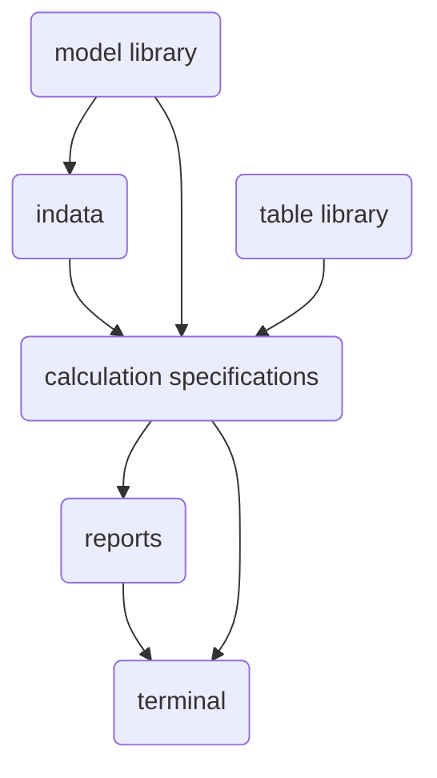

## Page 1

# ND 10145 MERCUR – A Language For Planning And Analysis

## INTRODUCTION

MERCUR is basically a high-level language for creation, manipulation and presentation of tabular information. However, the main objective with this language is to offer a powerful tool for building and running financial models on ND computers. One of the main goals was to make a language which would be easy to learn. At the same time it was to be powerful and flexible, so that the user might run different kinds of analyses on possible models, as well as developing, maintaining and making extensions on such models.

MERCUR has existed on the market since 1976. It is now available to be run on the NORD-10 and ND-100 computers. The user may interactively treat all kinds of information represented in tabular form. MERCUR handles calculations within a table or calculations of relationships between different tables. Normally it is run interactively via a terminal, but may also be run in batch mode.

## PRODUCT DESCRIPTION

### Data

In MERCUR data are always stored in tables which the user gives names. The tables are built up of columns and rows which are also named by the user. In addition to digits, the tables may contain editing information, like decimal specifications, underlinings, blocks and text, desired number of spaces between columns in the written output, etc. The tables are handled by MERCUR's database system, and are stored on a disk.

### Arithmetic

Besides addition, subtraction, multiplication and division, MERCUR contains expressions for relationships, logical expressions, as well as standard functions to present economic status, calculations of annuities, internal dividends and statistical calculations.

MERCUR also handles «vector arithmetic» in order to, for example accentuate certain rows, columns or tables, concatenate rows, columns or tables, to sum, accumulate, calculate differences among columns or rows, as well as matrix multiplication and matrix inversion.

## The Philosophy of MERCUR



The user normally communicates directly with MERCUR via a terminal. The job is defined and MERCUR writes out the desired reports directly on the terminal.

---

10145-A1–2000–0582

---

## Page 2

# MERCUR Language and Applications

Tables are a central concept in the MERCUR language. All the financial data of an organization may be stored in the `«table database»`. They may easily be changed, and can be written out in edited form. Calculations inside or between tables may be specified by the user in simple terms. The calculation specifications describe the relevant economic relations and constitute the user’s economic model.

## Examples of Applications of MERCUR in the Budgetary Process

### Financial Applications
- Consolidations
- Annual reports
- Follow-up of results
- Balance results analyses
- Financial analyses
- Cash-management
- Loan-amortization plans
- Cost distributions
- Cost comparisons
- Reports
- Investment calculations

### Market-oriented Applications
- Income comparisons
- Sales budgeting and control
- Market analyses
- Price calculations
- Offer calculations
- Forecasting models
- Investment calculations in marketing
- Storage and distribution analyses

### Production-oriented Applications
- Product calculations
- Standard cost calculations
- Cost calculations
- Cost analyses
- Cost distributions
- Rough production planning
- Needs analyses
- Project calculations
- Personnel budgeting
- Investment calculations for equipment

### Organization Models
Organization models are usually economic models, and describe connections between product volume, income and cost as well as the consequences for quantities like rentability, solidity, profit, etc.

Such models show connections between, for example in-comes, cost divisions, depreciations, allocation of funds, etc.

## Budget Calculations
The most common application of MERCUR is within budgetary operations. MERCUR is used in different places during the calculation, as for example when large numbers of data must be handled, or if it is desirable to output the results in many different ways. For large organizations several of the participants in the budgetary calculating process may participate and construct their own local budgets, an example would be different departments within the organization. In this manner a common base may be arrived at from which salaries, cost prognoses, current exchange prognoses or other relevant data may be calculated. The central economy department of the organization may coordinate and consolidate a total budget from the contributions of the individual departments, and conduct simulations of the over-all budget.

MERCUR is also applicable for spontaneous calculations like investment analyses or purchase/lease comparisons.

## MERCUR Statements
The commands in MERCUR are given as statements. The user expresses the calculations to be performed and other commands in a free and natural form.

There are two ways to execute statements. A command statement is first checked for possible errors and then executed. A program statement is preceded by a statement number. MERCUR again checks for correct input, but the statement is not executed. Subsequently these commands are stored according to number. Through the statements a MERCUR program may be built up and stored under a name in a program library for later use.

## Output
Among the many possibilities for output are:
- Automatic editing of output
- Writeout of certain parts of the table database
- Selective writeout of sections of tables that satisfy certain conditions
- Blocks and texts, truncations and specifications of demands

Other features which are simple to specify:
- Changes or corrections in a program
- Construction of large models from consecutive smaller models
- Communication with other systems

## Documentation
MERCUR – A Language for Planning and Analysis – User Manual.

```
  _______________________________________
 |          NORSK DATA/COMTEC            |
 |                                       |
 |  Address and Contact Information:     |
 |  Oslo, tel: 02-309200, tk. 18661 nd n |
 |  Bergen, tel: 05-209200               |
 |  Stavanger, tel: 04-53434             |
 |  Trondheim, tel: 075-165200           |
 |  Stockholm, tel: 075-164200           |
 |  Gothenburg, tel: 031-924960          |
 |  Malmö, tel: 040-75501                |
 |  Copenhagen, tel: 02-675566           |
 |  Helsinki, tel: 021-74871             |
 |  Amsterdam, tel: 05-406965            |
 |  Paris, tel: 1-48024716               |
 |  Lyon, tel: 1-1437371                 |
 |  Newbury, tel: 0635-4361              |
 |  Boston, tel: (617) 237-7945          |
 |_______________________________________|
```

---

