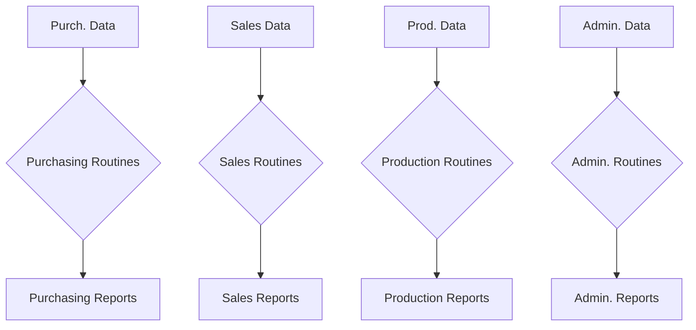
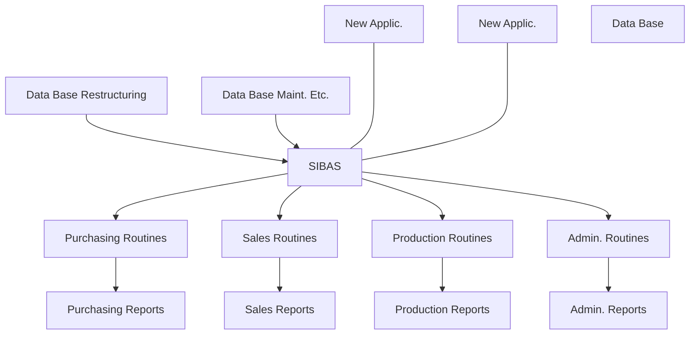
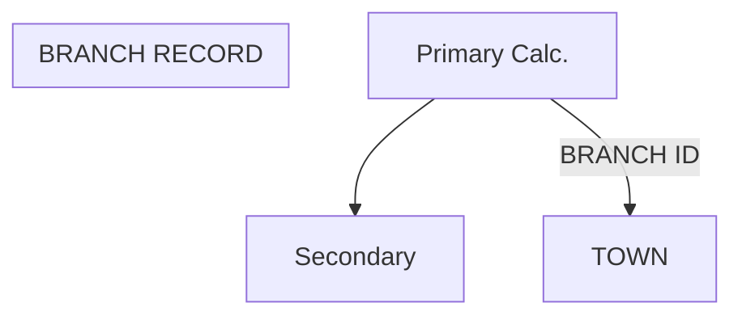
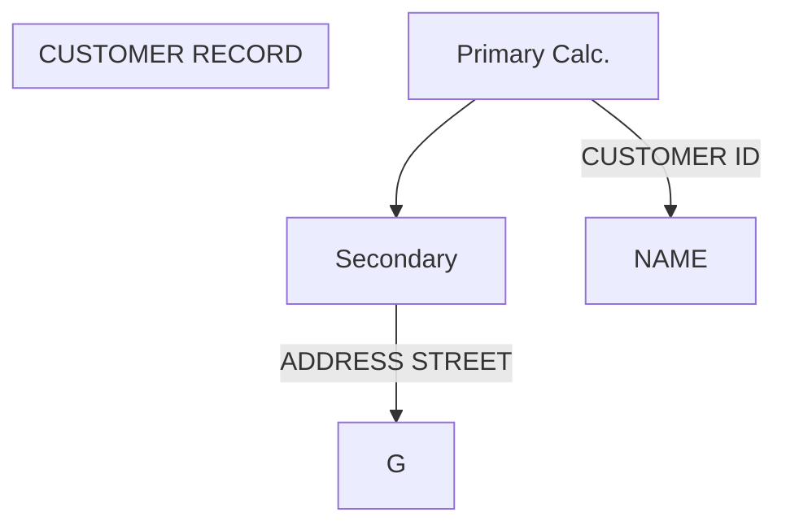
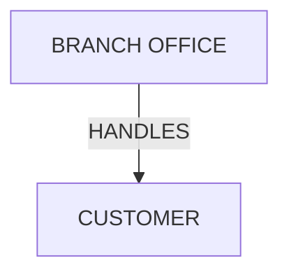
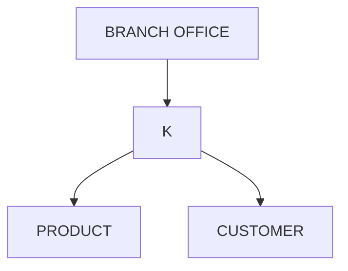
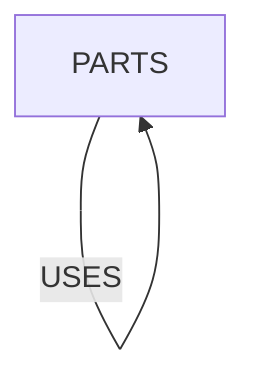
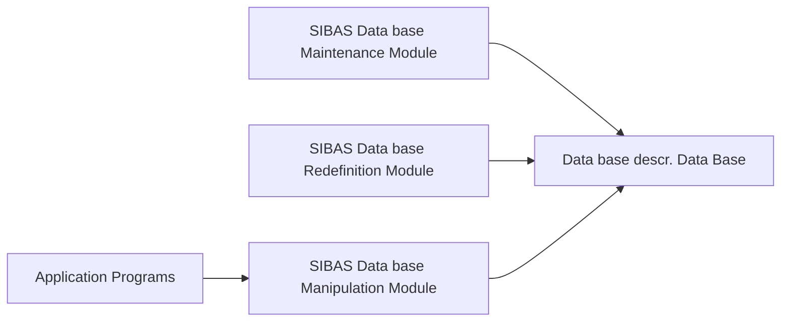
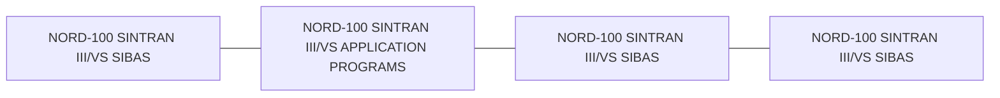

## Page 1

# ND 10166 SIBAS-II DATA BASE SYSTEM

## INTRODUCTION

The SIBAS-II data base system, originally developed by the Central Institute for Industrial Research (CIIR) in Oslo, Norway, is the first fully-fledged data base system following the CODASYL DBTG recommendations implemented on a minicomputer.

The system described in this datasheet is identical to systems offered on large computer systems, such as Univac 1100 and IBM 360/370. It has recently been expanded and optimized in a joint development project with the company offering SIBAS-II on large computer systems: A/S Shipping Research Services, Oslo, together with CIIR and NORSK DATA A.S.

The implementation of SIBAS-II on the NORD computers has utilized the advanced facilities of the SINTRAN III/VS Operating System, thus minimizing the amount of additional routines in the programs, and offering multiple user programs simultaneously accessing the same data base in a controlled and secure manner.

## FEATURES

- Offers facilities normally found only on large mainframes with for example IDS, IMS, DMS 1100, and TOTAL
- Designed in accordance with the CODASYL DBTG recommendations
- One of the most advanced and progressive DBM systems available
- Supported and maintained by highly qualified software personnel
- Functions under the powerful SINTRAN III/VS Operating System
- Controls a data base local to own organization running on his own low-cost NORD computer system
- Terminal oriented multi-user access
- Controlled expansion of the data base application via:
  - powerful data base restructuring facilities
  - the hardware modularity offered by NORD systems
  - conversational access to data bases

## THE PROBLEMS

The increasing complexity and changeableness of present-day business practices make it essential that good decisions can be reached rapidly and efficiently. Managers are relying more and more on suitable input to the decision-making processes provided by computerized data management systems.

Unfortunately, many computerized information systems are based on a software technology now ten to fifteen years old. This technology does not effectively use the capabilities offered by direct access storage. In addition many systems have been structured such that even simple modifications to the system are expensive and time-consuming. The increasing need for on-line access to the data requires that the data be correctly but flexibly structured and stored in direct access storage, and that it can be accessed in many different ways.

## THE DATA BASE CONCEPT — WHAT IT MEANS

An increasing number of organizations are realizing the advantages of data base management systems as fundamental tools for data processing applications. The traditional file handling systems were application oriented and static in data handling concepts.

They provided a direct link between a specific file of data and an application program designed to handle this file only. As a rule, the data in one set of files for one set of programs did not relate to data in another set.

---

## Page 2

# Data Base Management Systems

In contrast, today's data base management systems must handle data storage and retrieval requirements of a constantly changing environment, they must be data oriented, not application oriented.

The data base in itself is an independent information resource, separated from the application programs. Consequently, a company’s data base should be structured and managed so that it constitutes a resource to be drawn upon by the whole community of users.

Thus, the concept of a data base system may be defined as the collection and administration of integrated and structured data, designed to serve the changing information requirements of a group of users.

A good data base management system should offer the following capabilities:

- Flexible data base structuring in direct access storage
- Many possible access paths to and through the data base
- Preservation of data base integrity in a concurrent processing environment
- Control over unauthorized access to the data
- Data independence — the ability to modify and enhance the application programs
- Several high level programming languages for the application programs

## File Handling Routines





# SIBAS-II — The Solution

NORSK DATA A.S offers the SIBAS-II Data base Management System which provides all the above capabilities in one compact, easy-to-use software package.

SIBAS-II is a general data base management system which:

- Offers complete separation of the Data Description Language (DDL) and the Data Manipulation Language (DML)
- Allows several access paths to records, enabling different application programs to use stored information as required
- Includes a powerful restructuring facility which allows the data base to be redefined for expansion, deletion and modification
- Has established a central SIBAS-II user group for user contact
- Is programmed in FORTRAN, and implemented on several other systems in addition to NORD systems
- Is able to reflect the data structure as it usually appears to the user. Because of the flexible structuring facilities in SIBAS-II, data redundancy can be reduced to a minimum
- Allows application programs to be written in several programming languages such as FORTRAN, COBOL, BASIC, NORD PL, and Assembly
- Is generally applicable for various types of industries, organizations, governmental activities etc.
- Handles multi-user concurrent processing

---

## Page 3

# SIBAS-II — Structuring Concepts

## Location Modes

In SIBAS-II, there are many ways in which a database can be structured. The first step in designing a database is always to identify the basic types of records which will make up the database. For instance, in a typical marketing company, the following six record types might be identified as necessary:

- Customer
- Product
- Branch office
- Supplier
- Sales order
- Purchase order

Normally, each record type will have one item which is chosen as the primary key. In SIBAS-II the use of primary key is not necessary, although in most cases it will be desirable. The choice of a primary key is related to how a record is stored in the database. SIBAS-II has two location modes, and the choice of location mode for a record type controls how the record is to be stored. The location modes in SIBAS-II are:

- CALC
- SERIAL

### Primary Keys

In the case of CALC, the primary key item is used when the record is stored. Choice of CALC implies use of a randomizing or hashing algorithm to distribute the records randomly across part of the database. Choosing SERIAL location mode implies that the record will be stored serially in the realm, i.e., the location will depend only on time of arrival. The primary key may be one or more elementary items, not necessarily contiguous in the record type. Following the CODASYL recommendations, a key may be designated as either permitting or prohibiting duplicate values of the key item.

### Secondary Keys

The user may define one or more keys which are called search keys or secondary keys. Each key may be chosen as one or more items in the record type. An example of two record types with CALC keys and secondary indexes is illustrated below:

```
All indexes will be stored in ascending order on the index key. In this example this implies that the branch records could be processed in alphabetic order of the TOWN,
```

## Application Areas

SIBAS-II is being used or is under implementation by many European governmental and commercial organizations.

### Application areas include:

- **Shipbuilding**  
  Material purchasing / steel purchasing / long range capacity planning / cost analysis
- **Mechanical industry**  
  Production planning / production control
- **Education/Research**  
  Information analysis
- **Government administration**  
  Budgets / economy
- **Banking**  
  "In-house" enquiry system
- **Environment control**  
  Pollution of fjords / disposal of solid refuse
- **Oil business**  
  Management information systems
- **Health service**  
  Hospital medication control / national health service

- **Local government administration**  
  Map digitalization / location of sewers / municipal water pipes and communication cables / surveying, road layout profiles

---

## Page 4

# Primary and Secondary Indexes

The user may define as many indexes as desired on each record type. Each secondary index is built up and maintained in the same way as a primary index, and all indexes are automatically maintained by the system when the database is updated.





# Set Types

In addition to the facility for defining indexes, the CODASYL idea of defining relationships between record types and sets is fully supported in SIBAS-II.

In SIBAS-II, there are three classes of set types:

1. Single-member set type
2. Multi-member set type
3. Involuted set type

A single member set type is the class which would be most frequently used and is effectively a relationship between two record types, as illustrated in the following figure. One record type, in this case BRANCH-OFFICE, is identified as the owner of the set type and the other is then the member set type.



A multi-member set type is similar to a single member set type, but instead of one member record type there are two or more. If a branch office in the marketing company marketed only certain of the company’s products, then this situation could be illustrated as follows:



It should be noted that this situation could alternatively be handled by defining two separate single member set types. The SIBAS-II user has complete flexibility in this respect. Furthermore, SIBAS-II supports a class of set types which is valuable in many applications and has been recently included in the CODASYL recommendations. This is called an involuted set type and means that there may be a relationship between a record type and itself, i.e., a hierarchy.



SIBAS-II does not support the CODASYL facility for sorted sets. Instead, SIBAS-II secondary indexes provide a similar facility since the indexes are always maintained in sorted sequence of the key. Alternatively, one can define manually maintained sets where the insertion of a new member is under the application programmer’s control.

In the above figures, each rectangle represents a record type. In the SIBAS-II database, there would be several occurrences of this set type. One occurrence is usually referred to as a set. There would be as many sets of the type HANDLES as there are occurrences of the record type BRANCH-OFFICE. Three sets of this type are illustrated below where each circle is an occurrence of a record.

---

## Page 5

# SIBAS-II Data Manipulation Facilities

The flexibility for structuring a SIBAS-II database is matched by the facilities provided for processing the data in the database.

SIBAS-II is a host language database management system, which means that facilities have been added to standard programming languages, such as BASIC, COBOL, NORD PL, and FORTRAN, to enable the application programs to manipulate the data in the database.

Following the CODASYL recommendations, these facilities are collectively referred to as the data manipulation language. The SIBAS-II facilities are based on those proposed by CODASYL while certain modifications have been made which enable the user to ensure a fuller degree of data independence.

Access to a SIBAS-II Database is essentially "direct" access, because the whole database is stored in direct access storage. Access to a data record can come from "out of the blue" using an index (primary or secondary) or the CALC algorithm. Or access can be made relative to a recently found record. This kind of access may use either an index or a set type relationship.

## "Out of the Blue" Access

An "out of the blue" access requires the user to provide the value of either a primary key or a secondary key, as well as identifying the type of record to be retrieved. The system searches the database to see whether the record type sought can be found. If there are several records with the same value of the key, the first of these is retrieved. The user can subsequently access the others using a relative access.

## Relative Access

```ascii
+-------------------+  +-------------------+
|     REALM         |  |     REALM         |
|                   |  |                   |
| Owner of set      |  | Members of set    |
|                   |  |                   |
|   +------------+  |  |  +------------+   |
|   |  RECORD    |  |  |  |  RECORD    |   |
|   +------------+  |  |  +------------+   |
|                   |  |                   |
|   +------------+  |  |  +------------+   |
|   |  RECORD    |  |  |  |  RECORD    |   |
|   +------------+  |  |  +------------+   |
+-------------------+  +-------------------+

              NAMED SET
```

Relative access is used to locate a record relative to a record already found. The types of relative access are:

- Set member relative to set owner
- Set member relative to another set member
- Set owner relative to a set member
- Record with a duplicate value of the access key relative to another record with the same value of the key

# Chains

Each set is represented in storage by what is usually referred to as a chain. SIBAS-II allows the user to make a choice for each set type between uni-directional chains and bi-directional chains, as illustrated.

```mermaid
flowchart TD
    subgraph Uni-Directional
    A[Oslo] --> B[Olsen]
    A --> C[Jensen]
    B --|"LINK TO NEXT ONLY"|--> C
    end

    subgraph Bi-Directional
    D[Oslo] --> E[Olsen]
    D --> F[Jensen]
    E --|"LINK TO NEXT AND PRIOR"|--> F
    F --|"LINK TO NEXT AND PRIOR"|--> E
    end
```

In a real application, there may be several hundred sets, and each set may have several thousand CUSTOMER records connected to it.

---

## Page 6

# SIBAS-II — Concurrent Processing

In SIBAS-II, several run-units may be processing the same data base concurrently. The CODASYL word "run-unit" is adopted to identify the fact that the same program may be executed by several users simultaneously with different parameter values. Each "executing instance" of the program is called a run-unit.

In SIBAS-II, as in the CODASYL proposal, a data base is divided into a number of "realms". A user must signify his intent to process the records in a realm and at the same time declare a usage mode. SIBAS-II supports the following usage modes:
- Retrieval
- Load
- Up-date

and the following protection modes:
- NON EXCLUSIVE UP-DATE
- EXCLUSIVE UP-DATE

These protection modes can be applied at both the realm level and the record level.

In addition, all the records that a given run-unit is currently processing are in socalled EXTENDED MONITOR MODE. Any action by concurrent run-units which may affect the given run-unit's records is noted, and the information passed to the given run-unit as necessary. Individual records in EXTENDED MONITOR MODE may be LOCKED, preventing concurrent run-unit to access them.

# SIBAS-II — Privacy

SIBAS-II supports occurrence level privacy locks. This means that an item in a record may be identified as a privacy lock and the user must give the correct value of the item when attempting to retrieve the record. This simple device enables the customer to define an effective control over the access to individual records.

```
 -----------------------
|      SECRET           |
| --------------------- |
| ITEM  | ITEM          |
 -----------------------
```

# SIBAS-II — Restructuring

Considerable attention has been given in the design of SIBAS-II to the importance of restructuring a data base by adding any of the following:
- new items to existing record types
- new record types
- new set types
- new indexes

Furthermore, it is possible to delete items, record types, set types and indexes. In all cases care must always be taken to ensure that all users of the data are aware of, and in agreement with, the changes.

The ability to restructure a data base is of particular importance when:
- new applications require new data or new structuring of existing data
- existing data and data structures become obsolete
- the amount of data to be stored in the data base grows larger than anticipated, leading to low performance and poor economy

The advantages to the user of the restructuring facility are several:
- It obviates the need for dumping the data, redefining the whole data base and reloading the old data
- It simplifies the task of designing the original data base, as it is not crucial that all possible future requirements are taken into consideration
- The development of a data base can be done in steps. A simple system may be expanded and changed without prohibitive expenses in time and money

# SIBAS-II — Logging and Recovery

## Routine Logging

The routine log is essentially a sequential file where the SIBAS-II input packets (calls) are recorded before they are processed. SIBAS-II output packets are also recorded. Routine logging is specified in the starting procedure of SIBAS-II and provides a simple and robust reprocessing mechanism.

When routine logging is on, SIBAS-II input packets are written on the log file. In case of breakdown, this log file can be used in conjunction with a back-up copy of the data base or a rolled back data base, to reprocess the input to SIBAS-II and bring the data base to a state just before the breakdown occurred.

## Before Image Logging

The before image logging may be turned on when SIBAS-II is started. The before image log will contain a copy of all changed pages as they looked before the change. The before image log may be used to roll the data base back to a checkpoint where it is consistent. Together with the routine log it gives a fast and simple way of recovering the data base without using a back-up copy of the data base.

---

## Page 7

# After Image Logging

The **after image logging** may as the before image logging be turned on when SIBAS-II is started. The after image log will contain a copy of all changed pages as they looked after the change. The after image log may be used to roll a back-up copy of the data base forward to the last checkpoint. Together with the routine log it provides a fast way of recovering the data base from a back-up copy.

# Checkpoints

Checkpoints are taken automatically when the data base is closed physically, i.e. when the last run unit closes the data base. In addition checkpoints may be defined to be taken as a function of the length of the log or they may be initiated from user programs by using a call.

# SIBAS-II — Operational

SIBAS-II has been implemented on NORD computers under the SINTRAN III/VS Operating System, on IBM 360/370 series under OS, on the Univac 1100 series under Exec 8, and on CYBER 170 under NOS/BE. On the NORD-100 / SINTRAN III/VS Computer Systems, SIBAS-II may be used in a multiuser, multicomputer environment.

The memory requirement for SIBAS-II on the NORD-100 is approximately 30 Kwords, plus 2-32 Kwords buffer for the whole DML-module. However, the amount of actual physical memory necessary will depend upon which subsets of the SIBAS-II DML functions are used and what response time is required since the NORD-100 is a paged computer system.

# SIBAS-II Modules



The **SIBAS-II Data base Definition/Redefinition Module** is used for defining a data base, i.e. defining the structure, the access keys and the size of the data base.

The **SIBAS-II Data Manipulation Module** is called from the application programs for storing, reading, modifying and deleting of information in the data base.

The **SIBAS-II Data base Maintenance Module** contains possibilities for defining and changing passwords, printing the contents of the data base and verifying the data base.

# Multi-Computer Configuration



The SIBAS-II data base system runs under the SINTRAN III/VS Operating System. Utilization of the communication facilities in NORD-100 / SINTRAN III/VS gives the possibilities of running the application programs and SIBAS-II on several connected NORD systems for greater security and reduced load on each CPU.

Using a NORD computer system, the data base may be split on several computers for greater flexibility and security.

---

## Page 8

# Contacts

## Norway
**NORSK DATA A.S**  
Jerikoveien 20, Box 4 Lindberg gård  
OSLO 10  
Tel. 02-309030, Tk. 18661 nd n  
Bergen: tel. 05-29540  
Sandnes: tel. 045-66662  

## Denmark
**NORSK DATA ApS**  
Overødvej 5  
2840 HOLTE  
Tel. 02-425055, Tk. 37725 nd dk  

## Sweden
**ND NORSK DATA AB**  
Kanalvägen 3, Box 2031  
194 02 UPPLANDS VÄSBY  
Tel. 0760-86050, tk. 113528 nordata s  
Gothenburg: tel. 031-293950  
Malmö: tel. 040-70510  

## West Germany
**NORSK DATA DEUTSCHLAND GmbH**  
Abraham-Lincoln-Str. 30  
6200 WIESBADEN  
Tel. 06121-76420, Tk. 4186370 nolda d  

## U.S.A.
**NORSK DATA N.A., Inc.**  
65, William Street  
Wellesley, MASS. 02181  
Tel. 0617-237-7945, Tk. 921740 norsk well  

## France
**NORSK DATA FRANCE**  
"LE Brevent", Avenue du Jura  
01210 FERNEY-VOLTAIRE  
Tel. 050-405756, Tk. 386653 nordata ferm  
Paris: tel. 01-602366, Tk. 201108 nd paris  

## England
**NORSK DATA Ltd.**  
NORD House, 17 Balfe Street, King's Cross  
LONDON N1 9EB  
Tel. 01-2785501, Tk. 299537 norton g  

---

**Note:** NORSK DATA reserves the right to change specifications at any time without given notice.

---

