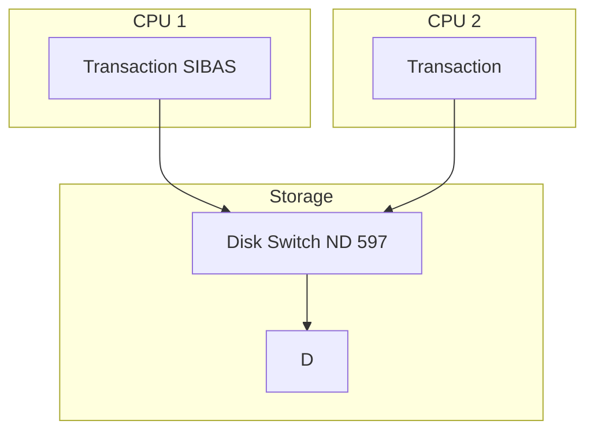
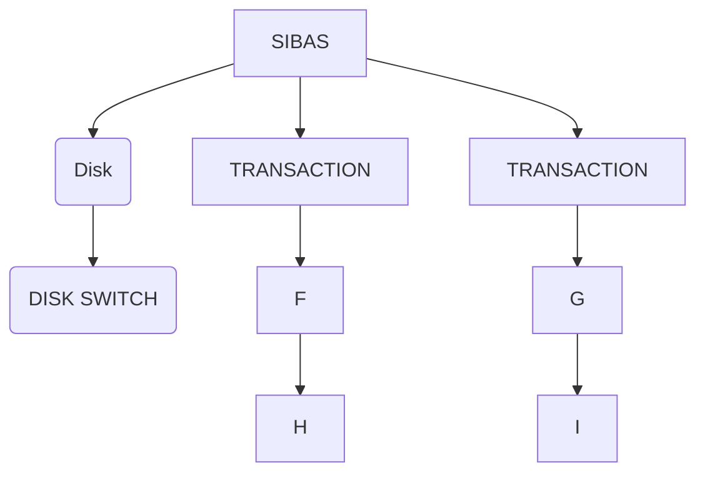

## Page 1

# ND 10197 SIBAS Backend Communication Modules

The ND 10197 SIBAS backend communication modules provide the possibility of letting transaction programs running in one CPU access a database on another CPU and thereby supporting a multi-CPU configuration for:

- Increased load
- Possibility of running in degraded mode in case of error

The communication modules are transparent.

_Fig. 1. 2 CPU SIBAS backend configuration_

Fig. 1 shows a 2 CPU configuration where SIBAS is running on the one CPU and the transactions are running on both CPUs. The performance of the system will give in the area of 1.5 – 1.7 times more transactions/second compared to a single CPU system.

The pictured configuration has two disk drives on the CPU where the database is, and one disk drive on the other CPU. The database disk drive is connected via a disk switch so that it may be switched to the other CPU when taking back-up or if there is error on the database CPU.

The ND 10197 SIBAS backend communication module and a ND 730 HDLC DMA interface or a ND 734 Megalink are required on both CPUs.

10197–A1–6000–0481

---

## Page 2

# 3 CPU SIBAS Backend Configuration

**Fig. 2. 3 CPU SIBAS backend configuration**

Fig. 2 shows a 3 CPU SIBAS backend configuration where 2 transaction CPUs are connected to the same database CPU.

The 3 CPU configuration will have a performance in the area of 2.0 – 2.5 times more transactions compared to a single CPU configuration.

The ND 10197 SIBAS communication module and two ND 730 HDLC DMA interfaces or two ND 734 Megalink are required on the database CPU. The SIBAS communication module and a HDLC DMA interface or Megalink are required on each of the transaction CPUs.

---

**Contact Information**

| City                | Telephone       | Telex                        |
|---------------------|-----------------|------------------------------|
| Bergen              | 05-203290       |                              |
| Sandnes             | 04-656544       |                              |
| Trondheim           | 86-77150        |                              |
| Stockholm           | 08-760-9500     | 13528 nordata s              |
| Gothenburg          | 031-499850      |                              |
| Malmoe              | 040-78015       |                              |
| Copenhagen          | 02-455355       | 37725 nd dk                  |
| Vejen               | 021-241754      | 418730 nda d                 |
| Ferslev-Hvilebaek   | 06-805488       | 385573 nordata fernw         |
| Paris               | 1-42253600      | 3015 nd paris                |
| Newbury (Berkshire) | 0635-341646     | 898919 norsk g               |
| Boston              | 061-737-7945    | 921750 norsk well            |

*Note: NORSK DATA reserves the right to change specifications without given notice!*

---

