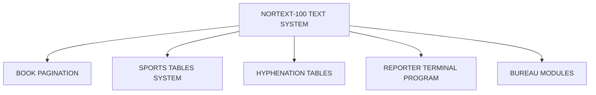

## Page 1

# NORTEXT-100 Book Pagination

**ND-10260 NORTEXT-100 book pagination for ND-110/CX and ND-100/CX**



```
     ND
 COMTEC
DIVISION OF NORSK DATA
```

[Scanned by Jonny Oddene for Sintran Data © 2021]

---

## Page 2

# NORTEXT-100 BOOK PAGINATION

## INTRODUCTION

NORTEXT-100 Book Pagination is a further development of the NORTEXT-100 Text system and covers pagination of large amounts of text (books, manuals, product descriptions etc). The text is divided into pages by a special batch pagination system and these pages can be interactively corrected later.

NORTEXT-100 Book Pagination makes most of the pagination automatically, although certain manual corrections will be necessary in situations involving very complicated typesetting. Users of the NORTEXT-100 Book Pagination have established that there are considerable savings to be made in production time and production costs of books.

## PRODUCT DESCRIPTION

NORTEXT-100 Book Pagination paginates the text, reports any problems and/or errors on a list file. The paginated output may be further improved by interactive inspection and correction to obtain the wanted typographic quality.

The NORTEXT-100 Book Pagination makes it possible to detect and correct errors in pagination working on one or more pages at a time — in contrast to batch-orientated systems, where all text is paginated at the same time. The system is closely connected to an editor, making it possible to edit and paginate parts of the text without having to store it in between.

The NORTEXT-100 Book Pagination system consists of several subsystems:

- **BATCH PG** is the book pagination batch processor. This is the program performing the actual batch pagination using the SINTRAN batch processor. This program is started as a special XCOMmand processor job.

- **DESCRIBE PG** is the book pagination description program. This is used to generate and manipulate book pagination description files i.e. describing the layout of the pages.

- **REGISTER PG** is the book pagination register and contents generation program. This program generates contents and index lists for paginated books.

- **EDITOR PG** is the book pagination editor itself. This program is used when text is entered and during the interactive correction pass.

---

## Page 3

# NORTEXT-100 Book Pagination

## Work Procedure

**Normal work procedure is as follows:**

A text is retrieved and converted to NORTEXT format if necessary.

This text is paginated by a batch processor and the user is notified when the batch pagination is finished. The list file (from the batch process) is inspected to see if and where the text needs any manual intervention.

If manual intervention is needed the Book Pagination Editor (Editor PG) is entered and the corrections are done. This correction is interactive, as the user may paginate a small part of the text only.

When the text part is finished, index and contents list are generated by the Register PG program and added to the book, manual etc.

When the correction pass is over, the text will be sent to typesetting.

## Operations to be Handled

The operations to be handled by the NORTEXT-100 Book Pagination can be divided into three groups: Making the pagination, collecting information and operations on the text when pagination is finished and finally be used by the operator during the interactive correction pass.

The most important tasks of the pagination process are:

- Dividing the text into same sized pages. As an option the Book Pagination system will try to get all pages to be in register. Vertical spacing is active if register leading is turned off.

- Removing orphans.

- Handling of typographical codes in the beginning and the end of the page, including page number

- Handling of typographical codes for blackstep, including sheet number.

- Typography completely restored at the start of each page.

- Chapter transitions in several levels - possibly new page at new chapter. Different handling of main and sub chapters.

## Information Collection

The most information collected to be used during the interactive correction pass is:

- Typographical information such as max spaceband, function code errors, messages from the Hyphenation & Justification program.

- Book pagination information such as "page has not correct height", "page is not fully justified" etc.

- User information written by the user to help himself.

Operations performed when pagination is finished:

- Generating contents and index lists.

- Output (parts of) the text to phototypesetter.

## Requirements

| Code      | Description                                       |
|-----------|---------------------------------------------------|
| ND-10800  | NORTEXT-100 Editor                                |
| ND-10801  | System Tables Maintenance                         |
| ND-10814  | Typographic Tables Maintenance                    |
| ND-325    | Nortext Editing Terminal with Graphic Option (NET)|
| ND-110003 | Black/white Nortext Editing Terminal with Graphic Option (NET) |

## Documentation

NORTEXT-100 Book Pagination  
Reference Manual ................................. ND-61.032.01 EN

**NOTE**: ND COMTEC reserves the right to change specifications without notice.

---

