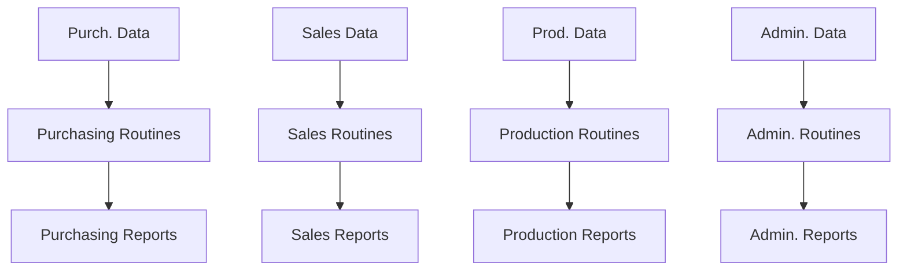
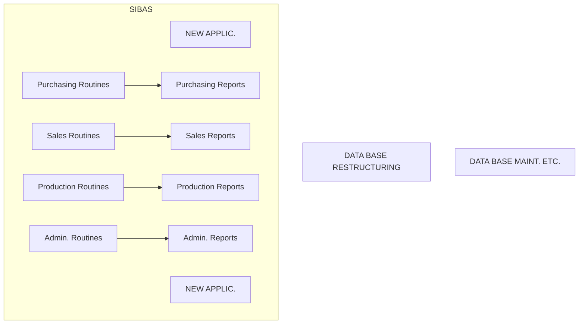
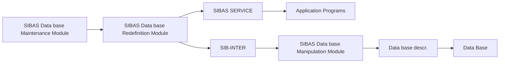
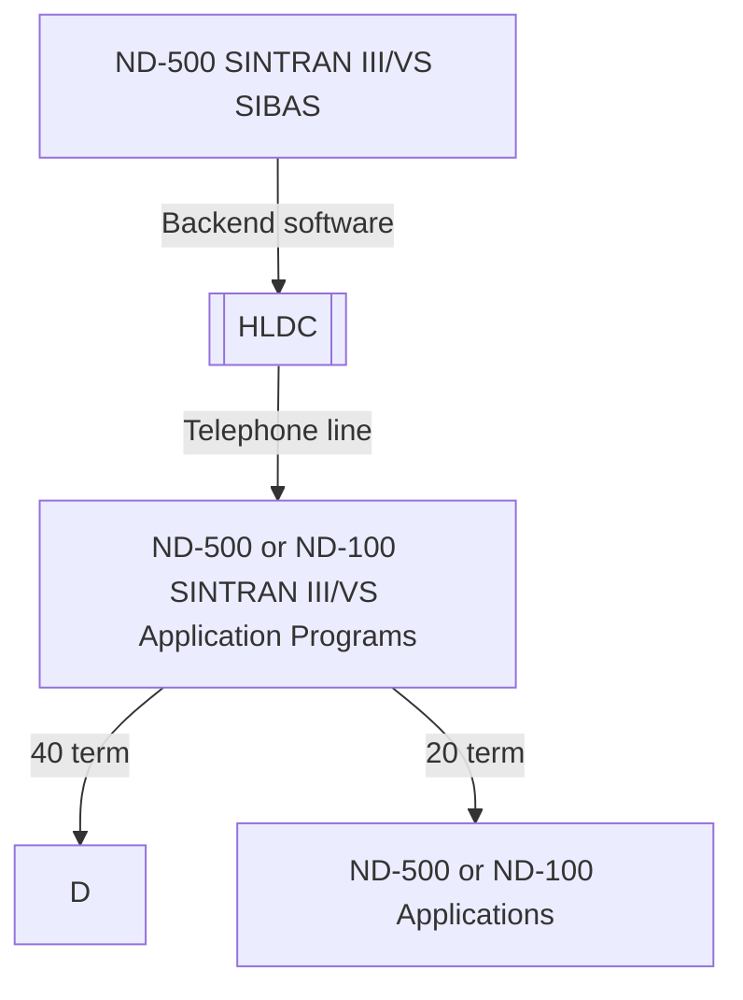

## Page 1

# ND 10340 SIBAS-II DATA BASE SYSTEM

**FOR ND-500 COMPUTERS**

## INTRODUCTION

The SIBAS-II data base system, originally developed by the Central Institute for Industrial Research (CIIR) in Oslo, Norway, is the first full-fledged data base system following the CODASYL DBTG recommendations implemented on a minicomputer.

The system described in this datasheet is identical to systems offered on large computer systems, such as Univac 1100 and IBM 360/370. It has recently been expanded and optimized in a joint development project with the company offering SIBAS-II on large computer systems: A/S Shipping Research Services, Oslo, together with CIIR and NORSK DATA A.S.

The implementation of SIBAS-II on the computers has utilized the advanced facilities of the SINTRAN III/VS Operating System, thus minimizing the amount of additional routines in the programs, and offering multiple user programs simultaneously accessing the same data base in a controlled and secure manner.

## FEATURES

- Offers facilities normally found only on large mainframes with for example IDS, IMS, DMS 1100, and TOTAL
- Designed in accordance with the CODASYL DBTG recommendations
- One of the most advanced and progressive DBM systems available
- Supported and maintained by highly qualified software personnel
- Functions under the powerful SINTRAN III/VS Operating System
- Controls a data base local to own organization running on the own low-cost ND computer system.
- Terminal oriented multi-user access
- Controlled expansion of the data base application via:
  - powerful data base restructuring facilities
  - the hardware modularity offered by ND systems
  - conversational access to data bases
- SIBAS-II on the ND-500 series of computers utilizes their huge address space and fast CPUs.
- Running a data base by means of SIBAS-II on an ND-500 keeps the whole database in virtual memory. No explicit disk transfers are executed. Reduced I/O overhead is thereby achieved.
- If enough physical memory is available on the ND-500, the whole database may actually reside in physical memory.
- On an ND-500 system, SIBAS-II processes can run simultaneously on both the ND-100 and the ND-500 CPU.
- The same data base format as for SIBAS-II on an ND-100 machine, so that it becomes easy to move applications and data bases between the two CPUs.
- Applications running on the ND-100 CPU of an ND-500 system may use both SIBAS-II running on the ND-500 CPU and on the ND-100 CPU.
- Running applications on the ND-500 CPU is the most efficient use of a SIBAS-II ND-500 system. This provides very large space for programs.

10340–A1–6000–0782

---

## Page 2

# The Problems

The increasing complexity and changeability of present day business practices make it essential that good decisions can be reached rapidly and efficiently. Managers rely more and more on suitable input to the decision-making process provided by computerized data management systems.

Unfortunately, many computerized information systems are based on a software technology now ten to fifteen years old. This technology does not effectively use the capabilities offered by direct access storage. In addition many systems have been structured such that even simple modifications to the system are expensive and time-consuming. The increasing need for on-line access to the data requires that the data be correctly but flexibly structured and stored in direct access storage, and that it can be accessed in many different ways.

# The Data Base Concept — What It Means

An increasing number of organizations are realizing the advantages of database management systems as fundamental tools for data processing applications. The traditional file handling systems were application oriented and static in data handling concepts.

They provided a direct link between a specific file of data and an application program designed to handle this file only. As a rule, the data in one set of files for one set of programs was not available for other sets of programs. To the user, only "his data" were accessible.

In contrast, today's data base management systems must handle data storage and retrieval requirements of a constantly changing environment; they must be data oriented, not application oriented.

The database in itself is an independent information resource, separated from the application programs. Consequently, a company's database should be structured and managed so that it constitutes a resource to be drawn upon by the whole community of users.

Thus, the concept of a database system may be defined as the collection and administration of integrated and structured data, designed to serve the changing information requirements of a group of users.

A good database management system should offer the following capabilities:

- Flexible database structuring in direct access storage
- Many possible access paths to and through the database
- Preservation of database integrity in a concurrent processing environment
- Control over unauthorized access to the data
- Data independence — the ability to modify and enhance the application programs
- Several high-level programming languages for the application programs

# File Handling Routines





# SIBAS-II — The Solution

NORSK DATA offers the SIBAS-II Database Management System which provides all the above capabilities in one compact, easy-to-use software package.

SIBAS-II is a general database management system which

- offers complete separation of the Data Description Language (DDL) and the Data Manipulation Language (DML)
- allows several access paths to records, enabling different application programs to use stored information as required

---

## Page 3

# SIBAS-II Features

- Includes a powerful restructuring facility which allows the data base to be redefined for expansion, deletion and modification.
- Establishes a central SIBAS-II user group for user contact.
- Is programmed in FORTRAN, and implemented on several other systems in addition to ND systems.
- Reflects the data structure as it usually appears to the user. Flexible structuring facilities in SIBAS-II minimize data redundancy.
- Allows application programs to be written in several programming languages such as FORTRAN, COBOL, PLANC and Assembly.
- Is generally applicable for various types of industries, organizations, governmental activities, etc.
- Handles multi-user concurrent processing.

The portability of SIBAS-II is particularly suited for implementation of a distributed database system. The databases are physically located at different sites and implemented upon different computers which together form a network with some kind of communication facilities.

The SINTRAN III/VS Operating System has built-in facilities for machine communication between ND computers. Distributed databases are easily implemented using ND computer systems.

In some cases where on-line, multi-terminal access to a data base is desirable, locally managed databases can be a practical solution.

SIBAS-II follows CODASYL recommendations for a database system, except where deviation has provided improved data independence and structuring facilities.

# Application Areas

SIBAS-II is being used or is under implementation by many European governmental and commercial organizations.

Application areas include:

- **Shipbuilding**: Material purchasing / steel purchasing / long range capacity planning / cost analysis
- **Mechanical Industry**: Production planning / production control
- **Education/Research**: Information analysis
- **Government Administration**: Budgets / economy
- **Banking**: "In-house" enquiry system
- **Environment Control**: Pollution of fjords / disposal of solid refuse
- **Oil Business**: Management information systems
- **Health Service**: Hospital medication control / national health service
- **Local Government Administration**: Map digitalization / location of sewers / municipal water pipes and communication cables / surveying, road lay-out profiles

# SIBAS-II — Structuring Concepts

## Location Modes

In SIBAS-II, various ways exist to structure a database. Identifying the basic types of records which make up the database is vital. For example, in a typical marketing company, the following six record types might be necessary:

- Customer
- Product
- Branch office
- Supplier
- Sales order
- Purchase order

## Primary Keys

In the case of CALC, the primary key item is used when storing the record. Choice of CALC implies randomizing or hashing to distribute the records across part of the database. Choice of SERIAL location mode implies records will be stored serially in the realm, dependent only on time of arrival. Primary keys may be designated as permitting or prohibiting duplicate values.

---

## Page 4

# Secondary Keys

The user may define one or more keys which are called search keys or secondary keys. Each key may be chosen as one or more items in the record type. An example of two record types with CALC keys and secondary indexes is illustrated below:

All indexes will be stored in ascending order on the index key. In this example, this implies that the branch records could be processed in alphabetical order of the TOWN, and the customer record in alphabetical order of NAME or ADDRESS.

```
Primary Calc.    Secondary
+-------------+-------------+
|  BRANCH ID  |    TOWN     |
+-------------+-------------+
   BRANCH RECORD
```

```
Primary Calc.    Secondary    Secondary
+-------------+-------------+------------------+
| CUSTOMER ID |    NAME     | ADDRESS STREET   |
+-------------+-------------+------------------+
   CUSTOMER RECORD
```

# Primary and Secondary Indexes

The user may define as many indexes as desired on each record type. Each secondary index is built up and maintained in the same way as a primary index, and all indexes are automatically maintained by the system when the database is updated.

# Set Types

In addition to the facility for defining indexes, the CODASYL idea of defining relationships between record types and sets is fully supported in SIBAS-II.

In SIBAS-II, there are three classes of set types:

1. Single-member set type
2. Multi-member set type
3. Involuted set type

A single member set type is the class which would be most frequently used and is effectively a relationship between two record types, as illustrated in the following figure. One record type, in this case BRANCH-OFFICE, is identified as the owner of the set type and the other is then the member set type.

```
     +-------------+
     | BRANCH      |
     | OFFICE      |
     +-------------+
         |
       HANDLES
         |
     +-------------+
     | CUSTOMER    |
     +-------------+
```

A multi-member set type is basically similar to a single member set type, except that instead of one member record type there are two or more. If a branch office in the marketing company marketed only certain of the company's products, then this situation could be illustrated as follows:

```
   +--------------+
   | BRANCH       |
   | OFFICE       |
   +--------------+
      /       \
     /         \
+---------+   +---------+
| PRODUCT |   | CUSTOMER |
+---------+   +---------+
```

It should be observed that this situation could alternatively be handled by defining two separate single member set types. The SIBAS-II user has complete flexibility in this respect. Furthermore, SIBAS-II supports a class of set types which is felt to be very valuable in many applications and is included in the CODASYL recommendations. This is called an involuted set type and means that there may be a relationship between a record type and itself, i.e., a hierarchy. This is valuable, for example, in a bill of material application where parts are made up of other parts. This is illustrated graphically as follows:

```
+------+
| PARTS|
+------+----+
          USES
```

SIBAS-II does not support the CODASYL facility for sorted sets, which can be very time consuming when records are stored. Instead, SIBAS-II secondary indexes provide a similar facility since the indexes are always maintained in sorted sequence of the key. Or one can define manually maintained sets where the insertion of a new member is under the control of the application programmer.

In the above figures, each rectangle represents a record type. In the SIBAS-II database, there would be several occurrences of this set type. One occurrence of a set type is usually referred to as a set. There would in fact be as many sets of the type HANDLES as there are occurrences of the record type BRANCH-OFFICE. Three sets of this type are illustrated below where each circle is an occurrence of a record.

```
      o
      |
+-------------+
| BRANCH      |
| OFFICE      |
+-------------+
      |
      o
      |
+-------------+
| CUSTOMER    |
+-------------+
```

[Photo: Jonny Oddene for Sintran Data © 2010]

---

## Page 5

# SIBAS-II DATA MANIPULATION FACILITIES

The flexibility for structuring a SIBAS-II data base is matched by the facilities provided for processing the data in the data base.

SIBAS-II is a host language data base management system, which means that facilities have been added to standard programming languages, such as COBOL and FORTRAN, to enable the application programs to manipulate the data in the data base.

Following the CODASYL recommendations, these facilities are collectively referred to as the data manipulation language. The SIBAS-II facilities are based on those proposed by CODASYL while certain modifications have been made which enable the user to ensure a fuller degree of data independence.

Access to a SIBAS-II Database is essentially "direct" access, because the whole data base is stored in direct access storage. Access to a data record can come from "out of the blue" using an index (primary or secondary) or the CALC algorithm. Or access can be made relative to a recently found record. This kind of access may use either an index or a set type relationship.

## "Out of the Blue" Access

An "out of the blue" access requires the user to provide the value of either a primary key or a secondary key, as well as identifying the type of record to be retrieved. The system searches the data base to see whether the record type sought can be found. If there are several records with the same value of the key, the first of these is retrieved. The user can subsequently access the others using a relative access.

## Relative Access

```
  ┌─────────────┐      ┌──────────────┐
  │   REALM     │      │    REALM     │
  │ Owner of set│      │ Members of set│
  │ ┌─────────┐ │      │ ┌──────────┐ │
  │ │ RECORD  │ │      │ │ RECORD   │ │
  │ └─────────┘ │      │ └──────────┘ │
  │ ┌─────────┐ │      │ ┌──────────┐ │
  │ │ RECORD  │ │      │ │ RECORD   │ │
  │ └─────────┘ │      │ └──────────┘ │
  └─────────────┘      └──────────────┘
          NAMED SET
```

Relative access is used to locate a record relative to a record already found. The types of relative access are:

- set member relative to set owner
- set member relative to another set member
- set owner relative to a set member
- record with a duplicate value of the access key relative to another record with the same value of the key

## Chains

Each set is represented in storage by what is usually referred to as a chain. SIBAS-II allows the user to make a choice for each set type between uni-directional chains and bi-directional chains, as illustrated.

```
     Oslo               Oslo
   ┌───────┐         ┌───────┐
   │ Olsen │         │ Olsen │
   └─┬───┬─┘         └─┬───┬─┘
     │   │             │   │
┌────┘   └────┐     ┌──┘   └──┐
│   Jensen    │     │   Jensen│
└─────────────┘     └─────────┘

LINK TO NEXT ONLY        LINK TO NEXT AND PRIOR
  (uni-directional)         (bi-directional)
```

```
    Oslo                New York                London
   ┌───────┐            ┌───────┐              ┌───────┐
   │ Olsen │            │ Jones │              │ Grey  │
   └─┬───┬─┘            └─┬───┬─┘              └─┬───┬─┘
     │   │                │   │                  │   │
┌────┘   └────┐       ┌───┘   └──┐         ┌────┘   └────┐
│             │       │          │         │             │
│   Jensen    │       │   Smith  │         │    Cooke    │
└─────────────┘       └──────────┘         └─────────────┘
```

In a real application, there may be several hundred sets, and each set may have several thousand CUSTOMER records connected to it.

---

## Page 6

# SIBAS-II — Concurrent Processing

In SIBAS-II, several run-units may be processing the same data base concurrently. The CODASYL word "run-unit" is adopted to identify the fact that the same program may be executed by several users simultaneously with different parameter values. Each "executing instance" of the program is called a run-unit.

In SIBAS-II, as in the CODASYL proposal, a data base is divided into a number of "realms". A user must signify his intention of processing the records in a realm and at the same time declare a usage mode. SIBAS-II supports the following usage modes:
- Retrieval
- Load
- Up-date

and the following protection modes:
- Non Exclusive Up-date
- Exclusive Up-date

These protection modes can be applied at both the realm level and the record level.

In addition, all the records that a given run-unit is currently processing are in so-called EXTENDED MONITOR MODE. Any action by concurrent run-units which may affect the given run-unit’s records is noted, and the information passed to the given run-unit as necessary. Individual records in EXTENDED MONITOR MODE may be LOCKED, preventing concurrent run-unit to access them.

# SIBAS-II — Privacy

1. Database level.  
   Password on the data base.

2. Record occurrence level.

SIBAS-II supports occurrence level privacy locks. This means that an item in a record may be identified as a privacy lock and the user must give the correct value of the item when attempting to retrieve the record. This simple device enables the customer to define an effective control over the access to individual records.

```
SECRET  ITEM     ITEM


    🔒
```

# SIBAS-II — Restructuring

Considerable attention has been given in the design of SIBAS-II to the importance of restructuring a data base by adding any of the following:
- New items to existing record types
- New record types
- New set types
- New indexes

Furthermore, it is possible to delete items, record types, set types and indexes. In all cases care must always be taken to ensure that all users of the data are aware of, and in agreement with, the changes.

The ability to restructure a data base is of particular importance when:
- New applications require new data or new structuring of existing data
- Existing data and data structures become obsolete
- The amount of data to be stored in the data base grows larger than anticipated, leading to low performance and poor economy

The advantages to the user of the restructuring facility are several:
- It obviates the need for dumping the data, redefining the whole data base and reloading the old data
- It simplifies the task of designing the original data base, as it is not crucial that all possible future requirements are taken into consideration
- The development of a data base can be done in steps. A simple system may be expanded and changed without prohibitive expenses in time and money

# SIBAS II Maintenance

This module makes possible the definition and changing of passwords, the printing of the contents of the data base, the unloading/loading of a data base from SINTRAN-III files and the regeneration and verification of the data base.
- Load/Unload.
- Verify.
- Regenerate.

# SIBAS-II — Logging and Recovery

## Routine Logging

The routine log is essentially a sequential file where the SIBAS-II input packets (calls) are recorded before they are processed. SIBAS-II output packets are also recorded. Routine logging is specified in the starting procedure of SIBAS-II and provides a simple and robust reprocessing mechanism.

When routine logging is on, SIBAS-II input packets are written on the log file. In case of breakdown, this log file can be used in conjunction with a back-up copy of the data base or a rolled back data base, to reprocess the input to SIBAS-II and bring the data base to a state just before the breakdown occurred.

---

## Page 7

# BEFORE IMAGE LOGGING

The before image logging may be turned on when SIBAS-II is started. The before image log will contain a copy of all changed pages as they looked before the change. The before image log may be used to roll the database back to a checkpoint where it is consistent. Together with the routine log it gives a fast and simple way of recovering the database without using a backup copy of the database.

# CHECKPOINTS

Checkpoints are taken automatically when the database is closed physically, i.e. when the last run unit closes the database. In addition, checkpoints may be defined to be taken as a function of the length of the log or they may be initiated from user programs by using a call.

# SIBAS – Operational

SIBAS-II has been implemented on ND-100 and 500 series of computers under the SINTRAN III/VS Operating System, on IBM 360/370 series under OS, on the Univac 1100 series under Exec 8, and on CYBER 170 under NOS/BE. On the ND-500/SINTRAN III/VS Computer Systems, SIBAS-II may be used in a multiuser, multicomputer environment. In 1982 SIBAS runs on 300 ND CPUs.

---

## SIBAS-II Modules



## An Example: Multi-Computer Configuration/Distributed Dataprocessing



---

## The SIBAS-II Data base Definition/Redefinition Module

The SIBAS-II Data base Definition/Redefinition Module is used for defining and redefining a database, i.e. defining the structure, the access keys and the size of the database, or redefining the structure of an already existing database.

## The SIBAS-II Data base Manipulation Module

The SIBAS-II Data base Manipulation Module is called from the application programs for storing, reading, modifying, and deleting of information in the database.

## The SIBAS-II Data base Maintenance Module

The SIBAS-II Data base Maintenance Module contains possibilities for defining and changing passwords, printing the contents of the database, unloading/loading a database from SINTRAN III files, regenerating and verifying the database base.

## The SIBAS Service Program

The SIBAS Service Program helps the user monitor and control a SIBAS-II process.

## The SIBINTER

The SIBINTER gives the possibility of using a database without writing any application programs.

## The SIBAS-II data base system

The SIBAS-II data base system runs under the SINTRAN III/VS Operating System. Utilization of the communication facilities in ND-100 and ND-500/SINTRAN III/VS and the SIBAS Backend communication software (ND-10197) makes it possible to run the application programs and SIBAS-II on several connected ND systems for greater security and reduced load on each CPU.

## Documentation

SIBAS-II User’s Manual ........................ ND-60.127

---

## Page 8

# Contact Information

## Norsk Data

```
         ND
-------------------
     Norsk Data
```

- Olav Helsets vei 5  
  Boks 25 Bogerud  
  Oslo 6  
  Oslo 6  
  Tel.: 02-245040   
  Tlx: 12884 nd  
  Telefax: 02-295617

- Oslo, tel. 02-393030, tlx. 18661 nd n  
- Bergen, tel. 05-220294  
- Sandnes, tel. 043-65654  
- Tromsø, tel. 083-77196  
- Stockholm, tel. 086-69000, tix. 15255 nordata s  
- Gothenburg, tel. 031-496760  
- Malmö, tel. 0401-59760  

- Copenhagen, tel. 02-252065, tix. 37765 nd dk  
- Wiesbaden, tel. 0611-7451, tix. 4186370 ndna  
- Ferrøy-Velhafn, tel. 050-20655, tix. 386355 nordata ferrv  
- Paris, tel. 1-6823566, tix. 201108 nd paris  
- Lyon, tel. 78-37 47 11, fx. 837159 nd  
- Newbury, tel. 0635/34165, tix. 849819 norskd g  
- Boston, tel. (617) 237-7945, tix. 927140 norsk well

## Comtec - Division of Norsk Data

```
          ND
-------------------
       COMTEC
  DIVISION OF NORSK DATA
```

- Jernkoveien 29  
  Boks 4 Lindberg gård  
  Oslo 10  
  Tel.: 02-900390  
  Tlx: 18661 nd  
  Telefax: 02-390427  

- Trondheim, tel. 075-16620, tix. 55580 comt n  
- Stockholm, tel. 0760-84010, tix. 15255 nordata s  
- Odense, tel. 95-17540-40, tix. 56980 comtec dk  
- Düsseldorf, tel. 0211-666388, tix. 857277 comt d

**NOTE**: NORSK DATA reserves the right to change specifications without notice.

---

