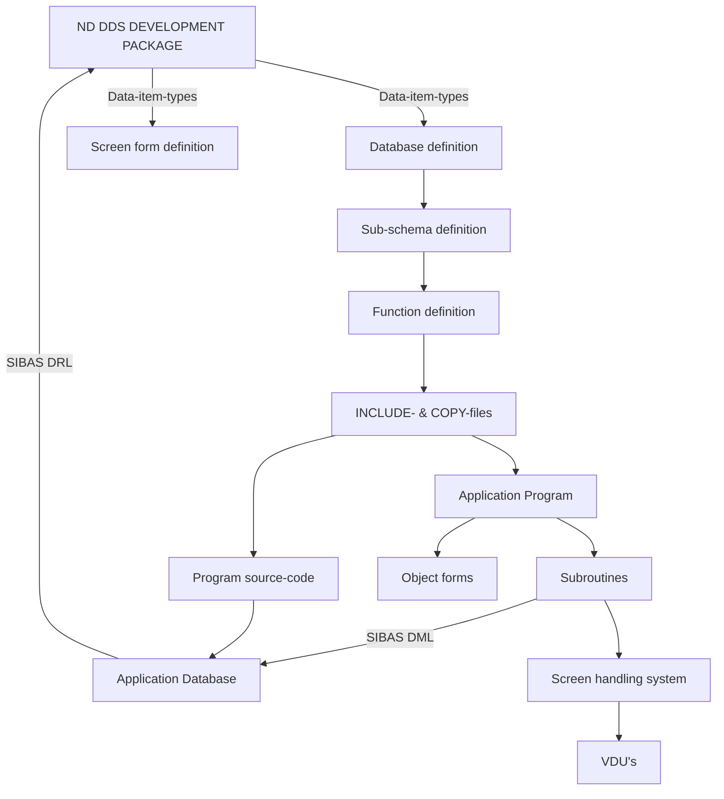

## Page 1

# ND 10371 ND Data Dictionary System

## INTRODUCTION

The ND Data Dictionary System (ND DDS) is primarily developed to achieve secure and fast development and maintenance of application programs with corresponding SIBAS databases and/or screen forms.

### ND-DDS SUBROUTINE PACKAGE

- **Subroutines**
- **Screen handling system**
- **VDU's**
- **Program source-code**
- **Application Program**

---

## Page 2

# Product Summary

- **Dictionary Entity Types:**
  - data-item types
  - databases
  - files
  - realms
  - database items
  - database groups
  - database sets
  - database indexes
  - forms
  - form fields
  - database sub schemas
  - modules/programs/routines
  - systems
- **Source Language and Structural Description**
  - Data stored on a SIBAS database
  - Written in FORTRAN
  - On-line system
  - Modular structure
  - Menu-oriented and -driven
- **Input Formats**
  - Preformatted forms (screen pictures)
- **Data Security**
  - ALL SIBAS security provided, i.e., database recovery

# Features

- Reduces application program development and maintenance time for programs written in FORTRAN and COBOL
- Relieves the system analyst and programmer from declaring data item formats every time they are needed
- Simplifies definition and redefinition of databases and forms
- Ensures data definition consistency in all application programs, databases, and forms
- Automatic generation of TPS consistent program code in FORTRAN INCLUDE- and COBOL COPY-files.

  These files contain:
  - variable declaration and value initiation for SIBAS and forms
  - calls for opening database and realms if specified
- Subroutines to simplify communication between application programs, databases, and forms
- Subroutines to take care of the transfer of data from SIBAS- to form-buffers and vice versa
- **«SIBAS>» approach in reading/writing from/to forms

# Product Description

The ND DDS is written in FORTRAN and uses a SIBAS II database for storage of data and NSHS for communication with the screen. The SIBAS database, which contains the data for the ND DDS, can be manipulated by the user in the same way as any other SIBAS database. Consequently, the user may write his/her own application programs to retrieve or update the ND DDS database. Any ND DDS database which has been manipulated by the user's own application programs or SIBENTEN, will of course be the user's responsibility.

Tests show that using the ND DDS for screen form generation, for database definition and initiation, as well as for programming of application programs, reduces man hour and machine costs by at least 50%.

The ND DDS consists of 2 parts:
1) an interactive system for the definition of data item types, databases, screen forms, database sub-schemas, functions and generation of FORTRAN INCLUDE- and COBOL COPY-files and files for initiation and redefinition of SIBAS databases.

2) subroutines called by the application programs to take care of communication with SIBAS and screen and transfer of data between SIBAS and screen-buffers.

# How ND DDS May Be Used in Application Program Development

1. Define and format data-item-types. The data-item-type format will guarantee that the data-item-type will be format consistent in all screen forms, database and application programs.
   
2. On-line definition of application database(s). When an item is defined, the data-item-type is referred to. When parts of, or the whole database has been defined, ND DDS will on command produce a database initiation file to be input to SIBAS-DRL.

3. On-line creation of screen forms. The screen forms will have the same screen layout when used in application programs as they have during definition. Every field in a screen form must have a reference either to an item in a database or to a data-item-type. You may define one or more record types in your screen-form, and every record type may have one or more occurrences. Therefore a screen form is, in its concept, a database with realms, records and items, and the application program consequently navigates — by means of the ND DDS subroutines — within a screen form as if it were a database. This approach simplifies the application program's navigation within a screen form.

4. On-line definition of sub-schemas, i.e. which part of a database is to be used in a specific application program.

5. On-line definition of functions, i.e. which sub-schemas are to be connected to which screen forms.

6. On-line creation of FORTRAN INCLUDE- and/or COBOL COPY-files with data definitions and value assignments for use in application programs.

7. Initiate or redefine your SIBAS database with the SIBAS-DRL file produced by ND DDS.

8. Compilation and loading of FORTRAN and COBOL application programs which use the INCLUDE- or COPY-files and call the subroutines in ND DDS to take care of the transfer of data between screen form, application program and database.

# How ND DDS May Be Used in Application Program Maintenance

The ND DDS is as likely to be effective in application program maintenance as it is in application program development. A trivial task like the changing of the format of a data item used in databases, screen forms and application programs could be taken as an example.

Without the ND DDS the following actions must be performed to execute the change:
- Find out which application programs, databases and screen forms use the data item (do we have an updated cross-reference list?)
- Modify all screen forms which contain the data item
- Recompile all screen forms which contain the data item
- Write input cards for SIBAS-DRL for all the affected databases
- Redefine all the affected databases
- Modify all application programs and/or INCLUDE- and COPY-files
- Compile and load all affected application programs

With ND DDS only the following steps are necessary:
- Change the data item in ND DDS

---

## Page 3

### Command ND DDS

- Recompile all screen forms with changed data items
- Generate database redefinition cards for SIBAS DRL for all databases with changed data items since last redefinition
- Generate new INCLUDE- and COPY-files for all affected functions

- Redefine all the affected databases
- Compile and load all the affected application programs

### Software Requirements

- ND-10166 SIBAS-II
- ND-10023/ND-10033 FORTRAN
- ND-10013 NSHS

### References

ND DDS Reference Manual ............... ND-60.162

---

## Page 4

# Contact Information

### Norsk Data

| Location      | Contact                                                                 |
|---------------|-------------------------------------------------------------------------|
| Oslo          | Tel. 02-309030, Tlx. 18661 nd n                                         |
| Bergen        | Tel. 05-202900                                                          |
| Sandnes       | Tel. 04-667580                                                          |
| Tromsø        | Tel. 083-71656                                                          |
| Stockholm     | Tel. 070-29000, Tlx. 15255 nordata s                                    |
| Gothenburg    | Tel. 031-496760                                                         |
| Malmö         | Tel. 040-10055                                                          |
| Copenhagen    | Tel. 02-425055, Tlx. 37275 nd dk                                        | 
| Århus         | Tel. 06-210655                                                          |
| Wiesbaden     | Tel. 06127-7641, Tlx. 4186370 noda n                                    |
| Ferney-Voltaire| Tel. 050-406576, Tlx. 385265 norda rdtafem v                          |
| Paris         | Tel. 1-6032656, Tlx. 201080 nd paris                                    |
| Lausanne      | Tel. 021-252122, Tlx. 26124 nd ch                                       |
| London        | Tel. 01-737-2397, Tlx. 8975395                                          |
| Newbury       | Tel. 0635-41545, Tlx. 848419 norsk g                                    |
| Utrecht       | Tel. 03480-86744                                                        |
| Boston        | Tel. (617) 237-7945, Tlx. 921740 norsk well                             |

### COMTEC - Division of Norsk Data

| Location      | Contact                                                                 |
|---------------|-------------------------------------------------------------------------|
| Trondheim     | Tel. 075-16520, Tlx. 55580 comtec n                                     |
| Stockholm     | Tel. 070-84100, Tlx. 15255 nordata s                                    |
| Odense        | Tel. 09-157440, Tlx. 59660 comtec dk                                    |
| Düsseldorf    | Tel. 0211-666388, Tlx. 8587277 comtd d                                  |

### Addresses

**Norsk Data:**

Olav Helses vei 5  
Boks 25 Bogerud  
Oslo 6  

| Tel.   | Telefax          |
|--------|------------------|
| 02-295400 | 02-295617     |

**COMTEC:**

Jerikoveien 20  
Boks 4 Lindeberg gård  
Oslo 10  

| Tel.          | Telefax          |
|---------------|------------------|
| 02-309030     | 02-309247        |

> **NOTE:** NORSK DATA reserves the right to change specifications without notice.

---

