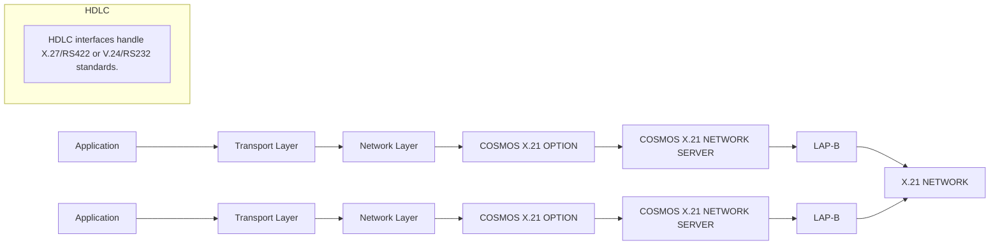

## Page 1

# Software Communications

## ND 10403 COSMOS X.21 OPTION (using HDLC-DMA)

## Introduction

COSMOS is Norsk Data's distributed communications environment. It provides communication and application services to augment the services offered by SINTRAN III to its users.

The COSMOS X.21 option allows the use of an X.21 based circuit-switching network as a transmission medium under COSMOS. The X.21 Network server (X21NS) functions as a bridge between two IS-XMSG entities in the COSMOS Network Layer.

The X21NS is invisible to all COSMOS users/user programs. This means that no changes are required in user procedures when the X21 Option is added to an already operational COSMOS Network.

## Features

- Translation of COSMOS Network Addresses to X.21 DTE numbers and vice versa. Cosmos Network users/user programs need not know anything about DTE numbers. They are defined by the System Supervisor during system startup.
  
- Cost Optimization. The cost of using a circuit-switched network depends on the duration of the established connections. The X21NS minimizes costs by clearing connection(s) when there is no data to send. It automatically re-establishes the connection(s) when needed.
  
- Multiple connections. The COSMOS X.21 Network Server can handle multiple connections to the X.21 network, with or without group number.

- Check the identity of the Calling DTE to ensure authorized access only.
  
- Direct call. This will minimize the time used to establish a connection.
  
- Accumulation of accounting information to keep track of the costs of using the X-21 network.

- Standard configuration with up to 4 connections to the X-21 network.

- COSMOS X.21 Option will support transmission speed at any rate supported by the public X.21 network.

- Some X.21 network services offered by the PTT do not need any support from the X21NS. This means that they are invisible to the X21NS, and that the user is free to utilise these options. For example:
  - Closed user group(s)
  - Incoming (outgoing) (international) call barred
  - Redirection of calls

10403-7000-1184

Scanned by Jonny Oddene for Sintran Data © 2021

---

## Page 2

# Product Description

The X.21 Network Server uses a simple network protocol to control the establishment and orderly release of connections. The protocol also detects and rectifies possible duplicates that may occur during link reset at the link level.

At the link level, standard LAP-B from X.25 is used. First the X.21 connection is established. When this phase is completed, the logical link at the link level is connected. From then on, full duplex data exchange can take place. The data exchanged consists of IS-XMSG Network Protocol Data Units (NPDUs). When the connection is no longer needed (long or short term), the logical link is disconnected at the link level and the X.21 connection is cleared. Be aware of the restrictions imposed by the circuit-switched network itself. When all the connections to the X.21 network are in use, calling DTEs have to wait until one(if group number)/the specific connection called is cleared.

# Requirements

- **ND 730 HDLC Interface (DMA)** One interface for each connection to the X.21 network.
- **SINTRAN III generated with the proper number of HDLCs and X.21 lines.** (The number of HDLCs used to local communication + the number of HDLCs used to X.21 communication. In addition, the number of X.21 lines has to be generated. SINTRAN will establish the relation between the X.21 datafield and the proper HDLC interface when COSMOS X.21 Option is started.)
- **ND 10374 COSMOS Basic Module.**
- To utilize the identity checking, the additional service «Calling Line Identification» supported by the X.21 network must be ordered from the PTT.
- If the Direct Call option is to be used, this must also be ordered from the PTT.
- Modem supported by the PTT has to be a DCE-X type modem.

# Documentation

COSMOS X.21 Option Operator Guide .......... ND-30.033

### Related Manuals:

| Manual                                   | Reference Code |
|------------------------------------------|----------------|
| SINTRAN III Reference Manual             | ND-60.128      |
| SINTRAN III System Supervisor            | ND-60.103      |
| COSMOS Operator's Guide                  | ND-30.025      |
| COSMOS User's Guide                      | ND-60.163      |

---

