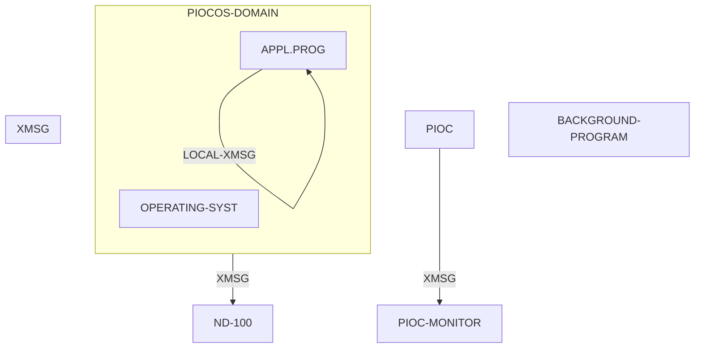

## Page 1

# ND 10493 PIOC Basic Software

## INTRODUCTION

The ND 10493 PIOC basic software includes the real-time multiprogramming operating system for PIOC (PIOCOS) and the PIOC monitor. The PIOC monitor runs in the ND-100 computer as a background program. The monitor has a debugger function, which allows breakpoints, inspections, and modification of the PIOC memory from a ND-100 terminal. The software environment of PIOC may be viewed as a domain. All individual programs, including the PIOCOS, must be linked together to form this domain.

## FEATURES

PIOCOS is the operating system for PIOC. This is a real-time, multiprogramming operating environment. The operating features supported by PIOCOS are the following:

- Process initiation and scheduling
- Interprocess communication and synchronisation
- Timing
- Exception handling
- Dynamic process control
- ND-100 communications

## PRODUCT DESCRIPTION

The PIOC and the ND-100 operate in a common memory. This memory must be allocated as a contiguous 64 K/256 K word segment in SINTRAN III. The RT-loader or the FIX Command in SINTRAN III is used to define this contiguous memory segment. The PIOC monitor in the ND-100 is responsible for the loading, supervision and control of the PIOC. A specific monitor call is available in SITRAN III which is used by the PIOC monitor to communicate with the PIOC.

A subset of the XMSG message system of SINTRAN III is implemented in PIOCOS. Process communications and synchronisation of their activities are performed through messages, which are transmitted and received over ports. Application programs are written in MC68-PLANC and/or assembler language. The relocatable code of these programs is linked together with PIOCOS by the ND linkage-loader (NLL), to form a domain. This domain is loaded in PIOC by the SINTRAN III PIOC monitor calls or by the PIOC monitor.

In addition to PIOC basic software, two other software products are available for PIOC, namely:

- MC68-PLANC compiler on the ND-100 for generating MC 68000 code. Assembler codes may be inserted in the MC68-PLANC source language. This also includes the runtime system (ND 10491).

- ND linkage-loader for building PIOC memory image on the ND-100 file (segment) for loading into PIOC (ND 10319).

## DIAGRAM

*Interactions of the ND 10493 PIOC Basic Software*

## REQUIREMENTS

- ND-100 Computer systems
- SINTRAN III version I or higher
- SINTRAN III RT loader

## DOCUMENTATION

PIOC Software Guide .........................................ND-60.161

10493-7000-1284

*[Scanned by Jonny Oddene for Sintran Data © 2021]*

---

