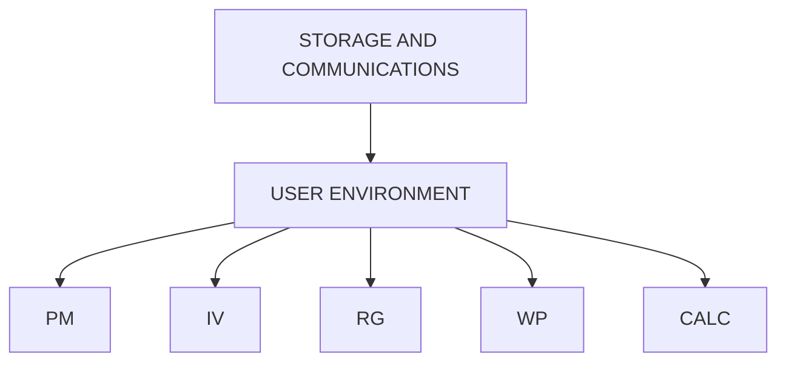

## Page 1

# ND 10530 NOTIS-CALC for ND 100  
# ND 10716 NOTIS-CALC for ND 500

**Norsk Data**

---

## INTRODUCTION

NOTIS-CALC is a product in Norsk Data's NOTIS integrated office support system. NOTIS-CALC is a spreadsheet program which may be used for the rapid development and maintenance of budgets, simulations, forecasting, financial models, and many other applications.

NOTIS-CALC is a true end-user product. A new user may become easily acquainted with NOTIS-CALC by reading the well designed documentation, or attending a short course at one of Norsk Data's Educational centers. The knowledge required about computers in general, or ND computers specifically, is very limited.

NOTIS-CALC contains an extensive, well structured HELP facility. This allows the user access to both general information about NOTIS-CALC and specific assistance during the execution of NOTIS-CALC commands.

The NOTIS-CALC worksheet consists of a grid of rows and columns. The intersection of each row and column is called a cell.

Each cell may contain either text or an expression. Such an expression may contain numbers, arithmetic operators (+ - * /), references to other cells, functions, or any combination of these.

There are two types of NOTIS-CALC functions: Financial functions, e.g. internal rate of return, future value and annuity payment; and general functions, e.g. maximum, mean and square root.

The basic principle of NOTIS-CALC, as with other spreadsheets, is that each cell contains a value which is either keyed in directly, or is calculated using the values of other cells.

Some of the new features available in the current version of NOTIS-CALC are:

- Cells and areas may be IMPORTED from other sheets
- Business Graphics generation
- Commercial and scientific numeric notation
- Input from any ASCII file
- Automatic calculation may be turned off
- Global and local structured HELP facility

NOTIS-CALC is available in English, Norwegian, French, German, Swedish, and Danish versions. Other language versions may be made available on request.

---

```
[ND Logo]
```

```
[Photo: Computer monitor with a spreadsheet interface]
```

- ND NORSK DATA

---

10530/10716.7000-0685

Scanned by Jonny Oddene for Sintran Data © 2021

---

## Page 2

# Features

## General

- Simple command structure. Single key commands make full use of the NOTIS terminal’s keyboard facilities.
- NOTIS-CALC uses the same keyboard and command conventions as other NOTIS products, as far as these are applicable.
- PRINT directly to a local EPSON printer, to a line-printer or text printer, or to a text file for inclusion in a NOTIS-WP document.
- National language keyboard and program versions.
- Extensive structured HELP facility. General information about NOTIS-CALC and information specific to the command being executed.
- Audio warning on illegal input.
- Processing of spreadsheets resident on other computers via the ND COSMOS network.
- Recalculation of a NOTIS-CALC spreadsheet is normally automatic. In cases consisting of large numbers of heavy calculations, this feature may be turned off. In this case recalculation occurs when the user requests it.

## Integration

- Areas and cells may be EXPORTED from one sheet and IMPORTED by another. The values of the areas/cells are imported from their worksheets when the importing sheet is read.
- BUSINESS GRAPHICS charts displaying data in a worksheet may be created. NOTIS-CALC produces chart files which may then be drawn using NOTIS-BG. The charts may be PIE, BAR or LINE. NOTIS-BG may draw these charts on the NOTIS terminal with graphics option, and on ND printers ND 424 (EPSON) and ND 448 (PHILIPS) or a plotter.
- Data from NOTIS products such as ACCESS, NOTIS-WP and NOTIS-RG may be read. Any file written in ASCII may be read.
- The whole sheet or parts of a sheet may be written out in standard ASCII. Such files may be read by other NOTIS products, such as NOTIS-WP, BG, IR, RG and ACCESS.

## Worksheet

- Individual adjustment of column widths: Up to 74 characters per column.
- Pre- and post-justification of both Text and Numeric cell contents: Right, Left or Center.
- Pre- and post-adjustment of the number of decimal places displayed: globally, by column, by row or by area from 0 to 14 decimal places.
- Pre- and post-formatting of the numeric presentation: commercial, European, scientific, percent or normal.
- Insertion and deletion of whole rows or columns.
- Text in a cell may be up to 50 characters long. It will be displayed as long as the cells to the right are unoccupied.
- Spreadsheet size is 26 columns by 250 rows.
- Cells and areas of cells may be LOCKED, i.e., protected from deletion, alteration and overwriting.
- An indicator shows the percentage of worksheet working space remaining.

# Content

- Each cell may contain either text or an expression consisting of numbers, functions and cell references.
- Comprehensive arithmetic facilities: addition, subtraction, area summation, multiplication and division.
- Comprehensive Financial functions: Annuity, Future Value, Present Value, Net Present Value and Internal Rate of Return.
- General functions such as mean, standard deviation and exponentiation.
- Both relative and absolute references may be made to individual cells and areas.
- Repeat function to fill a single cell or an area with the same character.
- Calculations performed using 14 digits.
- Two-dimensional table lookup: both horizontal and vertical tables.
- IF function.
- Recursive functions: any function parameter may also be a function.

# Navigation / Manipulation

- Comprehensive manipulation of cells and areas: single keys for COPY, REPLICATE, MOVE and DELETE.
- Cursor movement using arrow, scrolling, tab, end of line, start of line and home keys. The move command moves the cursor directly to a given cell.
- The cursor moves automatically in the most recently used direction after an entry, thus simplifying the entry of columns and rows of figures.
- The current cursor coordinates may be transferred into a formula using the FIELD key; area coordinates using the PARA key.

# Financial Functions

| Function            | Syntax                                    |
|---------------------|-------------------------------------------|
| Future Value        | #FV(periodic payment, interest rate per period, number of periods) |
| Present Value       | #PV(periodic payment, interest rate per period, number of periods) |
| Payment             | #PMT(mortgage value, interest rate per period, number of periods) |
| Net Present Value   | #NPV(interest rate per period, cash flow table) |
| Internal Rate of Return | #IRR(estimate, cash flow table)            |

# Logical, Arithmetic and Statistical Functions

| Function          | Syntax                                      |
|-------------------|---------------------------------------------|
| Summation         | #SUM(area)                                  |
| Maximum value     | #MAX(area)                                  |
| Minimum value     | #MIN(area)                                  |
| Mean value        | #MEAN(area)                                 |
| Standard Deviation| #STDV(area)                                 |
| Square root       | #SQRT(expression)                           |
| Exponential       | #EXP(base,power)                            |
| Logical           | #IF(expression, result if <0, result if >=0)|
| Absolute value    | #ABS(value)                                 |
| Integer part      | #INT(value)                                 |
| Remainder         | #REM(value,divisor)                         |
| Rounded value     | #ROUND(value,decimal places)                |
| Truncated value   | #TRUNC(value,decimal places)                |

---

## Page 3

# Table Functions

**Horizontal Lookup**  
`⇒HTL(index value, area, offset)`

**Vertical Lookup**  
`⇒VTL(index value, area, offset)`

These two functions are for choosing elements from a table. HTL performs a lookup in a horizontal table, VTL in a vertical one. The first row (HTL) or column (VTL) consists of values to be compared with the index value. The result is found by finding the first value in the defined area's first row (HTL) or column (VTL) which is less than or equal to the index value. The offset value tells how many rows/columns the result row/column is offset from the first. The values in the "index" column must be in ascending order.  
For example:

|   | A  | B  | C  | D  |
|---|----|----|----|----|
| 5 | 1  | 3  | 5  | 7  |
| 6 | 12 | 45 | 78 | 34 |
| 7 | 46 | 79 | 32 | 13 |

`⇒HTL(2,A5:D7,1) = 12`  
`⇒VTL(1,A5:D7,2) = 5`

`⇒HTL(5,A5:D7,2) = 32`  
`⇒VTL(56,A5:D7,1) = 79`

# Formats

A variety of output formats are available (for screen and printer):

**Commercial**  
100 000 000.00

**European commercial**  
100 000 000,00

**Scientific**  
1.23456789E + 16

**Normal**  
1234.567

**Percent**  
23.0 %

# Numeric Precision

NOTIS-CALC-D uses 8-byte floating-point arithmetic. This provides 16 significant figures and a numeric range of approximately 10^-76 to 10^+75.

If too many decimals are shown, results may look imprecise. All numbers are rounded on output.

# Subsheets

Previous versions of NOTIS-CALC have used a facility called SUBSHEETS. This facility is no longer necessary due to the more general and stronger IMPORT/EXPORT feature. Sheets created with subsheets under previous versions will run, but new subsheets may not be created. Old subsheets may be written out as independent sheets, and the IMPORT/EXPORT feature used to transfer one or more cells to the old main sheet.

# Requirements

- The NOTIS-CALC program runs on the ND-100, ND SATELLITE, ND COMPACT and ND-500 series of computers.
- ND-100 version of NOTIS-CALC requires 2 segments and is therefore loaded as a REENTRANT subsystem and requires that each background segment be 128 pages in length.
- The ND-100 version of NOTIS-CALC is ca. 150 pages long. In addition, the ND-100 command file NCALC-EN-D00:NDPF is ca. 25 pages long.
- The ND-500 version of NOTIS-CALC is ca. 150 pages long.
- NOTIS-CALC (both ND-100 and ND-500) requires the DDTABLES-EO1:VTM version of the Virtual Terminal Manager tables (ca. 10 pages) and the standard error message file UE-ERMSG-EN-B02:ERR (ca. 50 pages).

# Documentation

ND-63.025 EN .....................NOTIS-CALC User Guide  
ND-63.026 EN .....................NOTIS-CALC Brukerhåndbok

---

## Page 4

# The ND-NOTIS Office Support Concept

ND-NOTIS is an innovative system created to meet the challenge of office support. It is designed to be used by anyone in your organization, whether their role is secretarial, professional, or managerial. ND-NOTIS provides individual tools to perform office tasks easier and more productively.

## Highlights of ND-NOTIS:

- ND-NOTIS lets you choose which office task to support, without limiting you to one software package.
- All ND-NOTIS modules can work together, so that data can be shared, and flexibility increased.
- ND-NOTIS does not compromise on the protection of your information. Complete controls are incorporated to prevent unauthorized access.
- You can access all NOTIS functions through the same terminal. NOTIS products also use a consistent command style to reduce time needed in training.
- A highly developed feature of ND-NOTIS is its capability to communicate with other computers and networks.



## Growth

NOTIS systems can grow with your organization. You can add extra processing functions when needed, even incorporating data processing. Norsk Data computers range from small office systems to large systems supporting hundreds of terminals. Software is fully compatible throughout the range.

Organizations worldwide enjoy the benefits of ND-NOTIS through better access to information and faster execution of routine tasks. It leaves staff with more time for making better decisions and improving the quality of their work. A decision to invest in ND-NOTIS will bring immediate gains in productivity and efficiency to your organization.

---

