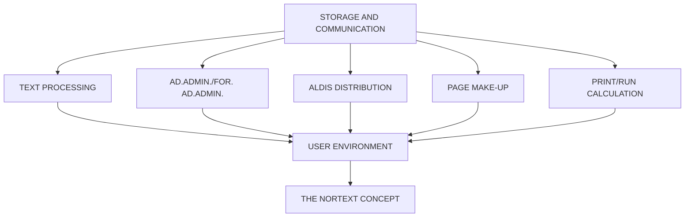

## Page 1

# NORTEXT-ALDIS

## ND 10595 ALDIS Subscription, Retail Sales and Distribution System



```
ND
COMTEC
DIVISION OF NORSK DATA
```

Scanned by Jonny Oddene for Sintran Data © 2021

---

## Page 2

# NORTEXT - ALDIS

## INTRODUCTION

ALDIS is an on-line system with immediate updating functions for registration, follow-up and control of subscription, retail sales and distribution.

The system is specially designed for newspapers. ALDIS may be used as an integrated part of the NORTEXT-100 consept, or as a stand-alone system.

ALDIS is a menu-driven system and all subroutines are accessible by means of menues. For each user it is possible to define if he/she should have access to all the menues or a restricted number. ALDIS allows immediate access to all kind of information relevant to the communication with subscribers, agencies and distributors. All data entry is handled by the NORTEXT Editing Terminal (NET) and update takes place immediately.

Relevant information may be defined by each customer; e.g. type of subscription (daily/weekly/-monthly), prices, credit days, discounts. The ALDIS system is modularly designed. The following modules are included:

- ALDIS BASIC Online for ND-100 contains subscription handling, policy rules and distribution
- ALDIS Batch for ND-100 contains reports and statistics for ALDIS Basic Online.
- ALDIS Retail Sales for ND-100 contains retail sales, retail sales statistics and batch programs to run the retail sales part.
- ALDIS Extended Batch for ND-100 contains a number of programs which are not included in ADIS.

## PRODUCT DESCRIPTION

### SUBSCRIPTION

- **Searching**  
  Searching of subscribers may be done by means of:
  - Subscription number
  - A key consisting of name, postal code, street name and street number
  - A key consisting of postal code and street name
  - Telephone number

- **REGISTRATION**  
  ALDIS simplifies the registration of new subscribers by automatic entry in the price register and the street name catalogue, thus providing correct price and route number.  
  Subscribers abroad are registered in the same way as ordinary subscribers, but more space for addresses are then available. Price and postage are set automatically.  
  In addition, ALDIS handles single-day/trial/free subscriptions, as well as subscribers with a fixed discount rate.

- **CHANGE OF ADDRESS/TERMINATION OF SUBSCRIPTION**  
  All input as for change of delivery (change of address, start/termination of subscription) is controlled by date and becomes effective on the actual date. Temporary stoppage will be credited to the customer automatically, but may be changed if wanted. Also, the exact number of newspapers to be distributed is automatically corrected.

---

## Page 3

# NORTEXT-ALDIS

## DEBT COLLECTION

For lack of payment, ALDIS has got the following possibilities:

- **Delivery is stopped automatically** after a certain number of days - set in the price register.
- **All deliveries are stopped at the same time on a fixed day.** The latter solution also gives the possibility of sending reminders. For each subscriber, all necessary invoicing information can be displayed on the screen. The system also handles cases where the invoicing address differs from the delivery address. The price register contains new and old prices providing correct amounts on the bill whenever there has been a change of price within the actual period. OCR payments are automatically entered by means of floppy diskette/mag tape from the Post Office. Payments over the counter are registered on the screen terminal. Information containing the last six payments of a subscriber is stored by the system, as well as other information concerning payment/invoicing.

## RETAIL SALES

- **SEARCHING**  
  Searching of retailers is made in the same way as searching of subscribers; i.e., by means of telephone number, retailer number or two different search-keys.

- **DELIVERY**  
  All retailers get a certain number of copies each week-day. This number may be changed for a given period. A number of copies can also be added to cover up for unexpected news.  
  Additional deliveries - including correct invoicing - are also handled by the system.  
  Changes affecting distribution are controlled by date as well. Such changes are written on the transport list, and the number is automatically corrected.

## RETURNS

The frequency of registration of returns may be decided by each newspaper; daily, weekly, monthly. The system may at any time provide statistics showing the number of copies delivered and returned within a specific period.

## INVOICING

The retailers are invoiced monthly. The commission is estimated on a percentage basis, or it may be a fixed amount. All invoicing information is automatically transferred to the newspaper’s accounting system.

## DISTRIBUTION

The distribution part of the system contains information necessary for the addressing, packing and distribution of the newspapers.

## PACKING

Each newspaper may choose the sorting of address sheets and labels, which can easily be changed. Integrated distribution of subscription and retail sales copies prevents unnecessary delays. Bundles often have to be split due to upper and lower limits in the stacker. ALDIS handles this automatically; reducing manual packing.

## TRANSPORT

ALDIS provides a complete overview of the distribution network, as well as the number of copies, parcels and time of arrival/departure at any level during transportation.

## ROUTES/POST OFFICES

All distribution places (post offices, routes and countries) are registered in the system, including ordinary transport and transport by air. In addition, ALDIS also defines alternative transport for different week-days.  
Freight rates for each distribution place are included in the system as well.

## STREET CATALOGUE

When entering new subscribers/retailers, the system automatically provides correct route number and post code.

## REPORTS/STATISTICS

The system allows an overview of different types of payment made (bank, post etc.)

ALDIS provides print-outs of address-sheets and labels, as well as the exact number of copies to be printed each day.  
Print-outs to the Post office contains the number of copies/parcels that are to be sent to the different regions. The same may also apply to other forwarding agencies.  
The chauffeur gets a list of where to deliver the parcels. Lists to carriers and post-offices may be sorted according to name, street name, or order of delivery.

## REPORTS ON REQUEST

ALDIS gives the following print-outs on request:

- Monthly invoices to retailers
- Statistics of retail sales
- Bills to subscribers sorted according to post office
- Due date list indicating what subscribers who have not paid yet
- Free copy list sorted according to department
- Inactive list showing previous subscribers
- A list giving the most essential information about subscribers
- Net-circulation list indicating income and already paid invoices of a given period compared to the same period last year. Income is divided by average subscription rate, thus giving a net circulation figure.
- Print-out showing circulation of subscription and retail sales. The customer may also define more specific reports by means of the NOTIS Report Generator. (NOTIS-RG)

## REQUIREMENTS

| Requirement      | Description                      |
|------------------|----------------------------------|
| ND-1016E         | SIBAS II (for ND-100)            |
| ND-10340         | SIBAS II (for ND-500)            |
| ND-10014         | Flocon                           |

## DOCUMENTATION

- NORtext-100 ALDIS
- System- og driftsansvarlig .................... ND-61.022.2 NO
- NORTEXT-100 ALDIS Brukermanual ... ND-61.021.2 NO

**NOTE:** ND COMTEC reserves the right to change specifications without notice.

[Scanned by Jonny Oddene for Sintran Data © 2021]

---

