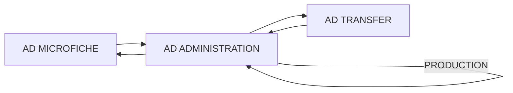

## Page 1

# AD MICROFICHE

**ND-10637 Ad Microfiche module**



```
ND
COMTEC
DIVISION OF NORSK DATA
```

---

## Page 2

# AD MICROFICHE

## PRODUCT DESCRIPTION

The Ad Microfiche module output pertinent data for the ad-orders to a mag-tape in a format suitable for microfiche.

These microfiches are used as historical records for the ads that have appeared in the newspaper.

## REQUIREMENTS

| Code    | Description                        |
|---------|------------------------------------|
| ND-10734| Ad Basic system                    |
| ND-10733| Ad Order Entry                     |
| ND-10636| Ad Order Entry with Editor extension|

## DOCUMENTATION

| Document                           | Code    |
|------------------------------------|---------|
| NORTEXT-100 Ad System, System Supervisor Manual | ND-61.011|
| NORTEXT-100 Ad System, Operator Manual          | ND-61.009|

**NOTE:** ND COMTEC reserves the right to change specifications without notice.

---

