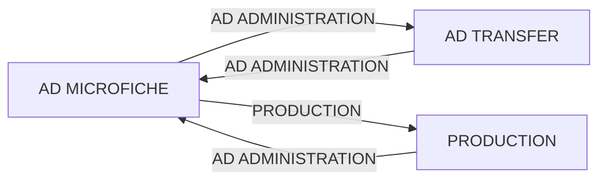

## Page 1

# AD TRANSFER

**ND-10638 Ad Transfer module**



```
| ND  COMTEC      |
| DIVISION OF NORSK DATA |
```

Scanned by Jonny Oddene for Sintran Data © 2021

---

## Page 2

# AD TRANSFER

## PRODUCT DESCRIPTION

The Ad Transfer module will extract the information in the ad-order data-base. This information may then be transferred to a separate computer system for invoicing.

Note that the ND-10736 Ad Invoicing module will do the same job on the ND-100 computers.

The order data will be stored on a normal file on a disk or output directly to a magtape. This file can be transferred to the invoicing system on a floppy, a magtape or by means of one of ND’s emulators. (!IBM, CDC, UNIVAC, Honeywell, Siemens etc.).

## REQUIREMENTS

- ND-10734 Ad Basic system
- ND-10733 Ad Order Entry
- ND-10636 Ad Order Entry with Editor extension

## DOCUMENTATION

| Document                                      | Code      |
|-----------------------------------------------|-----------|
| NORTEXT-100 Ad System, System Supervisor Manual | ND-61.011 |
| NORTEXT-100 Ad System, Operator Manual          | ND-61.009 |

**NOTE:** ND COMTEC reserves the right to change specifications without notice.

---

