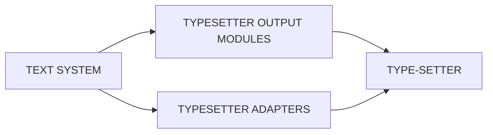

## Page 1

# TYPESETTER OUTPUT

**NORTEXT-100 Typesetter output modules options**



```
 ND
COMTEC
DIVISION OF NORSK DATA
```

---

## Page 2

# TYPESETTER OUTPUT

## Modules

- **ND-10644** Monotype Lasercomp Output module
- **ND-10820** CG8400 Output module
- **ND-10821** CG8600 Output module
- **ND-10822** LN202 Output module (German)
- **ND-10823** APS and APS Micro5 Output module
- **ND-10824** Digiset T20 Output module
- **ND-10825** Metroset Output module
- **ND-10874** LN202 Output module (Scandinavian)
- **ND-10875** AGFA P400 Output module
- **ND-10876** Unisetter Output module
- **ND-10880** Digiset T40 Output module
- **ND-10882** Harris 7450 Output module
- **ND-10885** Phillips GP-300 Output module

## PRODUCT DESCRIPTION

The typesetter output module is a program installed in a ND100/500 computer. This program will make different typesetters able to produce a result equal to the NORTEXT-100 typographical codes specified in an article.

Each option of the program is adjusted to fit the specialities of one certain typesetter.

Both TS and RT versions available.

Example values for the typographic tables are included:
- Example font-information
- Example typesetter information
- Example conversion table

## REQUIREMENTS

| Module      | Description                                   |
|-------------|-----------------------------------------------|
| **ND-10800** | NORTEXT-100 Editor                            |
| **ND-10814** | Typographic Tables Maintenance RT-version requires in addition: |
| **ND-10801** | System Tables maintenance                     |
| **ND-10802** | NORTEXT-100 Basic RT                          |

## DOCUMENTATION

- NORTEXT-100 System Maintenance and Utility Programs .................................. ND-61.031.1 EN
- NORTEXT-100 Typographic Maintenance ......................................... ND-61.030.1 EN

**NOTE**: ND COMTEC reserves the right to change specifications without notice.

## INTRODUCTION

The typesetter output module converts text and associated codes from NORTEXT-100 into photo-typesetter formats.

---

