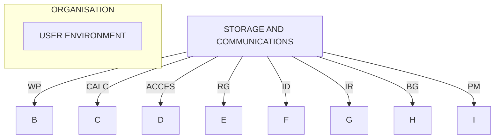

## Page 1

# ND 10691 NOTIS-DS Document Storage

![Photo: Diagram of NOTIS-DS system showing folders, documents, and drawers]

## Introduction

NOTIS-DS is a system for document filing and retrieval. The system may be seen as a complement to the more general SINTRAN filing system, and may be used with NOTIS-ID and NOTIS-WP.

## Features

- Hierarchically structured document storage, with DOCUMENTS in FOLDERS in DRAWERS belonging to USERS
- Same USER concept as in USER-ENVIRONMENT
- All levels have attributes for setting access rights, and for size, keywords, subject, date of modification and others
- A menu-driven user interface for creating, listing, moving, copying and deleting documents, folders, drawers and users
- Documents may be copied between the NOTIS-DS system and the SINTRAN filing system
- One NOTIS-DS system may serve several systems in a COSMOS network

## Product Description

The hierarchical filing structure supported by NOTIS-DS will ease the process of organizing and retrieving documents. The documents may be reports produced by NOTIS-WP (Word Processing), messages and notes received through NOTIS-ID (Information Distribution), or any other type of textual information.

The idea behind NOTIS-DS is to supply a filing system using the same terminology and structure as a familiar manual system: the filing cabinet. Documents are placed in a folder, and folders are grouped into drawers.

NOTIS-DS is superior to any manual archive system with regards to the retrieval process and access time.

A system for database backup is supplied.

## Requirements

| System                                     | Requirement Code |
|--------------------------------------------|------------------|
| Intermachine XMSG                          | ND 10373         |
| USER ENVIRONMENT (Version B or later)      | ND 10518         |
| NOTIS-WP (Version M or later)              | ND 10079         |
| SINTRAN III (Version J or later)           |                  |

## Documentation

| Document                                  | Code             |
|-------------------------------------------|------------------|
| NOTIS-DS Introduction                     | ND-63.017 EN     |
| NOTIS-DS Introduksjon                     | ND-63.017 NO     |

---

## Page 2

# THE ND-NOTIS OFFICE SUPPORT CONCEPT

ND-NOTIS is an innovative system created to meet the challenge of office support. It is designed to be used by anyone in your organisation, whether their role is secretarial, professional, or managerial. ND-NOTIS provides individual tools to perform office tasks easier and more productively.

## Highlights of ND-NOTIS:

- **ND-NOTIS lets you choose which office task to support, without limiting you to one software package.**

- **All ND-NOTIS modules can work together, so that data can be shared, and flexibility increased.**

- **ND-NOTIS does not compromise on the protection of your information. Complete controls are incorporated to prevent unauthorised access.**

- **You can access all NOTIS functions through the same terminal. NOTIS products also use a consistent command style to reduce time needed in training.**

- **A highly developed feature of ND-NOTIS is its capability to communicate with other computers and networks.**

### Growth

NOTIS systems can grow with your organisation. You can add extra processing functions when needed, even incorporating data processing. Norsk Data computers range from small office systems to large systems supporting hundreds of terminals. Software is fully compatible throughout the range.

Organisations worldwide enjoy the benefits of ND-NOTIS through better access to information and faster execution of routine tasks. It leaves staff with more time for making better decisions and improving the quality of their work. A decision to invest in ND-NOTIS will bring immediate gains in productivity and efficiency to your organisation.

---

