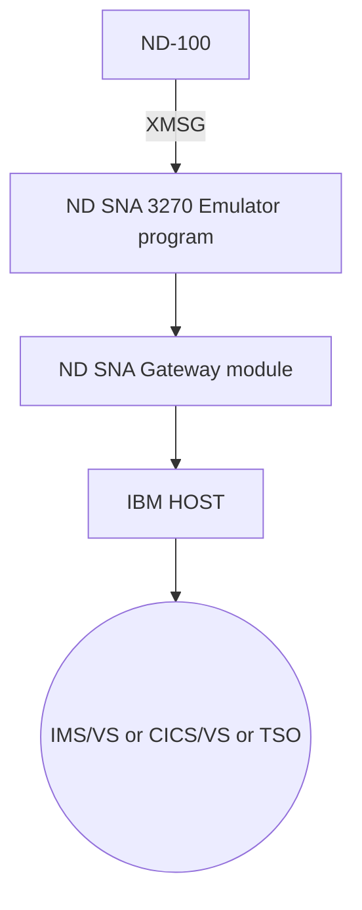

## Page 1

# ND 10742 SNA 3270 Terminal Emulator

## Introduction

The ND SNA 3270 Terminal Emulator program allows the ND-100 and locally attached display stations and printers to appear as a 3270 control unit with attached devices. The ND SNA 3270 terminal emulator program translates the IBM 3270 data stream from/to terminals and printers attached to the ND-100 computers. The SNA gateway software module runs on a separate processor (PIOC). This off-loads much of the communications protocol handling from the ND-100 CPU. The ND SNA 3270 Terminal Emulator can also be run over the ND COSMOS network system. This will allow distribution of the SNA 3270 emulation to several CPUs while only one of them is connected to the IBM host. The ND SNA 3270 Terminal Emulator program is configured as a Physical Unit of type 2 (PU-2) in the IBM SNA network environment.

## Features

- Emulates the IBM 3274 control unit
- Emulates 3278 model 2 display station and 3287 model 2 printer
- Supports IMS/VS, CICS/VS or TSO
- Supports three different logical unit types:
  - LU-T1 for 3207 printer with SNA character stream format (SCS)
  - LU-T2 for 3270 display units and
  - LU-T3 for 3270 printers with data stream compatibility (3270 DSC)
- Supports attachment of up to 31 devices per communication line
- May run concurrently with other ND SNA emulators on the same communication line
- Additional local keyboard functions are available, such as HELP, PRINT, EXIT etc.
- A total number of 24 program function keys and 2 program access keys are supported
- A special line (25th line) on the display unit is available for status and other exceptional messages

## Product Description

The ND SNA 3270 is implemented as a background program, running under the control of the SINTRAN III operating system. Communication between the ND SNA gateway software module and the ND SNA 3270 terminal emulator takes place through the XMSG message communication system. For ease of operation, functional keys on the display unit can be programmed for both log-on to and log-off from the IBM host. The ND SNA 3270 Terminal Emulator may use different kinds of display units, but the ND-320 NOTIS terminal exploits all functions supported by an IBM 3270 keyboard. Along with its own status code, the ND SNA 3270 Terminal Emulator also returns status code from the ND SNA gateway software module. This facility greatly simplifies the fault-finding process in the SNA environment.

*Implementation of the ND SNA 3270 terminal emulator*

## Requirements

- SINTRAN III version I or later
- ND 10741 SNA gateway module

## Documentation

SNA Terminal Emulator Operator Guide.......ND-30.038

---

