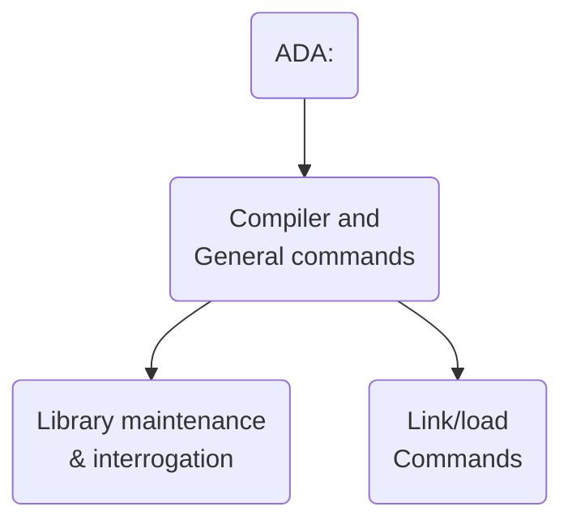

## Page 1

# ND 10745 ND-Ada

## INTRODUCTION

Ada\* is a programming language defined by ANSI standard ANSI/MIL-STD 1815A. The Ada programming language is designed to reduce the cost of creating and maintaining large systems. It contains facilities for modular programming and supports both top-down and bottom-up methods of program design.

ND-Ada is a subset of the Ada programming language. This subset has all the important features of Ada and includes all the facilities crucial to a proper understanding of how Ada should be used.

The ND-Ada compiler has been designed with the ND-500 architecture in mind, and generates highly efficient code.

## FEATURES

- Full separate compilation facilities.
  - Enforcing order of compilation.
  - Enforcing consistency during linking.
- Generic packages and subprograms with generic formal types.
- Constrained and unconstrained arrays.
- Records and access type: integer, float and enumeration types.
- Initialization of static and dynamic data. Full overloading of names.
- Full exception handling. Full TEXT-IO.
- Interfacing to non-Ada programs.
- Automatic load-and-go facility.
- Symbolic debugger.

## PRODUCT DESCRIPTION

### Program compilation:

All ND-Ada source program units are placed in a program library. Each user may have his own program library. For every compilation, the compiler checks that units in the context clause have not been edited since they were last compiled. This ensures that there is no use of a potentially incorrect specification. As the units are placed in the library, the compiler may optionally produce a listing of the compilation. The compiler also creates a named object file for the program unit.

### Program loading and execution:

When a program unit is selected as the main unit of the program, the program library is searched and all the dependent units are linked to it automatically. There will be no need for the user to specify which routines are needed by the program.

## REQUIREMENTS

ND 10745 ND-Ada runs only on ND-500 computer systems. SINTRAN III version J or later is a prerequisite. A minimum memory size of 4 MB is recommended.

## DOCUMENTATION

| Document                                   | Reference  |
|--------------------------------------------|------------|
| ND-Ada User Manual                         | ND-60.198  |
| Symbolic debugger User Manual              | ND-60.158  |
| ND-500 Loader/Monitor                      | ND-60.136  |

The simple data types supported are integer, float and enumeration. Structured data types, array and record, are supported. They are used to handle matrices and lists. Access types are present to give the facility of dynamically allocating storage and managing variable amounts of data.

The full overloading capability of Ada is available for the user to give several related subprograms the same name and allow the compiler to select the correct one according to the context.

All the operators are implemented that apply to the supported data types.

The ND Symbolic debugger is available to debug ND-Ada program units by using source names.

Generic subprograms and packages can be defined in order to parameterize an algorithm by the type of data on which it operates. The generic formal parameters are restricted to types.

Planc routines can be incorporated into the program by use of the interface pragma applied to the Ada specifications of the routines.

---

\* Ada is a registered trademark of the US Government, Ada Joint Program Office.

---

## Page 2

# ND 10755 ND-500 BASIC

## INTRODUCTION

ND-500 BASIC is a programming language that accepts nearly all programs written in ND-100 BASIC (ND 10024 and ND 10034). It also incorporates most of the features of the 1984 ANSI Standard Proposal for BASIC.

ND-500 BASIC lets the user write his/her programs in a PED-like editor and run them directly. It is not necessary to leave the editor to compile, load or edit a program. BASIC style interactive debugging is available.

If the user loads a program in the Linkage Loader, s/he may use the Symbolic Debugger.

## FEATURES

- Integer, real, fixed decimal, and string variables.
- Nearly 40 numeric functions and 14 string functions are available.
- One- and two-dimensional arrays are available, and matrix operations are allowed. Zero (0) or one (1) may be used as the first element of an array. The size of an array may be changed dynamically.
- Virtual arrays are available. Virtual string arrays may be treated as random access files.
- AND, OR, XOR, and NOT may be used in relation expressions.
- GOSUB, GOTO, and ON may be used in control statements.
- DO loops are allowed, and may be controlled by WHILE, UNTIL and EXIT DO statements.
- FOR loops are allowed, and may contain EXIT FOR statements.
- IF, THEN, ELSE, ELSEIF, and ENDIF may be used to create decision structures.
- SELECT CASE is allowed. It can often provide more readable programs by replacing complex IF THEN ELSE statements.
- Internal functions and subroutines are allowed. Subroutines have their own variables.
- Separately compiled functions or subroutines may be referenced by the EXTERNAL statement.
- DATA and READ statements are allowed. IF MISSING defines what happens if any items are missing.

- INPUT statements allow PROMPT, TIMEOUT, and ELAPSED to control user input.
- PRINT may be used with TAB, MARGIN, ZONE-WIDTH and PRINT USING specifications for flexible output.
- File Input/Output is as for ND-100 BASIC. Sequential and random access files are available.
- BREAK, RESET-BREAK and CONTINUE allow the user to debug programs interactively.
- If the program is compiled with DEBUG ON, and loaded by the Linkage-Loader, the Symbolic Debugger may be used to debug it.
- Programs written in BASIC may call routines written in FORTRAN, COBOL, PASCAL, PLANC and ND-500 Assembly Language.
- SINTRAN commands may be given within a program.

## PRODUCT DESCRIPTION

Programs may be edited with nearly all of the facilities available in PED. The program is edited in the upper half of the screen, and is executed in the lower half. The user may adjust the boundary between the editing area and the execution area. In addition, the following facilities are available:

- Any BASIC statement may be given as an interactive command in the command part of the screen.
- Output from BASIC programs will be written to the command part of the screen. It can be edited or moved to other regions.
- Lines may be automatically renumbered in the whole program or in parts of it.
- An :NRF file may be produced.
- The user may choose between an ANSI-ON and an ANSI-OFF version of BASIC.

## REQUIREMENTS

The ND-500 system

## DOCUMENTATION

ND-500 BASIC User Manual ND-60.207

---

