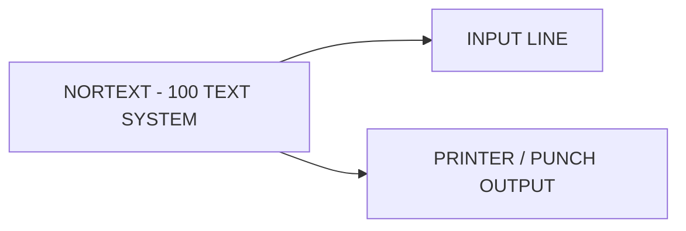

## Page 1

# PRINTER/PUNCH OUTPUT

## ND-10803 Printer/punch output



```
              _________
             |         |
             | INPUT   | 
             | LINE    |
             |_________|
                  ^
                  |
   _______________|_________________
  |                                   |
  |       NORTEXT - 100 TEXT SYSTEM   |
  |___________________________________|
                  |
                  v
             _______________
            |               |
            | PRINTER /     |
            | PUNCH OUTPUT  |
            |_______________|

```

```
    ND
  COMTEC
DIVISION OF NORSK DATA
```

---

## Page 2

# PRINTER/PUNCH OUTPUT

## INTRODUCTION

The Printer/Punch Output outputs text articles to a printer, a punch or to any asynchronous communication line. The program will allow conversion on output, including multi-code conversion.

## PRODUCT DESCRIPTION

The NORTEXT-100 Text system can have from 1 to 5 printer output lines. Each of these lines can be operated independently, through the NORTEXT LINE SYSTEM.

Each printer output module has a corresponding conversion table. The hard copy of an article may be printed with different types of headers such as CORRECTION HEADER or ARCHIVE HEADER. In addition, the print may be word wrapped at a pre-defined number of columns.

The punch output is acting the same way as the printer output. Thus up to 5 punch lines may be available.

## REQUIREMENTS

ND-10800 | NORTEXT-100 Editor  
ND-10801 | System Tables Maintenance  
ND-10802 | NORTEXT-100 Basic RT  
ND-10814 | Typographic tables maintenance  

## DOCUMENTATION

- NORTEXT-100 System Maintenance and Utility Programs ...................... ND-61.031.1 EN
- NORTEXT-100 Typographic Maintenance . ND-61.030.1 EN

**NOTE:** ND COMTEC reserves the right to change specifications without notice.

---

