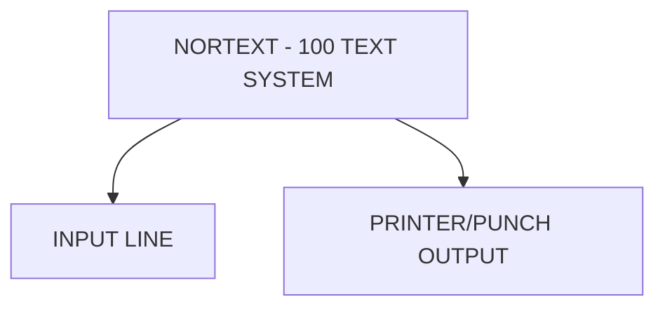

## Page 1

# INPUT LINE

ND-10805 INPUT LINE



```
  ND
COMTEC
DIVISION OF NORSK DATA
```

Scanned by Jonny Oddene for Sintran Data © 2021

---

## Page 2

# INPUT LINE

## INTRODUCTION

The Input Line contains the necessary functions for input of text articles from most asynchronous lines. The program will allow conversion of characters on input, including multi-code conversion.

## PRODUCT DESCRIPTION

The Input Line gives on-line retrieval of text from reporter (portable) terminals and some other kinds of input devices. Up to 15 input lines are available, each of them with conversion possibilities. The conversion tables can easily be changed by the user, including multi-code conversion.

If timeout checking is wanted, this can easily be turned on. The system will automatically generate an article number which will be redisplayed on the screen of the remote terminal when the text is processed. The articles can also be given pre-defined article numbers.

## REQUIREMENTS

| Code     | Description                       |
|----------|-----------------------------------|
| ND-10800 | NORTEXT-100 Editor                |
| ND-10801 | System Tables Maintenance         |
| ND-10802 | NORTEXT-100 Basic RT              |
| ND-10814 | Typographic tables maintenance    |

## DOCUMENTATION

NORTEXT-100 System Maintenance and Utility Programs .................................. ND-61.031.1 EN

NOTE: ND COMTEC reserves the right to change specifications without notice.

---

