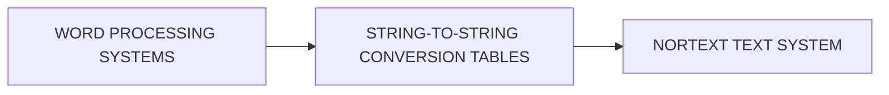

## Page 1

# STRING-TO-STRING CONVERSION

**ND-10806 String-to-string text conversion**



```
 __    __    __
|  |  |  |  |  |
|  |__|  |__|  |
|______________|
```

```
ND
COMTEC
DIVISION OF NORSK DATA
```

---

## Page 2

# STRING-TO-STRING CONVERSION

## INTRODUCTION

The String-to-string text conversion (STS) is a general text conversion system for conversion of codes or combination of codes to new codes or combination of codes.

In this way one can convert texts from external word processing system into the NORTEXT-100 Text system or vice versa.

## PRODUCT DESCRIPTION

The String-to-string program is designed to do general string conversion and is intended to handle moving of text jobs between a NORTEXT-100 Text system and foreign systems.

### STS is table driven.

Both time-sharing (TS) and real-time (RT) versions are included. PLANC is needed if special conversion tables are wanted in addition to the pre-programmed rules, to make a better conversion of the text. In principle the conversion task is straight forward. An input-stream of text is scanned from left to right (from beginning to end) looking for a match with a set of strings (defined in a table).

On finding a match, the matching string is substituted with another string (also defined in the table) in the output-stream. Characters which are not matching any string in the table, are optionally copied over to the output stream or they are ignored. In order to make the translation process more versatile, it is possible to specify other pairs than a mere match- and substitute-string pairs.

The following describes the concepts:

- The translation process is controlled through one or more translation tables.
- At any time there is one controlling table and control is transferred between tables depending on the outcome of the matching rules.
- Each table consists of one or more translation rules.
- The match string may specify a generic string match and a wild character match.
- The substitution string may be substituted with a call of a user-written sub-routine.

STS may be described as a set of finite-state transition rules on a left-to-right parser.

STS can run as a separate program or as an automated function connected to a queue or to the auto-routing sequence. The conversion is defined in user created conversion tables only.

The translation tables are defined as separate SINTRAN files and can be created and edited by the user. When the conversion table has been completely edited, it must be compiled by running a background program called: COMPIL.

STS may be used either as a separate conversion program under SINTRAN or as an automatic RT-program connected to a queue or line in NORTEXT-100 Text system.

## REQUIREMENTS

For the RT version only:

| Requirement ID | Description                       |
|----------------|-----------------------------------|
| ND-10800       | NORTEXT-100 Editor                |
| ND-10801       | System Tables Maintenance         |
| ND-10802       | NORTEXT-100 Basic RT              |
| ND-10309       | PLANC (option)                    |

## DOCUMENTATION

NORTEXT-100 String-to-string ........... ND-61.034.1 EN

**NOTE:** ND COMTEC reserves the right to change specifications without notice.

---

