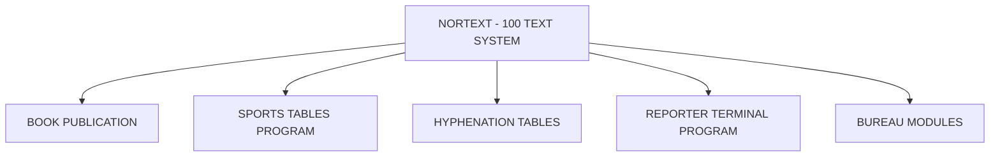

## Page 1

# NORTEXT- BUREAU MODULES

**NORTEXT-100 Bureau modules options**



```
   ND
COMTEC
DIVISION OF NORSK DATA
```

*Scanned by Jonny Oddene for Sintran Data © 2021*

---

## Page 2

# NORTEXT - Bureau Modules

| Code      | Bureau Input                                    |
|-----------|-------------------------------------------------|
| ND-10811  | Arbeiderpressen bureau input (Norway)           |
| ND-10812  | NTB Bureau input (Norway)                       |
| ND-10815  | TT Bureau input (Sweden)                        |
| ND-10816  | DPA Bureau input (Germany)                      |
| ND-10817  | Ritzau Bureau input (Denmark)                   |
| ND-10878  | PAL Press Ass.LTD (UK)                          |
| ND-10879  | FNB/STT (SF)                                    |
| ND-210947 | UPI Bureau input (SF)                           |
| ND-210949 | Associated Press (SF)                           |
| ND-210951 | REUTER (IS)                                     |

## Product Description

The NORTEXT-100 Bureau Modules are designed to handle text from news agencies. One NORTEXT-100 Text system can have several bureau lines connected. The bureau input lines take care of the standard news agency message format defined by the Technical Committee of the International Telecommunication Council (IPTC).

Typography is automatically put on the articles from the news agencies by means of formats. Justification, back-up, printing and typesetting can be done automatically if needed.

The articles from the news agencies are divided into categories such as: sports, features etc. These characteristics are used to put on the right typography. Agency sequence number or next free NORTEXT-articles number may be used when storing the articles. High priority articles from the news agencies are treated in a special way to secure rapid access. Additional agencies may be included upon request.

## Introduction

NORTEXT-100 Bureau Modules is a system for on-line retrieval of text from news agencies that will be processed as follows:
- Input with conversion of codes
- Adding typography
- Justification
- Storage on disk

The program automatically adds important parameters such as:
- The news agency (NTB etc.)
- Type of news (sports, economics etc.)
- Article depth (lines and millimeters)

The finished product is stored on disk as a standard system article.

## Requirements

- ND 10800 NORTEXT-100 Editor
- ND 10801 System Tables Maintenance
- ND 10802 NORTEXT-100 Basic RT
- ND 10814 Typographic tables maintenance

**NOTE:** ND COMTEC reserves the right to change specifications without notice.

---

