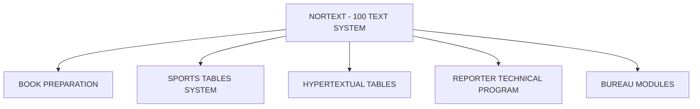

## Page 1

# NORTEXT - SPORTS TABLES

**ND-10826 Sports tables system**



```
   ND
  COMTEC
DIVISION OF NORSK DATA
```

---

## Page 2

# NORTEXT - SPORTS TABLES

## INTRODUCTION

The Sports Tables System is a system for automatic generation of sports tables. The Sports Tables System keeps track of the different sports, series and teams, and it will generate different tables with customized typography.

Automatically compute points are given according to the rules of the different sports.

## PRODUCT DESCRIPTION

- **TERMS**  
  Several terms are defined within the sports tables system:

- **TABLE**  
  is the teams belonging to one specific table

- **GROUP**  
  is a collection of several tables

- **TABLE SET**  
  is one table file, result file, team file and last result file. The system can hold 5 table sets

- **MATCHRULE**  
  By using a number, one can tell the system which rules a table is going to use.

  These numbers are:  
  1 - football  
  2 - basket ball  
  3 - ice hockey  
  4 - volley ball  
  6 - handball  
  7 - bowling

- **SORTRULE**  
  By using a number, one tells the system how to set up the table when two or more teams have the equal number of points.

  The data for the sports table system is organized in a set of table groups. Each group consists of several tables, each table contains the data for the teams belonging to one sport table (ex. Norwegian 1. division - football).

- **MENU DRIVEN**  
  The sports tables system is menu driven and all operator communication is screen oriented.

---

## Page 3

# NORTEXT - SPORTS TABLES

These are the commands in the main menu:

1. Initializing
2. Group definition
3. Table definition
4. Match results
5. Information display
6. Table corrections
7. Miscellaneous commands
8. Production of tables

The first three commands (1 - 3) are to be used by the system supervisor(s) and the last five (4 - 8) by the journalists or the production people.

## TABLE LAYOUT

Both result tables and league tables can be transferred for production in the NORTEXT-100 Text system.

The result table can handle results with or without half-time results, period results of the ice hockey type or period results of the volleyball type.

The league table has three different layouts: wide, normal or narrow. A wide league table contains the following columns: Team names, total number of matches, matches won, drawn or lost at home, goals scored and let in at home, matches won, drawn or lost away, goals scored and let in away, total number of goals scored and let in and total number of points.

A normal league table contains: Team names, number of matches won, drawn or lost, number of goals scored and let in and number of points. A narrow league table contains: Team name, number of matches played, number of goals scored and let in and number of points. A specification is needed if the league position shall be included or if a "German" layout is wanted. A “German” layout means that the lost points will be written as the last column.

# REQUIREMENTS

ND-10800  | NORTEXT-100 Editor  
ND-10801  | System Tables maintenance  
ND-10802  | NORTEXT-100 Basic RT  
ND-10814  | Typographic Tables maintenance  

# DOCUMENTATION

NORTEXT: 100 Sport Tables ................. ND-61.044.1 EN

**NOTE:** ND COMTEC reserves the right to change specifications without notice.

---

