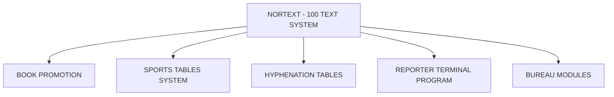

## Page 1

# NORTEXT-HYPHENATION TABLES

**Hyphenation tables Options**



```
     ____
    | ND |
    |____|
    COMTEC
  DIVISION OF NORSK DATA
```

---

## Page 2

# NORTEXT - HYPHENATION TABLES

| Table Code | Description                        |
|------------|------------------------------------|
| ND-10827   | English Hyphenation Tables         |
| ND-10828   | Norwegian Hyphenation Tables       |
| ND-10829   | Swedish Hyphenation Tables         |
| ND-10830   | Danish Hyphenation Tables          |
| ND-10831   | German Hyphenation Tables          |
| ND-10832   | Icelandic Hyphenation Tables       |
| ND-10833   | Finnish Hyphenation Tables         |

## INTRODUCTION

The Hyphenation Tables are standard logic hyphenation tables. An example exception is included. This can be further enhanced by the customer.

## PRODUCT DESCRIPTION

The Hyphenation & Justification program (H & J-program) is phototypesetter independent. It is integrated with the text editor and the output module for the NET Graphic Option. The H & J program justifies the text in two modes: EDIT mode and GRAPHIC mode. Pressing the "Justify" key on the keyboard will re-justify the text and re-display it with NET characters and visible function codes. The program will generate hyphenations and line endings. The text will appear on the NET in graphic mode, when pressing "SHIFT/JUSTIFY", giving the “soft” typesetter functionality of the system.

The text in GRAPHIC mode may be scrolled, window by window (page by page) for inspection of the typeset results. Return to EDIT mode is simply done by pressing one specific key on the keyboard. Back in EDIT mode, the cursor will return to the same position it had before entering the GRAPHIC mode.

The H & J program is equipped with function codes. The function code parameters are checked for syntax and validity. The denomination of the function code parameters is Pica, Cicero, Millimeter, Point, Line or relative units. One of these will be chosen as the default value, the others are made available by adding a letter to the function code. The users have simple means of up-dating tables and exception word directories in order to take care of local names and words having special hyphenation rules. The hyphenation frequency may be controlled by means of a function code. This code also controls spaceband variations.

## INCREMENTAL JUSTIFICATION

This special type of H & J is implemented to save time and resources when handling greater amounts of text as one job. In a consecutive natural sequence throughout the job, text may be H & J’ed section by section by pressing the JUSTIFY-key while the cursor is still positioned in a specific section.

## DOCUMENTATION

- NORTEXT-100 System manual ........... ND 61.045 1 NO
- NORTEXT-100 System Maintenance and Utility Programs ........................... ND 61.031.1 EN

**NOTE:** ND COMTEC reserves the right to change specifications without notice.

---

