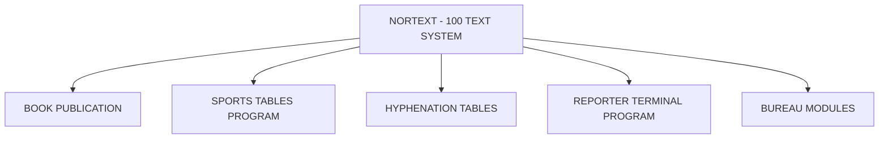

## Page 1

# NORTEXT-REPORTER TERMINAL

**ND-10881 NORTEXT-100 Reporter Terminal Basic Program**



```
     ND
   COMTEC
DIVISION OF NORSK DATA
```

---

## Page 2

# NORTEXT - REPORTER TERMINAL

## INTRODUCTION

The NORTEXT-100 Reporter Terminal Basic Program (RTP) contains the functions for handling reporter terminals.

By reporter terminal one means a portable microcomputer with local text handling facilities, a communication program and (preferably) its own file store. A modem is connected to this terminal.

The NORTEXT-100 RTP is designed for transferring NORTEXT-articles between the NORTEXT-100 Text system in an ND-computer (the host) and an micro computer (reporter terminal) via modems.

The NORTEXT-100 RTP must be installed in the host computer.

## PRODUCT DESCRIPTION

The NORTEXT-100 Reporter Terminals Basic program consists of one basic program written in PLANC, intended to serve as a common program for all types of reporter terminals. In addition there is one main parameter file independent of the type of reporter terminal and three parameter files which may differ from type to type.

The articles are written as local articles in the reporter terminal. When the article has been made ready, the user gets in contact with the host system by making a connection via modem.

When the connection is made, the user log into the NORTEXT-100 Text system as from an ordinary terminal.

The next step is to start the Reporter Terminals Program. The way this is done depends on the routines defined by the System Supervisor. When the Reporter Terminal Program is started, the user gets a message on the screen telling that he/she is identified as a legal RTP-user and that the RTP is ready.

## COMMANDS/FUNCTIONS

These are the commands/functions available for the interaction between the host computer and the reporter terminal by means of the Reporter Terminal Basic program:

- **HELP**: get a list of commands to be used.
- **SEND-ARTICLE**: transfer an article to the host system
  (The NORTEXT-100 Text system in the host computer).
- **FETCH-ARTICLE**: retrieve an article from the host system for correction or editing.
- **SHOW-LAST-ARTICLES**: Get a list of articles transferred to the host system.
- **CATALOGUE**: get a catalog of articles accessible in the host system.
- **EXIT**: logging out of the Reporter Terminal Program.

## TIME-OUT LIMITS

The Reporter Terminal Program has a set of time-out limits which will cause some activity when these limits are exceeded. These values are defined by ND COMTEC, but may be changed by the System Supervisor.

## REQUIREMENTS

- Kits for adaption to the different types of reporter terminals are required.
- The different terminals are tested and included through own sets of parameter files.
- HW: ND-271/212 Flp to modem

## DOCUMENTATION

NORTEXT-100 Reporter Terminals Reference Manual and User Guide .............
NDC No 61.043.1 EN

**NOTE**: ND COMTEC reserves the right to change specifications without notice.

---

