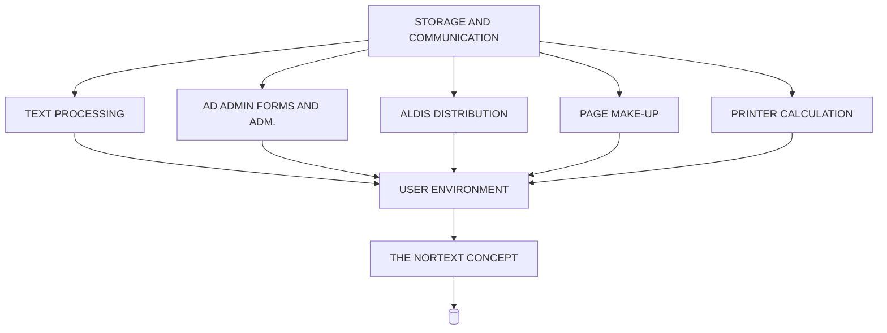

## Page 1

# NORTEXT-TEXT SYSTEM

**ND-10900 NORTEXT-100 Text system**



```
      _____________
     |   __  __    |
     |  |__||__|   |
     |            o|
     |  ________   |
     | |        |  |
     | |________|  |
     |_____________|
``` 

# ND COMTEC

*DIVISION OF NORSK DATA*

[Scanned by Jonny Oddene for Sintran Data © 2021]

---

## Page 2

# NORTEXT-TEXT SYSTEM

## ND-10800 NORTEXT-100 Editor
## ND-10801 System Tables Maintenance
## ND-10802 NORTEXT-100 Basic RT
## ND-10807 Sequential Article Back-Up
## ND-10809 Autojustification
## ND-10814 Typographic Tables Maintenance

### Introduction

The NORTEXT-100 Text System is an interactive multi-user system within the NORTEXT family of products. The system may operate as a stand-alone system or as an integrated part of the NORTEXT concept.

The SINTRAN Operating System is "the heart" of the system, thus allowing a very flexible program attachment capability. The program selected to run under the Operating System gives the user a powerful tool for producing text with a professional touch. NORTEXT-100 Text System is a text handling system complete with typography, formats, hyphenation and justification, and the ability to drive an output unit (phototypesetter, laser-printer etc.)

These are the basic modules in the NORTEXT-100 Text System:

- NORTEXT-100 Editor
- System Tables Maintenance
- NORTEXT-100 Basic RT
- Sequential Article Back-up
- Autojustification
- Typographic Tables Maintenance

### Product Description

#### Security

Each user enters the system by giving a specific NORTEXT user name. A secret password is assigned to each user. This prevents unauthorized access to any part of the NORTEXT system, as well as unauthorized access to any article not released by a user.

The user-name and the password may be changed at any time. For dialed up connections, which may invite attempts to break the access key, the system can be set up to disconnect the channel after a certain number of unsuccessful attempts.

#### Organising Articles

Each user may be given one or more specific labels for all his/her articles in order to group an unlimited number of articles, or the user may use a private working area and store the articles with different names.

### Catalogues

The NORTEXT catalogue function is essential for production management, selecting and sorting groups of jobs stored in the database.

Various catalogues can be obtained for job manipulation, and the catalogue will display in tabular form all jobs in the database, or in a queue, given the specified criteria, such as:

- Product
- Edition
- Page
- Date
- Status
- etc.

Many possibilities are available to act in the current catalogue, such as: DELETE, PUT IN QUEUE, RETRIEVE, CHANGE, STATUS-LISTS etc.

Using the terminal split screen function, the user may call the catalogue into one split, and from this point, call the individual articles or jobs into the other split for editing.

### System Tables Maintenance

The System Tables Maintenance contains the functions for maintenance of the tables used in the NORTEXT Basic RT system, including:

- User Access rights to the articles
- Automatic Routing tables
- Product Name tables

### NORTEXT-100 Basic RT

NORTEXT-100 Basic RT contains the necessary RT functions for running a system, text file system for article storage, line system for controlling I/O lines, queue system for queuing of articles to the I/O lines and error message system for printing system messages.

The XMSG backend module is also included in the NORTEXT-100 Basic RT.

### Sequential Article Back-Up

The Sequential Article back-up will output articles sequentially for back-up to either floppy or magtape. It will allow catalogues of the back-up articles and input of selected articles from the back-up media.

The storing function is an integral part of the NORTEXT-100 Editor, while the retrieval part is a sub system.

The retrieval part makes it possible to copy articles from floppies or mag-tapes into the NORTEXT-100 Text system.

The articles can be copied to the same article number as on the floppy/magtape or be given a new article number. In addition information of date entered or date last written is available.

---

## Page 3

# NORTEXT-TEXT SYSTEM

The selection of the articles for back-up may be done manually by putting them into the queue or automatically by the routing tables.

## FORMATS

To simplify the use of typographic function codes, the NORTEXT Text system is equipped with a format function. The formats may be GLOBAL FORMATS available to all jobs in the system, or LOCAL FORMATS which are defined and used within one job. LOCAL FORMATS can be defined within a GLOBAL FORMAT.

The formats are very powerful tools to simplify typographical coding of complex composition, as well as definition of standards to be used for typography and layout of articles and ads.

## THE USER INTERFACE AND COMMAND PROCESSOR

This is the central part of the NORTEXT-100 Text System, controlling each subsystem by a simple and easy-to-use dialogue between the user and the system.

Most commands can be defined in User Definable function Keys (UDK), or as a simple command mnemonic with parameters and options. Some commands may create prompts, where the user is asked for more parameter information, or the user only has to fill in a mask on the screen.

## "HELP" FUNCTIONS

A "HELP" key is available on the keyboard. By pressing the "HELP" key, the user will immediately get the user manual on the screen, which will give the necessary description of commands and parameters to perform a given task.

## NORTEXT-100 EDITOR

The NORTEXT Editor is suitable for users of all experience levels. The NORTEXT Editor contains the basic time-sharing functions for the system. Included is a full-screen editor specially tailored for use with the ND-322 NET-terminal.

Functions for controlling the NORTEXT Basic RT system are included. These take care of the control of input/output lines, of catalogue lists of articles stored and of output of articles to typesetters and printers.

Special modules for keyboard layout and character set customizing of the ND-322 terminal are also included.

Standard screen and catalogue forms are included, other sets are offered as an option. The forms may be customized on-site by using the ND-10188 FOCUS Level 1.

## AUTOJUSTIFICATION

The Autojustification module includes the functions for automatic justification of text articles.

## TYPOGRAPHIC TABLES MAINTENANCE

The typographic Tables Maintenance contains the functions for maintenance of the typographic tables in the NORTEXT-100 Text System, i.e.:

- font-information
- kerning-pairs
- typesetter information
- code conversion tables
- multicode Conversion tables
- control-block
- format-list and init
- tabfile service
- graphic Display Information
- TOFOTO typesetter output inspection
- hyphenation Test program

## REQUIREMENTS

NORTEXT-100 Text system may only run in ND-100/CX. The RT part requires XMSG to be present. In case the application is split between 2 or more CPU's this means that intermachine XMSG (ND-19373) or COSMOS basic system (ND-13074) must be present on all machines.

A set of standard forms and catalogues are delivered with the system. If the user wants forms tailored specially for his system, ND-FOCUS level 1 (ND-10188) must be ordered, allowing him to do so.

## DOCUMENTATION

| Documentation                          | Reference Code    |
|----------------------------------------|-------------------|
| NORTEXT-100 Håndbok for tekstoperatorer | ND 61.025 1 NO    |
| - del 1 - NORTEXT kommandoer           |                   |
| - del 2 - Typografikommandoer          |                   |
| NORTEXT-100 System manual              | ND 61.045 1 NO    |
| NORTEXT-100 System Maintenance and Utility Programs | ND-61.031.1 EN |
| NORTEXT-100 Typographic Maintenance    | ND-61.030.1 EN    |

**NOTE:** ND COMTEC reserves the right to change specifications without notice.

---

