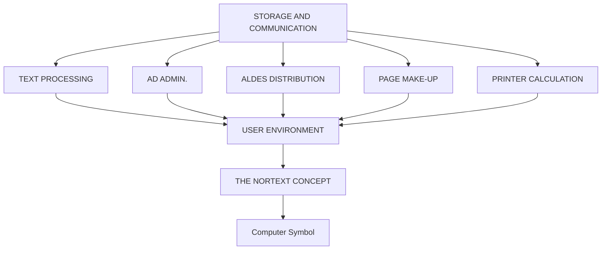

## Page 1

# NORTEXT - AD Integrated Administration

**ND-10902 NORTEXT-100 Ad integrated administration system**



```
    ND
 COMTEC
DIVISION OF NORSK DATA
```

---

## Page 2

# NORTEXT-AD INTEGRATED ADMINISTRATION

| Code    | Module                                   |
|---------|------------------------------------------|
| ND-10734| Ad Basic system                          |
| ND-10636| Ad Order Entry with editor extension     |
| ND-10736| Ad invoicing module                      |
| ND-10735| Ad Statistics module                     |
| ND-10814| Typographic Tables Maintenance           |

## INTRODUCTION

The NORTEXT-100 Ad Integrated Administration system is a system for handling the complete production of ads from text and data entry to finished typeset class and display ads. It will also handle customer data and invoicing of ads. It is an interactive, multi-user system and may operate as a stand-alone system or as an integrated part of the NORTEXT-100 consent.

The NORTEXT-100 Ad Integrated Administration system consists of the following modules:

- Ad Basic System
- Ad Order Entry with Editor extension
- Ad Invoicing Module
- Ad Statistics Module

## PRODUCT DESCRIPTION

### SYSTEM DATABASE

The system database in the ad system is based upon the SIBAS database system. All the information such as the price policy of the company, customer data or ad information is stored in the system database and can easily be updated.

### AD BASIC SYSTEM

The AD Basic system contains the necessary information for definition and maintenance of system tables in the ad-system.

The internal ad policy of the company is defined within the Ad Basic System. This means f.ex. prices, price reductions or administrative data. Changes can easily be made by people who are authorized to do so.

Different categories of customers and the classification of ads are defined within this module.

The catalogue function within the Ad system is also defined in the Basic module. The catalogues give updated information based upon the database — f.ex. catalogues of the ads sorted after ad placement, classification etc.

All catalogues are displayed on the screen. From the screen they may be copied to different files, or be printed directly on any printer.

---

## Page 3

# NORTEXT-AD INTEGRATED ADMINISTRATION

## AD ORDER ENTRY WITH EDITOR EXTENSION

The Order Entry System handles the administrative data such as customer- and order information for ad invoicing. In addition, this module will allow the ad text to be entered at the same time. The price calculation will be made on the basis of the justified text. Included is the module for the production of ads. These ads may be put into a normal file and may be output directly on a typesetter or may be entered in the NORTEXT-100 Text System.

The system handles contract customers, account customers or transient customers. Classification of ads is done according to a placement structure (4 levels).

Credit control of advertisers is made at Order entry, and the insertion sequences are controlled by the system at this stage. Automatic price calculation is executed with multi insertions for the advertiser at order entry.

All the data to be keyed in are automatically controlled, and mistakes are immediately reported back to the operator.

During the registration of ad information, the HELP-function might be useful to the operator. Just by pressing the HELP-key he/she will have the necessary information of the field.

Customer information already registered and earlier used ads can easily be retrieved from the database.

The Editor module in the NORTEXT-100 Text System is used for the ad text entry. The typographical commands and the possibilities of having typographical formats are also identical. (See 10900 NORTEXT-100 Text System). The typographical outlook of the ad can be checked by means of the Graphic Option module in the NET-terminal. (see 322 NORTEXT Editing Terminal (NET).

After being registered the ads can be stored in the database and can later on be retrieved after certain criteria such as date of production, date of issue or classification. Then the ads can be sent to a typesetter or transferred to the NORTEXT-100 Text system for further typographical handling.

## INVOICING

Invoicing may be done immediately after insertion. An ad cannot be deleted before it is invoiced. Invoicing can be done both in an external invoicing system and in an internal invoicing system. Invoices can be made for post and bank payment.

Account and transient customers will receive reminders from the accounting system. The invoice system produces an accounting file to the accounting system and also journal and account enclosures.

## AD STATISTICS MODULE

On the basis of the orders that have been invoiced, this module will make up statistics of the ads.

The Statistics module may deal with a comprehensive number of statistics which might be useful to the marketing people, the salespeople, and the administration within the company. Available areas of statistics can be f.ex: total turnover, turnover per customer or districts.

## SECURITY

There are several security levels within the system. The user must give a user-number, a secret code, and a password before the system can be operated. The system supervisor can change the security levels at any time. Individual access to the different parts of the system can be given.

### REQUIREMENTS

The Ad system runs on ND-100/CX, thus requiring the SIBAS II database system (ND-10166). In case the SIBAS system shall run in a ND-500, the ND-10340 is the alternative required.

A set of standard forms are delivered with the ad system. Sets of tailored forms and catalogues can be ordered as supplements. If the user wants forms tailored specially for his system by himself, the FOCUS level 1 (ND-10188) is required.

National hyphenation tables are needed for the Ad text production within the Ad Order Entry module.

## DOCUMENTATION

| Document                                     | Reference   |
|----------------------------------------------|-------------|
| NORTEXT-100 Ad System, System Supervisor Manual | ND-61.011   |
| NORTEXT-100 Ad System, Operator Manual          | ND-61.009   |

**NOTE:** ND COMTEC reserves the right to change specifications without notice.

---

