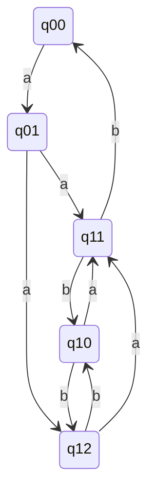

## Page 1

# Scientific Subroutine Package

**ND 210007/ND 210009**

## Compute

### (a) \( \binom{8}{5} \), (b) \( \binom{9}{7} \)

\[
\binom{n}{r} = \frac{n(n-1)(n-2)\ldots}{(n-1)(n-2)\ldots r}
\]

\[
\begin{align*}
(a) \quad \binom{8}{5} &= \frac{8 \cdot 7 \cdot 6 \cdot 5 \cdot 4}{1 \cdot 2 \cdot 3 \cdot 4 \cdot 5} = 56 \\
   &= \frac{6 \cdot 16!}{6! \cdot 11!} + \frac{11 \cdot 16!}{6! \cdot 11! \cdot 10!} = \ldots \\
   &= \frac{17 \cdot 16!}{6! \cdot 11!} = \frac{17!}{6! \cdot 11!}
\end{align*}
\]

### Further Calculations

\[
\frac{27 \cdot 26 \cdot 25}{25!} = \frac{2}{2}
\]

\[
\frac{11}{13 \cdot 12} = \frac{11!}{14 \cdot 13 \cdot 12 \cdot 1}
\]

### Compute: \( \frac{13!}{11!} \), \( \frac{7!}{10!} \)

---

---

## Page 2

# SCIENTIFIC SUBROUTINE PACKAGE

## INTRODUCTION

The **Scientific Subroutine Package** comprises a set of subroutines written in ND FORTRAN IV for users of ND Computer Systems. It is primarily developed to furnish the mathematical tools required to simplify the solution of complex problems encountered in engineering and the sciences. The Scientific Subroutine package — SSP — relieves the sophisticated user from the arduous and mundane task of program development and testing. For the novice, it eliminates the chore of acquiring a detailed knowledge of the novel and esoteric field of numerical mathematics and iterative algorithms. Special care has been taken in the selection of the various algorithms to ensure that truncation errors, numerical instability etc. will not jeopardize the final result. Execution speed, storage economy and ease of use have also been major concerns. However, the imperative objective has been to produce a program package which generates valid and reliable results.

## FEATURES

- Modular design
- Input/output independent
- Programmed in ND FORTRAN IV
- Can be combined in any sequence to solve complex problems
- Uniformly documented with examples of more complex subroutines
- Covers most mathematical requirements in statistics, research and engineering
- Parameter transfer by FORTRAN Call statement from user program

## PRODUCT DESCRIPTION

The ND 10007 — 48 bit format and the ND 10009 — 32 bit format Scientific Subroutine Package — SSP — consists of a collection of I/O independent, modular subroutines written in ND FORTRAN IV. The subroutines can be grouped into three categories: Statistics, matrix manipulation and "other" mathematics for use in science, industry and engineering.

In the development of the SSP, special concern has been given such factors as execution speed, storage economy and past experience with the applied algorithms.

The SSP provides the user with a wide collection of I/O independent computational building blocks that can be freely combined with the user's input and arranged to form the sequence required to solve a particular problem. As no fixed maximum dimensions are defined within the subroutines, no restriction is imposed on the user with respect to the size of the data arrays to be processed.

Many of the matrix manipulation subroutines handle symmetric and diagonal matrices (stored in compressed format to improve storage economy) as well as general matrices. This can result in considerable savings in data storage for large arrays. The use of more complex subroutines (or groups of them) is illustrated in the program documentation by sample main programs with I/O. All subroutines are documented uniformly.

---

## Page 3

# SCIENTIFIC SUBROUTINE PACKAGE

Individual subroutines, or a combination of them, can be used to carry out the listed functions in the following areas:

## Statistics

- Analysis of variance (factorial design)
- Correlation analysis
- Multiple linear regression
- Polynomial regression
- Canonical correlation
- Factor analysis (principal components, varimax)
- Discriminant analysis
- Time series analysis
- Data screening and analysis
- Nonparametric tests
- Random number generation (uniform, normal)

## Matrix Manipulation

- Inversion
- Eigenvalues and vectors (real symmetric case)
- Simultaneous linear algebraic equations
- Transpositions
- Matrix arithmetic (addition, product, etc.)
- Partitioning
- Tabulation and sorting of rows or columns
- Elementary operations on rows or columns

## Other Mathematical Areas

- Integration of given or tabulated functions
- Integration of first-order differential equations
- Fourier analysis of given or tabulated functions
- Bessel and modified Bessel function evaluation
- Gamma function evaluation
- Legendre function evaluation
- Elliptic, exponential, sine, cosine, Fresnel integrals
- Finding real roots of a given function
- Finding real and complex roots of a real polynomial
- Polynomial arithmetic (addition, division, etc.)
- Polynomial evaluation, integration, differentiation

# REQUIREMENTS

Memory requirements will depend on which subroutine(s) is used.

# REFERENCES

Scientific Subroutine Package Application  
ND-60.037 EN Description

---

