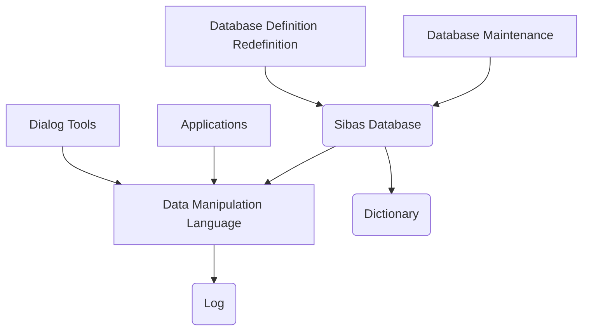
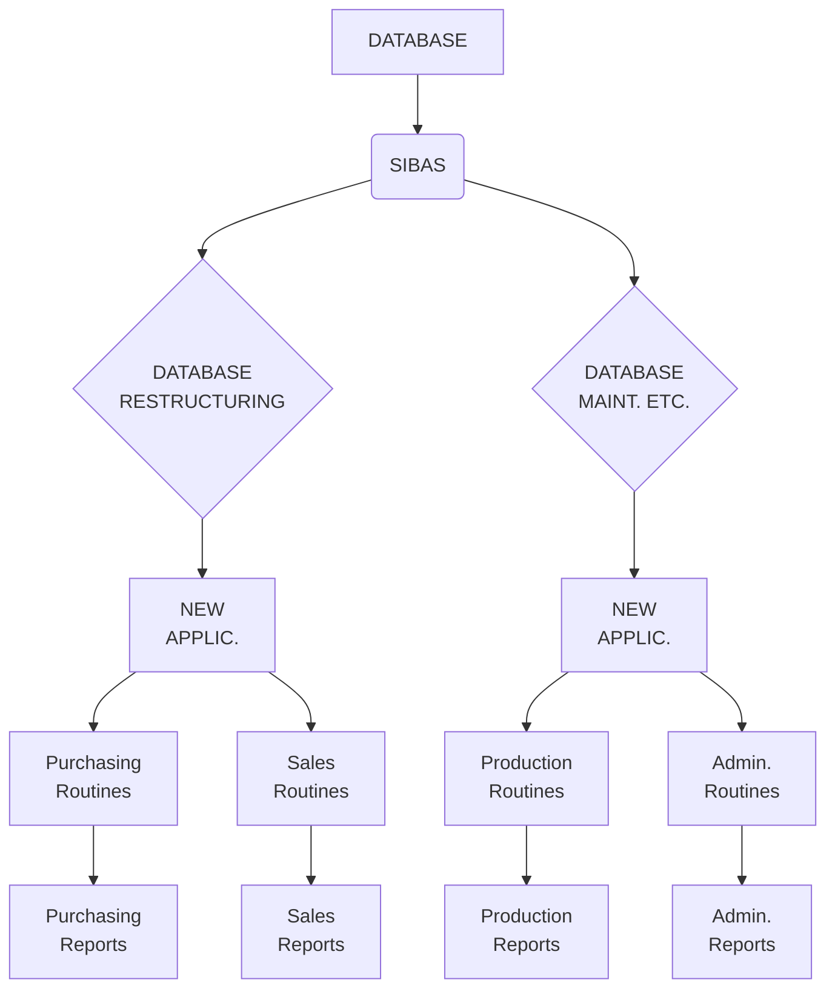
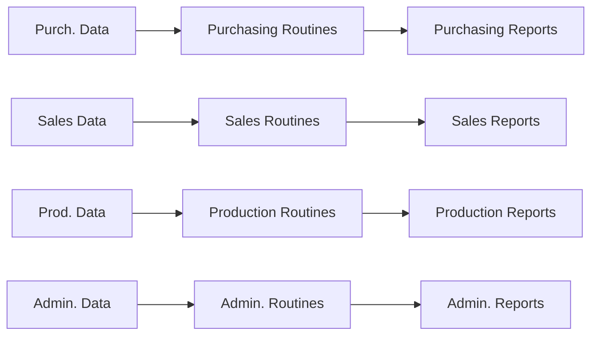
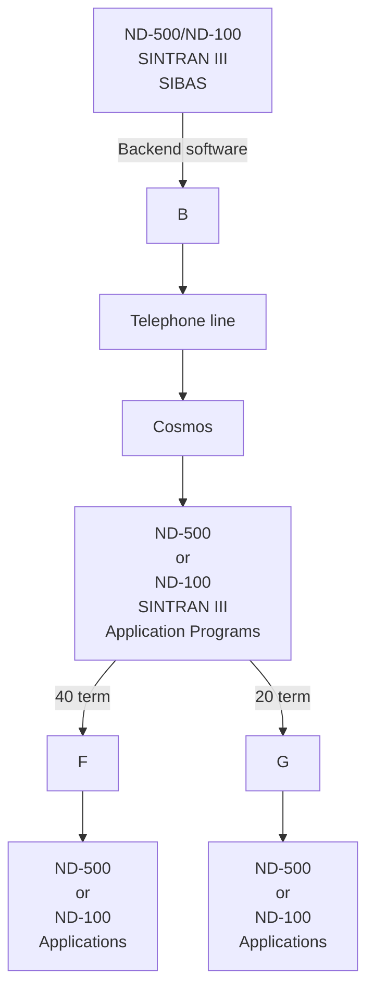

## Page 1

# SIBAS-II Database System for ND-100/ND-500

ND 210166/ND 210340



```
   ND
Norsk Data
```

---

## Page 2

# SIBAS-II: Database System for ND-100/ND-500

## INTRODUCTION

The SIBAS-II database system is part of a set of productive tools for administrative data processing available for the ND-100 as well as ND-500 computer systems.

The implementation of SIBAS-II on ND computers has used the advanced facilities of the SINTRAN III Operating System, thus minimizing the amount of additional routines in the programs, and offering multiple user programs simultaneous access to the same database in a controlled and secure manner.

## TRADITIONAL DATABASE SYSTEMS

The increasing complexity of present-day business practice makes it essential that good decisions can be reached rapidly and efficiently. Managers are relying more and more on suitable input to the decision-making process which can only be provided by computerized data management systems.

Unfortunately, many computerized information systems are based on a software technology which does not effectively use the capabilities offered by direct access storage. In addition, many systems have been structured such that even simple modifications to the system are expensive and time-consuming. The increasing need for online access to data requires that data is correctly, but flexibly structured and stored, and that it can be accessed in many different ways.

## FEATURES — SIBAS-II

- Functions under the powerful SINTRAN III/VS Operating System
- Controls a database local to own organization running on the firm's low-cost ND computer system.
- Transparent LOCAL and REMOTE database access through COSMOS network.
- Terminal oriented multiuser access.
- Controlled expansion of the database application
  - powerful database restructuring facilities
  - the hardware modularity offered by ND systems
  - conversational access to databases
- High level of data integrity; fail safe features.
- Integrated dictionary for 4th generation software.
- Cornerstone of the ND DIALOGUE Concept.

Special benefits offered by SIBAS-II when using the huge address space and fast CPU of an ND-500 system include:

- Full compatibility of database format, allowing applications and data to be easily "ported" between ND-100 and ND-500 systems.
- Applications running on either processor of an ND-500 may access the same database.
- ND-500 allows the database to be kept in virtual memory, provided that the size is within the 4.2 Gb address range. If the configuration permits, the whole database may in fact reside in physical memory, entirely eliminating disk transfers.
- Offers facilities normally found only on large mainframes with for example IDMS, IMS, DMS 1100, and TOTAL.
- Supported and maintained by highly qualified software personnel.

## THE DATABASE CONCEPT — WHAT IT MEANS

An increasing number of organizations are realizing the advantages of database management systems as fundamental tools for data processing applications. Traditional file-handling systems were application oriented and static in data-handling concepts. They provided a direct link between a specific file of data and an application program designed to handle this file only. As a rule, the data in one set of files for one set of programs was not available for other sets of programs. To the user, only "his data" was accessible.

In contrast, today's database management systems must handle data storage and retrieval requirements of a constantly changing environment. They must be data oriented, not application oriented.

The database in itself is an independent information resource, separated from the application programs. Consequently, a company’s database should be structured and managed so that it constitutes a resource to be drawn upon by the whole community of users.

Thus, the concept of a database system may be defined as the collection and administration of integrated and structured data, designed to serve the changing information requirements of a group of users.

Conventional systems:

A good database management system should offer the following capabilities:

- Flexible database structuring in direct access storage.
- Many possible access paths to and through the database.
- Preservation of database integrity in a concurrent processing environment; fail-safe features.

## SIBAS Database System Diagram



---

## Page 3

# SIBAS-II
Database System for ND-100/ND-500

- Control over unauthorized access to the data.
- Data independence — the ability to modify and enhance the application programs.
- Several high-level programming languages for the application programs.
- 4th generation development tools — query language, report generator, online application development (separately ordered products).

## Conventional Systems

### FILE HANDLING ROUTINES



## SIBAS-II: THE SOLUTION

Norsk Data A.S offers the SIBAS-II Database Management System which provides all the above capabilities in one compact, easy-to-use software package. SIBAS-II is a general database management system which:

- Offers complete separation of the Data Description Language (DDL) and the Data Manipulation Language (DML).
- Allows several access paths to records, enabling different application programs to use stored information as required.
- Includes a powerful restructuring facility which allows the database to be redefined for expansion, deletion and modification.
- Has established a central SIBAS-II user group for user contact.
- Is able to reflect the data structure as it usually appears to the user. Because of the flexible structuring facilities in SIBAS-II, data redundancy can be reduced to a minimum.
- Allows application programs to be written in several programming languages such as FORTRAN, COBOL, BASIC, PLAN and Assembly.
- Is generally applicable for various types of industries, organizations, governmental activities etc.
- Handles multithread concurrent processing, implements several automatic fail-safe features.
- Can grow as demands on the database increase.

The SINTRAN III Operating System has built-in facilities for machine-to-machine communication between ND computers. Technically, distributed databases are easily implemented using ND computer systems.

In some cases where online, multiterminal access to a database is desirable, it may not be economically feasible to have a large local machine system, or to use data transmission facilities to a remote machine system. In such cases, a locally managed database running on a minicomputer system is a practical solution.

## APPLICATION AREAS

SIBAS-II being used by governmental and commercial organizations in application areas such as:

- Shipbuilding ......... Material purchasing/steel purchasing/long-range capacity planning/cost analysis.
- Mechanical industry ......... Production planning/production control.
- Education/Research ......... Information analysis.
- Government administration ......... Budgets/economy.
- Banking ......... "in-house" enquiry system.
- Environment control ......... Pollution of fjords/disposal of solid refuse.
- Oil business ......... Management information systems.
- Health service ......... Hospital medication control/national health service.
- Local government administration ......... Map digitalization/location of sewers/municipal water pipes and communication cables/surveying, road lay-out profiles.

## SIBAS-II: DICTIONARY

SIBAS-II is the database management system of DIALOGUE. The dictionary which is the connection link between the members of DIALOGUE, is also based on SIBAS facilities. These members are:

- UNIQUE — Online application generation
- ACCESS — Query language
- RG — Report processing and generation
- ABM — Application Building and Maintenance
- BIM — Business Information Management

The dictionary provides descriptions of data items regarding type and length. It may also be used to support ad hoc queries and system design work, by inclusion of verbal documentation of usage. Having been made once, these description uniquely define the data.

## SIBAS-II: STRUCTURING CONCEPTS

### Location Modes

In SIBAS-II, there are many ways in which a database can be structured. The first step in designing a database is always to identify the basic types of records which will make up the database. For instance, in a typical marketing company, the following six record types might be identified as necessary:

- Customer
- Product
- Branch office
- Supplier
- Sales order
- Purchase order

---

## Page 4

# SIBAS-II
## Database System for ND-100/ND-500

Normally, each record type will have one item which is chosen as the primary key. In SIBAS-II the use of a primary key is not necessary, although in most cases it will be desirable. The choice of a primary key is related to how a record is stored in the database. SIBAS-II has two location modes, and the choice of location mode for a record type controls how the record is to be stored. The location modes in SIBAS-II are:

- CALC
- SERIAL

### Primary Keys

In the case of CALC, the primary key item is used when the record is stored. Choice of CALC implies use of a randomizing or hashing algorithm to distribute the records randomly across part of the database. The primary key may also be an index key. The primary key may be one or more elementary items, not necessarily contiguous in the record type. A key may be designated as either permitting or prohibiting duplicate values of the key item.

### Secondary Keys

The user may define one or more keys which are called search keys or secondary keys. Each key may be chosen as one or more items in the record type. An example of one record type with CALC and secondary indices is illustrated below:

All indices will be stored in ascending order on the index key. In this example the branch records could be processed in alphabetical order by TOWN, and the customer record in alphabetical order by NAME, ADDRESS or CUSTOMER ID.

```
  +-------------------+------------------+
  | Primary Calc.     | Secondary        |
  +===================+==================+
  |                   |                  |
  |       BRANCH ID   |        TOWN      |
  |                   |                  |
  +-------------------+------------------+
  |        BRANCH RECORD                 |
  +--------------------------------------+

  +-------------------+------------------+------------------+
  | Primary Calc.     | Secondary        | Secondary        |
  +===================+==================+==================+
  |                   |                  |                  |
  |     CUSTOMER ID   |      NAME        |    ADDRESS       |
  |                   |                  |      STREET      |
  +-------------------+------------------+------------------+
  |       CUSTOMER RECORD                |
  +--------------------------------------+
```

### Primary and Secondary Indices

The user may define as many indices as he wishes on each record type. Each secondary index is built up and maintained in the same way as a primary index, and all indices are automatically maintained by the system when the database is updated.

### Set Types

In addition to the facility for defining indices, the idea of defining relationships between record types and sets is fully supported in SIBAS-II.

In SIBAS-II, there are two classes of set types:

1. Single-member set type
2. Involuted set type

A single-member set type is the class which would be most frequently used and is effectively a relationship between two record types, as illustrated in the following figure. One record type, in this case BRANCH-OFFICE, is identified as the owner of the set type and the other is then the member set type.

```
  +----------------+          +-----------+
  | BRANCH OFFICE  | HANDLES  | CUSTOMER  |
  +----------------+          +-----------+
```

SIBAS-II supports a class of set types which is very valuable in many applications. This is called an involuted set type and means that there may be a relationship between a record type and itself, i.e., a hierarchy. This is valuable, for example, in a bill of material application where parts are made up of other parts. This is illustrated graphically as follows:

```
  +-------+          +------+
  | PARTS |   USES   |      |
  +-------+          +------+
```

SIBAS-II does not support sorted sets, which can be very time-consuming when records are stored. Instead, SIBAS-II secondary indices provide a similar facility since the indices are always maintained in sorted sequences of the key. One can also define manually maintained sets where the insertion of a new member is under the control of the application programmer.

In the above figures each rectangle represents a record type. In the SIBAS-II database, there would be several occurrences of this set type. One occurrence of a set type is usually referred to as a set. There would in fact be as many sets of the type HANDLES as there are occurrences of the record type BRANCH-OFFICE.

### Balanced Trees

Each index table is internally implemented as a balanced tree (B-trees). This mechanism allows SIBAS to fully support relation access methods.

---

## Page 5

# SIBAS-II
## Database System for ND-100/ND-500

**RK** = Record key  
**TP** = Table pointer  
**RP** = Record pointer  

### Levels

#### Level 1
| RK      | RP   |
|---------|------|
| ADAM    | 15   |
| ALEX    | 9    |
| ALLEN   | 20   |

#### Level 2
| RK      | TP   |                         |
|---------|------|-------------------------|
| ADAM    | 1    |                         |
| ANNE    | 1.2  |                         |
| EVA     | 1.3  |                         |
|         |      |          |

##### Records
| RK      | RP   |
|---------|------|
| ANNE    | 2    |
| CARL    | 13   |
| DON     | 8    |

#### Level 3
| RK      | TP   |
|---------|------|
| ADAM    | 1    |
| JERRY   | 2.1  |
| LEE     | 2.2  |
| LOUIS   | 2.3  |

##### Records
| RK      | RP   |
|---------|------|
| EVA     | 19   |
| FRED    | 25   |
| IGOR    | 3    |

##### Another Set
| RK      | TP   |
|---------|------|
| SAM     | 3.1  |
| TOM     | 3.2  |
| WILLY   | 3.3  |

### SIBAS-II: DATA MANIPULATION FACILITIES

The flexibility for structuring a SIBAS-II database is matched by the facilities provided for processing the data in the database. SIBAS-II is a host language database management system, which means that facilities have been added to standard programming languages, such as BASIC, COBOL, PLANC, and FORTRAN, to enable the application programs to manipulate the data in the database. These facilities are collectively referred to as the data manipulation language. The SIBAS-II facilities are based on those proposed by CODASYL while certain modifications have been made which enable the user to ensure a fuller degree of data independence.

Access to a SIBAS-II Database is essentially “direct” access, because the whole database is stored in direct access storage. Access to a data record can come from “out of the blue” using an index (primary or secondary) or the CALC algorithm. Access can be made relative to a recently found record. This kind of access may use either an index or a set type relationship.

### “Out of the Blue” Access

An “out of the Blue” access requires the user to provide the value of either a primary key or a secondary key, as well as identifying the type of record to be retrieved. The system searches the database to see whether the record type sought can be found. If there are several records with the same key value, the first of these is retrieved. The user can subsequently access the others using a relative access.

### Chains

Each set is represented in storage by what is usually referred to as a chain. SIBAS-II allows the user to make a choice for each set type between unidirectional chains and bidirectional chains, as illustrated.

```plaintext
   Link to Next Only (unidirectional)

     Oslo
    /    \
 Olsen   Jensen
```

```plaintext
   Link to Next and Prior (bidirectional)

     Oslo
    /    \
 Olsen   Jensen
```

### Relative Access

```plaintext
   Relative Access

   REALM                REALM
   +----------------+   +----------------+
   | Owner of set   |   | Members of set |
   +----------------+   +----------------+
   |   RECORD       |   |   RECORD       |
   |   RECORD       |   |   RECORD       |
   |   RECORD       |   |                |
   +----------------+   +----------------+
            NAMED SET
```

### Relative Access

Relative access is used to locate a record relative to a record already found. The types of relative access are:

- Record with a duplicate value of the access key relative to another record with the same key value.
- Record with a duplicate or next higher or next lower value of an access key via index for records with key values via index lying between two limits defined at run-time.
- All records in a realm in ascending or descending order with respect to the value of the access key.
- All records in a realm in physical serial order.

---

## Page 6

# SIBAS-II
## Database System for ND-100/ND-500

- Set member relative to set owner.
- Set member relative to another set member.
- Set owner relative to a set member.

Members of a set may be processed in both directions, i.e., prior or next relative to another set member. Defining secondary indices and processing the records sequentially via the indices will give the user the impression that the records are sorted on each index key.

### Multirecord Retrieval

Once a search region is established, all records corresponding to the criteria may be accessed in one single call (depending on the buffer size). This facility greatly speeds up processing.

## SIBAS-II: CONCURRENT PROCESSING

In SIBAS-II, several run-units may process the same database concurrently. The word "run-unit" is used to identify the fact that the same program may be executed by several users simultaneously, with different parameter values. Each "executing instance" of the program is called a run-unit.

In SIBAS-II, a data base is divided into a number of "realms". A user must signify his intention of processing the records in a realm and at the same time declare a usage mode. SIBAS-II supports the following usage modes:

- Retrieval
- Load
- Up-date

And the following protection modes:

- Non exclusive up-date
- Exclusive up-date

In addition, all the records that a given run-unit is currently processing are in so-called EXTENDED MONITOR MODE. Any action by concurrent run-units which may affect the given run-unit’s records is noted, and the information passed to the given run-unit as needed. Individual records in EXTENDED MONITOR MODE may be LOCKED, preventing concurrent run-units to access them.

## SIBAS-II: PRIVACY

### Password on the database

SIBAS-II supports occurrence level privacy locks. This means that an item in a record may be identified as a privacy lock and the user must give the correct value of the item when attempting to retrieve the record. This simple device enables the customer to define an effective control over the access to individual records.

```
+---------+------+------+
| SECRET  | ITEM | ITEM |
|         |  🔒  |      |
+---------+------+------+
```

## SIBAS-II: RESTRUCTURING

Considerable attention has been given in the design of SIBAS-II to the importance of restructuring a database by adding any of the following:

- New items to existing record types.
- New record types.
- New set types.
- New indices.
- New texts.

Furthermore, it is possible to delete items, record types, set types and indices, and to rename or change items, record types, set types and texts.

The ability to restructure a database is of particular importance when:

- New applications require new data or new structuring of existing data.
- Existing data and data structures become obsolete.
- The amount of data to be stored in the database grows larger than anticipated, leading to low performance and poor economy.

The advantages to the user of the restructuring facility are several:

- It obviates the need for dumping the data, redefining the whole database and reloading the old data.
- It simplifies the task of designing the original database, as it is not crucial that all possible future requirements are taken into consideration.
- The development of a database can be done in steps. A simple system may be expanded and changed without prohibitive expenses in time and money.

## SIBAS-II: BACKEND

A SIBAS database may be accessed from another ND computer through a COSMOS network. This feature supports truly distributed processing in an easy-to-use, transparent, safe and efficient manner. The backend feature is optional and must be ordered separately.

## SIBAS-II: LOGGING AND RECOVERY

### Routine Logging

The routine log is essentially a sequential file where the SIBAS-II input packets (calls) are recorded before they are processed. SIBAS-II output packets are also recorded. Routine logging is specified in the starting procedure of SIBAS-II and provided a simple and robust processing mechanism.

When routine logging is on, SIBAS-II input packets are written on the log file. In case of breakdown, this log file can be used in conjunction with a backup copy of the database or a rolled-back database, to reprocess the input to SIBAS-II and bring the database to a state just before the breakdown occurred.

### Before Image Logging

The before image logging may be turned on when SIBAS-II is started. The before image log will contain a copy of all pages changed as they looked before the

---

## Page 7

# SIBAS-II
Database System for ND-100/ND-500

The **before image log** may be used to roll the database back to a checkpoint where it is consistent. Together with the routing log it gives a fast and simple way of recovering the database without using a backup copy of the database. As an example, recovery time usually is only 1 to 5 minutes.

## Transaction Units

A single transaction can be backed out, without interference with a concurrently executing run-unit. This facility requires the use of the **before image log**.

## Checkpoints

Checkpoints are taken automatically when the database is physically closed, i.e., when the last run-unit closes the database. In addition checkpoints may be defined to be taken as a function of the length of the log or key, and may be initiated from user programs by a call.

## SIBAS-II: OPERATION

SIBAS-II is implemented on ND-100 and ND-500 series of computers under the SINTRAN Operating System. SIBAS-II may be used in a multiuser, multicomputer environment. SIBAS-II requires approximately 128 Kb virtual memory for the program, and 128 Kb for the buffer area.

## SIBAS-II: MODULES

```
   ┌─────────────────────────┐
   │ SIBAS                   │
   │ Database Maintenance/   │
   │ Module                  │
   └─────────────────────────┘
               │
               │
               ▼
   ┌─────────────────────────┐
   │ SIBAS                   │
   │ Database Redefinition   │
   │ Module                  │
   └─────────────────────────┘
               │
               │
   ┌───────────▼───────────┐
   │ Application Programs  │
   └───────────────────────┘
               │
               │
   ┌───────────▼───────────┐
   │ SIB Inter             │
   └───────────┬───────────┘
               │
   ┌───────────▼───────────┐
   │ SIBAS Service         │
   └───────────┬───────────┘
               │
   ┌───────────▼───────────┐
   │ Dictionary            │
   └───────────┬───────────┘
               │
   ┌───────────▼───────────┐
   │ Database              │
   └───────────────────────┘
```

The SIBAS-II Database Definition/Redefinition Module is used for defining a database, i.e., defining the structure, the access keys and the size of the database.

The SIBAS-II Data Manipulation Module is called from the application programs to store, read, modify or delete information in the database.

The SIBAS-II Database Maintenance Module contains possibilities for defining and changing passwords, printing the contents of the database and verifying the database.

The SIBINTER module allows direct manipulation of the database through a set of commands, not requiring application programming. Transactions can be defined by creating command-input mode files, and simple reports can be generated.

## An Example: Multicomputer Configuration/Distributed Data Processing



## DOCUMENTATION

| Document                   | Reference      |
|----------------------------|----------------|
| SIBAS-II User's Manual     | ND-60.127.5 EN |
| SIBAS-II Operator's Manual | ND-30.009.3 EN |

## ORDERING INFORMATION

| Product      | Reference  |
|--------------|------------|
| SIBAS-II ND-100 | ND 210166 |
| SIBAS-II ND-500 | ND 210340 |
| SIBAS Backend   | ND 210197 |

---

## Page 8

# THE ND INFORMATION SYSTEM CONCEPT

The ND Information System consists of terminals, the user environment, programs, and the communications, processing and storage systems. Each terminal uses the rest of the system as a common information processing facility. The programs represent different ways of handling information. Some of these functions are mainly office support oriented, like word processing, electronic mail or file queries. These are collectively called the NOTIS family of office support systems. Other functions are predominantly used for administrative data, such as data entry and transaction processing or report generation. This set of functions are known as the DIALOGUE Information Supporty System.

Each customer may wish to include NOTIS, DIALOGUE or both. Because of the close relation between office support and general administrative data processing, this flexibility is important. The following description covers both the NOTIS and the DIALOGUE Information System Concepts.

# THE USER ENVIRONMENT

A user communicates with the system via a terminal and a set of menus. Instructions to NOTIS may be selected from these menus or entered directly. Each user has a personal user-environment profile, which allows for a tailormade working environment, and ensures a comprehensive and safe interface between the user and the system.

# THE PROGRAMS

NOTIS and DIALOGUE include a set of programs to execute a comprehensive group of information processing functions. Some functions, considered equally important in the office environment and in general administrative data processing, are members of both.

NOTIS consist of modules for entering and revising documents, maintaining address lists and client registers, retrieving information, including it in reports and so on. A main function is the powerful and flexible full-screen word processor. This can be used independently for letter and document production, or to prepare data for other modules such as telex or teletext messages, spreadsheet calculation, business graphics, etc. A common document storage module enhances this combined use of several NOTIS functions.

DIALOGUE is a set of productivity functions for Administrative Data Processing (ADP), sharing a common information base. Productivity is achieved in two ways. For development of operational systems, DIALOGUE offers a 4th generation applications tool as well as a "work bench" with support for screen handling and database management. The second important aspect is that it provides a direct interface to the databases, removing the barriers that ADP systems often appear to create between themselves and the user community. The direct processing functions comprising report generation and interactive access and queries, are also available with NOTIS. DIALOGUE is centered around a powerful database management system with a global dictionary.

# GROWTH

The potential for expansion is a fundamental part of the ND Information System Concept. Having begun with a simple NOTIS system, your growing needs can be satisfied by adding additional NOTIS and DIALOGUE modules. The ND System Architecture for Expansion (ND SAFE) concept guarantees you the ability to enhance your present system. An ND Information System may grow into a distributed network, interconnected by the COSMOS data communication network. Information stored anywhere in a network or even on computers from other vendors can be immediately available to any user of any terminal, provided that the user has the necessary authorization.

---

