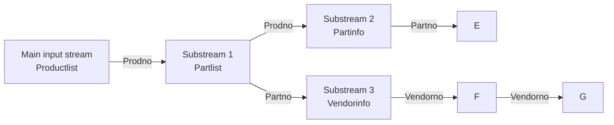

## Page 1

# ND 210193 Report Generator for ND-100 
# ND 210528 Report Generator for ND-500

## INTRODUCTION

The Report Generator (RG) is a high-level, end-user or professional system for designing and producing reports comprising both data and text. Within ND’s office support concept, NOTIS, it is known as NOTIS-RG. It is also a full member of the DIALOGUE concept, a set of productive tools for administrative data processing. Areas of application include the production of standard letters and catalogs, financial reporting and accounting. NOTIS RG is ideal for many traditional batch programming tasks, but requires far less work.

### USERS:

- **Report Design**
  - Programmers
  - Analysts
  - Experienced end users

- **Report Production**
  - Secretaries
  - Managers
  - Clerks

**Examples of Use:**

- Mailing labels
- Telephone lists
- Sales reports
- Statistics and summaries
- Standard letters
- Invoices
- Directories

## FEATURES

- NOTIS-WP compatible editing of report layout
- Reports from sequential files, ISAM files and SIBAS realms
- Data from many files and realms merged in the same report
- Each report can access several SIBAS databases
- Efficient key search may be combined with general selection criteria
- Group key search in ISAM and SIBAS
- Data Dictionary assistance
- Sorting and control breaks on up to 12 levels
- One report definition may generate several output files
- Text fields may be printed as text columns with given width
- Full inter-field arithmetic and field totaling
- String and substring management
- Easy access to system data, for example, date, page number, etc.
- Calendar functions

## PRODUCT DESCRIPTION

### Using RG

The user enters the RG system from a standard NOTIS terminal. The Input-Definition part is used to specify the format of the input data, field lengths, data-types, etc. When used in the DIALOGUE context, this information is supplied by the SIBAS Data Dictionary.

The report itself is specified in the interactive Report Definition module. Report areas are defined and displayed on the screen. After the report has been defined, the production of the actual report can be started. The report definition is stored in a NOTIS-RG Library file for later use.

```mermaid
flowchart TD
    A[RG Interactive Report Definition Module] --> B(Report)
    C[RG Input File Description Module] --> B
    D[Library containing Report Descriptions and Input File Descriptions] --> A
    D --> C
    E[NOTIS-RP REPORT PRODUCTION] --> B
    F[ISAM FILE(S)]
    G[SIBAS REALMS]
    H[SEQ. FILE(S)]
    F --> E
    G --> E
    H --> E
    E --> B
```

---

## Page 2

# Report Layout

A report may consist of many areas. Each area consists of a descriptor and one or more lines of text and output fields. At least one of any type is mandatory in every report. RG accepts 4 types of areas:

| Area Type | Description |
|-----------|-------------|
| **1 REPORT** | These areas appear only once, first and/or last. |
| - HEADING  | Both areas may be printed vertically centered on a separate page. |
| - FOOTING  |  |
| **2 PAGE** | These areas appear once on each page, first and/or last. |
| - HEADING  | Useful for printing page number, headings, footings, and page summaries. |
| - FOOTING  |  |
| **3 CONTROL** | Each control area is associated with one input field; a control field. Control areas are printed whenever their control field changes value. A maximum of 9 control fields may be used in one report. |
| - HEADING  |  |
| - FOOTING  |  |
| **4 DETAIL** | A detail area is printed for each input record. Standard letters may be written in a detail area with name and address fields fetched from your customer name and address file. |

# Output Fields

Any report area may contain text and output fields. An output field is a user defined field which is filled with data during report production. The data may come from one of several sources:

- One of up to 10 input data files.
- One of up to 5 NOTIS WP LOOKUP files.
- A DERIVED INPUT FIELD where the data is a result of a string operation or a calculation.
- A system function such as TOTAL, MIN, etc.
- A system field such as DATE, PAGE etc.
- The terminal as a result of a USER QUESTION.

Output fields may be given a name and referred to in another field as part of a string manipulation or calculation.

# Data Sources

Every NOTIS-RG report must have at least one input source: a sequential file, an ISAM file, or a SIBAS realm. In addition, several files or realms may be accessed as substreams. A maximum of 9 substreams may be accessed in one report. Records may be retrieved from a substream by key search. If the substream is a sequential file, RG will simulate a key search. Data from one retrieval may be manipulated, using RG’s numeric and string operators, and used to retrieve data from another substream.

To illustrate, here is an example of how simple it is to access data using substreams. Suppose you want a list of all manufactured products in the “Productlist” file. For each product, you want a list of all the parts used and the vendor’s name. The following data model may be used. As shown, the field “Prodno” in the main input stream is used as a non-unique key to access a set of records in the “Partlist” file. The part number is also used as a unique key to find the part description, and the vendor number is used to fetch the vendor’s name from the “vendor” file.



To access these fields, all you have to specify as output field sources are:

- PRODUCTLIST.NAME
- PARTINFO.NAME
- VENDORINFO.NAME, etc.

RG then automatically takes care of the necessary database access for you.

```ascii
    +------------------------------------------------+
    |                Report Heading                   |
    |-----------------------+-------------------------|
    |      Page Heading     |                         |
    |-----------------------+-------------------------|
    | MONTHLY SALES REPORT FOR JUNE                   |
    | PAGE 1                                            |
    +-------------------------------------------------+
    | Control Heading level 1                          |
    | Control Heading level 2                          |
    | Details, 1 per input record                      |
    +-------------------------------------------------+
    | Product category: Hardware                      |
    | Product  Volume  Price  Value                    |
    | ND-100   37      100.00  3,700.00                |
    | ND-560   12      200.00  2,400.00                |
    | ND-570   8       400.000 3,200.00                |
    | Monthly total                9,300.00            |
    +-------------------------------------------------+
    | Product category: Software                       |
    | Product  Volume  Price  Value                    |
    | NOTIS-RG 10      4,000  40,000.00                |
    | SIBAS     12,000  12,000.00                      |
    | Monthly total                136,000.00          |
    +-------------------------------------------------+
    | Sales department total for June: 9,436.000.00    |
    +-------------------------------------------------+
    | Control Footing  level 1                         |
    | Page Footing                                     |
    +-------------------------------------------------+
    |                                            -- 20 July --         Page 1 |
    |                                            -- 20 July --         Page 2 |
    | Grand total for June:        23,236,000.00                     -- 20 July --  Page 9 |
    +-------------------------------------------------+
    |                 Report Footing                  |
    +-------------------------------------------------+
```

---

## Page 3

# Named Expression

A named expression may be regarded as a derived input field. The data referred to by a named expression is usually the result of calculation or string operation. The data is conditionally updated every time a new data record is read from the main input file.

# User Questions

Any number of user questions may be defined for each report. The questions are asked each time the report is produced. This way, report parameters like selection criteria may be changed each time the report is produced.

# Lookup

RG offers a simpler LOOKUP facility, as an alternative to using substreams. NOTIS-WP may be used to make LOOKUP files, containing tables that are used to replace key values. For example, if a field in the input file contains a three-figure division number, and we wish to replace this with a division name and the number of people budgeted for that division, then the LOOKUP file may look like this:

```
123 = Research and Development  21
124 = Marketing - Publishing     5
386 = Sales Education           12
056 = Service                    9
```

# System Fields

The following system fields are available as shown in the table below:

| Field         |
|---------------|
| BREAKLEVEL    |
| BREAKCOUNT    |
| COUNT         |
| DATE          |
| DAY           |
| DOMDAY        |
| FIXDATE       |
| HOUR          |
| INPUTFILE     |
| MINUTE        |
| MIDDAY        |
| MONTH         |
| PAGE          |
| REJECTCOUNT   |
| REPORT        |
| SUBCOUNT      |
| YEAR          |
| YYMMDD        |

# Constants

Text and Numeric constants may be used freely in string operations. Text constants are enclosed in single apostrophes.

# System Functions

The following system functions are available as shown in the table below:

## Totalling functions
- TOTAL
- SUBTOTAL
- MIN
- MAX

## Datatype conversion functions
- STRING
- VALUE
- CONVERT
- CHR

## Case conversion functions
- UPPERCASE
- LOWERCASE
- NAMECASE
- SPACECASE

## Numeric rounding functions
- ROUND
- TRUNC
- MODULO

## Calendar functions
- FUTURE·DATE
- NUMBER·OF·DAYS
- WEEKDAY

# Arithmetic and Logic

Arithmetic operators: `* / + -`

Logical operators: `AND OR NOT > < >< <= >= =`

All arithmetic is carried out in COBOL compatible 18 figure BCD arithmetic.

# Input Files

## FORMAT

RG may process sequential files, ISAM files and SIBAS realms. These files may contain any number of fields with both fixed and variable length fields in any order. Variable fields are identified by a unique, user-defined termination character. Variable length records are separated by explicitly defined characters, for example, a blank line or a commercial at sign, (`@`).

## INPUT FIELDS

There are nine types of input fields:

| Type        | Description                                 |
|-------------|---------------------------------------------|
| ALPHANUMERIC| strings or ordinary ASCII characters        |
| COLUMN      | text fields with many lines                 |
| NUMERIC     | text strings representing numbers           |
| INTEGER     | binary integers                             |
| REAL        | binary reals                                |
| UNPACKED    | ASCII coded decimals                        |
| PACKED      | binary coded decimals                       |
| GROUP       | SIBAS or ISAM group fields                  |
| NONSTD      | nonstandard data type                       |

## SELECTION

Selection criteria may be specified for records to be included in the report. Logical operators may be used to operate upon any input fields in any combination to provide the required criteria. In addition to the selection criterion, a key search in the main input file may be specified. This speeds up reporting from large realms or files.

## SORTING

Up to 12 sort keys may be used. Both input fields and named expressions may be used as sort keys. Sorting may be either ascending or descending.

# REQUIREMENTS

The Report Generator requires SINTRAN version I or later.

The RG Report Generator consists of two separate programs:
1. The interactive Report Definition part, NOTIS·RG (170 pages)
2. The Report Production part, NOTIS·RP (140 pages)

Approximate storage requirements are shown in parentheses.

# DOCUMENTATION

- NOTIS·RG Reference Manual .............. ND·63.013 EN
- NOTIS·RG Håndbok .......................... ND·63.014 NO

---

