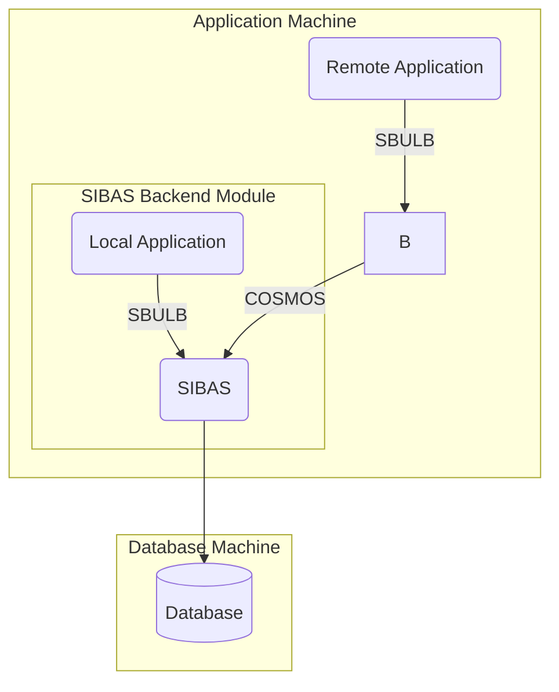

## Page 1

# SIBAS Backend Communication Module for ND-100/ND-500

ND 210197

[Photo: ND Norsk Data Logo]

---

## Page 2

# SIBAS BACKEND COMMUNICATION MODULE

## INTRODUCTION

ND 210197 SIBAS Backend Communication Module makes it possible to access one or more SIBAS-II databases from a remote ND-100 or ND-500.

Distributed computing will then be possible without programming effort. A number of configurations are possible and easy to implement.

## FEATURES

- Serves any ND-100/ND-500 configuration
- Access from one or several application machines
- No programming modifications are necessary
- Makes use of COSMOS communication lines

## PRODUCT DESCRIPTION

The figure on the cover demonstrates a solution for two machines, but it is possible to increase the number of application machines. The capacity of the machine for database-oriented applications may thereby be significantly increased.

As an example, imagine a system based on one machine with a great deal of SIBAS activity. To increase the capacity of the system, one machine may be added and the total load split.

One machine runs only applications (Application machine), and the other runs both the database(s) and some applications (Database machine).

Such a change may be made without any modification to the application programs. The system may later be upgraded with more machines to further increase the capacity.

Another example is the case where a database is held at a central site, but may be accessed from remote systems through local or public area network.

## REQUIREMENTS

SIBAS Backend Communication Module runs under the SIBAS-II Database Management System.

COSMOS communication is required between the Database machine and the Application machine(s).

## DOCUMENTATION

This is included in the SIBAS-II documentation.

---

210197-7000-0286

Scanned by Jonny Oddene for Sintran Data © 2021

---

