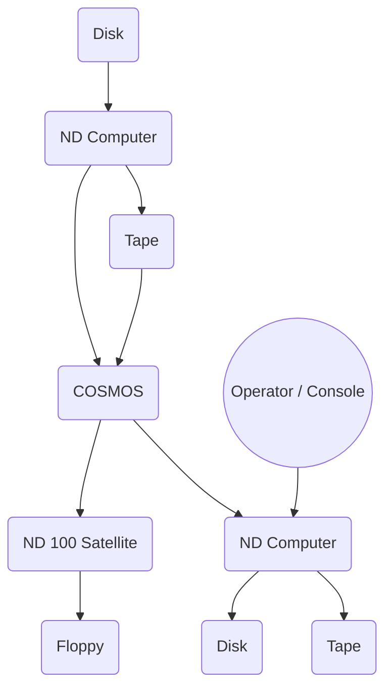

## Page 1

# The Backup System

ND 210337



```
  _______                             __
 |       \                         _ |  |
 | $$$$$$$\ __    __  ______ ____| \| $$
 | $$__/ $$|  \  |  \|      \    \| $$ __\
 | $$    $$| $$  | $$| $$$$$$\$$$$$$| $$/  \
 | $$$$$$$ | $$  | $$| $$ | $$ | $$| $$  $$
 | $$      | $$__/ $$| $$ | $$ | $$| $$$$$$\
 | $$       \$$    $$| $$ | $$ | $$| $$ ___\
  \$$        \$$$$$$ | $$  \$$  \$$| $$|  $$
                          \$$         \$$\$$
```

[Scanned by Jonny Oddene for Sintran Data © 2021]

---

## Page 2

# THE BACKUP SYSTEM

## INTRODUCTION

The **backup system** offers a variety of facilities for copying files between users, or to and from disk, diskette and magnetic tape. Files may be copied for archival, duplication, and other purposes. The backup may be performed interactively, with mode files or in batch jobs. When using Volume media (magnetic tape or diskettes), the Backup System will ask for the mounting and dismounting of backup media if more than one medium is used.

The DEVICE-COPY command offers fast copying of complete device units of different types. The users are also allowed to take incremental backup of their own files. In a decentralized machine configuration, where the computers are connected through the COSMOS network system, backup on a specific computer may be performed from any machine in the network.

The backup medium may also be connected to any machine in the network. When using the MULTI-USER-COPY command (see below) between two directories, both directories must be connected to the same computer. To enable communication with non-ND installations, ANSI standard label format is available for magnetic tapes. When the BACKUP SYSTEM is used interactively, help functions are available at all dialogue levels to give descriptions of parameters for the command being used, or information about other commands.

## SIMPLE USE OF THE BACKUP SYSTEM

**Personal backup:**
If you want to take personal backup, the backup medium is usually one or more floppy diskettes. Use the command COPY-USERS-FILES, to copy your specified files. If the volume of data is so large that one diskette cannot hold it all, use the command CREATE-VOLUME before copying. A volume may contain files from many users, and a file may extend over several volumes. With the command MULTIUSER-COPY, you may copy files from several users in one command.

## FEATURES

- Backup can be performed interactively, with a mode file or in batch jobs.
- Copying user files.
- Backup logging.
- Selecting files by logical combinations of selection keys, e.g. files modified since last backup (incremental backup).
- Possibility of using a specific backup/copying function directly from a User Environment menu.
- ANSI-defined format.
- ANSI-defined format + some SINTRAN III file system information.
- Copying of selected files.
- Copying of files with exact file name matching.
- Interactive HELP facilities at all levels.
- VOLUME create.
- VOLUME list.
- VOLUME delete files.
- Simultaneous backup/copy and file shrink.

## PRODUCT DESCRIPTION

The backup system may be called with commands, with all their parameters as an input-string.

### COMMAND SUMMARY

- **DESCRIBE-ALL-COMMANDS**
  - Gives a detailed description of all commands available, and their options and parameters.

- **DEVICE-COPY:**
  - The command DEVICE-COPY performs fast copying of complete device units. The source and destination device may be of different types, making it possible to take complete backup copies of disks to disk, tape or streamer-tape. By "freezing" the operating system, it is possible to use the system's main unit as backup medium, thus in many cases reducing the need for removable disk units.

- **CREATE-VOLUME**
  - Creates a `<VOLUME>` on magnetic tape or floppy disk. A VOLUME may contain files from many users. A file may extend over several volumes.

- **LIST-VOLUME:**
  - Lists the contents of a VOLUME on magnetic tape or floppy disk.

- **DELETE-VOLUME-FILES:**
  - Deletes all files on a VOLUME following and including a specified file.

- **RECREATE-FILES-AND-USERS:**
  - Creates files and users listed on a parameter file onto a directory.

- **MULTIUSER-COPY:**
  - Copies several users of a directory in one command. This will not work between directories over COSMOS.

- **COPY-USERS-FILES:**
  - The BACKUP SYSTEM will create all the necessary file names, and will copy one or more files from a user on one medium or machine, to a user on the same or on a different medium or machine. Copying between machines presumes that the machines involved have COSMOS installed. For medium selection, there are options available in SERVICE-PROGRAM-CUF (see below) to assist with more complex copying requirements. User SYSTEM may access any user's files with the same access rights as the file owner, allowing files to be copied on behalf of the user. Use of the COPY-USERS-FILES or MULTIUSER-COPY commands in the incremental backup mode will also result in the copying of the contents of the fields FILE ACCESS, LAST DATE OPENED FOR READ, LAST DATE OPENED FOR WRITE, CREATION DATE and MAX-BYTE-POINTER from the source file to the destination file.

---

## Page 3

# THE BACKUP SYSTEM

## SERVICE-PROGRAM-CUF

Can be used to modify the function of the copying command. In this manner the user can control the way the backup system works. The following commands are available in this program:

### DUMP-BACKUP-SYSTEM

This command dumps the system with the values currently set for the different mode and control parameters, making it possible to use the same values later.

### USER-INCREMENTAL-MODE

This is a command restricted to user system. The command controls whether users are allowed to use the selection criteria MODIFIED-SINCE-LAST-BACKUP to take incremental backup of own files.

### SET-DENSITY

The command is used to set the density on STC magtape stations.

### VOLUME-MODE

This command decides how the system will handle indexed files with holes when copying to a volume on tape.

### SINGLE-SEARCH-MODE

This command controls the search strategy when copying files from a volume. When the mode is switched ON, the copying will end when the first non-matching file is encountered after a matching file has been found on the source volume. The magtape or floppy disk remains positioned at the end of the last file copied.  
When the mode is OFF, all files found in the volume are copied.

### SET-DEFAULT-ANSWERS

This is a command to decide how the system will handle runtime questions, when a system is running in batch or as a mode job. The command is useful to avoid breaking processes to ask questions.

### COMPARE-MODE

The command is used to decide whether the system should make a comparison between source and destination after the copying process. It may be used for both file-copying and device-copying.

### COPY-MODE

This command enables the user to choose between different copy alternatives. Together with the advanced features in the SELECTION subsystem, it provides a good possibility to keep the directories tidy.

### SET-VOLUME-ACCESS

The command is used to set or reset access for public users to volumes other than their own.

### MASTER-LOG-MODE, USER-COPY-LOG-MODE

Both commands cause copy command information to be written into a LOG file.

## SET-MATCHING-MODE

This command may be used to demand exact file-name matching.

## SHRINKING-MODE

By this command one may determine that the destination file should be shrunk according to actual size. However, database files and other contiguous files will not be shrunk.

## DESTINATION-EXPANSION-MODE

User SYSTEM may set the Backup System in automatic expansion mode so that the destination user space is expanded, if necessary, to contain the destination files. When running the MULTIUSER-COPY command, destination user name will be created if it does not exist in advance.

## DOCUMENTATION

| Title                                      | Code          |
|--------------------------------------------|---------------|
| BACKUP User Guide                          | ND-60.250 EN  |
| Sikkerhetskopiering Brukerveiledning       | ND-60.250 NO  |

---

