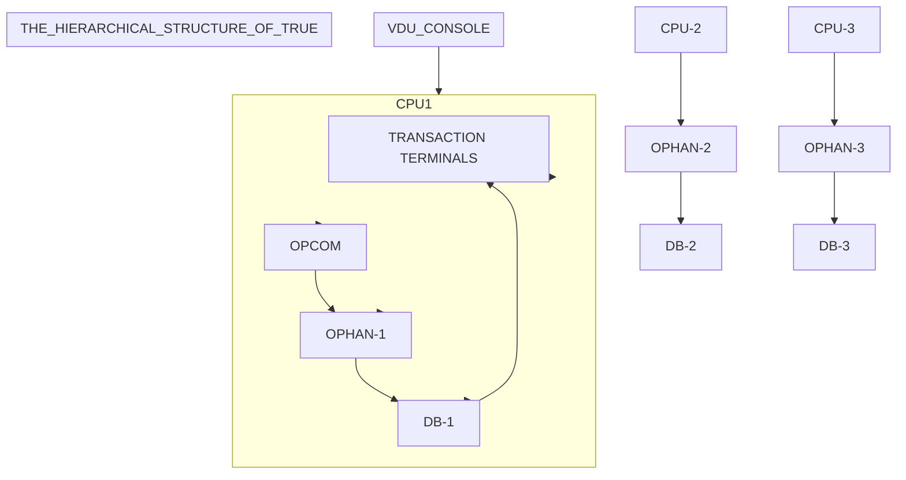

## Page 1

# TRUE
## TRANSACTION USER ENVIRONMENT

ND 210557 TRUE for ND-100  
ND 210558 TRUE for ND-500  



### Notes
- **OPCOM** = Operator Communication Program  
- **OPHAN** = Operation Manager  
- **DB** = Database

```
   ND
Norsk Data
```

Scanned by Jonny Oddene for Sintran Data © 2010

---

## Page 2

# Introduction

Management of a user's transaction system includes tasks like terminal control, program access control, database checkpointing and recovery.

TRUE is a supervisory program system that offers hierarchic control over a distributed set of background processes in a COSMOS network, or in a single-CPU SINTRAN III system. In cooperation with a Database Management System (e.g. SIBAS) which provides the primitive functions necessary for database recovery, TRUE acts as a Transaction Processing Monitor. The principal task of a TP monitor is to maintain the data integrity between the transactions in all databases that are under monitor control.

TRUE includes an optional user menu and report system, called TRUEMAN.

# Features

- In cooperation with a Database Management System, like SIBAS, TRUE acts as a TP monitor for ordinary background processes in one or more ND-100 or ND-500 systems.

- TRUE has a modular design. The different TRUE modules (max. 24) may be distributed to several different computers.

- Each TRUE module consists of a set of databases and their surroundings of transaction processes and transaction programs.

- Both the total system control and user program select functions are menu-driven.

- TRUE accepts application programs written in any language. But programs making TRUE function calls must be written in a language with a FORTRAN-compatible call interface.

- TRUE is delivered with some central routines in source code which allows the system to be tailored to the individual user needs.

The databases are controlled by a set of subroutines which are loaded together with the TRUE-OPMAN program. Symbolic versions of these subroutines are delivered, since some customers may want to modify them according to their own special needs.

The modules may be controlled, selectively or collectively, from a subsystem called TRUE-OPCOM. TRUE-OPCOM can only be active on one terminal at a time. Access to TRUE-OPCOM may be set according to the users' desires. TRUE-OPCOM presents the commands in the form of a two-level menu. Messages from the internal system may be displayed on the bottom four lines of the screen.

Most TRUE-OPCOM functions are also available from application programs by means of a TRUE User Library. All transfer of function calls is taken care of by XMSG, the message system COSMOS is based on. The use of XMSG is hidden from the programmers using the functions.

The following functions are managed by the SINTRAN III operating system directly - with TRUE supervision:

- Paging of all program code and transaction data.
- Multithread task handling.
- Code protection and reentrance.
- Application priority and timesharing.

# Product Description

The kernel of a TRUE module is a dedicated batch process executing a version of the TRUE-OPMAN program, which performs the TRUE monitor functions on behalf the module.

A TRUE-OPMAN version controls:

- A group of terminal processes called transaction terminals. Some of them may be permanent members of the group.

- A group of transaction batch processes. Some of them may be permanent members of the group.

- A group of databases.

- The access to transaction program files.

- The execution of batch jobs by permanent batch process members. Batch queue entry time and periodic interval may be preset if desired.

---

## Page 3

# APPLICATION PROGRAMS

Application programs exist in ND-100 as reentrant subsystems, on reentrant segments or as program files, and in ND-500 on domains. They may be executed interactively or in batch mode.

The application program must mark the beginning and end of transactions according to the conventions in the Database Management System used. The TRUE application system must be entered through a menu selection program. When a selection has been made, the corresponding application program is started immediately. If the application program terminates orderly, a new program may be started, or the program sequence may be terminated (LOGOUT).

If instead an error occurs, or the TRUE operator intervenes, the application process terminates through a Termination Handler program, TRUE-TRMH, which performs transaction backout and writes a proper error message.

# USER LIBRARY

The TRUE User Library provides the following functions:

- Background processes may join and quit TRUE module membership.
- Information about the module and user processes may be read.
- Supervision and administration of the transaction system:
  - Start.
  - Shutdown.
  - Halt.
  - Database rollback/recovery.
- Messages may be sent to TRUE-OPCOM.
- Switch to a new application program; terminate immediately or through the Termination Handler.
- Start new batch job, either immediately or at some future time. Periodic start may also be specified.
- Change access to programs.
- Send and receive broadcast message. TRUE includes an optional broadcast system. The most convenient use of this is to combine it with the use of the FOCUS screen handling system, or the COBOL ACCEPT statement. Broadcast messages may then be received when the cursor is at the beginning of a field.
- Session protocol for the exchange of data between user processes.

# TRUEMAN

TRUEMAN is an optional extension of the TRUE system. It contains maintenance programs for registration of:

- Users
- Terminals
- Menus
- Applications
- Application groups

It also contains runtime routines to handle:

- User login
- Menu and program access control
- Application sequence execution

The TRUEMAN report system includes programs for:

- Definition of reports
- Ordering report execution
- Deletion of report files
- Status
- Printout
- Routing of output to printers
- Automatic and manual startup of report at given times
- Parameter transfer and control from user to job
- Periodic execution of reports daily, weekly and monthly
- Printing of "headers" and "trailers" on output files for identification

# TRUE BACKUP SYSTEM

TRUE Backup System integrates the standard Backup System (ND 210337) with the database control, batch scheduling and error handling facilities of TRUE to offer easy-to-use backup procedures in a TRUE application system. Backup jobs and input parameters may be predefined. The backup procedures can be run interactively through a menu-driven interface or automatically through a batch job. File copy, device copy and combinations may be performed. TRUE Backup System will handle database control and database Routine resetting if specified.

# TRUE REQUIREMENTS

- ND-100 or ND-500 computer system
- SINTRAN III, version J or later
- Optional COSMOS or single CPU X-message

# DOCUMENTATION

| Document                 | Number    | Language |
|--------------------------|-----------|----------|
| TRUE User Manual         | ND-60.176 | EN       |
| TRUE Operator Guide      | ND-30.042 | EN       |
| TRUE Operatorhåndbok     | ND-30.042 | NO       |

---

## Page 4

# Norsk Data

## Corporate Headquarters

**Olaf Helsets vei 5**  
P.O Box 25, Bogerud  
0619 Oslo 6  
Norway  

- Tel.: +47-2-620090  
- Telex: 72633 trodatan (A)  
- Tel.: +47-2-626164  
- Telex: 42189 delab n (A)  
- Telefax: +47-2-296769 (A)

### Norway

- Oslo, tel. +47-2-309630  
- Stavanger, tel. +47-4-52710 (B)  
- Bergen, tel. +47-5-125910  
- Tromsø, tel. +47-7- 77366  
- Trondheim, tel. +47-7-92122  

## ND Compute

**Olaf Helsets vei 5**  
P.O Box 25, Bogerud  
0619 Oslo 6  
Norway  

- Tel.: +47-2-668910  
- Tel.: +47-2-626339  
- Telefax: +47-2-639506  
- Oslo, tel.: +47-2-97419  
- Stavanger, tel.: +47-4-145758  
- United Kingdom, tel.: +44-21-325354  
- Switzerland, tel.: +41-21-255684

Finland, tel. +358-0-684296

---

## Sweden

**ND Norsk Data AB**  
Kanalvägen 3  
P.O Box 721  
S-191 27 Upplands Väsby, Sweden  

- Tel.: +46-8-986800  
- Telex: 15325 ndrobis s  
- Telefax: +46-708-3627 (A)  
Gothenburg, tel.: +46-31-496760  
Malmö, tel.: +46-40-75610  

### ND-SELVDATA

**Sweden**  
581 83 Sundsvall, Sweden  

- Tel.: +46-60-151510  

Växjö, tel.: +46-470-49020  
Stockholm, tel.: +46-660-92000  

---

## Denmark

**Norsk Data A.S**  
Lautrupbakke 1-3  
P.O Box 127  
2750 Ballerup, Denmark  

- Tel.: +45-2-68665  
- Telefax: +45-2 681861 (A)  

Aalborg, tel.: +45-2-650566/881200  
Aarhus, tel.: +45-2-861106  

---

## Switzerland

**Norsk Data (Switzerland) S.A**  
1180 Pully-Lausanne 12  
Switzerland  

- Tel.: +31-622012  
- Telefax: +41-21-255654 (A)  

---

## Finland

**Oy Norsk Data Ab**  
Vanha maantie 9 B Vantaa  
P.O Box 56  
SF-01610  

- Tel.: +358-0-546032  

Turku, tel.: 995-171 232 (papy sf)  

---

## West Germany

**Norsk Data GmbH**  
Thomastrasse 10-12  
8303 Hamburg 66  
Bad Homburg v.d H.  
West Germany  

- Tel.: 06172-480 0  
- Telex: 411 77-7553 nd d  
- Telefax: +49-617-22390 (A)  

West-Berlin, tel.: +49-30-213-8996  
Hamburg, tel.: +49-41-5750701  

---

## The Netherlands

**Norsk Data Nederland B.V**  
Burgwal 50  
P.O Box 50  
3430 BM Nieuwegein, the Netherlands  

- Tel.: +31-306-72411  

---

## France

**Norsk Data S.a.r.l**  
Aix-en-Provence  
Le Domaine de Voltaire  
13100  

- France  
- Tel.: 33-36 408768  
- Telex: 53503 aexthe f  

---

## United Kingdom

**Norsk Data Ltd.**  
Benrhydding Drive  
Ilkley, Yorkshire  
United Kingdom  

- Tel.: +44-943-960344  
- Telefax: 660245 (H)  
London, tel.: +44-1-5619965  
Manchester, tel.: +44-61-8656988  
Edinburgh, tel.: +44-31-5511661  

## USA

**Norsk Data N.A., Inc.**  
Westborough Office Park  
1800 West Park Drive  
Suite 350  
Westborough, MA 01581  
USA  

- Tel.: +1-617-3664982  

---

## Hong Kong

**Norsk Data International Ltd.**  
11 Connaught Road  
Hong Kong  

- Tel.: 602-512121/2/033  
- Telefax: +852-8111065 (A)  

## India

**Norsk Data (India) Pty. Ltd.**  
- Tel.: 91-44-24917191/826

---

## Thailand

**Norsk Data Co. Ltd.**  

- Tel.: 66-2-2531844

---

## France and Italy

Merz DataSysteme S.A
- Paris  
- Tel.: 33-93 588869

---

[Scanned by Jonny Oddene for Sintran Data © 2010]

---

