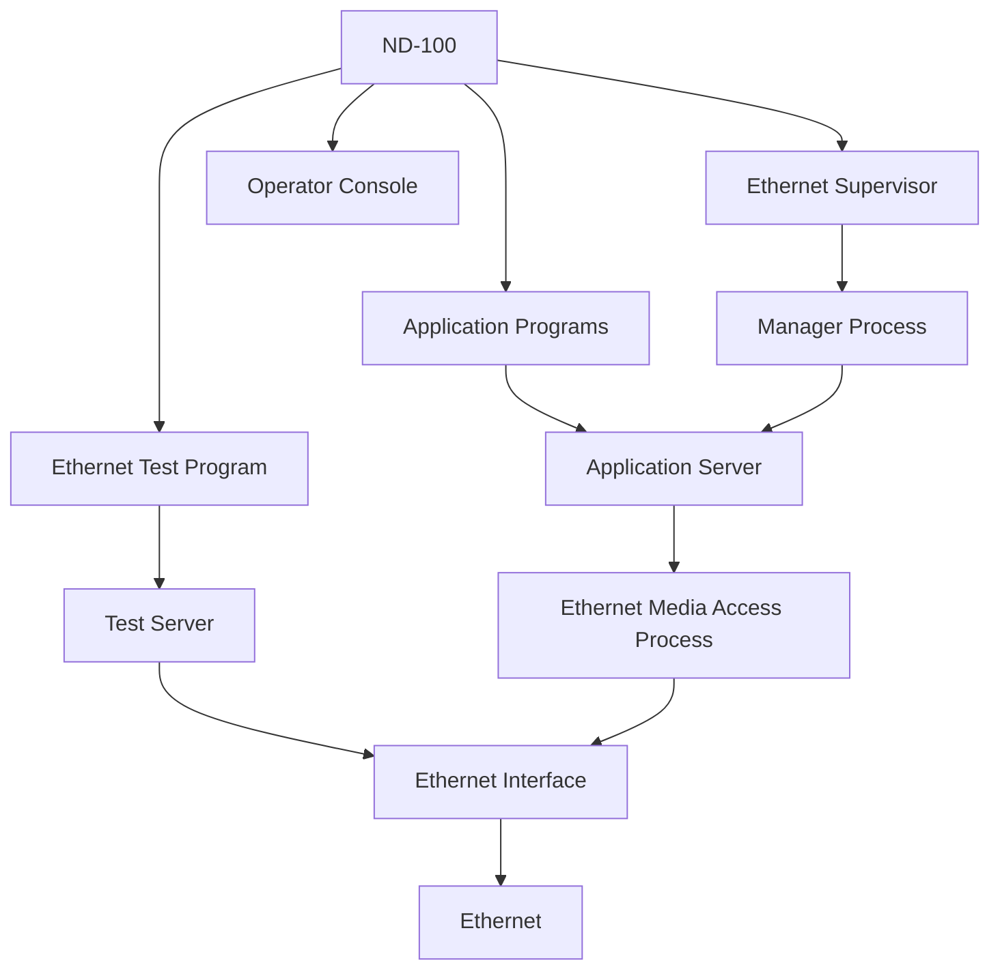

## Page 1

# ETHERNET INTERFACING TOOLS

ND 210582

---

## Page 2

# ETHERNET INTERFACING TOOLS

## INTRODUCTION

Ethernet is a high-speed local area network that may be used for communication between all sorts of digital devices.

ND's implementation on the physical level currently consists of two boards in the ND-100, the Ethernet Master and the Ethernet controller. The implementation follows the specifications of the IEEE 802.3 and ISO DIS 8802/3 standards.

All software implemented conforms to the above mentioned IEEE and DIX standards and the ECMA-82 standard.

This software package is intended for users with a high degree of understanding of data communications, and a need for either implementing their own communication protocols between ND computers or implementing communications to computers from other manufacturers on the same network.

## PRODUCT DESCRIPTION

NORSK DATA's Ethernet Basic Software may be divided into two parts, one running in the ND-100 host and the other in the Ethernet Interface. The modules are listed below:

### ND-100 modules:
- Routine Interface to Media Access service for PLANC or FORTRAN application programs.
- Network test program for utilizing the Configuration Test Protocol described in DIX 2.0.
- Supervisor functions for starting/stopping and error reporting from the Ethernet Interface modules.

### Ethernet Interface modules:
- Server process for Media Access service.
- Server process for Configuration Test.
- Media Access process controlling the Ethernet Hardware.
- Management process for startup and error reporting.

## FEATURES
- Simple routine interface for sending and receiving frames.
- Separate routine interfaces for PLANC and FORTRAN.
- Possibility for gateway implementation between Ethernets.
- Multicast/Broadcast facility.
- Send/Receive Statistics facility.
- Network testing facilities.

---

Scanned by Jonny Oddene for Sintran Data © 2010

---

## Page 3

# ETHERNET INTERFACING TOOLS

## IMPLEMENTATION

### Physical level

The Ethernet Controller board takes care of electrical signalling, timing etc. This board also handles such functions as destination address checking, CRC generation and checking, and network access. The algorithm for access is CSMA/CD (Carrier Sense Multiple Access with Collision Detection).

### Media Access level

Media Access is the lower sublevel of the Link level (ISO-OSI level 2) in the IEEE 802 Local Networking standards. The Ethernet Master board, a MC68000 based processor, takes care of all these functions such as addressing, packaging of frames, address decoding and so on.

## USER INTERFACE TO MEDIA ACCESS

The routines provided perform the following functions:

- Initialize and terminate connection to server.
- Address conversion between ND system number and 48-bit Ethernet address.
- Sending data.
- Providing buffers to the server.
- General waiting for an event to occur (including incoming data).
- Setting and removing a specified multicast address.
- Getting send/receive statistics information.

## NETWORK TEST FACILITIES

The following test facilities are accessible from a ND-100 background program:

- Simple loop-back test. Echo from a specified station.
- Complex loop-back test. Echo from a specified station via an intermediate station.
- Three addressing modes; ND system number, the specific loop-back assistant multicast address and any 48-bit Ethernet address.

The above test facilities conform to the specification given in DIX 2.0 and are accessible across the COSMOS Network.

## DOCUMENTATION

| Ethernet Basic Software        | Programmer Guide                      |
|--------------------------------|---------------------------------------|
|                                | ND-60.197 EN                          |

## PREREQUISITE

ND 108630 The Ethernet Controller

---

[Scanned by Jonny Oddene for Sintran Data © 2010]

---

## Page 4

# Norsk Data

## Corporate Headquarters

**Olaf Helsets vei**  
P.O. Box 5 Bogerud  
0603 Oslo 6  
Norway  
Tel.: +47-2-626000  
Telex: 74256 nd n  
Telefax: +47-2-29645 (A)  
New wing 2: 29649 (A)  
Telefax: +47-2-29676 (A)  

## Norway

Oslo, tel +47-2-92300  
Bergen, tel +47-5-296510  
Sandnes, tel +47-3-20796  
Tromsø, tel +47-83-7166  
Trondheim, tel +47-7-92122  

## ND Committe Head Office

**Olaf Helsets vei**  
P.O. Box 5, Bogerud  
0603 Oslo 6  
Norway  
Tel.: +47-2-626000  
Telex: 74256 nd n  
Telefax: +47-2-29676 (A)  

### Subsidiaries in:

- West Germany, tel +49-611-40680
- United Kingdom, tel +44-734-59635
- France, tel +33-769053
- Sweden, tel +46-8-949400
- Switzerland, tel +41-21-255544
- Finland, tel +358-0-523282  

## Finland

Oy Norsk Data AB  
Vapaalantie 4 (Vanda)  
SF-01650 Vantaa 65  
Finland  
Tel.: 9056-368 or 905-022  
Telex: 025-7123 paper sf  

## Sweden

ND Norsk Data AB  
Kanalvägen 3  
P.O. Box 1213  
191 27 Upplands Väsby  
Sweden  
Tel.: +46-760-98400  
Telex: 15576 nordata s  
Telefax: +46-760-82507 (A)  

Göteborg, tel +46-31-496760  
Malmö, tel +46-40-70510  

### ND-SILVADATA Sweden

S:t Olofsgatan 25  
851 85 Sundsvall  
Sweden  
Tel.: +46-60-154150  
Växjö, tel +46-470-46200  
Stockholm, tel +46-760-92000  

## Denmark

Norsk Data A/S  
Lautruphuk 13  
A 2400 Copenhagen  
Denmark  
Tel.: 3612-69856  
Telex: 34-5024 nd a d  
Copenhagen, tel +45-1-6622566/6621920  
Telefax: +45-1-683766  

## Switzerland

Norsk Data (Switzerland) S.A  
Gartenstrasse 12  
P.O. Box  
Switzerland  
Tel.: +21-211-25552  
Telex: 41-21-255544 (A)  
Glattburg (Zurich), tel +41-1-801003  

## West Germany

Norsk Data GmbH  
Thomasstresse 10-12  
6383  
Bad Homburg v.d.H  
West Germany  
Tel.: +49-6172-4060  
Telex: 9-116762 nod d  
Telefax: 49-6172-2220 (A)  

- West Berlin, tel +49-30-2133095
- Hamburg, tel +49-40-272706
- Hannover, tel +49-511-694211
- Stuttgart, tel +49-711-3413190
- Munich, tel +49-89-23910070
- Münster, tel +49-251-71028
- Kiel, tel +49-431-53425  

## The Netherlands

Norsk Data Nederland B.V  
Burgwal 50  
P.O. Box 850  
3300 AJ Nieuwegein  
The Netherlands  
Tel.: +31-34074-72411  
Telex: 390-104 nd nl  

## France

Norsk Data s.a.r.l  
18 Avenue D'Iena  
12ème Etage  
F-75016 Paris  
Tel.: 33-1-406875  
Telex: 336506 nordata fornic  

## United Kingdom

Norsk Data Ltd.  
Benham Valence  
Newbury  
Berks RG15 5UL  
United Kingdom  
Tel.: +44-634-59635  
Telex: 849163 nodkat g  
Telefax: +44-636-3647 (A)  

- London, tel +44-1-5869965
- Manchester, tel +44-61-9816787
- Edinburgh, tel +44-031-6681661  

## USA

Norsk Data N.A., Inc.  
56, William Street  
Wellesley  
Massachusetts 02181  
USA  
Tel.: +1-617-237-7966  
Telex: 921147 nortek 13 (A)  
Telefax: +1-801-24157956  
Los Angeles, tel +1-714-7525081  

## Hong Kong

Norsk Data Instrument  
19/C Wing On Centre  
111 Connaught Road  
Hong Kong  
Tel.: 0052-841619/2412063  
Telex: 08022-8681 nodky hk  

## Represented by Agent in:

- India: Norsk Data (India) Pty, Ltd. +91-44-199171/47210110 d 472190 carbin
- Thailand: Norsk Data Thailand, Ltd., tel +66-2-2525006 to 086255 elektrash f  
- France and Italy:  
  **Data Systemei S.A Paris**, tel +33-1-694000  
  **Mara Datasyyteme S.A Milan**, tel +33-4-7554045  
- Toulouse, tel +36-31-33024, te 53880

---

