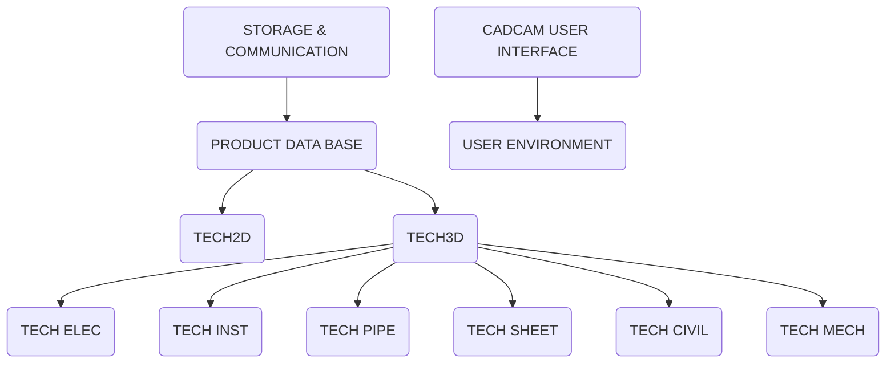

## Page 1

# TECHNOVISION

## TECH2D

ND 210702

```
 _______________________________________
|                                       |
|                 ______                |
|                |      |               |
|                |______|               |
|       _______   ______   _______      |
|      |       | |      | |       |     |
|      |_______| |______| |_______|     |
|                                       |
| _____________________________________ |
| |                                     |
| |          CLUTCH                     |
| |_____________________________________|
|                                       |
|      Drawing prepared for TECHNOVISION |
|_______________________________________|

```

---

ND  
Norsk Data

Scanned by Jonny Oddene for Sintran Data © 2010

---

## Page 2

# TECH2D

## Introduction

TECH2D is a productive 2D CAD system. It is the basis of the TECHNOVISION software family and is a prerequisite for the other TECHNOVISION software modules.  
TECH2D provides the facilities for the creation and manipulation of component geometry, text, dimensioning, and cross-hatching. It is suitable for a wide range of applications, its main strength being the rapid creation of mechanical engineering drawings.  
TECH2D is a highly interactive system running on NORSK DATA's ND-500 series 32-bit minicomputers. It can only be used with special workstations. The main components of the workstation and their functions are:

- Dialogue screen
- Graphic screen
- Keyboard
- Tablet with pen
- Graphic controller

For a detailed description of the workstations see the datasheets for ND products 9791, 9780, and 9781.

The workstations ND 9780 and 9781 do not have a local controller.

## Features

- Fast 2D design & drafting system
- Easy to learn
- Separate dialogue and graphics screen
- Dialogue in different languages
- Cartesian and polar coordinate systems
- 38 commands for editing points, lines, circles, and ellipses
- Layer and group technique
- User-friendly trimming functions
- User defined symbols (up to 9900)
- Duplicating, mirroring, moving, and dragging of elements
- Automatic cross-hatching
- Dimensioning and text according to national standards (DIN, BS)
- Different windowing facilities
- Virtual copying
- Macro facility
- Full calculator function and 45 registers for temporary data storage

## Diagram

```
   +-------------------+
   |                   |
   |     Monitor       |
   |                   |
   +-------------------+
           |
   +-------------------+
   |                   |
   |      Keyboard     |
   |                   |
   +-------------------+
           |
   +-------------------+
   |                   |
   |    Tablet with    |
   |       Pen         |
   |                   |
   +-------------------+
           |
   +-------------------+
   |                   |
   |  Graphic Control  |
   |                   |
   +-------------------+
```

---

## Page 3

# TECH2D

## Product description

### Menu

The TECHNOVISION menu pad has been designed to present a simple command interface to the draftsman. The layout is structured with colour-coded areas to make the system easy to use and learn.

#### Main areas on the menu:

- Geometry creation
- Dimensioning and text
- Group composing and manipulation
- Layer composing and manipulation
- Editing of geometrical functions
- Enquiry on values
- Status and control fields
- System-, user- and macro functions
- Alphanumeric input pad with full calculator function set.

The lower left area of the menu pad is reserved for screen interaction via the cursor and for symbol selection through menu overlays using the touch-sensitive pen attached to the menu pad. Command execution is fast. Zooming or displaying status may be carried out without interrupting the running function.

### Geometric construction

This part of the menu deals with the analytical geometry of 2D-elements. TECH2D provides two different coordinate systems: Cartesian and both absolute and relative conditions. Over 38 commands are available for creating points, lines, circles, arcs, radii, fillets, ellipses, splines, rectangles, equidistances and parallels. Constructions can be "snapped" to existing graphics by selecting "identification mode". This modifies the cursor to include a snap circle. The snap tolerance may be varied.

### Symbols

TECH2D allows easy generation of user-specific symbols which subsequently are retrieved through menu pad selection and cursor positioning on the drawing. There are 99 symbol menu overlays of each 100 symbol fields at disposal, giving a total of 9900 symbols. Symbols can be dragged dynamically to check location or they can be snapped precisely to existing components. Symbols can have any complexity. Typical uses are for the storage of standard drawing frames or company logos and any other standard components that have a wide usage in the drawing office.

---

## Page 4

# TECH2D

## Groups

Any part of a drawing or a symbol may be turned into a group. The separate elements within a group may still be handled as single entities, or the group may be treated as one single entity. This speeds up operations like translating, rotating and duplicating geometry. A group may be given a name, and hierarchies of subgroups may be created. Elements can be added to or subtracted from existing groups. An existing group can also be dissolved if required.

## Layers

An additional way of structuring the graphical information within a drawing is by using different layers. As the name implies the functionality of the layer mechanism is a close analogy to the use of transparent overlays on a manual drawing.

There are four conditions of layer status: active, passive, visible and invisible. Entities can be made only in the active layer. Different layers have different names. They can be copied to other drawings to other scales. The total number of layers is practically unlimited.

In a drawing geometry, dimensioning and text may for example be put onto different layers, thus making it possible to display the drawing without dimensioning just by turning this layer to "invisible". Layers may have different coordinate systems and scale, making it possible to enlarge details of a construction by copying the detail to a layer of a different scale.

## Dimensioning

Dimensions are automatically created to a range of dimension types which comply with drawing standards. Dimensioning can be either singular, chain or with reference to a datum.

## Diagram

```ascii
                  +--------+
                  |        |
                  |  angle |
                  |        |
 +-----+          +--------+
 |     |          __|__        
 |     |         /     \       
 |     |       /        \height
 |diameter |   /          \
 |     | /    distance    \
 |     |/                  \
 +-----+---+            horizontal
          radius
```

### Dimension Types

```ascii
single
elements

+--------+--------+--------+
|  25.5  |  24.1  |  29.3  |
+--------+--------+--------+
```

chain

```ascii
+--------+--------+--------+
|   25.5 |  25.3  |  24.1  |
|        |        |  21.2  | 29.3
+--------+--------+--------+
```

datum

```ascii
+--------+
|  25.5  |
+--------+
    |
  50.8
    |
  74.9
    |
  96.1
    |
  125.4
```

### Dimensioning Methods

Through a dimensioning status menu the user can control 16 default dimensioning parameters such as scale, number of decimal places, units rounding factor and character height.

---

## Page 5

# TECH2D

## Cross-hatching

Cross-hatching can be created within any area bounded by lines, circular - and elliptical arcs. The user specifies hatching angle and spacing, and may select the hatching area by picking single entities, identifying a contour or identifying within a window. Manipulation of hatchings is possible by using a special trimming function.

## Geometric editing

During drawing creation it is often necessary to trim lines to existing elements. Four main functions are provided within TECH2D. The "T" function will lengthen or shorten a line relative to a reference line, the "H" function trims both ends of a line relative to two reference lines, the double "T" function erases a section of line that lies between two reference lines and the "L" function extends or truncates two identified lines to their intersection. These editing functions can also be used on circles, arcs, etc.

Additionally editing functions allow generating the complement of an arc, stretching of geometry, changing of line types and moving, duplicating, mirroring or dragging of elements.

```
  T1           T2
  ____________________
 |                  |
 |                  |
 n                  l
m    SINGLE T - FUNCTION           H - FUNCTION


        T1    T2
 n1          ___    l1
________ [illegible] ______
n3    DOUBLE T - FUNCTION     L - FUNCTION
```

Trimming functions

```
                  before                    after

  +-----------------------------------+
  |         |         x            |                  |        |
  |         |    x            |                         |        |
  +-----------------------------------+
```

Stretch

## Text

Six commands on the menu generate or modify text or define default text parameters. Four text fonts are available. Text size is user-definable, and text may be left, right or centre justified. Control characters are used to generate subscripts or exponents. Text editing using pen or keyboard is performed on the dialogue screen and is placed in the drawing through position and angle.

## Macros

TECH2D includes a powerful macro definition module, whereby sequences of commands may be turned into a macro command and stored for later use. When defining a macro, the user indicates which inputs to be variable. Macros may thus be used for variant design. Once created, macros are assigned to menu overlays and selected in the same way as symbols. 99 pages of 100 macro fields each allow for a total of 9900 accessible macros. A Macro Editor enables the user to modify existing macros.

## Requirements

The TECHNOVISION software family is only available for the ND-500 series of computers.

TECH2D-software is running on the following workstations:

| Workstation       | Model                   |
|-------------------|-------------------------|
| Colour raster     | 19" ND 9791             |
| Monochrome raster | 15" ND 9780 and 20" ND 9781 |

## Documentation

TECH2D, 2D-Module Reference manual .... ND 65.001 EN  
TECHOFF, Offline module/User manual .... ND 65.014 EN

---

Scanned by Jonny Oddene for Sintran Data © 2010

---

## Page 6

# TECHNOVISION Overview

TECHNOVISION is the 2D/3D CAD system developed by NORSK DATA for engineering design and related applications. It is an invaluable aid in every aspect of technical drawing (design, calculation and drafting) as well as in the management of all associated product data.

The modular nature of the system ensures that an economic configuration can be found to meet the requirements of every design office. In addition the open-ended structure of the system enables users to develop new functions themselves and incorporate them into the system, and facilitates the communication of product related information both within the company and to outside concerns.

An universal product data base represents the kernel of the CAD/CAM solution offered by TECHNOVISION and the key to the integration of product planning, product management, and office automation.

## TECHNOVISION Diagram



## Contact Information

| Division                           | Address                           | Phone        | Fax          |
|------------------------------------|-----------------------------------|--------------|--------------|
| **Corporate Headquarters**         | Oluf Helsets vei 5 PO Box 25, Bogerud 0621 Oslo 6 Norway | Tel: +47 2-62 60 00 | Telefax: +47 2-62 68 01 |
| **ND-SILDVATA SWEDEN**             | 581 83 Sundsvall Sweden          | Tel: +46 60-151510 | Telefax: +46 60-151810 |
| **DENMARK**                        | Norsk Data A/S Lautrupbjerg 1-3 PO Box 322 DK-2750 Ballerup Denmark | Tel.: +45 2-695065 | Telefax: +45 2-694840 |
| **FRANCE**                         | Norsk Data s.a.r.l 4a Av. Brenton Avenue du Jura, 01 210 Ferney-Voltaire France | Tel.: +33-50 405676 | Telefax: +33-50 420845 |
| **SWITZERLAND**                    | Norsk Data (Switzerland) S.A Ch. de Vidy-Lausanne Switzerland | Tel.: +41 21 20102 | Telefax: +41 21 255694 |
| **UNITED KINGDOM**                 | Norsk Data Ltd Benyon, RDB, Reading, United Kingdom | Tel.: +44 636 95443 | Telefax: +44 635 309576 |
| **IRELAND**                        | Norsk Data Ireland Ltd A5 Dublin Industrial Estate, Sentry Avenue, Dublin 9 Ireland | Tel.: +353 1 47244 | Telefax: +353 1 472182 |
| **USA**                            | Norsk Data (Inc.) USA Westborough Office Park 1800 West Park Drive Westborough, MA 01581 USA | Tel.: +1 617 364 9652 | Telefax: +1 617 366 0246 |
| **THE NETHERLANDS**                | Norsk Data Nederland B.V Brussels 53A P.O Box 300, 3430 AM Nieuwegein Netherlands | Tel.: +31 3062 74411 | Telefax: +31 3402 74100 |

## Additional Offices

| Country         | Location Details                                              |
|-----------------|---------------------------------------------------------------|
| **HONG KONG**   | Norsk Data International 16th Floor, Overseas Building, 139 Hennessy Road, Wanchai, Hong Kong |
| **ICELAND**     | Norsk Data Iceland                                           |
| **INDIA**       | Norsk Data (India) Pvt. Ltd                                   |
| **PAKISTAN**    | Norsk Data Pakistan (P) Ltd                                   |
| **SAUDI ARABIA**| C/- Advanced Systems Ltd. 057-49655 |
| **THAILAND**    | Norsk Data Th. Ltd                                            |

[Photo: ND Logo]

---

