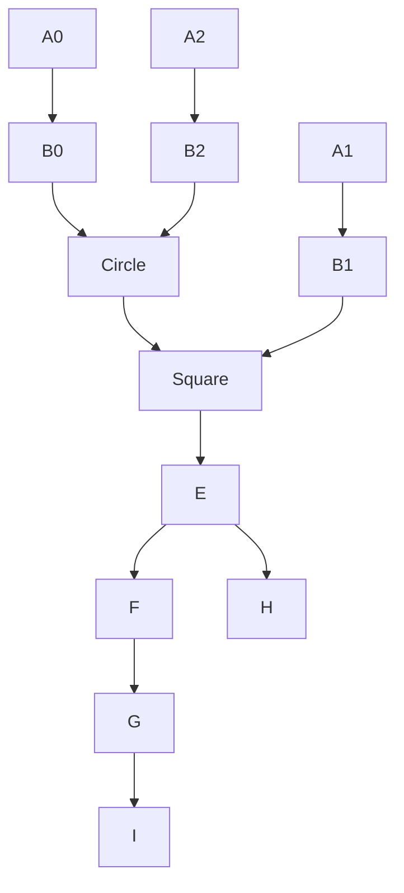

## Page 1

# TECHNOVISION

## TECHNORM

### ND 210703

```
      ___
     |   |
     |   |
     |   |
     |___|
        |
________|________
|                 \
|                  \
|                   \
|                    \
|                     \
|______________________\

      |-----|
      |-----|
   ___|     |____
  |             |
  |             |
  |_____________|

  _________
 |  _____  |
 | |     | |
 | |     | |
 | |_____| |
 |_________|

   |---|   |---|
   |---|   |---|

( )    (•)
         |

  _______
 |  ___  |
 | |   | |
 | |___| |
 |_______|

```

### ND
#### Norsk Data

[Logo: ND Norsk Data]

---

## Page 2

# TECHNORM

## Introduction

NORM parts represent an essential and frequently used aspect of mechanical engineering. In addition to the national norms such as the German DIN and British BS and the international standards (ISO), most business enterprises produce parts according to their own standard specifications.

TECHNORM is a library of DIN machine components that, in conjunction with the TECH2D module, enables a large number of the norm parts commonly used in engineering design (such as screws, washers, and nuts) to be generated.

NORM parts are stored as variants. When a NORM part is required in a drawing, you enter the desired values for its defining characteristics (parameters), and the part is then generated and displayed in the drawing. The system automatically checks that the values entered agree with the standard specifications for that part.

Users can extend the range of norm parts delivered with TECHNORM by producing their own library of standard works parts. Although this cannot be done directly, because norm parts are generated as variants by processing the basic geometrical data of the part, TECHNOVISION provides tools for generating norm parts via:

- Macro functions that define fixed sequences of procedures (TECH2D)
- The variant module TECHVAR
- The FORTRAN interface (TECHFTN)

The use of a library of norm parts not only means that assemblies can be constructed very much more quickly and the TECHNOVISION system used with greater economy, but it also helps prevent the use of an unrestricted diversity of parts.

## Features

- Norm parts for general mechanical engineering
- More than 30 different DIN norms
- Specifications according to DIN
- Assistance in selecting standard sizes
- User-defined intermediate specification
- Part positioning with respect to reference point
- Additional functions for the numbering of parts and the addition of text material
- Hatching of auxiliary details
- The tablet overlays provide a clear overview of the norm parts available
- Procedure is directed by menus
- The geometry is defined as a variant of a basic model of the part
- The geometry of the part is drawn to scale and is formed into a group
- Chamfers, rounds, keys, drilled holes, countersinks, welded seams, cones, shafts, and circlips can be generated automatically

## Product Description

The symbols for norm parts are depicted on two tablet overlays, each with 100 fields. Some of these fields are provided with functions which enable parts to be positioned and certain elements to be added to the part.

A component is obtained by penning the appropriate overlay field then positioned in the drawing, also by using the pen. If the dimensions of the component are unknown, or if they are non-standard, a list of the permissible dimensions for the part is automatically displayed. Once a part has been generated in a drawing, the geometrical elements of which it is composed can be treated in the same way as any other element in the drawing. Norm parts are generated according to the specification tables for norm parts provided by TECHNORM, the resulting part being a variant based on the specified proportions of the part.

TECHNORM provides functions for the consecutive numbering of all parts and the addition of descriptive texts to a drawing. The ability to generate chamfers, rounds, countersinks, keys, and drilled holes at a specified point in the drawing is a further feature of this module.

TECHNORM includes the following standard parts: [illegible]

---

## Page 3

# TECHNORM

| Part                                 | DIN number  |
|--------------------------------------|-------------|
| 1. Slotted countersunk head screws   | 63          |
| 2. Counterbores                      | 74          |
| 3. Slotted cheese head screws        | 84          |
| 4. Medium washers                    | 125         |
| 5. Single coil spring washers        | 127/7980    |
| 6. Hexagon nuts                      | 439/934     |
| 7. Retaining rings                   | 471/472     |
| 8. Slotted round nuts                | 546         |
| 9. Round nuts with drilled holes in one face | 547  |
| 10. Slotted headless screws          | 553/926     |
| 11. Needle roller bearings           | 617         |
| 12. Needle thrust bearings           | -           |
| 13. Needle bevel ball bearings       | -           |
| 14. Single thrust roller             | -           |
| 15. Trolley                          | -           |
| 16. Rolling ball bearings            | 625         |
| 17. Self-aligning ball bearings      | 630         |
| 18. Set collar                       | 705         |
| 19. Thrust ball bearings             | 711         |
| 20. Hexagon socket head cap screws   | 912/6912    |
| 21. Hexagon socket set screws        | 913/914/915 |
| 22. Hexagon sockets                  | 926         |
| 23. Hexagon bolts/screws             | 931/933     |
| 24. Parallel pins, hardened          | 6325        |
| 25. Parallel keys                    | 6885        |
| 26. Hexagon countersunk head screw   | 7991        |



After a field on the tablet has been selected, the user is required to enter the dimensions of the part. If the exact dimensions are not known, the system automatically displays the next suitable value closest to the one entered. Similarly, if an unsuitable dimension is entered, the system displays a short list of suitable dimensions in the range of that entered. This avoids him having to search through the specification tables to find the right dimension.

## Requirements

TECHNORM can be installed in any system that includes the basic module.

TECH2D ND 210702

## Documentation

TECHNORM User manual ND 65 012 EN

---

