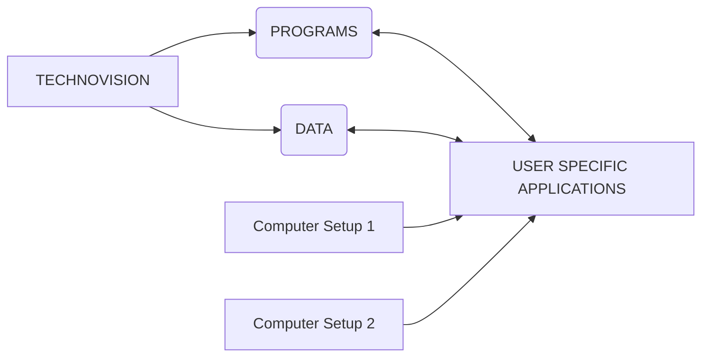

## Page 1

# TECHNOVISION

## TECHFTN

**ND 210704**



**ND**  
Norsk Data

---
Scanned by Jonny Oddene for Sintran Data © 2021

---

## Page 2

# TECHFTN

## Introduction

The productivity of a CAD system can be significantly increased by the use of applications tailored to meet the individual requirements of the user. Advanced CAD systems therefore include a FORTRAN interface so that users can make extensions to the system themselves. Via the FORTRAN interface the user can incorporate the basic functions of the CAD system into his own task-specific applications, thereby saving considerable effort in programming.

TECHFTN, the FORTRAN interface of TECHNOVISION, meets the increased demands for operational flexibility by enabling application programs, produced by the user to meet his own specific requirements, to be integrated into the TECHNOVISION software. This is achieved by linking FORTRAN programs into the basic system so as to extend its operational range. The fact that the FORTRAN interface also gives you access to TECHNOVISION's user interface greatly increases the usefulness of this module.

TECHFTN enables the user to write his own FORTRAN programs and include them in calls to subroutines of TECH2D, TECHARC, TECHLIST and TECHSURF using the existing parameter format of the subroutine. For example, the output values of a user program that computes certain dimensions of a part can be used as the input parameters to a TECHFTN subroutine for the generation of the relevant elements in a drawing.

The FORTRAN interface enables an expedient solution to be found to the specific problems the user faces. This in turn means that the system can be used more efficiently and with greater productivity. Furthermore, the FORTRAN interface is usually easier to operate and quicker than standard interfaces such as IGES.

Aside from the applications of FORTRAN interface mentioned above, TECHFTN can also be used to generate symbols and offers an alternative method of generating variants of a part (normally produced using TECHVAR ND 210852).

## Features

1. Direct access to the functions of
   - TECH2D
   - TECHVAR
   - TECHSURF
   - TECHARC
   - TECHLIST

2. Geometry functions:
   - generation of geometric elements
   - manipulation of elements, such as dimensioning, text and cross-hatching
   - formation of groups and opening of layers
   - duplication of elements, groups or drawings
   - geometric calculations
   - access to stored elements via their type, number or coordinates
   - generation of spline contours and sculptured surfaces
   - access to register values and variables

3. Additional functions:
   - interactive operation
   - production of own dialogues
   - use of standard dialogues for the input of values, points and text
   - access to the basic functions of the archive
   - access to the most important functions of the parts list modul

## Product Description

Although the user of TECHFTN must be capable of writing FORTRAN programs, he need not be concerned with the internal organization of TECHNOVISION.

The subroutines are based on the principle of 'one call, one function'. For example, a simple subprogram call is all that is needed to enter graphical input in a drawing. This subprogram also follows the internal rules for adding the new element to the data structure, which include, for example, displaying the element on the graphics screen. In this way, it is possible to achieve a clearly structured program and to spare the user the necessity of acquiring knowledge specific to data processing.

```
 ________  ________  ________
|        ||        ||        |
|________||________||________|

 ________  ________  ________
|        ||        ||        |
|________||________||________|

 ________  ________  ________
|        ||        ||        |
|________||________||________|

 __________
|          |
|__________|

[Diagram: Element Arrangement]

SUBROUTINE FEDER ( N, D1, D2, H )
```

---

## Page 3

# TECHFTN

The 'front end' processor of TECHFTN consists of 12 functions which can be accessed via the standard menu fields of TECH2D. The source codes for the corresponding subroutines are supplied together with the TECHFTN module. Up to 400 user programs can be accessed directly via each user function by penning one of the quadrants of a field in the graphic area of the tablet. The user can reformulate the dialogue of the individual calls, which may be as numerous as he cares to make them.

TECHFTN contains the library of TECH2D functions. The TECHARC, TECHLIST and TECHSURF libraries can be added to this if the appropriate module has been installed in the system.

The following describes the steps required to produce a program using TECHFTN.

1. The user writes a FORTRAN subroutine in which a call of an appropriate subroutine is included.
2. The subroutine is then compiled.
3. This is then assigned to one of the user functions (01 to 12) and to a specified field of an overlay page.
4. The user-function is then recompiled.
5. Finally, the TECHNOVISION software is reloaded.

```
   _____________
  /             \
 /               \
|   SUBROUTINE   |
|    TPROF       |
|   ( B,R,T,D,R ) |
 \               /
  \_____________/
```

## Examples of Subroutine Calls

1. **Generate point: absolute**

   ```
   CALL BDPUEL (X, Y, IEN, ITYPE, NE)
   ```

   This function prompts the user to input the coordinates of a point (the parameters X and Y) as X,Y input or by identifying the end point of an element. In the latter case, the number and type of the line element is returned by the parameters IEN and ITYPE, respectively. The parameter NE has a control function. It produces an error message if unequal zero.

2. **Generate straight line: between two points**

   ```
   CALL BLGPP (XS, YS, XT, YT, IEN, NE)
   ```

   The input parameters are the coordinates of the start point (XS, YS) and target point (XT, YT) of the line. The output parameter is the element number of the line generated, and this can be used in a subsequent step in the program as the variable IEN. NE is the error parameter, as in the example given above.

## Requirements

TECHFTN can be installed in systems that include the following modules:

| Module                          | Reference Number |
|---------------------------------|------------------|
| TECH2D                          | ND 210702        |
| FORTRAN COMPILER                | ND 210190        |
| A program editor e.g. PED       | ND 210532        |
| or NOTIS WP                     | ND 210526        |

TECHFTN can only be used in conjunction with the graphic workstation provided with the TECHNOVISION CAD-System.

## Documentation

TECHFTN 2D FORTRAN interface.

| Documentation                  | Reference Number |
|--------------------------------|------------------|
| Reference manual               | ND 65.002 EN     |
| FORTRAN Reference manual       | ND 60.145 EN     |

```
Option Hatching

Positioning ( X,Y,W )
```

---

