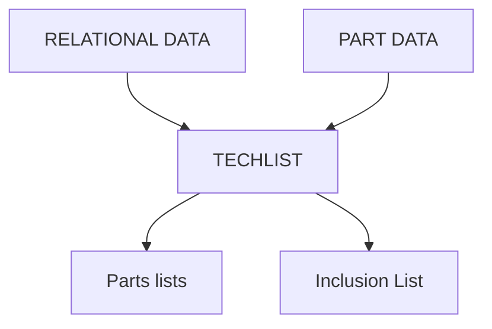
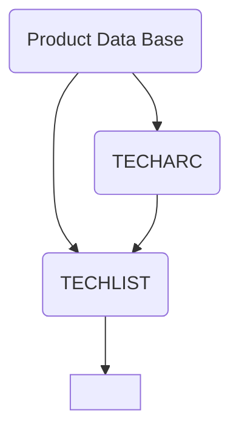

## Page 1

# TECHNOVISION

## TECHLIST

**ND 210705**

[Photo: ND Norsk Data Logo]

---

## Page 2

# TECHLIST

## Introduction

The integrated approach as offered by TECHNOVISION basically means an automated flow of information between the design office and other areas of a business enterprise, such as production planning, purchasing, production and sales department. Quick access to a complete and accurate parts list is therefore of great importance in an integrated solution. TECHLIST is a product that deals with the problems involved in compiling parts lists in the design office.

TECHLIST enables the user of TECHNOVISION to store the parts list data of every component in the product data base. This information can then be used to automatically generate a parts list in an assembly drawing, each part being indicated by a position number. TECHLIST also features a freely definable dialogue interface for the input and output of parts list data.

The concept behind TECHLIST is that every part is assigned to an entry in the product data base. Each entry can include specific information which is stored in a source data area reserved for parts list information. In addition, individual variations of a standard part can be specified and subsequently incorporated into the parts list. A function of the structural data area, which is another section of the product data base, is to record every individual relationship between the parts. By means of this chain of relationships a reference can be made to the individual parts included in the parts list.

It is often the case that a new product incorporates existing parts assembled in a new way. TECHLIST gives the design engineer the opportunity of including such parts in a drawing, thereby making a new entry in the structural data area of the data bank. Only in the case of a new part need a new entry be made in the source data area of the data base.

The complexities surrounding the use of the data base need not concern the user of TECHLIST who, instead, is provided with a user environment including a PARTS LIST EDITOR and a mask generator. In addition, the designer can use NOTIS-RG to retrieve information from the product data base and rearrange it in order to produce related documents.

The parts lists themselves are stored as unitary block structures consisting of one part owner and a number of part members. The system is, however, capable of handling the complex hierarchical structures required in the production of structured parts lists. In checking for the inclusion of a part and producing a list of quantities, the check for inclusion helps provide an overview of the uses to which individual parts are put in the total range of products within the data base. Reducing the diversity of individual parts is just one example of the functions aimed at here. The list of quantities provides information concerning the number of parts in the product or subassembly over any range of levels in the hierarchy of parts.

## Features

- The construction of parts lists in hierarchical form
- Variable parts list information
- Provision for user specific expansion
- Automatic incorporation of norm and standard parts and symbols
- A parts list editor
- A mask generator for the output of parts lists
- NOTIS-RG for compiling documentation
- Management of parts list data using the archive system TECHARC
- Support from the SIBAS data base system
- Management of subassemblies at all levels of complexity
- Flexible use of parts list information via the FORTRAN interface

## Product Description

TECHLIST can be accessed from the graphic workstation via system function 05. For this purpose, the user of TECH2D and TECH3D is provided with a tablet overlay. As with all TECHNOVISION modules, the dialogue between the user and the system takes place on the alphanumeric screen.

## Product Data Base

TECHLIST uses the central TECHNOVISION product data base for storing data relating to parts lists. The division of the data base into two areas, the source area and the structural data area, not only allows parts list data to be stored in a way that avoids unnecessary duplication of information but also ensures that information in the parts lists are automatically updated when changes are made to any of the parts.

---

## Page 3

# TECHLIST

## Source data

The source data contain the specifications of detailed parts, norm and standard parts, purchased parts and customer-specific symbols and variants. The source data are divided into standard information fields and user-defined fields whose length and number can be specified. Organisational data, such as the identifier of each entry in the data base and the date on which it was created and last modified, are stored in the standard information fields. The user-defined fields include such information as the name, material and size of the part and the project to which it belongs.

## Structural data

The structural data area of the data base consists of archive entries which establish connections between, in the simplest case, a subassembly and the individual detailed parts of which it is composed, and more generally between part owners and part members. The relationship between a part owner and a part member is defined by the following:

- the identifiers of the owner and member parts
- the position of the part member in the part owner
- the quantity and units of quantity of the part member
- additional data

In practical terms the number of levels in the hierarchy in TECHLIST is virtually unlimited. The LIST PARTS and CHECK FOR INCLUSION functions can be limited to one level of a hierarchy (unitary) or can cover any number of levels up to a maximum of 20 (tree structure). Furthermore the user is free to specify the entry at which the list parts and check for inclusion functions begin (the root of the tree structure). Regarding the organisation of entries, TECHLIST also provides a facility, via the FORTRAN interface, for obtaining information such as which parts have a certain size or where a certain type of part is used.

## Parts list editor

The parts list editor has functions for creating new parts list entries and for modifying and deleting entries, in addition to the list parts and check for inclusion functions. The editor is accessed via the Archive Monitor Program, either using a normal terminal with an alphanumeric screen or the CAD graphics workstation. Not only does every company use parts lists for different purposes but the requirements governing the output of parts lists can vary from department to department within a company. In order to satisfy these different demands TECHLIST can present data in several ways. These include output to the alphanumeric screen, to the graphics screen, or to a plotter. In addition, the output of the list parts and check for inclusion functions can be sent directly to a printer or be written into a file.

A mask generator ensures that the output data can be easily read when displayed on the screen or written into a file. The designer can also generate a parts list in an assembly drawing interactively. In addition, NOTIS-RG is a valuable aid in communicating with the data base and in the process of generating parts lists. Furthermore, the FORTRAN interface offers the designer greater flexibility in formatting parts lists to meet his requirements.

## Requirements

TECHLIST can be installed in systems consisting of the following three modules:

| Module     | Number   |
|------------|----------|
| TECH2D     | ND 210702|
| TECHARC    | ND 210706|
| SIBAS-II   | ND 210340|

## Documentation

TECHLIST Parts list module.  
User Manual ND-65 004 EN

---

### Parts List

| No. | Pc. | Designation                          | Standard Parts No.      | Stock size, unmachined part, Material  | Manuf part no. | Supplier | Idx pc | Material         | Remark              |
|-----|-----|--------------------------------------|-------------------------|----------------------------------------|----------------|----------|--------|------------------|---------------------|
| 1   | 1   | Bottom cover                         | 063-1051-213-028        | RD DIN1013 G15 SXIQ59                  |                |          |        |                  |                     |
| 2   | 1   | Guide cover                          | 063-1051-233-028        | RD DIN1693 GG6-40 HG 85x70             |                |          |        |                  |                     |
| 3   | 1   | Cylinder                             | 063-1951-024-           | Tube wl16 Rst37-7 Fex5xb2xhub          |                |          |        |                  |                     |
| 4   | 1   | Piston rod                           | 063-1051-213-           | Rod wl115 G45 4l57fgh9xhub             |                |          |        |                  |                     |
| 5   | 1   | Piston                               | 063-1051-024-053        | DIN 1591 G27 25 KG 70,28               |                |          |        |                  |                     |
| 6   | 1   | Groove nut                           | 063-1051-014-015        | DIN4248 S13 6x9xlQxl                   |                |          |        |                  |                     |
| 7   | 1   | Piston gas seal                      | 063-2252-000-100        | PDF 0470100657 Teflon/Perburan 63x5.6  |                |          |        |                  |                     |
| 8   | 1   | Rod gasket                           | 046-2264-000-005        | PDF 6021489555 Polyurethane 45x5x57,3 |                |          |        |                  |                     |
| 9   | 1   | Q1 wiper                             | 045-2252-000-035        | PDF NA2804055 Perburan 45x5x37         |                |          |        |                  |                     |
| 10  | 2   | O-ring                               | 063-2250-000-040        | Perburan 6x4                           |                |          |        |                  |                     |
| 11  | 2   | Protection plug                      | 038-233-000-000         | F7 M4x1.5                             |                |          |        |                  |                     |
| 12  | 1   | Index label                          | 076-0123-014-089        | Self-adhesive                          |                |          |        |                  |                     |
| 13  | 1   | Special primer                       | 596-524-000-000         | No 5964/2                              |                |          |        |                  |                     |

Example of a parts list

---

