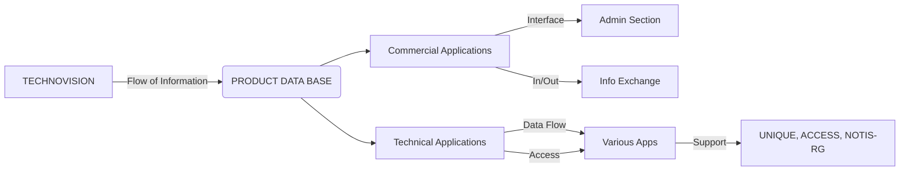

## Page 1

# TECHNOVISION

## TECHARC

### ND 210706

```
 _____________________________
|         PRODUCT DATA BASE   |
|  ________________________   |
| |       PARTS LISTS      |  |
| |________________________|  |
|  ________________________   |
| |                        |  |
| |________________________|  |
|  ________________________   |
| |                        |  |
| |________________________|  |
|  ________________________   |
| |         3D MODELS     |  |
| |________________________|  |
|  ________________________   |
| |        2D DRAWINGS     |  |
| |________________________|  |
|  ________________________   |
| |       STANDARDS       |  |
| |________________________|  |
|_____________________________|
```

ND  
Norsk Data

Scanned by Jonny Oddene for Sintran Data © 2021

---

## Page 2

# TECHARC

## Introduction

Technical information within a business enterprise usually originates from the design office. It is the data center here which largely determines the production costs of a product and which are of significance for many other departments. TECHARC regulates the flow of information within the design office and by means of a product data base facilitates the exchange of data between other departments of the company, such as production planning and scheduling, purchasing and sales departments.

In addition to technical drawings, the design office produces norm and standard parts, company-specific symbols, variants, macro functions, and 3D models. These are stored in the product data base. The TECHNOVISION product data base is divided into two interrelated areas, one structure orientated and the other administrative, although to the user the product data base appears as a single unit. The administrative section of the product data base governed by TECHARC is based on the SIBAS data base system (CODASYL standard) and, like the structure orientated section, has a variety of other applications.

The structure and operation of TECHARC can be tailored to meet the customers' particular needs. To ensure the optimal use of the archive system, it is therefore most important for the business enterprise to have a clear idea of how the archive should be structured and the nature of the information flow between the various departments of the company.

The availability of an archive FORTRAN interface enables the user to extend the operational scope of TECHARC and make full use of the product data base according to the particular needs of the company. Other ND software products, such as UNIQUE, ACCESS and REPORT GENERATOR (NOTIS-RG) also use the SIBAS data base, as do a variety of CAD applications. Moreover, the archive FORTRAN interface enables products from other software houses, PPS systems, and accessory CADCAM functions to utilize the TECHNOVISION data base. Its philosophy of having a central data base for several applications enables NORSK DATA to supply an integrated CIM solution.

## Features

The product data base has the following features:

- It contains a complete model of the product.
- It integrates technical and administrative information.
- It is a data base which can be expanded according to the needs of the individual business.
- It can be expanded to meet future needs.
- It embodies a single operational concept for a large number of applications both within and beyond those required by the design office.

The operational features of TECHARC include the following:

- Checking and administration of the data base via the Archive Master Program.
- Access rights can be set for regions within the data-base and for individual entries.
- Search keys can be defined by the user in order to search through the various attributes of the archive entries (which the user specifies when the archive is installed).
- Entries in the archive are tested so as to avoid recursion.
- The system is organized so as to promote data security.

TECHARC can be operated by several users at once and can administer several product data bases on more than one ND computer system.



---

## Page 3

# TECHARC

## Product Description

TECHARC operates on two levels: an administrative level, via the Archive Master Program, and a user level, via the Archive Monitor Program.

### Access Rights

The administrative level can only be operated by a person authorized to use the entire archive system, the so-called system supervisor. They can use the Archive Master Program to regulate and control the access users have to the stored data and to data stored under areas assigned to other users. The supervisor has unrestricted access to the entire archive and is responsible for allocating the user's rights of access.

Access rights can be graded (none, read, write, read and write) and can be defined for access to the data under another user's area and for the access of another user to your own user’s area. This enables the establishment of a network of authorized and unauthorized users.

### Work Areas

The archive can be divided into as many as 512 different logical areas, each represented by an access number. This division can be made according to the area of application, such as product groups, production or assembly drawings, secret documents, and a library of standard parts. It could also be divided according to aspects of the work process, such as the design phase and the final check.

### Communication

Users interact with the system in two ways, via a terminal with an alphanumeric screen or via a CAD workstation provided with a graphics display. Terminals can be used for administrative work, keeping the CAD workstation free for design work. The Archive Monitor Program is also accessible via the workstation, and the search and scroll functions can be used from the tablet while working on a drawing.

```
+------------------+------------------+
| VALVE A16V       | Serial No:       |
| Access No: 100   | 1                |
| Created:         | 17 07 85         |
| Updated:         | 00 00 00         |
| Last Access:     | 00 00 00         |
| Type: XE         |                  |
| Access Right: W  | Object status: 0 |
| No of accesses:  0                  |
| Wave:            |                  |
| Info:            |                  |
| Dimes:           | Part type *      |
| Material:        | Worker *         |
| Job:             |                  |
+------------------+------------------+
| ** The following values may be changed |
| 1 Access number                       |
| 2 Access rights                       |
| 3 User field                          |
| 4 2D element name                     |
| 5 Field number                        |
| Function                              |
| * Select function                     |
+---------------------------------------+
```

## Attributes

Every drawing and 3D model produced with the TECHNOVISION CAD-system can, besides the geometric data of the drawing, be supplied with additional information (attributes). This information includes the number and type of the drawing, its name, the material, the part it is made of, the name of the designer, the date the drawing was created, and the date it was last modified, and text. Other information can assist in project planning and the management of orders, such as the job number, order date and number, and the number of a related NC program. All this information is stored together with the technical data of the drawing in the product database where it is administered using the TECHARC monitor and master programs.

## Masks

The data contained in an archive entry are displayed in an output mask on the alphanumeric screen. Individual companies can decide on the format of the output mask. Some output data, such as the date the entry was created and the date it was last modified, as well as the number of times the entry has been accessed, are generated automatically to prevent errors.

## Search and Scroll

The search algorithm is very flexible. The information fields associated with each archive entry (its attributes) can be addressed individually. The search key can be defined to restrict the scope of the search and therefore speed up the process.

## Requirements

The installation requirements for TECHARC are firstly the SIBAS database and secondly TECH2D (or both TECH2D and TECH3D).

| TECH2D  | ND 210702  |
|---------|------------|
| SIBAS II| ND 210340  |

## Documentation

- TECHARC User manual: ND-65 003 EN
- TECHARC Supervisor’s manual: ND-65 008 EN

---

