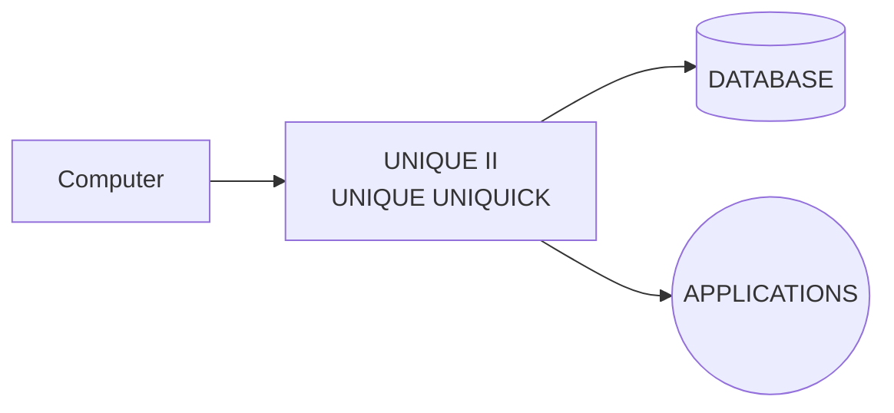

## Page 1

# UNIQUE II AND UNIQUE UNIQUICK FOR ND-100/ND-500

| Unique II | Unique UniQuick |
|-----------|------------------|
| SIBAS FOR ND-100 ND 210729 | SIBAS FOR ND-100 ND 210871 |
| SIBAS FOR ND-500 ND 210730 | SIBAS FOR ND-500 ND 210872 |
| ISAM FOR ND-100 ND 210731  | ISAM FOR ND-100 ND 210896  |
| ISAM FOR ND-500 ND 210895  | ISAM FOR ND-500 ND 210897  |




---

## Page 2

# UNIQUE II AND UNIQUE UNIQUICK

## UNIQUE II

### INTRODUCTION

UNIQUE II is a fourth-generation tool for the development of applications within the administrative data processing area.

UNIQUE II is a general multiuser system for interactive information systems. It is ideal for prototyping or experimental system development.

With UNIQUE II the development effort will in many cases be greatly reduced. The UNIQUE approach to system development is first to design the user interface (the screen display form), and subsequently to define the functions that relate the data items in the form to the database.

A UNIQUE application may thus be developed very quickly and the user may participate in the design to ensure that it reflects the real requirements. UNIQUE II may be run on the ND-100 and the ND-500 computers and can use both SIBAS-II and ND ISAM databases.

### FEATURES

- Easy to use
- Function keys in common with DIALOGUE and NOTIS products
- Language independent
- A design development and implementation tool
- Maintenance costs are reduced
- Models are quickly defined
- Programming efficiency is radically improved
- Extensive use of data dictionary to prevent incorrect data references and to simplify application design
- References to multiple databases; locally or distributed
- System and application control
- IF, ELSEIF, ELSE functions
- Based on standard data management - SIBAS II or ND ISAM

### PRODUCT DESCRIPTION

UNIQUE II is an ideal tool for users who work interactively with a database. It is very suitable as a prototyping tool as well as a development tool for medium-complex applications.

Traditional programming has been replaced by a system where the desired solution is described. This description is made by designing the screen picture that the user wants to see, and subsequently by defining the functions/relations that the fields (data) have to each other and to the database.

Large and complicated pictures are often difficult to complete, especially if the registered materials are not in accord with the picture. UNIQUE II is the powerful tool which takes care of this problem.

UNIQUE II is not a program generator; it is a PROGRAM. This provides the user with the same procedures for all applications to be developed. The fact that it is ONE program reduces maintenance costs to a minimum. No programming experience is needed to use UNIQUE II, so it is possible to have user participation in both the design and the application phases. This means shorter development time for the final applications.

IF-THEN-ELSE, IF-END-ENDIF functions and BEGIN/END sequence will minimize the need for special routines in application programming, although they are allowed if necessary.

A simple application of UNIQUE II is described below:

```plaintext
+-----------------+
| Start-form      |
|                 |
| CUSTOMER        |
|-----------------|
| Number | Name   | Shortname   |
| A..... | A..... | A...........|
| A..... |        |             |
| A..... |        |             |
| A..... |        |             |
| A..... |        |             |
| Telephone A.....|             |
|=================|
| Contact person  | A.......... |
| Payment condition| A..........|
|-----------------|
| end-form        |
|-----------------|
| start-fields    |
| data-base-name = ORDRBASE    |
| register-name = CUSTOMER    |
| field = "CUSTNO" key         |
| field = "NAME" alternative-key letter-type (UPPER)|
| field = "SHORTNM"  alternative-key letter-type (UPPER)|
| field = "ADDRESS1" |
| field = "ADDRESS2" |
| field = "ADDRESS3" |
| field = "TELNO"   |
| field = "CONTPERS" alternative-key letter-type(UPPER)|
| field = "PAYCOND" |
| end-fields        |
+-------------------+
```

This application will give this screen picture, filled with data on one customer:

| Number | Name             | Shortname |
|--------|------------------|-----------|
| 100    | SANDNES OILINDUSTRY | SANDOIL |
|        | OIL STREET 4     |           |
|        | STAVANGER        |           |
|        | Telephone 04 214587 |          |
| Contact person | R. BROWN |           |
| Payment condition | MONTHLY |         |

The application `Customer` makes it possible to register and maintain information on customers while accessing data from the database ORDRBASE, using the register CUSTOMER.

The application has two main parts:
- A screen layout description (between start-form and end-form)
- A description of the databases with functions and relations (between start-fields and end-fields).

The layout description contains texts and fields. The sign "A" defines the position of the field; the rest of the data description, type, length, and display format can be picked from the data dictionary.

The field part contains the mapping between the fields of the form and the items of the database(s), and ... [continued]

---

## Page 3

# UNIQUE II AND UNIQUE UNIQUICK

describes functions and relations between the fields. The words in uppercase letters are the names of database and of registers (realms) and items in the database.

UPPER is an exception and means uppercase letter-type. These are some of the features of the application: The application defines keys to retrieve records from the database. Each register has one main key, called 'key'. This key is often unique, as opposite to 'alternative key'.

## QUERIES

- Direct search for customers via their customer number or name. Name might be abbreviated.
- By use of simple commands in UNIQUE II, a user may move through the entire list of customers, (F/N/P/L- first/next/previous/last).

## PRINTOUT

- Direct printout of the screen pictures on a printer.
- Sorted printout of the whole list of customers, or parts of it.

## PREREQUISITES VERSION B

Prerequisites for version B are:

- SINTRAN III version J or later
- SIBAS-II version E or later

To make special routines FORTRAN or COBOL

## DOCUMENTATION

| Document                      | Code         |
|-------------------------------|--------------|
| UNIQUE II User Manual         | ND-60.206. 2 EN |
| UNIQUE II Brukerhåndbok       | ND-60.206. 2 NO |
| UNIQUE II Programmer Manual   | ND-60.210. 2 EN |

# UNIQUE UNIQUICK

## INTRODUCTION

UNIQUE UNIQUICK is an application generator for UNIQUE II. UNIQUE UNIQUICK produces applications that can be run by UNIQUE II or edited by standard ND editors (PED, NOTIS-WP). UNIQUE UNIQUICK runs on the ND-100 and the ND-500 and can use both SIBAS-II and ND ISAM databases.

## FEATURES

- Easy to use
- Function key-driven system
- A design development and implementation tool
- User participation at both the design and the application phases
- Maintenance costs are reduced
- Models are quickly defined
- Programming efficiency is radically improved
- Based on standard data management SIBAS-II and ND ISAM

## PRODUCT DESCRIPTION

UNIQUICK is completely menu-driven. The user chooses the database, registers, keys and fields that he wants by moving the cursor to the desired field and then pushing a function key on the keyboard.

The application 'Customer' can be made by a few keystrokes. The only thing the user has to do is to pick the databases, registers, keys and fields from the successive menu levels using standard NOTIS function keys on the terminal keyboard. With only 6 keystrokes your application is ready to run.

The following example shows the keystrokes needed to make this application.

This menu shows how to pick the database. The other menus have the same layout.

| Choose DATABASE              |
|------------------------------|
| CUSTBASE     CUSTINFO        |
| ORDRBASE     ADMBASE         |

To choose the wanted database, the cursor is moved to the actual position.

- Choose ORDRBASE

- Choose CUSTOMER register

- Choose CUSTOMER key CUSTOMER register

- Choose all fields in CUSTOMER register

- Use default application file name CUSTOMER

After the user has finished the application, he can choose to run it, modify it, or store it for later use.

## PREREQUISITES

UNIQUE UNIQUICK prerequisites are:

- SINTRAN III Version J or later
- UNIQUE II Version A or B
- SIBAS-II Version E or later, or ND ISAM Version I

## DOCUMENTATION

| Document                       | Code          |
|--------------------------------|---------------|
| User Manual                    | ND-60.240. 1 EN |
| Brukerhåndbok                  | ND-60.240. 1 NO |

---

## Page 4

# The ND Information System Concept

The ND Information System consists of terminals, the user environment, programs, and the communications, processing and storage systems. Each terminal uses the rest of the system as a common information processing facility. The programs represent different ways of handling information. Some of these functions are mainly office support oriented, like word processing, electronic mail or file queries. These are collectively called the NOTIS family of office support systems. Other functions are predominantly used for administrative data, such as data entry and transaction processing or report generation. This set of functions are known as the DIALOGUE Information Support System.

Each customer may wish to include NOTIS, DIALOGUE or both. Because of the close relation between office support and general administrative data processing, this flexibility is important. The following description covers both the NOTIS and the DIALOGUE Information System Concepts.

## The User Environment

A user communicates with the system via a terminal and a set of menus. Instructions to NOTIS may be selected from these menus or entered directly. Each user has a personal user-environment profile, which allows for a tailor-made working environment, and ensures a comprehensive and safe interface between the user and the system.

## The Programs

NOTIS and DIALOGUE include a set of programs to execute a comprehensive group of information processing functions. Some functions, considered equally important in the office environment and in general administrative data processing, are members of both.

NOTIS consists of modules for entering and revising documents, maintaining address lists and client registers, retrieving information, including it in reports and so on. A main function is the powerful and flexible full-screen word processor. This can be used independently for letter and document production, or to prepare data for other modules such as electronic messages, spreadsheet calculation, business graphics, etc. A common document storage module enhances this combined use of several NOTIS functions.

DIALOGUE is a set of productivity functions for Administrative Data Processing (ADP), sharing a common information base. Productivity is achieved in two ways. For development of operational systems, DIALOGUE offers a 4th generation applications tool as well as a "work bench" with support for screen handling and database management. The second important aspect is that it provides a direct interface to the databases, removing the barriers that ADP systems often appear to create between themselves and the user community. The direct processing functions comprising report generation and interactive access and queries, are also available with NOTIS. DIALOGUE is centered around a powerful database management system with a global dictionary.

## Growth

The potential for expansion is a fundamental part of the ND Information System Concept. Having begun with a simple NOTIS system, your growing needs can be satisfied by adding additional NOTIS and DIALOGUE modules. The ND System Architecture for Expansion (ND SAFE) concept guarantees you the ability to enhance your present system. An ND Information System may grow into a distributed network, interconnected by the COSMOS data communication network. Information stored anywhere in a network or even on computers from other vendors can be immediately available to any user of any terminal, provided that the user has the necessary authorization.

## Corporate Headquarters

| Country        | Address                                               | Contact Details               |
|----------------|-------------------------------------------------------|-------------------------------|
| Norway         | Olaf Helsets vei 5 <br> PO Box 6, Bogerud <br> 0611 Oslo 6 | Tel.: +47-2-6 25500 <br> Telex: 47-2 76930 |
| Sweden         | Norsk Data AB <br> Ranhammarsvagen 3 <br> PO Box 123 | Tel.: +46-08 760-9840 <br> Telex: 47-2-76930 |
| ND-SILVADATA   | Specialist Sales <br> Vasag. 11B 58 Sundsvall    | Tel.: +86-40 460-70920 |
| Denmark        | Norsk Data A/S <br> Lautrupvej 13-3 <br> PO Box 220 | Tel.: +45-2 8 77200 <br> Telex: 47-26 67927 |
| Switzerland    | Norsk Data (Switzerland) S.A <br> Oberv Voltaire 12 | Tel.: +41 21-255564(A) |
| West Germany   | Norsk Data GmbH <br> Thomasstrasse 10-12 <br> 6380 Bad Homburg v.d.H | Tel.: +49-6172 40874 <br> Telex: 49-61 47139 |
| United Kingdom | Norsk Data Ltd <br> Benham Valence <br> Newbury | Tel.: +816-35 73470 <br> Telex: 44- 
435 8367 |
| USA            | Norsk Data N.A., Inc <br> 50, William Street <br> Wellesley | Tel.: +1 617-237 7945 |
| France         | Norsk Data France <br> Immeuble "Pythagore" <br> Rue P. et M Curie | Tel.: +33 3 476 996<br> Telex: 33-3 476 264 |

[Photo: Scanned by Jonny Oddene for Sintran Data © 2010]

---

