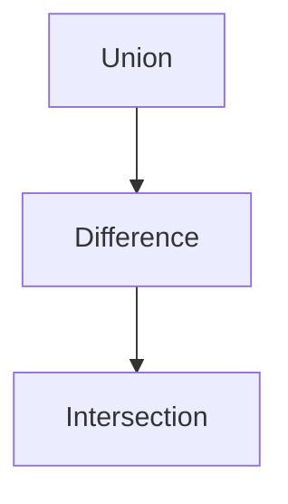

## Page 1

# TECHNOVISION

## TECH3D

ND 210840

```
   ______    ______
  /      \  /      \
 |        ||        |
  \______/  \______/

   ________   _______
  /        \ /       \
 |          ||         |
  \________/  \_______/
```

ND  
Norsk Data

Scanned by Jonny Oddene for Sintran Data © 2010

---

## Page 2

# TECH3D

## Introduction

TECH3D is an interactive design system based on a three-dimensional geometric solid modeller. It allows the designer to create an accurate and unambiguous description of components and assemblies of any complexity, and to carry out design analysis tasks based on the model. TECH3D is fully integrated with the TECH2D 2-dimensional design and draughting system, making it easy to produce 2-dimensional engineering drawings based on the TECH3D design. This also allows the use of 2-dimensional geometry as basis for subsequent 3-dimensional modelling.

TECH3D is suited for design of mechanical parts and other applications where a 3D visualisation of a proposed design is needed. By changing dimensions and position of parts a study of appearance, volume properties and interconnection may be done early in the design-phase of a new product. Exploded views output via TECHNOTIS can be used in technical documentation, installation and assembly manuals before the product reaches manufacturing. The exact 3D model also simplifies the production of engineering drawings, as the projected views necessary for dimensioned drawings are readily available as a "by-product" of the modelling process.

TECH3D is a solid modeller using a special data base system for storage of the 3D model. TECH3D stores each solid as a description of the surfaces bounding the solid, along with other geometrical and non-geometrical data necessary to fully describe the solid. This type of 3D modelling allows fast generation of hidden-line pictures and cuts.

## Features

- Integrated 2D and 3D system
- Swept 2D profiles
- Basic shape primitives
- Boolean operations on primitives
- Subassembly modelling
- Combination of volumes
- Technical elements modelling and manipulation
- Local detailing - fillets and chamfers etc.
- Local manipulation of faces and edges
- Hidden line removal
- Cross-sectioning
- Exploded views
- Normal and special views
- Menu driven
- Interactive
- Optimized modelling algorithms

## Diagram



```plaintext
Boolean operations

   +---------+   +-----------+   +-------------+
   |         |   |           |   |             |
   |  Union  |-->| Difference|-->| Intersection|
   |         |   |           |   |             |
   +---------+   +-----------+   +-------------+

            Basic shape primitives

        Cylinder    Block

          Cone      Sphere   Torus
```

## Product Description

### Model Creation

Model creation is achieved via a range of functions. The combination of shape primitives using the boolean operations union, intersection and difference, creates basic geometric bodies.

The basic primitives available are:

- Cube (Block)
- Cylinder
- Cone
- Torus
- Sphere

More complex shapes can be designed by linear and rotational sweep of 2D profiles created in TECH2D. Complex pyramids are formed by joining the vertices of two planar parallel profiles with the same number of [illegible].

---

## Page 3

# TECH3D

A significant extension to the modelling functions is the ability to generate "technical elements" such as counterbored holes, without using the procedural approach of modelling solid cylinders and performing boolean subtractions to create the hole. This gives the designer a familiar convention to work with in a range of modelling commands.

```
   -----
  /     \ 
 /       \
| Swept  |  
| 2D     |
| profile| 
 \       /
  \_____/
```

```
   _____
  /     \
 /_______\
|       |
|       |
|       |
|_______|
Technical element - c'bored hole
```

```
     /\
    /  \
   /    \
  /      \
 /________\
|          |
|__________|
   Pyramid
```

## Complex 3D Models

Complex 3D models can be split into several "part constructions", which may be thought of as a kind of "3D layers", allowing the modelling of different sub-assemblies in different colours, and subsequently separate or joint manipulation of these "part constructions".

A 3D model can be used as a component when designing other parts, thus making it possible to operate with a library of ready made 3D standard parts.

## Model Viewing

The designer views the model in up to seven viewports, the default being four, three plane-parallel (xy,yz and zx) and one isometric. All of the displayed viewports can be used to interact with the model. Model representation is normally with all edges shown with potentially hidden edges shown as dotted lines. At any stage in the design process, the designer can create "snapshots" of the model with full hidden line removal, or with freely defined cuts through the model. The cut planes are automatically crosshatched. These "snapshots" can be stored separately as 2D drawings.

By moving separate parts of the model, exploded views can be created to show internals and assembly logic.

```
[Illustration of an Exploded View]
```

## Design Analysis

Once a complete design has been modelled various options are provided to analyse design validity. Mass properties such as volume, centre of gravity and surface area can be calculated.

## Requirements

The TECHNOVISION software family is only available for the ND-500 series of computers.

TECH3D requires TECH2D - ND 210702

## Documentation

TECH3D User manual ............................... ND 65.009 EN

```
+-------------------------+
| Linear duplication      |
|                         |
|   []  []  []  []  []    |
|                         |
+-------------------------+
```

```
+------------------------+
| Duplication with       |
| mirroring              |
|     ______   ______    |
|    |      | |      |   |
|    |______| |______|   |
+------------------------+
```

## Model Editing

Once created, elements and volumes can be transformed, duplicated and stretched, surfaces can be moved and rotated etc. to create the shape wanted. Conical surfaces can be transformed into cylindrical surfaces and vice versa.

---

## Page 4

# TECHNOVISION Overview

TECHNOVISION is the 2D/3D CAD system developed by NORSK DATA for engineering design and related applications. It is an invaluable aid in every aspect of technical drawing (design, calculation and drafting) as well as in the management of all associated product data.

The modular nature of the system ensures that an economic configuration can be found to meet the requirements of every design office. In addition, the open-ended structure of the system enables users to develop new functions themselves and incorporate them into the system, and facilitates the communication of product related information both within the company and to outside concerns.

An universal product data base represents the kernel of the CAD/CAM solution offered by TECHNOVISION and the key to the integration of product planning, product management, and office automation.

```mermaid
flowchart TD
    A(STORAGE AND COMMUNICATION)
    B(PRODUCT DATA BASE)
    B --> TECH20
    TECH20 --> TECH30
    TECH30 --> TECH40
    TECH40 --> CAD/CAM USER INTERFACE
    SUBGRAPH CAD/CAM USER INTERFACE
    TECH30 --> TECH20
    TECH --> TECH
    TECH30 --> TECH40
    end
    CAD/CAM USER INTERFACE --> USER ENVIRONMENT
```

# Contact Information

| Country      | Contact Details                                                                                       |
|--------------|-------------------------------------------------------------------------------------------------------|
| NORWAY       | NORSK DATA A/S<br> Olaf Helsets vei 5, P.O. Box 25, Bogerud, 0621 Oslo 7<br> Tel: +47 2-620000       |
| SWEDEN       | ND SILVADATA<br> Sveavagen 166, Box 71200102 STOCKHOLM<br> Tel: +46 8-154910                          |
| DENMARK      | Norsk Data A S<br> Lautrupvang 2, 2750 Ballerup<br> Tel: +45 42-88685/42-88660                        |
| SWITZERLAND  | Norsk Data (Switzerland) S A CHEMIN DE VALLEE 12, P.O. Box 610, CH-1000 Lausanne 22                  |
| THE NETHERLANDS | Norsk Data Nederland B V<br> Brugwal 5, P.O. Box 36, 3430 A M Nieuwegein                            |
| USA          | Norsk Data A Inc.<br> Westborough Office Park<br>1800 West Park Drive, Westborough, MA 01581       |
| HONG KONG    | Norsk Data International<br> Room 306, 3rd Floor, United Theatre Building<br> 742 Nathan Road, Mongkok|
| FRANCE AND ITALY | Matra Datasysteme S A<br> Matra,<br>13-15 Place Truffaut<br>92306 Levallois Perret, CEDEX        |

# Offices

## Corporate Headquarters
| Location     | Address & Contact                                                                             |
|--------------|-----------------------------------------------------------------------------------------------|
| NORWAY       | Olaf Helsets vei 5, P.O. Box 25, Bogerud, 0621 Oslo 6<br> Tel: +47 2-620000                   |
| SWEDEN       | ND Svenska AB<br> 191 42 Upplands Väsby<br> Tel: +49-576-4100                                |
| DENMARK      | ND Danmark A/S<br> Lautrupvang 2, 2750 Ballerup<br> Tel: +45 42 857867                         |
| SWITZERLAND  | Norsk Data (Switzerland) S A<br> P.O. Box 610, CH-1000 Lausanne 22<br> Tel: +41 21-250122     |
| USA          | Norsk Data North Inc.<br> 1800 West Park Drive, Westborough, MA 01581<br> Tel: +1-617-3664964 |

[Logo: Norsk Data]

---

