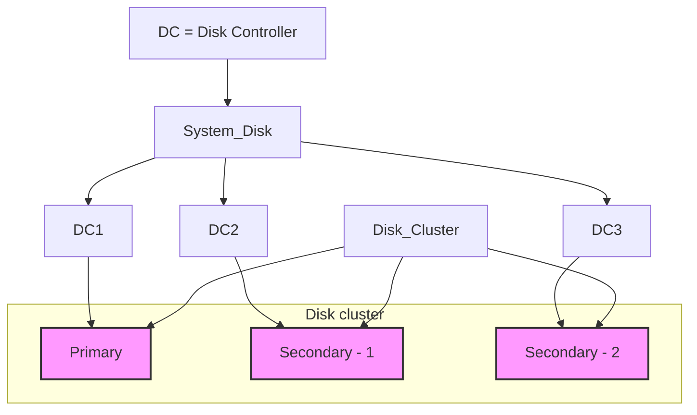

## Page 1

# DISK MIRRORING MODULE

## ND 210855

### Norsk Data

[Photo: Norsk Data logo]

---

## Page 2

# Disk Mirroring Module

## Introduction
Norsk Data's Disk Mirroring Module secures all data stored on disks, by enforcing that all modifications to the data are written to at least two different disks (mirror disks). Should one disk later fail to operate, the data will be automatically accessed from the mirror unit. It also allows on-line backup while the system (e.g., the database system) is running. This is crucial to those who are heavily dependent upon a system being "up" at all times, such as in transaction-processing applications like banking and finance, manufacturing, transportation and retail markets.

## Features
- Extra security against disk failures; parallel writing on two or three disks.
- On-line backup while the system is running.
- Includes a "revive" facility which allows for equalising the disks after failure or backup.
- Mirroring of both separate physical disks and separate directories (sub-units) on the same physical disk allowed.
- Disk mirroring operations are invisible to application programs and most parts of the operating system.
- The system throughput is maintained even though duplicated disk units are used.

---

## Page 3

# Disk Mirroring Module

## Product Description

The system employs two or three equal-size disk units or directories that are updated simultaneously by system software. There is a "primary" disk, the one that the applications see; and "secondary" disk(s), invisible to the applications and most of the operating system. The disks are configured in a "disk cluster." If one disk drive in a cluster fails, an error message is recorded and the disk drive that failed is automatically "disconnected". The system keeps running without interruption, and the failing drive may be serviced at a convenient time.

All write operations issued to a primary disk in a cluster are also automatically performed on the secondary disk(s) in order to keep them equal. Read operations are normally performed on only one unit. An internal "read distribution flag" may be set to direct reads to various units. If this flag is not set, all reads will go to the primary disk. This minimises disk-head movements in cases where reads are more frequent than writes.

The disk drives are kept as equal as possible. However, they may become unequal due to, for example, a failure of one of them or after a backup operation. In this case, the "revive" facility of the disk mirroring module is used to equalise them again, by copying the primary disk to the secondary disk(s). User applications may keep running while the reviving process is taking place.

The Disk Mirroring module allows for taking backup copies of the data disks while the applications are running. This is done by temporarily disconnecting one of the disks from the disk cluster and copying it onto a magtape or a removable disk pack. The disconnected disk can then be reconnected to the disk cluster and the process of reviving can be done while the system is fully operational (available).

## Requirements

- Two or three disk units/directories (fixed or removable) of the same logical size, connected to the same or two SMD or SCSI-type disk controllers. The former configuration is less advisable due to low disk I/O performance.

- SINTRAN III operating system, version K or later.

---

## Page 4

# Corporate Directory

## Corporate Headquarters

**ND Headquarters a/s**  
P. O. Box 5, Bogerud  
N-0610 Oslo 6  
Norway  
Tel.: +47-2-620700  
Telex: 2870 nd n  
Telefax: +47-2-62284 (A)  
Manufacturer

## Norway

**ND Raffel a/s**  
P. O. Box 70, Bogerud  
N-0610 Oslo 6  
Norway  
Tel.: 47-2-620700  
Telex: 47-2-62281 (A)  
Sales office  
Spangereid, tel.: 47-3-710000  
Forus, tel.: 47-4-589090  
Trondheim, tel.: 47-7-91222

## ND Comptec

**ND Comptec a/s**  
P. O. Box 70, Bogerud  
N-0610 Oslo 6  
Norway  
Tel.: 47-2-620700  
Telex: 47-2-62280 (A)

## Operations

**Opf Hetalco a/s**  
P. O. Box 70, Bogerud  
N-0610 Oslo 6  
Norway  
Tel.: 47-2-620700  
Telefax: +47-2-62201 (A)

## Sweden

**ND Norge Data A/B**  
Kanalbanken AB  
S-1169 Upplands Vasby  
Sweden  
Tel.: +46-8-590070  
Telex: 86573 nddata s  
Gothenburg, tel.: +46-31-96570  
Malmö, tel.: +46-40-70510

## ND-Silvidata

**Sweden**  
S-890 Sundsvall  
Sweden  
Tel.: +46-60-151150  
Vaxjo, tel.: +46-470-18500

## Denmark

**Norsk Data A/S**  
Lautrupbæk 1-3  
P. O. Box 129  
DK-2750 Ballerup  
Tel.: +45-8-671244  
Telefax: +45-8-66641 (A)  
Copenhagen, tel.: +45-2-682100  
Aarhus, tel.: +45-861916  
Aalborg, tel.: +45-816800

## Finland

**OY Norsk Data A/B**  
Pultimukentæukouko 2  
SF-0071 Helsinki 1  
Tel.: +358-0-3661611  
Telefax: +358-0-94644 (A)  
Sales: +358-0-36942  
Oulu, tel.: +358-21-27022

## United Kingdom

**Norsk Data Ltd.**  
Bermelyn Valence  
Rm1 3GF  
United Kingdom  
Tel.: +44-1-439-3594  
Fax: +44-1-396-35964  
London, tel.: +44-1-347-8922  
Reading, tel.: +44-734-58607  
Birmingham, tel.: +44-21-427-5230  
Gosforth, tel.: +44-688-96404  
Leeds, tel.: +44-531-824150  
Herford, tel.: +44-442-592381  
Worples: +44-479-305942  

## West Germany

**Norsk Data GmbH**  
Tonnastrasse 10-12  
6000 Baf Homburg v.d.H.  
West Germany  
Tel.: +49-6172-80460

## Belgium

**Wordplex Belgium S.A.**  
Excelsiorlaan 2  
1930 Brussels  
Belgium  
Tel.: 00-32-7201580  
Brussels, tel.: 00-32-7200900  
Telefax: 00-32-7210801

## France

**Norsk Data Paris**  
32 Ave Grange-Dame-Rose  
92140 Veluzay-La-Forêt  
France  
Tel.: +33-1-45037030  
Telefax: +33-1-45037060

## Ireland

**Norsk Data Ireland Ltd., A/S**  
IDA Industrial Estate, Sentry Avenue  
Dublin 9  
Ireland  
Tel.: 353-1-472744  
Telefax: 353-1-472868

## Luxembourg

**Wordplex Luxembourg**  
Rue de l'Industrie No.9  
1811 Luxembourg  
Tel.: 352-492131

## The Netherlands

**Norsk Data Nederland B.V.**  
Breyssel 50  
3944 AB Nonweigen  
The Netherlands  
Tel.: 31-340-72811

## Spain

**Norsk Data - Wordplex Espana S.A.**  
Paseo de Gracia 50  
08807 Barcelona  
Spain  
Tel.: +34-3-2165000  
Telefax: +34-3-2485461  

## Switzerland

**Norsk Data (Switzerland) S.A.**  
Chem. du Vivlduc 12  
CH-1010 Preutz-Lausanne  
Switzerland  
Tel.: +41-21-27012

## Australia

**Wordplex Australia Pty. Ltd.**  
Unit 4, A Sydney Place  
Frazertech (Sydney)  
New South Wales 2068  
Australia  
Tel.: +61-2-951-9353  

## Hong Kong

**Norsk Data International**  
Sing Wong Center  
111 Connaught Road  
Hong Kong  
Tel.: 5-852-161365  

## USA

**Norsk Data A. Inc.**  
Ninebrookserk Office Park  
Westerport Drive, Suite 150  
Westborough  
MA 01581  
USA  
Tel.: 1-617-366-3496  
Telefax: +1-617-380036 (A)

## Agents and Distributors In

### France

**Martec Datasystemes S. A. Paris**  
Tel.: 33-3-6938580  

### Iceland

**Norsk Data Iceland**  
Sao:o-tel  
Tel.: 351-614-9 gwseagy s. erf. nov. 190186  

### India

**Norsk Data India Pty. Ltd.**  
Tel.: 914-1174-1270/910925  

[Photo: ND Logo]

---

