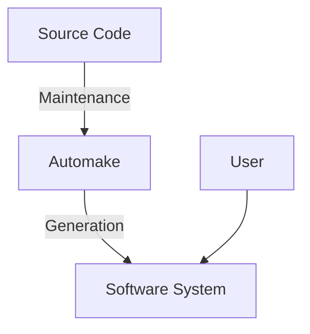

## Page 1

# AUTOMAKE FOR ND-100/ND-500

**ND 210886  ND 210887**



[Logo: ND Norsk Data]

---

## Page 2

# AUTOMAKE FOR ND-100/ND-500

## Introduction

AUTOMAKE is a tool to control development and generation of software systems.

The base for AUTOMAKE are description files, called "AUTOMAKE-files", which describe the software systems: Which files are needed, their relationships, and which commands to execute to generate each system. In addition to the "AUTOMAKE-files", there is an "AUTO-RULES-file" which contains default rules and commands on how to generate a system. The default rules are invoked if the user does not supply commands to generate a system.

When AUTOMAKE is run, it determines which parts of a system have been modified since the system was last generated, and then regenerates those parts that are invalid.

Typically, AUTOMAKE is used in projects where the source of a program is spread among several files. When AUTOMAKE is run, it checks when the files were last modified to find out which files need to be recompiled, if any. It then reloads the program, if necessary.

## Features

- Possibility to generate AUTOMAKE-files automatically.
  
- Macro facility and conditional statements make the AUTOMAKE-files more powerful and flexible.

- AUTO-RULES-file to ease the writing of the AUTOMAKE-files.

- The user can write his/her own AUTO-RULES-file.

- Commands to list invalid files, and to change the modification date and time of invalid files so that they become "valid".

- Possibility to generate only a part of a system.

- Commands to list and copy files required in a system.

---

## Page 3

# AUTOMAKE FOR ND-100/ND-500

## Product Description

AUTOMAKE uses the AUTOMAKE-file to find out which files a system consists of, and their relationship. It then checks when the files were last modified to determine which files are invalid. Finally, it writes a mode file which, when run, regenerates the system so that it becomes valid again.

## Example

A description file could look like this:

```
my-program:prog < my-program:brf
    @ DELETE-FILE my-program:prog
    @ BRF-LINKER
    PROGRAM-FILE "my-program"
    LOAD my-program planc-1bank
    EXIT

my-program:brf < my-program:symb
    @ DELETE-FILE my-program:brf
    @ PLANC-100
    COMPILE my-program,,"my-program"
```

This tells AUTOMAKE that my-program:prog depends on my-program:brf which in turn depends on my-program:symb. It also tells AUTOMAKE which commands to write on the mode file generated, in order to generate the program. If my-program:symb was modified after my-program:prog is modified or loaded, AUTOMAKE puts the commands for compilation and loading of the program in the mode file, and executes the mode file.

## Requirements

- SINTRAN III version H or later

## Documentation

AUTOMAKE User Manual ......................... ND-60.232 EN

---

Scanned by Jonny Oddene for Sintran Data © 2010

---

## Page 4

# Norsk Data

## Corporate Headquarters

Olaf Helsets vei 5  
P.O. Box 25, Bogerud  
0621 Oslo 6  
Norway  
Tel.: +47-2-269000  
Telex: 76 242  
Telefax: +47-2-269041 (A)  

## Norway

Oslo, tel. +47-2-390630  
Stavanger, tel. +47-4-96760  
Sandnes, tel. +47-4-766150  
Bergen, tel. +47-5-211975  
Trondheim, tel. +47-7-192122  

## ND Comtec Head Office

Olaf Helsets vei 5  
P.O. Box 25, Bogerud  
0621 Oslo 6  
Norway  
Tel.: +47-2-269000  
Telex: 76 242  
Telefax: +47-2-269789 (A)  

## Sweden

ND Norsk Data AB  
Kanalvägen 3  
Box 19  
191 02 Upplands Väsby  
Sweden  
Tel.: 8-590-94080  
Telex: 1-25076 nddata s  
Telefax: +46-8-590-5257 (A)  

Gothenburg, tel. +46-31-496760  
Malmö, tel. +46-40-70510  

## ND-Silvadata

SWEDEN  
581 83 Sundsvall  
Sweden  
Tel.: +46-60-545150  

Växjö, tel.: +46-470-46920  
Stockholm, tel.: +46-760-93000  

## Denmark

Norsk Data A/S  
Lautrupbakken 13  
P.O. Box 32  
2750 Ballerup  
Denmark  
Tel.: +45-2-689065  

Odense, tel. +45-12-68654 (A)   

## Finland

Oy Norsk Data AB  
Sturenkatu 15 A  
00510 Helsinki 51  
Finland  
Tel.: +358-0-172247  

## Switzerland

Norsk Data (Switzerland) S.A  
Chemin De L'Echo 2  
1007 Lausanne 12  
Switzerland  
Tel.: +41-21-255564 (A)  
Glattbrugg (Zurich), tel. +41-1-8101033  

## West Germany

Norsk Data GMBH  
Thomasstrasse 12/1  
6300  
Bad Homburg v.d.H.  
West Germany  
Tel.: 49-61772-4080  
Off.: 49-61775-1330 (A)  

West Berlin, tel. +49-30-2134986  
Hamburg, tel. +49-40-5202020  
Hannover, tel. +49-511-660242  
Mülheim, tel. +49-208-386264  
Stuttgart, tel. +49-711-473910  

## The Netherlands

Norsk Data Nederland B.V  
Burgwal 55  
P.O. Box 500  
3430 AN Nieuwegein  
The Netherlands  
Tel.: +31-340-27411  

## France

ND Data S.a.r.l  
La Bretonnière  
Ozon Espace  
21 Route D'Anjou  
73290 Ozon  
France  
Tel.: +33-54-303576  

## United Kingdom

Norsk Data Ltd.  
Bentley Drive  
Newbury  
Berks RG13 8QJ  
United Kingdom  
Tel.: +44-635-35454  
Telefax: +44-635-33897 (A)  

## USA

Norsk Data N.A., Inc.  
Westborough Office Park  
1800 West Park Drive  
Suite 150  
Westborough, MA 01581  
USA  
Tel.: +1-617-366-4862  
Telefax: +1-617-366-0069 (A)  

Los Angeles  
Tel.: +1-714-752-5061  

## Hong Kong 

Norsk Data International  
1902 Wing On Centre  
111 Connaught Road  
Hong Kong  
Tel.: +852-5-4121253  
Telefax: +852-51-51095 (A)  

## Represented by Agent In:

## India

Norsk Data (India) Ptv. Ltd.  
Tel.: +91-44-42919741926  

## Thailand

Tel.: 66-02-2581 683  

## France and Italy

Inter-Datasystèmes S.A. Paris  
Tel.: +33-616-3533  
Mars Data Systèmes S.A  
Toulouse  
Tel.: +33-42-342020  

Scanned by Jonny Oddene for Sintran Data © 2010

---

