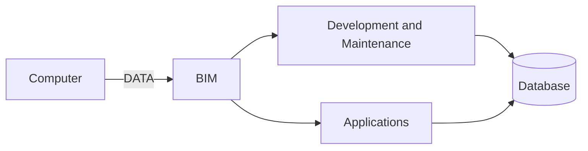
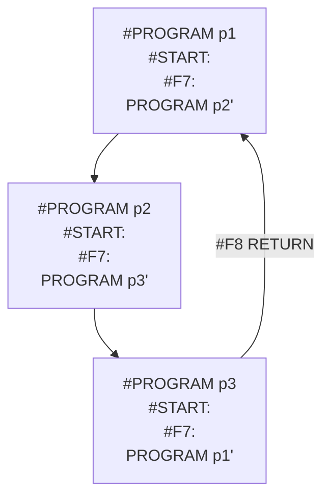

## Page 1

# BIM
## Business Information Management

ND 210937 BIM FOR ND-100  
ND 210938 BIM FOR ND-500



ND  
Norsk Data

---

## Page 2

# BUSINESS INFORMATION MANAGEMENT

## INTRODUCTION

The BIM System is a fourth-generation tool for fast development and safe maintenance of data structure, screen and report forms, and application programs.

Development of ADP systems with COBOL, FORTRAN, RPG, BASIC or other languages is time consuming and requires experienced personnel. Detailed coding only known to the authors makes maintenance difficult and expensive. The result is that there are many unsolved tasks within the ADP area, and many unstable and badly adjusted systems that are difficult to use.

For the purpose of improving the situation, several information-handling systems have been developed. These systems may be divided into two categories: Systems for end users, and systems for highly qualified system analysts with programming experience.

BIM is a product for the problem-solver who knows his or her field well, but does not necessarily have programming experience.

The high functionality of the BIM system makes it well suited for the development of both complicated and less complicated application systems.

BIM is a part of DIALOGUE, a set of productive tools for administrative data processing available as well for the ND-100 as for the ND-500 series.

---

## Page 3

# BUSINESS INFORMATION MANAGEMENT

## FEATURES

- A complete system development tool, with modules for the definition of screen pictures and report layouts.

- A comprehensive fourth-generation programming language for event-oriented programming.

- Fast development and easy maintenance.

- Based on SIBAS database management system.

- Active and integrated Data Dictionary.

- Automatic generation of so-called field-sets, which permit easy navigation between programs.

- Extensive facilities for batch processing.

- General report generator with database updating possibilities.

- High level of security.

---

## Page 4

# Business Information Management

## Product Description

BIM consists of the following modules:

- Data-definition module
- Form layout composer (FOCO) for screen and report definition
- BIM compiler
- BIM online processor
- Batch processor

This picture shows the different modules:

```
+-----+            +-----------+          +--------------------+
| FOCO|            |   BIM     |          |    BIM PROCESSOR   |
|     |            | Compiler  |          | +--------+   +----+|
+-----+            +-----------+          | | On-line|   |    ||
   |                     |                | |        |   |    ||
   v                     v                | |        |   |    ||
+-----------+       +--------+            | |        |   |    ||
|   XXX X   |------>|  BIM   |---+        | |        |   |    ||
|   XX: 999 |       |  Prog. |   |--------| |        |   |    ||
|   XX: 9   |       +--------+   |--------| |        |   |    ||
+-----------+       |Data-   |   |        | +--------+   +----+|
                    |definition| |        | |  Batch  |        |
                    +--------+ |          +----+---+----------+
+----------------+   +-+       |          |  Development    |
|Data-definition/|   | |       |          |  Maintenance  | Run-time
|redefinition |   | DB
+----------------+
```

### Data-definition Module

The Data-definition module is used to define and maintain the databases. The definitions are stored in the data-definition catalogues. The definition catalogues consist of:

- Field types
- Fields
- Files
- Keys

The field-type feature is a powerful efficiency tool for the maintenance of fields with common properties. Instead of maintaining these properties on each field when they occur, they may be maintained once, at the field-type level.

The SIBAS schema is updated from the definition module. The data descriptions are included into the programs when these are compiled. All field information is available for the screen-definition module (FOCO).

### Form Layout Composer (FOCO)

FOCO is used to define screen and report layouts. It is integrated with the definition module. The design of screen picture and report layouts merely consists of selecting and positioning the fields to be used in the layout picture of the FOCO module. The field properties are then automatically retrieved from the data dictionary. Leading texts can be overruled.

### BIM Compiler

BIM uses a high-level fourth-generation programming language. The language is easy to learn, and all programs consist of small, compact parts which are easy to write and to maintain. Useful features:

- Programming of function keys: Each key may be defined to execute a program function.
- Programming of input fields for calculation and control.
- Navigation between programs. The user can navigate between programs using the same FIELD-SET by pushing a programmed function key. The current data is always available both in the programs called and in the programs returned-to. Their screen pictures are automatically displayed with the current data values included.

The compiler produces efficient and compact code, which may be executed either with the BIM online processor, or with the batch processor.

An example of a BIM online program:

```
#START:

#F3:               ** Get part
  RETRIEVE part
  STATUS UNKNOWN THEN
    MESSAGE 'Unknown part'
  END-STATUS

#F4:               ** Next part
  GET-NEXT part
  STATUS UNKNOWN THEN
    MESSAGE 'No more parts'
  END-STATUS

#F5:               ** Previous part
  GET-PREVIOUS part
  STATUS UNKNOWN THEN
    MESSAGE 'No more parts'
  END-STATUS

part/number:
```

When pushing the F3 key after entering a part number into the field part/number, the part’s data is retrieved from the database and displayed on the screen. When pushing F4 or F5, the next or the previous part, respectively, is displayed.

---

## Page 5

# BUSINESS INFORMATION MANAGEMENT

An example of a BIM batch-program:

```
#START:
  LOOP-ASCENDING part
  IF part/abc = 'C' THEN
    PRINT part-line
    COPY #DATE INTO part/pri-dat
    CHANGE part
  END-IF
END-LOOP

PAGE-HEADING-1:
  PRINT page-head
  PRINT part-head
```

The file PART is searched, and the selected parts are printed, while updating the field PART/PRI-DAT. Whenever a page-eject is performed, the #FORMAT sections PAGE-HEAD and PART-HEAD of the report layout being used are automatically printed.

## BIM Online Processor

The execution of the online programs which are requested by the BIM users is handled by the BIM online processor. The execution of a BIM program starts with automatically displaying the program’s screen picture. The execution of the program is then governed by the user, by entering data into the input fields of the screen picture, or by pushing the function keys which the program uses. Each input field and function key has a corresponding section in the BIM program, with BIM statements to be executed when the input field or function key is activated.

## Batch Processor

Batch jobs can be ordered with the statement BATCH, and the job orders are inserted into one of two job queues, depending on the job-order parameters. Batch job orders may be displayed and monitored within the BIM system.

The Batch processor processes the batch-job orders in the batch queues, and controls the execution of the batch programs.

Up to three reports can be written simultaneously during one search through the database. The database can be updated simultaneously with the printing of reports. Page heading and footing logic as well as value-break situations for reports may be handled in separate sections of the report program.

Reports may be printed on a standard form, or on any other type of form which may be predefined. The printers to be used for each form may also be predefined.

## FIELD-SETS

A FIELD-SET is a table of the fields which are used by one or by a group of BIM programs. For each field entry, the FIELD-SET contains the fields’ properties as they are defined in the data-definition module, and the fields’ current value.

The FIELD-SET enables the programs which share it to communicate with each other. When navigating between programs using the same FIELD-SET, the programs’ screen pictures are automatically displayed with the current field values included.

The picture shows the use of FIELD-SETS.

```
       +---------+
       |  P1 P2  |
       |     P3  |
       +---+-----+
           |
           v
      +---------+
      | DB      |
      +---------+
```

P1, P2 and P3 are three different BIM programs which use some common fields.

The principles of the navigation between programs using the same FIELD-SET are shown in this picture:



When pushing the F7 key in program p1, program p2 is started. Pushing the F7 key once more while in program p2 starts program p3. From p3 it is possible to return directly to p1 by pushing the F8 key. Execution in p1 will then continue immediately after the call to p2.

FIELD-SETS are created automatically by the BIM compiler. The user only needs to supply the names of the FIELD-SET to be used, in the heading of the BIM program.

The FIELD-SET feature greatly simplifies the programming, by removing the lists of fields from the programs. Only the database files to be accessed are referenced in the BIM programs, not the fields involved.

---

## Page 6

# BUSINESS INFORMATION MANAGEMENT

## SCROLLING TABLES

A scrolling table is a table of records to be used temporarily by a BIM user.

The scrolling table acts as a buffer area between the BIM user and the database. A record in a scrolling table may correspond to the records of one or several files in the database.

The BIM user communicates with a scrolling table by means of a scrolling table area in the screen picture. The following example shows the relationship between the total scrolling table and the part of it displayed in the screen picture.

```
                          A record in
                          the scrolling
                          table

                        XXXXXXXXXXXXXXX 999999 999 X XXX X 999 XXX
                        XXXXXXXXXXXXXXX 999999 999 X XXX X 999 XXX
                   ┌───────────────────┐
                        XXXXXXXXXXXXXXX 999999 999 X XXX X 999 XXX
                   │    XXXXXXXXXXXXXXX 999999 999 X XXX X 999 XXX   │
                   │    XXXXXXXXXXXXXXX 999999 999 X XXX X 999 XXX   │
                   └───────────────────┘
                        XXXXXXXXXXXXXXX 999999 999 X XXX X 999 XXX
                          ┌───────────────┐
Scrollng               Part-no  Description  Qa.+
table                      XXXXXX XXXXXXXXXXXXX 999999 999 X XXX X 999 XXX
window
                          ┌───────────────────┐
The scrolling         1   XXXXXX XXXXXXXXXXXXX 999999 999 X XXX X 999 XXX
table as it is        2   XXXXXX XXXXXXXXXXXXX 999999 999 X XXX X 999 XXX
part of the           3   XXXXXX XXXXXXXXXXXXX 999999 999 X XXX X 999 XXX
picture  screen       4   XXXXXX XXXXXXXXXXXXX 999999 999 X XXX X 999 XXX
                      5   XXXXXX XXXXXXXXXXXXX 999999 999 X XXX X 999 XXX
Change-code           6   XXXXXX XXXXXXXXXXXXX 999999 999 X XXX X 999 XXX
(optional)            7   XXXXXX XXXXXXXXXXXXX 999999 999 X XXX X 999 XXX
                      8   XXXXXX XXXXXXXXXXXXX 999999 999 X XXX X 999 XXX
Data-entry             XXXXXX XXXXXXXXXXXXX 999999 999 X XXX X 999 XXX
line                  Part: XXXXXXX  Qa.: 999999999 Mr. X
(optional)            Desc: XXXXXXXXXXXXX XXXXXXXXXXXXXXXX
                                XX XXXXXXXXXXXXXXXXXXXXXXXXXXXXXX
                             XXXXXXXXXXXXXXXXXXXXX XXXXXXXXXXXXX
```

The BIM user may navigate either horizontally or vertically in the scrolling table by means of the arrow keys.

A scrolling table may be used to retrieve data from the database, and eventually, update them, or to enter new records into the database.

## SECURITY

Fields may be assigned two security levels, one for retrieval and another for updating. At runtime the security levels of fields will be matched with the BIM user's own security level. The BIM user will not be allowed to enter a BIM program if it gives access to fields with higher security levels than the user's own.

## REQUIREMENTS

### Hardware

ND 100/CX and ND-500/CX computers.

### Software

- SINTRAN Operating system
- SIBAS-II Database Management System
- An editor: PED or NOTIS-WP

## DOCUMENTATION

BIM User Manual ND 60.260.1 EN

## MACROS

Typical application systems may contain various examples of identical sequences of BIM statements which must be performed in several programs. In such cases the macro feature is very useful. Macros may be created once in the macro library, and then referenced in the BIM programs where they are needed.

## VERSION HANDLING

A BIM-based application system may exist in several versions, each system version containing the system components: data definitions, form layouts, BIM programs, etc., which are new or have been changed.

If, when BIM is run, a system component is found to exist in different versions, BIM will prefer the newest version authorised for the BIM user.

---

