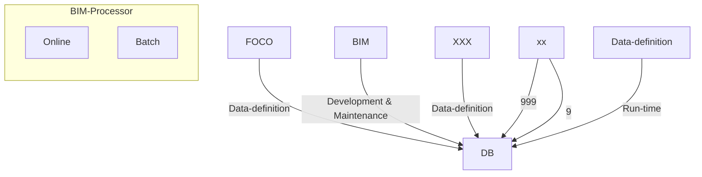
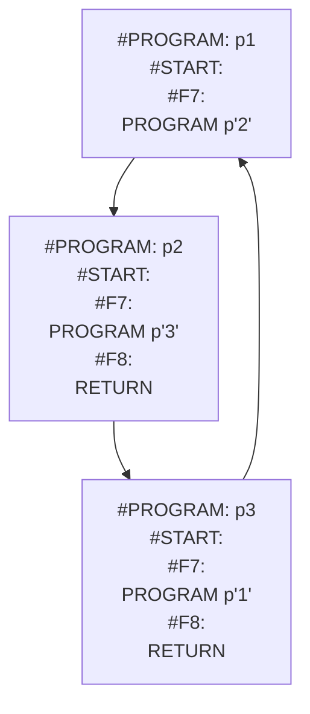

## Page 1

# BIM  
## BUSINESS INFORMATION MANAGEMENT  

**ND 210938**  
**BIM FOR ND-500/ND-5000**  

```
    ________________________________________
   |                                        |
   |      _________                         |
   |     |         |                        |
   |     |  _____  |                        |
   |     | |     | |  _______               |
   |     |_|_____|_| |       |              |
   |      |     |   |_______|               |
   |      |_____|                           |
   |   _______ _______ _______ _______      |
   |  |_______|_______|_______|_______|     |
   |                                        |
   |________________________________________|
```

**ND**    
**Norsk Data**  

*Scanned by Jonny Oddene for Sintran Data © 2010*

---

## Page 2

# BIM

## Introduction

DIALOGUE-2 BIM Program Development Package consists of the fourth-generation tool BIM. BIM is a complete tool for the development and maintenance of application systems.

The BIM System is a fourth-generation tool for fast development and safe maintenance of data structure, screen and report forms and application programs. It includes a very high level language for application procedures.

The high functionality of the BIM system makes it well suited to the development of both complex and less complicated application systems. BIM is a part of DIALOGUE, a set of productive tools for administrative data processing available for the ND-500 and the ND-5000 series.

## Features

- A complete system development tool, with modules for defining screen pictures and report layouts.
- A comprehensive fourth-generation programming language for event-oriented programming.
- Fast development and easy maintenance.
- Based on the SIBAS database management system.
- Active and integrated Data Dictionary.
- Automatic generation of field-sets, which permits easy navigation between programs.
- Extensive facilities for batch processing.
- General report generator with database updating facilities.
- High level of security.

## Product Description

BIM consists of the following modules:

- Data definition module
- Form layout composer (FOCO) for screen and report definition
- BIM compiler
- BIM online processor
- Batch processor

This diagram shows the different modules:



## Data Definition Module

The data definition module is used to define and maintain the databases. The definitions, stored in the data definition catalogues, consist of:

- Data types
- Columns
- Tables
- Indexes

The data type feature is a powerful concept for defining fields with common properties. Instead of maintaining these properties on each field individually, they may refer to a common data-type definition.

The SIBAS schema is generated with information from the definition catalogue. The data descriptions are included in the programs when they are compiled. All field information is available for the screen-definition module (FOCO).

---

## Page 3

# BIM

## Form Layout Composer (FOCO)

FOCO is used to define screen and report layouts. It is integrated with the data definition modules. Designing screen pictures and report layouts is easily done by selecting and positioning the fields to be used in the layout picture of the FOCO module. The field properties are then automatically retrieved from the data dictionary.

Leading texts can be overruled.

## BIM Compiler

BIM uses a high-level, fourth-generation programming language. The language is easy to learn, and all programs consist of small, compact parts which are simple to write and maintain.

### Useful features:

- Programming of function keys. Each key may be defined to execute a program function.
- Programming of input fields for calculation and control.
- Navigation between programs. The user can navigate between programs using a programmed function key. The field-set allows navigation between programs, making current data available both in the programs called and in the programs returned to. Their screen pictures are automatically displayed with the current data values included.

The compiler produces efficient and compact code, which may be executed either with the BIM online processor or with the batch processor.

### An example of a BIM online program for looking up information in a parts inventory:

```
#START:

#F3: ** Get part
RETRIEVE part
STATUS UNKNOWN THEN
    MESSAGE 'Unknown part'
END-STATUS

#F4: ** Next part
GET-NEXT part
STATUS UNKNOWN THEN
    MESSAGE 'No more parts'
END-STATUS

#F5: ** Previous part
GET-PREVIOUS part
STATUS UNKNOWN THEN
    MESSAGE 'No more parts'
END-STATUS

part/number:
```

When pushing the F3 key after entering a part number into the field `part`, the part's data is retrieved from the database and displayed on the screen. When pushing F4 or F5, the next or the previous part, respectively, is displayed.

### An example of a BIM batch program:

```
#START:
    LOOP-ASCENDING part
    IF part/abc = 'C' THEN
        PRINT part-line
        COPY #DATE INTO part/pri-dat
        CHANGE part
    END-IF
    END-LOOP

PAGE-HEADING-1:
    PRINT page-head
    PRINT part-head
```

The PART table is searched, and the selected parts are printed, while updating the field PART/PRI-DAT. Whenever a page-eject is performed, the #FORMAT sections PAGE-HEAD and PART-HEAD of the report layout being used are automatically printed.

## BIM Online Processor

The execution of the online programs which are requested by the BIM users is handled by the BIM online processor. The execution of a BIM program starts by automatically displaying the program's screen picture. The execution of the program is then governed by the user, by entering data into the input fields of the screen picture, or by pushing the function keys which the program uses. Each input field and function key has a corresponding section in the BIM program, with BIM statements to be executed when the input field or function key is activated.

## Batch Processor

Batch jobs can be ordered with the statement BATCH, and the job orders are inserted into one of two job queues, depending on the job order parameters. Batch job orders may be displayed and monitored within the BIM system.

The batch processor processes the batch job orders in the batch queues, and controls the execution of the batch programs.

Up to three reports can be written simultaneously during one search through the database. The database can be updated simultaneously with the printing of reports. Page heading and footing logic as well as value-break situations for reports may be handled in separate sections of the report program.

Reports may be printed on a standard form, or on any other type of form which may be predefined. The printers to be used for each form may also be predefined.

---

## Page 4

# BIM

## Field Sets

A FIELD SET is the working set of data to be used by one or a group of BIM programs. For each field entry, the FIELD SET contains the fields' properties as they are defined in the data definition module, and the fields' current value.

The concept allows retention of data values when switching between two or more programs.

The illustration shows the use of FIELD SETS in the three programs P1, P2, and P3, which use some common fields:

```ascii
        +-------+
P1  P2  P3
 \   |   /
  \  |  /
   \ | /
+---------+
| FIELD-SET |
+---------+
     |
    \|/
   +---+
   | DB |
   +---+ 

BIM-programs
```

When pushing the F7 key in program p1, program p2 is started. Pushing the F7 key once more while in program p2 starts program p3. From p3 it is possible to return directly to p1 by pushing the F8 key. Execution in p1 will then continue immediately after the call to p2.

FIELD SETS are created automatically by the BIM compiler. The user only needs to supply the names of the FIELD SET to be used in the heading of the BIM program.

The FIELD SET feature greatly simplifies programming by removing the lists of fields from the actual programs. Only the database tables to be accessed are referenced in the BIM programs, not the fields involved.

A field may also be a wide column within a database, containing a variable length document, which may be edited and/or included in application output.

## Scrolling Tables

A scrolling table is a temporary table to be used for faster viewing and updating.

The scrolling table acts as a buffer area between the BIM user and the database. A row in a scrolling table may correspond to the row of one or several tables in the database.

The following example shows the relationship between the total scrolling table and the part of it displayed in the screen picture.

```ascii
A row in         XXXXXX XXXXXXXXXX $999.95 $9.99 X XXX X $99 XXX
the scrolling    XXXXXX XXXXXXXXXX $999.95 $9.99 X XXX X $99 XXX
table            XXXXXX XXXXXXXXXX $999.95 $9.99 X XXX X $99 XXX
                 XXXXXX XXXXXXXXXX $999.95 $9.99 X XXX X $99 XXX
                 XXXXXX XXXXXXXXXX $999.95 $9.99 X XXX X $99 XXX

   <---------- Scroll ---------->

Scrolling        Part-no     Description   0+ h =
table heading    XXXXXX      XXXXXXXXXX    $999.95 

The scrolling XXXXXXXXXXX XXXXXXXXXXX X XXXX $ XXXX XX XX 
table's part  XXXXXXXXXXX XXXXXXXXXXX X XXXX $ XXXX XX XX 
of the screen XXXXXXXXXXX XXXXXXXXXXX X XXXX $ XXXX XX XX 
              XXXXXXXXXXX XXXXXXXXXXX X XXXX $ XXXX XX XX 

Change-code 
(optional)

Data-entry     Part: XXX XXX X 999999 M.n X
lines (optional) Desc: XX XXXXX XXXXX XXL XXX
                 XXXXXXXXXXX XXXXXXXXXXX X XXXX $ XXXX 
```

The BIM user may navigate either horizontally or vertically in the scrolling table by means of the arrow keys.

A scrolling table may be used to retrieve data from the database, to update it, or to enter new records into the database.



---

Scanned by Jonny Oddene for Sintran Data © 2010

---

## Page 5

# BIM

## Macros

Typical application systems may contain various examples of identical sequences of BIM statements which must be performed in several programs. In such cases the macro feature is very useful. Macros may be created once in the macro library, and then referenced in the BIM programs where they are needed.

## COBOL Subroutines

COBOL Subroutines can be called from BIM programs. Data used in the BIM programs are automatically available for the COBOL Subroutines.

## Security

Fields may be assigned two security levels, one for retrieval and another for updating. At runtime the security levels of fields will be matched with the BIM user's own security level. The BIM user will not be allowed to enter a BIM program which gives access to fields with higher security levels than the user's own.

## ND Numbers

- ND 210938 BIM for ND-500/ND-5000
- ND 211033 BIM Runtime for ND-500/ND-5000

## Requirements

### Hardware

- ND-500 and ND-5000 computers.

### Software

- SINTRAN Operating system
- SIBAS-II Database Management System
- An editor: PED or NOTIS-WP

## Documentation

| Documentation                            | ND Number |
|------------------------------------------|-----------|
| DIALOGUE-BIM Application Development     | ND 60.260 |
| DIALOGUE-BIM Operations                  | ND 30.068 |
| DIALOGUE-BIM Reference Guide             | ND 60.299 |

---

## Page 6

# Contact Information

## Corporate Headquarters
**P.O. Box 25, Bogerud 0621 Oslo 6, Norway**  
Tel: +47-2 620000  
Telex: 79648 nd n  
Telefax: +47-2 626994 (A)  
New York: +47-2 629268 (A)  
Telefax: +47-2 627365 (A)

### Norway
**Oslo**  
Tel: +47-2 628000  
Telex: 76 861 nd  

**Bergen**  
Tel: +47-2 820001 (A)  
Telefax: +47-2 825653 (A)  
Paragrun, tel: +4-2-5953000  

**Sandnes**  
Tel: 4-32-636260  

**Tromsø**  
Tel: +47-6 765766  

**Trondheim**  
Tel: +47-9 732122

## ND Committee

### Head Office
**P.O. Box 10, Bogerud 0621 Oslo 6, Norway**  
Tel: +47-2 820000  
Telex: 79668 nd  
Telefax: +47-2 628001 (A)

**Oslo**  
Tel: +47-2 820000  
Drammen, tel: + 47-3 714306  
West Germany, tel: + 49-211-671364  
United Kingdom, tel: + 44-41-305 6354  
Switzerland, tel: +41-1-811003  
Austria, tel: + 1-222-51505  
USA, tel: +1-316-866506

### Sweden
**ND Nordic Data A S Karabocken 7 P.B.ox 21 21 194 92 Upplands Vasby, Sweden**  
Tel: +46-760-98400  
Telex: 85-10585 nordata s

**Gothenburg**  
Tel: +46-31-495760

**Malmo**  
Tel: +46-40-75010

## ND-Silvadata

### Sweden
**Sod Sundsvall, Sweden**  
Tel: +46-60-15150  

**Vaxjo**  
Tel: + 46-470-18500  
Stockholm, tel: +46-760-98400

### Denmark
**Norsk Data A S, Parkvej 8 2750 Ballerup Denmark**  
Tel: +45-2 68065  
Telefax: + - 6026527 ndk
Odense, tel: + 45-6-191740  
Aarhus, tel: + 45-6-161756  
Aalborg, tel: + 45-6-337216

### Finland
**P.O. Box 46, Oy Datia AB, Pursimiehenkatu 29, 00121 Helsinki, Finland**  
Tel: +358-0-58021  
Telex: 124961 matk  
Service: +358 0 383684  
Oulu, Tel: + 358-1-272500

## West Germany
**Norsk Data GmbH, Normannenstrase 10-12, 603 Bad Homburg v.d.H. West Germany**  
Tel: 061-4117563  
Telefax: 061-47175230 (A)  

**West Berlin**  
Tel: +49-882 7137  
Hamburg, tel: + 49-41-59415  
Hannover, tel: + 49-511-36600

**Munich**  
Tel: + 49-89-358649  
Stuttgart, tel: +49-7 1214121  
Munster, Tel: +49-251 76702  
Kiel, tel: + 49-431-53018  
Frankfurt, tel: + 49-69-500063

## The Netherlands
**Norsk Data Nederland B.V. Burgwal 55, P.O. Box 90, 3400 AN Nieuwegein The Netherlands**  
Tel: +31-340-7251  
Telefax: +31-3402 72400

## France
**Norsk Data s.a.r.l. Ave. Breutenhof, Avenue du Jura Or. 210 Ferney-Voltaire, France**  
Tel: +33-50-497956  
Telefax: +33-50-02454 (A)

## Switzerland
**Norsk Data (Switzerland) S.A. Ch. du Vallause 12, CH-1009 Pully-Lausanne, Switzerland**  
Tel: +41-21-25052  
Telefax: +41-21-25654 (A)

## United Kingdom
**Norsk Data Ltd. Newham Manor, Bristol Road Newham, Berks, RG 8 8UJ, United Kingdom**  
Tel: +44-865-590345  
Telefax: +44-865-305062 (A)

**London**  
Tel: +44-1 305 6354  

**Manchester**  
Tel: +44-61-279 52

**Ireland**
**Norsk Data Ireland Ltd. I.D.A. Industrial Estate, Santry Avenue Dublin 11, Ireland**  
Tel: +353-1 324 4704  
Telefax: +353-1-471762

## USA
**Norsk Data N.A., Inc. Westborough Office Park, 1800 West Park Drive, Suite 150, Westborough, MA 01581 USA**  
Tel: +1-617-362-9992  
Telefax: +1-617-366 0036 (A)

## ND International Operations
**P.O. Box 10, Bogerud 0621 Oslo 6, Norway**  
Tel: +47-2 820000

### Hong Kong
**Norsk Data International**  
Telefax: 852-7896301 (A)

## India
**Norsk Data (India) Pvt. Ltd.**  
Tel: +91-11-72191296  
Telefax: 0091-482141785

## Pakistan
**Norsk Data Pakistan (P) Ltd.**  
Tel: 92-51 941861

## Thailand
**Norsk Data (Thailand) Ltd.**  
Tel: 66-2-2532900  
Telefax: +66-2 2532984

---

```ascii
       __
      / /____
 __  / / /   /
/__/ / /__/ /
```
Norsk Data

[Scanned by Jonny Oddone for Sintran Data © 2010]

---

